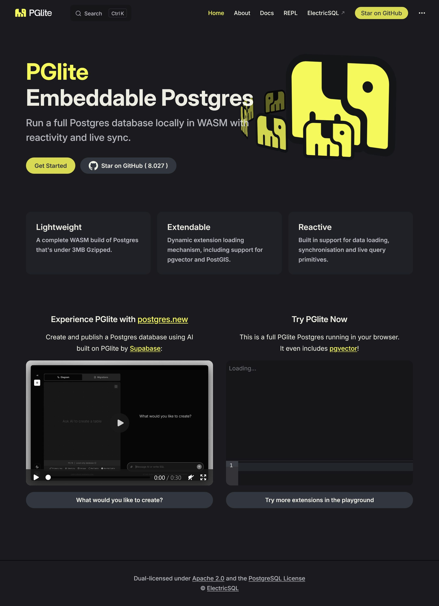

# PgLite - PgWasm -PGlite Embeddable Postgres

https://pglite.dev/

PGlite
Embeddable Postgres

Run a full Postgres database locally in WASM with reactivity and live sync.

https://pglite.dev/repl/
https://github.com/electric-sql/pglite
https://electric-sql.com
Lightweight Postgres packaged as WASM into a TypeScript library for the browser, Node.js, Bun and Deno from https://electric-sql.com

https://supabase.com/blog/postgres-new

## Links 

Sandbox <https://postgres.new/>
