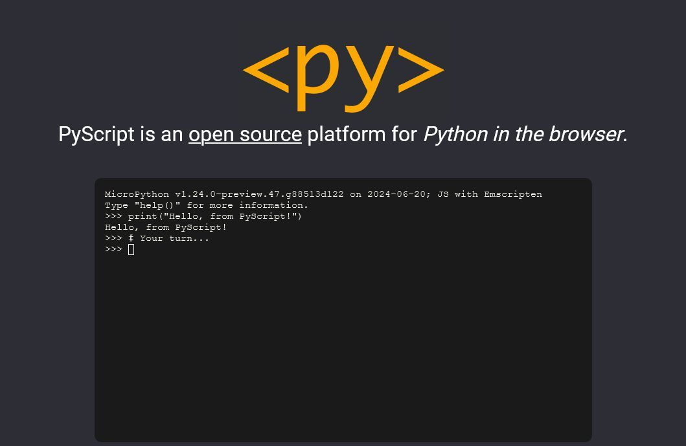

# PyScript 

PyScript is an open source platform for Python in the browser.

## Say Hello to PyScript 👋

**PyScript** is an [open source](https://github.com/pyscript/pyscript) platform for [Python](https://python.org) in the [browser](https://en.wikipedia.org/wiki/Web_browser).

PyScript brings together two of the most vibrant technical ecosystems on the planet. If [the web](https://en.wikipedia.org/wiki/World_Wide_Web) and Python had a baby, you'd get PyScript.

At the core of PyScript is a _philosophy of digital empowerment_. The web is the world's most ubiquitous computing platform, mature and familiar to billions of people. Python is one of the [world's most popular programming languages](https://spectrum.ieee.org/the-top-programming-languages-2023).

With PyScript, _Python runs anywhere there's a browser (which is everywhere)_.
## Links 

<https://pyscript.net/>

<https://pyscript.com/@examples>

<https://github.com/pyscript/pyscript>
