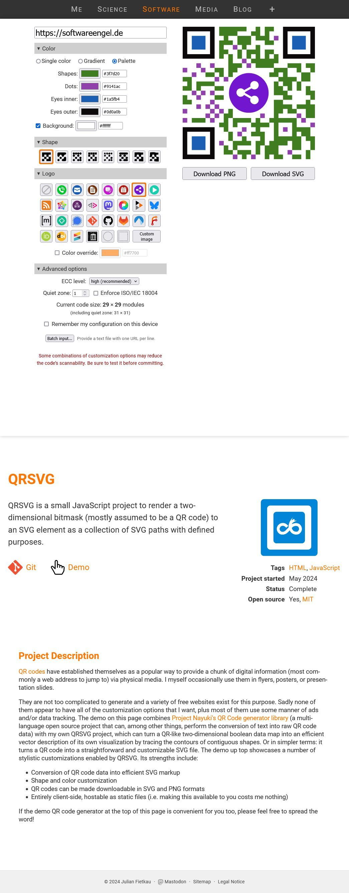
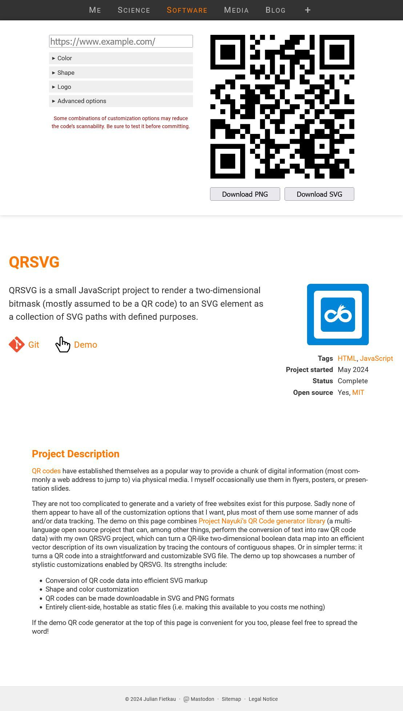
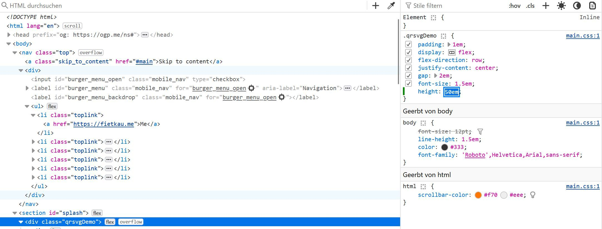

# QRSVG

QRSVG is a small JavaScript project to render a two-dimensional bitmask (mostly assumed to be a QR code) to an SVG element as a collection of SVG paths with defined purposes.

This is a small JavaScript project to render a two-dimensional bitmask (mostly assumed to be a QR code) with a fixed width and height to an SVG element as a collection of SVG paths with defined purposes. The code analyzes the bitmask geometrically and traces the contours of contiguous shapes. It allows rendering QR codes in several stylized ways. Note that this code does not contain an actual QR code creator – it expects to receive the 2D QR code as a bitmask for its input. See the project website for a demo and more information.

## Project Description

[QR codes](https://en.wikipedia.org/wiki/QR_code) have established themselves as a popular way to provide a chunk of digital information (most commonly a web address to jump to) via physical media. I myself occasionally use them in flyers, posters, or presentation slides.

They are not too complicated to generate and a variety of free websites exist for this purpose. Sadly none of them appear to have all of the customization options that I want, plus most of them use some manner of ads and/or data tracking. The demo on this page combines [Project Nayuki’s QR Code generator library](https://www.nayuki.io/page/qr-code-generator-library) (a multi-language open source project that can, among other things, perform the conversion of text into raw QR code data) with my own QRSVG project, which can turn a QR-like two-dimensional boolean data map into an efficient vector description of its own visualization by tracing the contours of contiguous shapes. Or in simpler terms: it turns a QR code into a straightforward and customizable SVG file. The demo up top showcases a number of stylistic customizations enabled by QRSVG. Its strengths include:

- Conversion of QR code data into efficient SVG markup
- Shape and color customization
- QR codes can be made downloadable in SVG and PNG formats
- Entirely client-side, hostable as static files (i.e. making this available to you costs me nothing)

If the demo QR code generator at the top of this page is convenient for you too, please feel free to spread the word!

## Resize Options Field 

## Links 

<https://fietkau.software/qr>

https://fietkau.software/QRSVG.git
