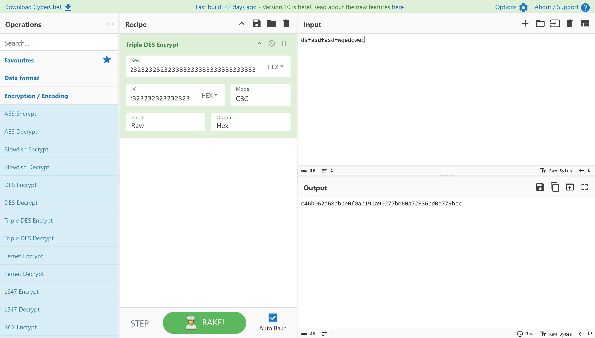
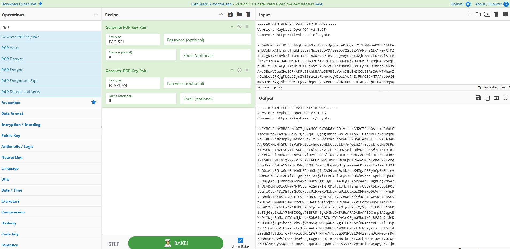

#  CyberChef - The Cyber Swiss Army Knife

#### _The Cyber Swiss Army Knife_

CyberChef is a simple, intuitive web app for carrying out all manner of "cyber" operations within a web browser. These operations include simple encoding like XOR and Base64, more complex encryption like AES, DES and Blowfish, creating binary and hexdumps, compression and decompression of data, calculating hashes and checksums, IPv6 and X.509 parsing, changing character encodings, and much more.

The tool is designed to enable both technical and non-technical analysts to manipulate data in complex ways without having to deal with complex tools or algorithms. It was conceived, designed, built and incrementally improved by an analyst in their 10% innovation time over several years.

##### **What**

A simple, intuitive web app for analysing and decoding data without having to deal with complex tools or programming languages. CyberChef encourages both technical and non-technical people to explore data formats, encryption and compression.

  

##### **Why**

Digital data comes in all shapes, sizes and formats in the modern world – CyberChef helps to make sense of this data all on one easy-to-use platform.

  

##### **How**

The interface is designed with simplicity at its heart. Complex techniques are now as trivial as drag-and-drop. Simple functions can be combined to build up a "recipe", potentially resulting in complex analysis, which can be shared with other users and used with their input.

For those comfortable writing code, CyberChef is a quick and efficient way to prototype solutions to a problem which can then be scripted once proven to work.

https://gchq.github.io/CyberChef/#input=ZHNmYXNkZmFzZGY

https://gchq.github.io/CyberChef/

## Links

<https://github.com/gchq/CyberChef>

[github](https://github.com/gchq/CyberChef#the-cyber-swiss-army-knife)
