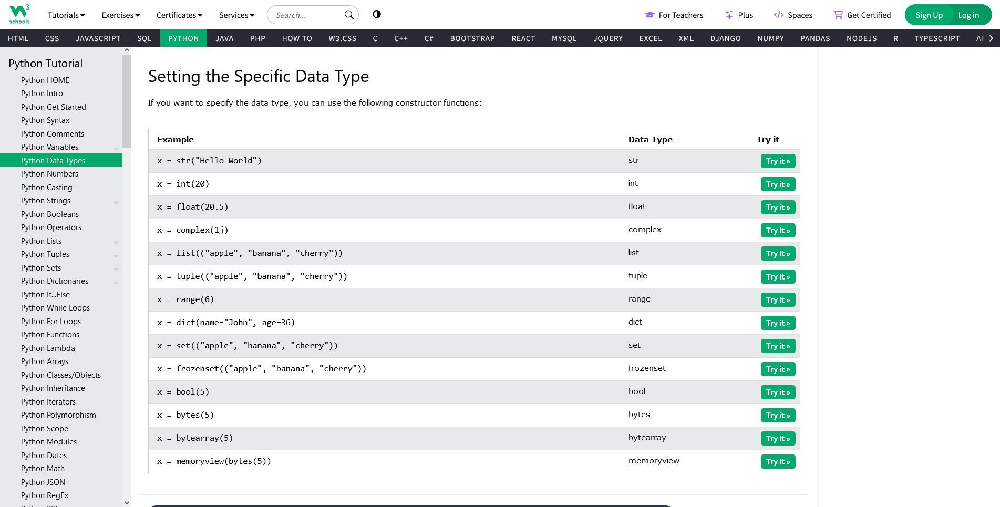
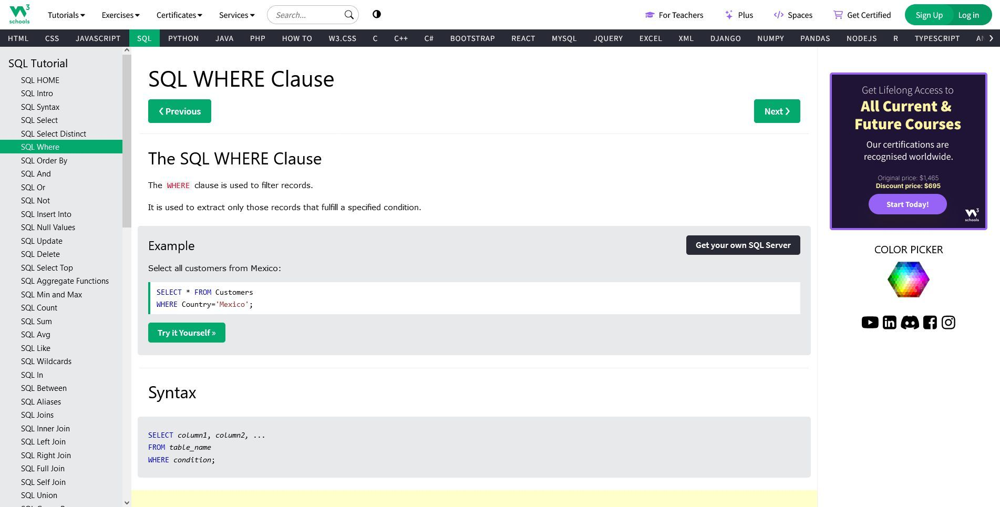
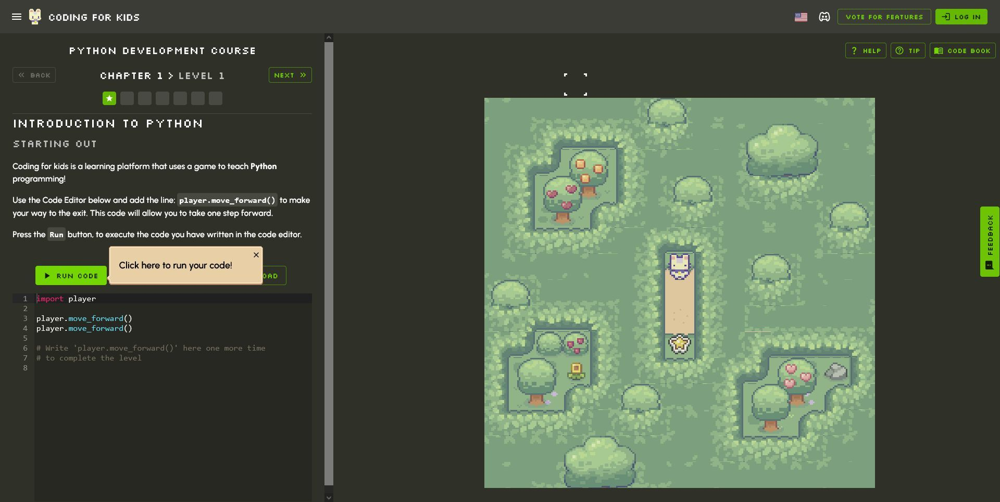
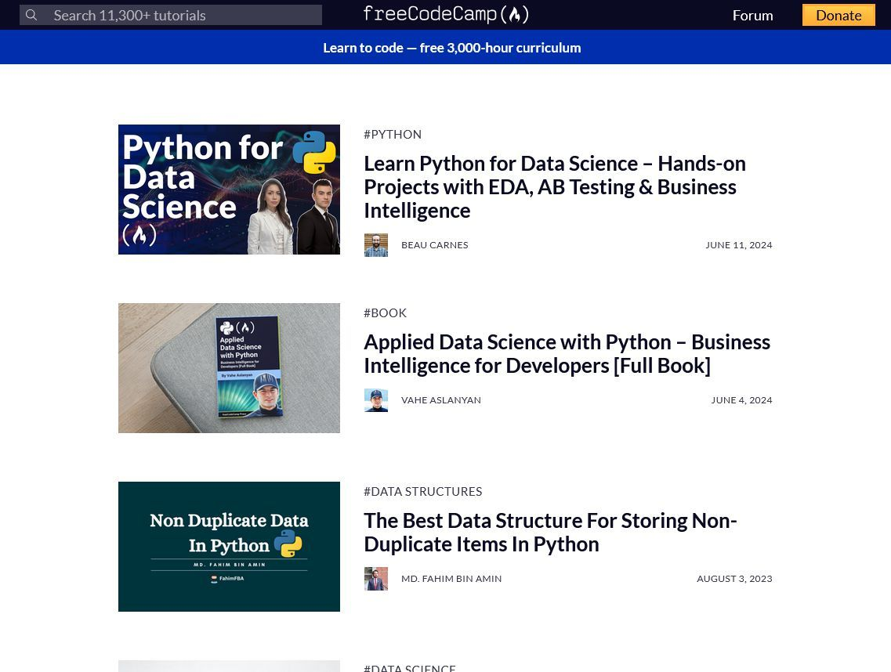
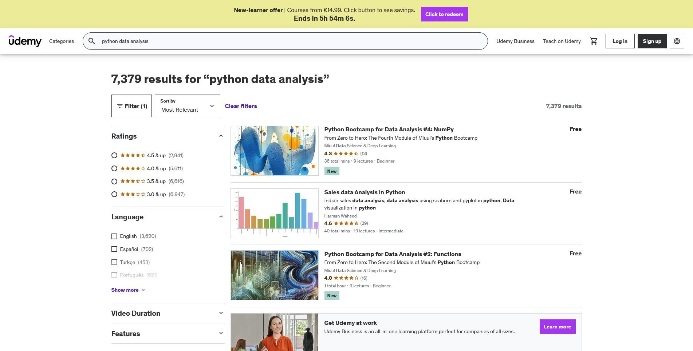
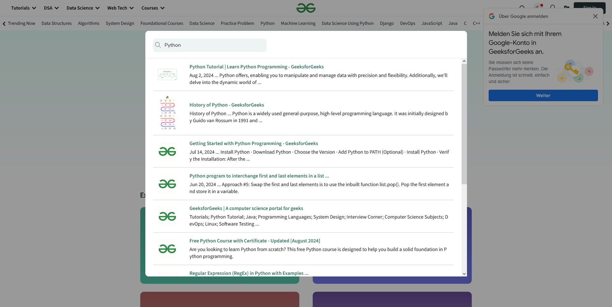

# Learn coding / programming 
## W3School Python 

https://www.w3schools.com/python/python_datatypes.asp

## W3School SQL !

https://www.w3schools.com/sql/sql_not.asp

## codingforkids.io Python 

https://codingforkids.io/en/play/python

## freecodecamp

<https://www.freecodecamp.org/>

## codecademy

<https://www.codecademy.com>

## Udemy

https://www.udemy.com/courses/search/?price=price-free&q=python+data+analysis&sort=relevance&src=sac

## Geeksforgeeks

<https://www.geeksforgeeks.org/>