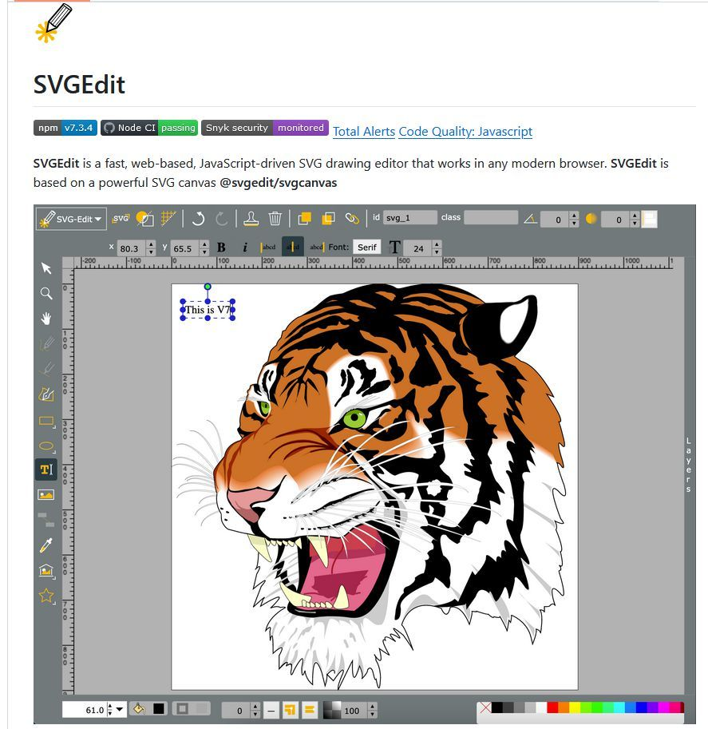
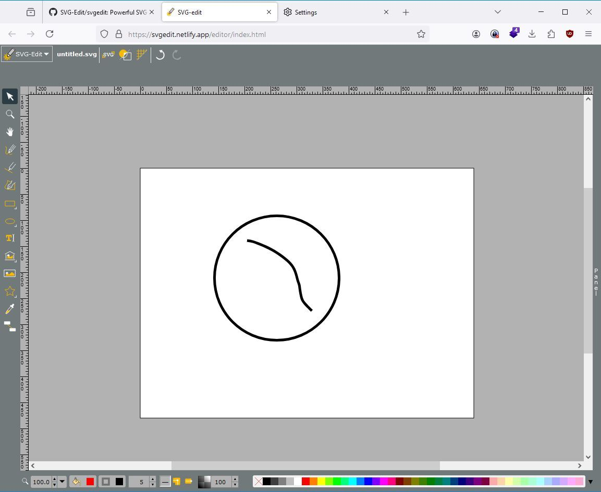

# svgEdit

**SVGEdit** is a fast, web-based, JavaScript-driven SVG drawing editor that works in any modern browser. **SVGEdit** is based on a powerful SVG canvas **@svgedit/svgcanvas**

## Link

<https://github.com/SVG-Edit/svgedit?tab=readme-ov-file>
