# Shrink Git Repo for Obsidian Android Phone usage - WIP


## current state

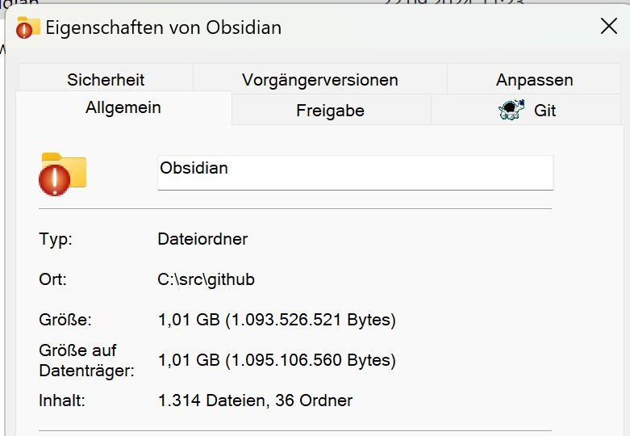

## Analysis Files and Sites 

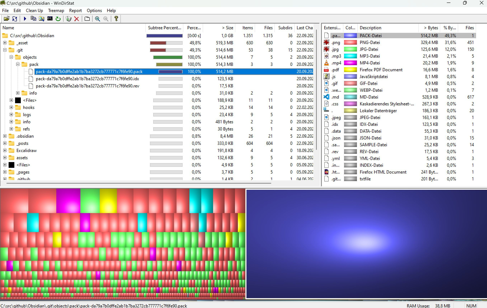

## Analysis Result

~ 50 % .pack Files 
~ 30 % PNG - Files 
~ 12 % JPG Files 
## Find unused Pictures 

- Obsidian Plugin 
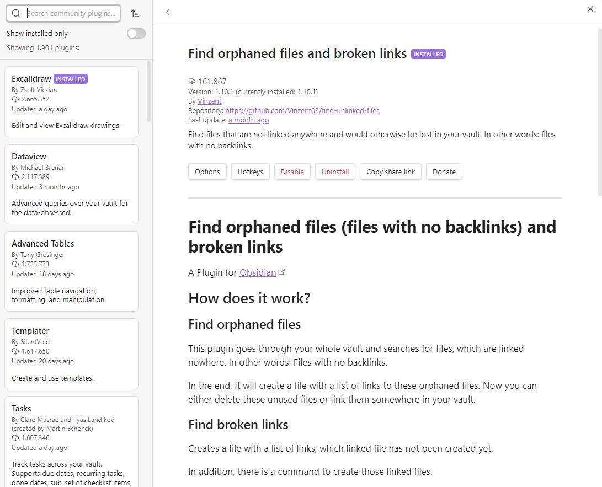

- and delete jpg, png manually 
## Shrink .pack ?

https://stackoverflow.com/questions/11050265/remove-large-pack-file-created-by-git
https://www.ducea.com/2012/02/07/howto-completely-remove-a-file-from-git-history/
https://www.geeksforgeeks.org/how-to-remove-a-large-file-from-commit-history-in-git/
#### Test 1 - not working 
```
git verify-pack -v .git/objects/pack/*.idx | sort -k 3 -n | tail -5
``` 

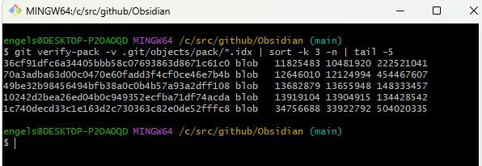

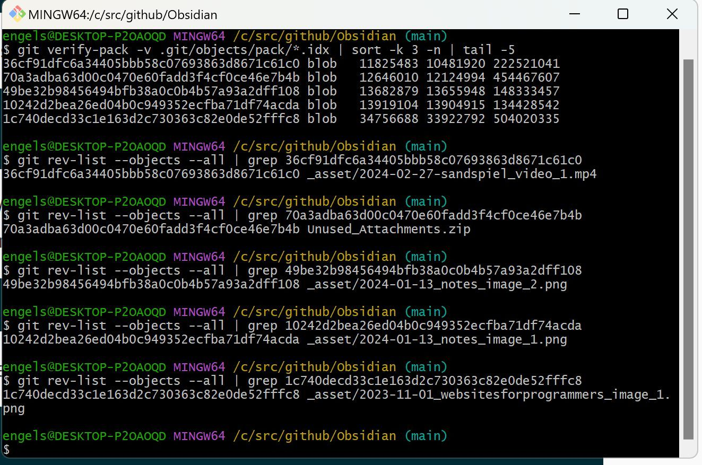
#### Test 2 bfg - working

https://rtyley.github.io/bfg-repo-cleaner/

https://www.geeksforgeeks.org/how-to-remove-a-large-file-from-commit-history-in-git/#using-bfg-repocleaner


```

engels@DESKTOP-P2OAOQD MINGW64 /c/src/github/Obsidian (main)
$ git verify-pack -v .git/objects/pack/*.idx | sort -k 3 -n | tail -


engels@DESKTOP-P2OAOQD MINGW64 /c/src/github/Obsidian (main)
$ git verify-pack -v .git/objects/pack/*.idx | sort -k 3 -n | tail -5


engels@DESKTOP-P2OAOQD MINGW64 /c/src/github/Obsidian (main)
$ git verify-pack -v .git/objects/pack/*.idx | sort -k 3 -n | tail -10
a9cae79fe84fa49b711001709dd7bbf9b78733af blob   7073757 7025109 57958568
853a97a054a64173eca02c7479f56cfccbcae6b9 blob   7508872 7398282 225970779
0c943b3af0258c25e30caa23b43b5cb2c36fce79 blob   8203902 7991509 246231280
19cf3ab0c738316560d5b0c9cf42502362096076 blob   8541078 6555906 85938508
740f6cd508ce1f3af345c3d29e06bbb03fb6a9e0 blob   9493804 9408683 537127208
36cf91dfc6a34405bbb58c07693863d8671c61c0 blob   11825483 10481920 322219135
70a3adba63d00c0470e60fadd3f4cf0ce46e7b4b blob   12646010 12124994 373368221
49be32b98456494bfb38a0c0b4b57a93a2dff108 blob   13682879 13655948 448209234
10242d2bea26ed04b0c949352ecfba71df74acda blob   13919104 13904915 434304319
1c740decd33c1e163d2c730363c82e0de52fffc8 blob   34756688 33922792 254224306

engels@DESKTOP-P2OAOQD MINGW64 /c/src/github/Obsidian (main)
$ git rev-list --objects --all | grep ^C

engels@DESKTOP-P2OAOQD MINGW64 /c/src/github/Obsidian (main)
$ git rev-list --objects --all | grep 853a97a054a64173eca02c7479f56cfccbcae6b9
853a97a054a64173eca02c7479f56cfccbcae6b9 _asset/2023-09-18-18-17-08_illusion pages_image_1.jpg

engels@DESKTOP-P2OAOQD MINGW64 /c/src/github/Obsidian (main)
$ git rev-list --objects --all | grep 853a97a054a64173eca02c7479f56cfccbcae6b9
853a97a054a64173eca02c7479f56cfccbcae6b9 _asset/2023-09-18-18-17-08_illusion pages_image_1.jpg

engels@DESKTOP-P2OAOQD MINGW64 /c/src/github/Obsidian (main)
$ git rev-list --objects --all | grep
Usage: grep [OPTION]... PATTERN [FILE]...
Try 'grep --help' for more information.

engels@DESKTOP-P2OAOQD MINGW64 /c/src/github/Obsidian (main)
$ git rev-list --objects --all | grep 1c740decd33c1e163d2c730363c82e0de52fffc8
1c740decd33c1e163d2c730363c82e0de52fffc8 _asset/2023-11-01_websitesforprogrammers_image_1.png

engels@DESKTOP-P2OAOQD MINGW64 /c/src/github/Obsidian (main)
$ git rev-list --objects --all | grep 10242d2bea26ed04b0c949352ecfba71df74acda
10242d2bea26ed04b0c949352ecfba71df74acda _asset/2024-01-13_notes_image_1.jpg

engels@DESKTOP-P2OAOQD MINGW64 /c/src/github/Obsidian (main)
$ git rev-list --objects --all | grep 49be32b98456494bfb38a0c0b4b57a93a2dff108
49be32b98456494bfb38a0c0b4b57a93a2dff108 _asset/2024-01-13_notes_image_2.jpg

engels@DESKTOP-P2OAOQD MINGW64 /c/src/github/Obsidian (main)
$ git rev-list --objects --all | grep 70a3adba63d00c0470e60fadd3f4cf0ce46e7b4b
70a3adba63d00c0470e60fadd3f4cf0ce46e7b4b Unused_Attachments.zip

engels@DESKTOP-P2OAOQD MINGW64 /c/src/github/Obsidian (main)
$

```
![[Pasted image 20240922134018.png]]


```
$ git clone --mirror git@github.com:softwareengel/Obsidian.git
Cloning into bare repository 'Obsidian.git'...
remote: Enumerating objects: 4501, done.
remote: Counting objects: 100% (96/96), done.
remote: Compressing objects: 100% (81/81), done.
remote: Total 4501 (delta 42), reused 65 (delta 15), pack-reused 4405 (from 1)
Receiving objects: 100% (4501/4501), 525.69 MiB | 2.47 MiB/s, done.
Resolving deltas: 100% (2369/2369), done.
```


```

engels@DESKTOP-P2OAOQD MINGW64 ~
$ cd Downloads/

engels@DESKTOP-P2OAOQD MINGW64 ~/Downloads
$ cd 
Display all 389 possibilities? (y or n)
0507_DE_1200x1200px_no730jpg_e=1719504000&v=beta&t=sYNsQvYY__zMa_xDeXUIscGklfhE5vHTiOMVxwsppTk.jpg
1111signal-2024-06-20-134411_002.png
1111signal-2024-06-20-134411_003.png
1111signal-2024-06-20-134411_004.png
1111ve_01.png
1516247956509_e=1724284800&v=beta&t=KiO3FVAmZgUf2xwF6lFbgqgUBXkOWK2xxO5FvC0ct4o.jpg
1516287899774_e=1724284800&v=beta&t=lUCQ0YIlV9neCyWaa6Xw_GgGhWoi1QRO9H6ANFv8XdA.jpg
1516296405273_e=1724284800&v=beta&t=KKFmVgkIbVdzeWNzysHdFfJIkWHkykQkMF4HRAYxRCM.jpg
1516316650164_e=1724284800&v=beta&t=xfymTruXdpIIP1b4tOvV1DJO7bN7xp-wVTPH9vJczSQ.jpg
1516468665290_e=1724284800&v=beta&t=5lustZ1hE8bsZIC8mgVAgw3W8zip6v31sUG6kuaA_Lo.jpg
1516898222136_e=1724284800&v=beta&t=vfhqEiKe90I_hfvX2ImIz4VdyN5xShXMIo8xwe-S2sw.jpg
1516900564639_e=1724284800&v=beta&t=Wbw2QrsntVGUpAMLRZGw68XCjujwnZeGje2XBQRM8bo.jpg
1516951551935_e=1724284800&v=beta&t=BBkvVCZPNI82EFhN9pHv1qlImTurO4VP3F8gAbjvD-8.jpg
1516970439224_e=1724284800&v=beta&t=BpIhPeVmJyXhQZLVnz4aWsXMoxtpYqUl0HGRGyV1wNk.jpg
1516975680445_e=1724284800&v=beta&t=lAMq6RqQuGcf1kmmuJz4WJ4AQ-vKph8l3zim3pzCDsQ.jpg
1517039191262_e=1724284800&v=beta&t=jD0xrgDKCuoDGXdzZhWdefft5Xc-ReJlZgMCO51vCn4.jpg
1517052746964_e=1724284800&v=beta&t=BZUN-aZcXmrBu-fI1rurHKJb4UPOVhUfBMmh0bfIP84.jpg
1517071621877_e=1724284800&v=beta&t=zDpAVk4NK6wgtv95poeRIXwiEXMLI05P2940Omo8XiU.jpg
1517072520564_e=1724284800&v=beta&t=2zIeNa1KpVLj0ap92H1udCcNXKS2j8EkqdxNWiUVLEI.jpg
1517225892037_e=1724284800&v=beta&t=-1-8Ha3wBKwUNMsnjtgHEazUlWR0LS4Qjgd6jC5vZ0k.jpg
1517364882067_e=1724284800&v=beta&t=6PrrCGXcwDfF9N5b5pNE-oNb0y5gcopddnFKLh-eW-E.jpg
1517392872146_e=1724284800&v=beta&t=TNcj-ICYI68N1bcYHH21akR0rAPgeg3XUGCa1mrpdhI.jpg
1517392917205_e=1724284800&v=beta&t=CJ1UjjK7Etmt_Eo8VWurNSkbivLcm_zw_pW18BI3rIA.jpg
1517451303284_e=1724284800&v=beta&t=63AIQnNCD-HbJh-xmqMQqkKEZVviDUidUOgU0c5B6QU.jpg
1517637982820_e=1724284800&v=beta&t=96whY5jdacKvsFb_8CrDGXbwmRX1xTXfPqYBJcm-RCc.jpg
1517716849384_e=1724284800&v=beta&t=HH_pbZICvmIbTRoVu99UTumeIlRMgQKhBV_gmO4ezis.jpg
1517792802371_e=1724284800&v=beta&t=4JWQW5noeGpFZojMOFhSXu4BXSWLCMzBjkD3VjmypsU.jpg
1517794641321_e=1724284800&v=beta&t=p5Vl42FvPT5ixm9qBxc7ovWvhQuI6xx2QF7qYeONs_k.jpg
1518284491135_e=1724284800&v=beta&t=GGQUMWdfJ46HRY57XHNey2qmD4g4Gsltna_TVOXcO7k.jpg
1522914053928_e=1724284800&v=beta&t=IAXjjFyGl1PC7NkpiXWIeYhE7OnEVSjdO8V0CpsU3hs.jpg
1530301781530_e=1724284800&v=beta&t=4Mn4I0aPuoowcu8OfCNb3G7-cdrcymJGyn9DnjYcCd0.jpg
1534236253391_e=1724284800&v=beta&t=2jFXVO8E_p_cdaM8mjQ25ELTwUekhWRPMTW3tKhnJXA.jpg
1536838748776_e=1724284800&v=beta&t=6QIDRRSME53hweeExfjcLxJOak1tm3J1mDGMjm9nk_M.jpg
1539885893921_e=1724284800&v=beta&t=hhrtKVm3FoZSnxRd8LcC0Iu_JhDayLu0SJ-RLrmwg5E.jpg
1541099845697_e=1724284800&v=beta&t=t5PkgQNu8PBl__CAxB6_IsTmVVqfthStso4dGRDIjqo.jpg
1542883342367_e=1724284800&v=beta&t=xWRs_TdkF4l_7F0PEi4DMqK4yObWfRk-GHutdM55-a0.jpg
1543906743918_e=1724284800&v=beta&t=FLczM_t3EzDfCgqkZ0zGq2nHePV_D5QRSr_arxgqdKU.jpg
1544272255368_e=1724284800&v=beta&t=s5cAvT-mvdC_joekDYYTRq28QOF8BdA0RV6KabayGxo.jpg
1545576849771_e=1724284800&v=beta&t=gbT-MvnLUU30AMT44mIw7tCCbsBDfoTYcNR6OOl7SrI.jpg
1546087546722_e=1724284800&v=beta&t=nByrDOfK26JYAU1usgX57Xm_0Qek0Z5pzQrlTn-DZL8.jpg
1546855591038_e=1724284800&v=beta&t=wMUf_urRSDxaO-nw-WPEj9nrHYEigRVkCGnNPM2Mq78.jpg
1551126900641_e=1724284800&v=beta&t=kdGb40Lk_n2gof6bYP8GQxn5HbMZCS76IjyvMm_nA3I.jpg
1551253545099_e=1724284800&v=beta&t=a2_vAw1yy9e6fz1FTNCxVtM8JxTCBAn0FNA1C8zNO8k.jpg
1552037037043_e=1724284800&v=beta&t=zP4vHHFbhvpzuxmvwnYgLR02-9I0RxtLe8nFolT6Y9o.jpg
1557702793306_e=1724284800&v=beta&t=1d1Hym98t3AGQM1YS0oe0fZ67oaOmMAG2wXNtXvo4uo.jpg
1559143731953_e=1724284800&v=beta&t=Gkvt7qppNw4nH0imp3ZN03SMRxo54kcVm4gWRzAyisM.jpg
1562138144239_e=1724284800&v=beta&t=ju6JNR47Kwx_JDEHFCAWBHNy3yzwIWI7Okm7pIL1EBY.jpg
1563439493607_e=1724284800&v=beta&t=PxSyj6fOIKjE67WoY9iqPPleylQVrkgnG0vVYRu1PeM.jpg
1567579941652_e=1724284800&v=beta&t=FpPeb0kof57iEBa3d765Nqa-amHautqRXI2Xa6TidQc.jpg
1570552805168_e=1724284800&v=beta&t=IEgnfcLJwgNDtwopGhJIkwQ26nLySsLrXTx2z4VEUkc.jpg
1573826780003_e=1724284800&v=beta&t=a-sYSI34chDW5lPjicuOIBY_vvNGrbPFeNZJeHeVJgo.jpg
1574177368974_e=1724284800&v=beta&t=wIhT2z5bVBlsrPa4cJVFR3VFkHad5vQUyYwCO3QO2WY.jpg
1575558889332_e=1724284800&v=beta&t=EYhEB4r18fdBxjej2fjIqsYE1KIzxP-iuf9urXpzzzs.jpg
1576080206340_e=1724284800&v=beta&t=XhTmfNoyLrcg3mOTrf2ScLTusC91cFVW81puh0QMcOs.jpg
1581271921446_e=1724284800&v=beta&t=qJMe61ZJzIJPiJqn5NEeP1thZjoe7IOovnVWHY5rq0w.jpg
1584451281802_e=1724284800&v=beta&t=-J1AwMkWIGfz3L4z05sGLGzuGXS9zShroZAt4bCK-ig.jpg
1585061316927_e=1724284800&v=beta&t=__aWZ17lLtN_5vLN-ItlHkT0i3Poifo2z3UhX27pyzE.jpg
1589362773722_e=1724284800&v=beta&t=GmoJl6hdPWjszAE4nkEy7CnVrlXSzxDX0gjd9nOHmYE.jpg
1589534696719_e=1724284800&v=beta&t=Q79a-1YtdnUonZ4aCelXxaVaOt92WoQvjSJmhJpC0r8.jpg
1589807960377_e=1724284800&v=beta&t=k1gYJt80HMIPMOqjPpeduIrDBaIv9eUid1u_QNkoMXs.jpg
1592302545969_e=1724284800&v=beta&t=DqdQdoGokun945xYbicCO-IFY0mHvboJIDV8AoaJPv8.jpg
1595236429655_e=1724284800&v=beta&t=NlWFO-QUz9RADKFTTszSMDDsTaAJsfGc6oUpzp5f2UY.jpg
1595577648769_e=1724284800&v=beta&t=AiTOsHkwwrhWfh-nUP0otjlINqx8tB0LiWwGcHCnS9c.jpg
1596262995627_e=1724284800&v=beta&t=1sCHFk9l8xk0gkYPBuYWCngloibI1Sp7xkgIXeZ38Xg.jpg
1597744660226_e=1724284800&v=beta&t=SEP_YKN0dZTJvgtqBeDoqF09_JhC6mtm2G7RT5g8rwg.jpg
1601462606286_e=1724284800&v=beta&t=w7RTCYb8DvrOcD-kGGmreLGcizQa54NKb_r536DFfMU.jpg
1603379420577_e=1724284800&v=beta&t=QVnO-0nHZRAl2lBn_hrB1Eix6z4TWkwvjKMa-X2a7FU.jpg
1603646884888_e=1724284800&v=beta&t=oF48V_U-P5Due--qA5Tvtemrv_hk9DRg4JBhxPzdBq4.jpg
1605590136416_e=1724284800&v=beta&t=1tzeoF7h1OIoLtNlDBPTfxnyGHc6PL9n_5pHmcdS0xg.jpg
1605684280695_e=1724284800&v=beta&t=mBmHySjdkHqauUzGCorBh6Nxca1nmMswXPl7GF78UMw.jpg
1605784401927_e=1724284800&v=beta&t=3w_atWPwqh5vVA7muOkd_mfMSHFFlUD5FMa8TadX4KY.jpg
1605892619750_e=1724284800&v=beta&t=qItvWzXzlJCryhE-vJ47X8nihSTq-EjgTrIu_LqXgSE.jpg
1606828371038_e=1724284800&v=beta&t=seJ8lqktIuHsEWb4I56JZtOplYsYad7_7HLiojZ9SCc.jpg
1607339528416_e=1724284800&v=beta&t=66dkwivZn7Rm6u-n_TIr2sQA7SsDhuTlppTA5Ak3tNI.jpg
1614863110673_e=1724284800&v=beta&t=VtMlZZwC2KHW6lIxuSVv1NvcWTQa8d2Zvt0YIZnugi8.jpg
1617773255575_e=1724284800&v=beta&t=9ZB2HCjTxo1FXe_rwcBVy3RFu4koZqeWKp-ZXAsKS-U.jpg
1617786999445_e=1724284800&v=beta&t=hWPD4w5xKW7Ey0lYcJVo4Zf7RXHM2Oyhj96kBDNbY5w.jpg
1618499239090_e=1724284800&v=beta&t=NHwvU8q3UlMC5lKAC8nd0bGlss-65H4U70khzR-VzvQ.jpg
1619083629882_e=1724284800&v=beta&t=0a-YOkkdaPNk-MsBF7Vv-ruxUJE9gaCn4aGc77K52MM.jpg
1619452468794_e=1724284800&v=beta&t=eT2ueWbg9lY7YP0T8zGpHKMkY8ybcXikR9UmkIEeE5g.jpg
1620660971396_e=1724284800&v=beta&t=BYHfhO_YfZP8H9XLJU-2m8zzpCYD4-QWO8gi8Cn0090.jpg
1620673507402_e=1724284800&v=beta&t=12Cs7f7TjxBLrCWK-mZD_BIuUjSKI_MFODDALwUcfXg(1).jpg
1620673507402_e=1724284800&v=beta&t=12Cs7f7TjxBLrCWK-mZD_BIuUjSKI_MFODDALwUcfXg.jpg
1621803721633_e=1724284800&v=beta&t=9DumENuP60Nokt45KqCV7JklvLDoCTZou2J_MmClyV8.jpg
1622202283420_e=1724284800&v=beta&t=2bRLptUW-qhAPi80auhx2k2yV_jrAaqJYt7eScrSe0s.jpg
1623937100081_e=1724284800&v=beta&t=hdhq2cs9jNBVYMGziGqU4cj5k52y1Voqn1iBQNkD9oU.jpg
1624981112424_e=1724284800&v=beta&t=5jOwlhhpVg5zvdisJS_AK31ky9kAxGZfUyQsafgQEsI.jpg
1625256252038_e=1724284800&v=beta&t=O2vpJUc0dBlRJIj3imKB2hinoNWiafKCBNqR56OqMZw.jpg
1629704217016_e=1724284800&v=beta&t=tKQBXRWH--HbY9oS9flKGfAAqWLn46Ocys6XLIRDqiE.jpg
1630252926406_e=1724284800&v=beta&t=vqg2yzsqUmHv4qg1HvQRyWxhLRstXzDyjB5AOm-IcS8.jpg
1631007936617_e=1719504000&v=beta&t=wHcC-qkvg1r1UIyxbNgWkqRXiWFCDicvdF8Qn7JgV0Q.jpg
1631396026829_e=1719504000&v=beta&t=Rbi-BeWQXOvYA_5ZWjXAsdgLOuuRRNOCiCw_P49xVhU.jpg
1632328822017_e=1724284800&v=beta&t=m_xvLWFjN_i2gIEyggiUKEWcdFmITfpVOfBwr8pvhYM.jpg
1632863630810_e=1724284800&v=beta&t=jzBEPPtWFUsfFopWohdR2Lm1Aymni64G0lE_W9DWex4.jpg
1633089490331_e=1724284800&v=beta&t=y_DXqj1UeLyB0RRBmWmzGC71ZDqdV_SiTdQwORMz8KA.jpg
1634124732865_e=1724284800&v=beta&t=-5oNltr2XDRNTmt2YgxbnzBYBT9a4j0mm1l7dtYBvNw.jpg
1634277899754_e=1724284800&v=beta&t=Dg2q2C50I1soFIK4W5Q7OeLVF0a97iZuy9RT1DbyKDM.jpg
1634486176366_e=1724284800&v=beta&t=Ew3YTiA61mVlqdwnqP45Nl92Dig28VH3yds2EXRkXN4.jpg
1635166884407_e=1724284800&v=beta&t=C7Eft9NpQs1sxXjFirinO9RKBFCpihbP5OdYhlYC1g0.jpg
1635507668183_e=1724284800&v=beta&t=k7H0hz-ats2Dmsul9XHmsWY513xS5HG_Jg8Ct0DjW1M.jpg
1636113737789_e=1724284800&v=beta&t=DVAV5YI6bvTcfoBZuxKJGc83UCozsg3nWLPuZY5XUbE.jpg
1636557559737_e=1724284800&v=beta&t=st7NaoAYc8KcSWtqG-PmEzkog5h5JWsv6PNBvTKfuEE.jpg
1637868833084_e=1724284800&v=beta&t=0ksxVvylnbDaPp3vrUjcTsp-MT__PKPHlaszB-aw3fE.jpg
1638697135790_e=1724284800&v=beta&t=y_C5yRnbjyRtSvUI79VJeiqTq2qCf4ssBlNu02uvKEc.jpg
1640339226264_e=1724284800&v=beta&t=NsDXKoPwCHeOGDspQL0Vrl7UM5HLc1yJolCXEwvZ9TU.jpg
1642754754693_e=1724284800&v=beta&t=Holp2964SPwmpXkB0eX5WlEGBipM_2WOpIOK-a2MgBU.jpg
1643836977054_e=1724284800&v=beta&t=MI2_XlRie-aL7Gl1j8EAl1vt4y6ykJIoP88UYrwaYag.jpg
1644509399420_e=1724284800&v=beta&t=9CNVO21Zly-1j3RGyA6MrBbggL9UHPuE1VBVSOar0Bk.jpg
1644602240745_e=1719504000&v=beta&t=ldecyRYfN-JZlD4ZzxpWPQnozat04X1UOD2Dmx3A2gg.jpg
1644667293772_e=1724284800&v=beta&t=HGVnwacLVWb8IPQvEjWro09vU8UZNUCeEw-EqFFHztM.jpg
1645106874421_e=1724284800&v=beta&t=d3kstykP_qQcqesgsNEAUSaV_x3yAzfetx8juP06-yM.jpg
1645179670941_e=1724284800&v=beta&t=ty3Q-1QoNwVfNnnBsw1SCLGUVyBpN_uAE9wUyyAxdJQ.jpg
1645801077533_e=1724284800&v=beta&t=MOWREAUGaGwp_pM4jUEqPq1bNPlxncQn4iUy8qy1_io(1).jpg
1645801077533_e=1724284800&v=beta&t=MOWREAUGaGwp_pM4jUEqPq1bNPlxncQn4iUy8qy1_io.jpg
1647189882792_e=1724284800&v=beta&t=j3Wd7Ehw7NNYdkCba6WVcEZPJJ_bN7gwG-I2vdgCv7I.jpg
1649357497188_e=1724284800&v=beta&t=904eP4-2FS0CxUGTzumFYy0Km5e5atd3SdHjdqIOt4Y.jpg
1651049115148_e=1724284800&v=beta&t=hxEDAJDVTOZWiHcO9sAiAVB_bDFtkQOF4uKtfQVI-lQ.jpg
1651850685404_e=1724284800&v=beta&t=KV8t5qu_SYI_rN1E_Nz40n5HwCMK_fmPqipXYOigcYk.jpg
1652991531483_e=1719504000&v=beta&t=Kd9j2R8Q6lWJ0dEYkEUoXafGnjjjcF9olHzNyHGd5-s.jpg
1654000878107_e=1724284800&v=beta&t=gSm918yEqCFgEJ6n5ki4f5IScTHXTgtRI4-bPeP5pu8(1).jpg
1654000878107_e=1724284800&v=beta&t=gSm918yEqCFgEJ6n5ki4f5IScTHXTgtRI4-bPeP5pu8.jpg
1656575070246_e=1724284800&v=beta&t=vN4SaV8KwvBHkYuroYvZWU_QcdsYBtioD1xtuJJvgjo.jpg
1657749834036_e=1724284800&v=beta&t=_ENld0gS-rV1iAlLk_EczsCcw93sd4OWagW5X-zcvlY.jpg
1658249586164_e=1724284800&v=beta&t=Et1fgz5er0rdm61pZgjmpTkhWjufj8fKbtaxQtrJcuk.jpg
1659547599150_e=1724284800&v=beta&t=jLzB-uX0tRwSDLwq0KJ74ZZoY518y93D77by53RztYw.jpg
1660639541497_e=1724284800&v=beta&t=cXbpsViSWRJSAP-yN7BLYPYgB_tfDtAJPm5isTo29lQ.jpg
1660898588717_e=1724284800&v=beta&t=wvcdJ231NAve6qCRpeWijDsVVEw6h-v8Ybg9f3gMlBY.jpg
1660978346483_e=1724284800&v=beta&t=t4jrmpFuDXcsKtDSzYtDfXB8PK_7Nr1VES5wuFPnnok.jpg
1661257328471_e=1724284800&v=beta&t=YFPQwpP6_6C03YFmwnetK5qXuYsWXBeteddFTrS9cZ8.jpg
1663184384507_e=1724284800&v=beta&t=H_bxMjOt-rNhKMh6SsI9kXoL3EGx7v0B54T0euCLPb8.jpg
1664105072305_e=1724284800&v=beta&t=274llrObd81f71Uve-EMDSJu64fVfE4QsNJb1PmxBKI.jpg
1664903311263_e=1724284800&v=beta&t=7nYA-imQxYjDPlTvAqt7aIeLIQirAHDoTYBfI_nGql0.jpg
1664985294026_e=1724284800&v=beta&t=1RoHnjTtXedQvtkfQkN9ZSKjUQbkiY1pZDzNRcP4Yyw.jpg
1665493122600_e=1724284800&v=beta&t=ubz5wRkpj1J9TR9E5Z7nZ2kkDAJASsPz2Xrl2Tdm-Ws.jpg
1665691469838_e=1724284800&v=beta&t=YY-Mt2O7zMhO0q-4Tc-RmEoHmYQTAG9bkBWviCmrWDk.jpg
1666214112845_e=1724284800&v=beta&t=PqmisxTbS09JWZC2HkrQd0zspGx89CGfLtXxkD0Yo_k.jpg
1666772873074_e=1724284800&v=beta&t=qzRIJmO4pnIgB4BrPB3phF3W-x-8oJys77Ay0TTSW5Y.jpg
1667323663558_e=1724284800&v=beta&t=wDVyM-qCEAPGkAVr86hUCABRsv7AMzcQ2G6vWicmMjk.jpg
1667564599258_e=1724284800&v=beta&t=wOL-hz5J6J7erY4IOvaJCsdy4ohz-FWrSrDrBCmiCvM.jpg
1667651533884_e=1724284800&v=beta&t=82vx-RJMm3zvlJ_5dzobkw04zKi4ICaf1rclwj4WXmY.jpg
1668412899882_e=1724284800&v=beta&t=lpoV8tK7d_yfyc_akRytNzKjIk6cr6g6oF18iEJtbow.jpg
1669800079152_e=1724284800&v=beta&t=Z60FEFzq2as1ItkWs7Xuid9h9p-OEYaNF9AMjFd3hWQ.jpg
1669995390651_e=1719504000&v=beta&t=dV_8BIpNx1xrsClhW7tzhcVfv_mvaIBSGBazZK5fWYg.jpg
1670356193357_e=1724284800&v=beta&t=b3WCdHyK8YqB6PhlLbQav6KMyDdawM-rvuVhhXPpB9Y.jpg
1672271625790_e=1724284800&v=beta&t=19SM2AxOj90P63e8QWUuRM7uKCx6E3oZ1fQLLFlMSWA(1).jpg
1672271625790_e=1724284800&v=beta&t=19SM2AxOj90P63e8QWUuRM7uKCx6E3oZ1fQLLFlMSWA.jpg
1672665682943_e=1724284800&v=beta&t=wqPOG_B3Tjakpx2T-f2yXAVDgzm2zv2RDSm5i09aDMw.jpg
1672917360561_e=1724284800&v=beta&t=2s4zRR4H99itdoSLxM0vOGFQrH_YqfeZPG9TZpayeAA.jpg
1673533215183_e=1724284800&v=beta&t=omfavbe-CmrdemfX_xN_cJFuHR9pTnn4eOrv3Yd42qs.jpg
1673538846343_e=1724284800&v=beta&t=zzg8pJMZqTfSGlOJNA0m48dbmKJvxP_2gjuupk-KbnI.jpg
1675069409524_e=1724284800&v=beta&t=Fjjav5bHRuQaqscE4Q9UFuW4Y0Xl85Y9eIwMPrmUjBk.jpg
1676198533149_e=1724284800&v=beta&t=uds3aoZSMhLJHXMUoUx_fnU8MCdFWbl6YLbOgJvRHCQ.jpg
1678280214829_e=1724284800&v=beta&t=8C0H_ymYSdIHZHgJUVJNIyb7Idjfnwt9wxx395yAhxU.jpg
1678832599795_e=1724284800&v=beta&t=8Xm-i2sEyoORH-bHW_Cd9uVANZISceQQMgYdEB8F-K4.jpg
1678891419849_e=1724284800&v=beta&t=xV0Jln9JQCPEZik_caXrn--A4_CO07ICVox2iHifQEI.jpg
1679488552018_e=1724284800&v=beta&t=hxlVJLHqquWvO1OIXtV1vqoApYENlzljgZNDUMb40vQ.jpg
1679561775205_e=1724284800&v=beta&t=16ClcoEUJcQXxSGZ8ndm2YrShICA-4pPRVKA-rnNFKk.jpg
1679653434102_e=1724284800&v=beta&t=wVCQZ_2LLI8M9_qgeAVTTH3-i3iCi1vmxrJY7vSWQx8.jpg
1680597770076_e=1724284800&v=beta&t=RRAEhWVuAf5IO4gDa7q1nNxKVJ4C2mHfX3yQp41pbkw.jpg
1682669543669_e=1724284800&v=beta&t=L55jloEZM0V8TZwGmixzHOmw1on826j9ppiOr-RvvRM.jpg
1683035876701_e=1724284800&v=beta&t=i3JMzvkpMekOXKQ8DOhfzWD41fJhta2kdt5UawZZSpY.jpg
1683566034929_e=1724284800&v=beta&t=KW1_oevvUkrJPLGiLqwInteuJu0Kvp_5iA02cjAqztQ.jpg
1684236465913_e=1724284800&v=beta&t=rS4VKbrZdRpe8oNBda9EiThoFct8058hpw95AEJnU0A.jpg
1685387486580_e=1724284800&v=beta&t=6-u9xTM9x7lt68jpzPSYe-TLAfxkwiXG6gRclvkL2xk.jpg
1686145556835_e=1724284800&v=beta&t=K1ChwQ10deMcVQZ6YpC1k1gW7elj8F5ycD6_2vr2Lss.jpg
1686552002890_e=1724284800&v=beta&t=aFmbA49mrMcMFM8WlzQpoIYKl2RJp88BZfhEdPXYnpo.jpg
1687206094342_e=1724284800&v=beta&t=In-52BRkJ8zaXizyJuOGRs2SeGRmaYFxVxXDKOym3vE.jpg
1688115914839_e=1724284800&v=beta&t=cBxkF6Q8GtGlGWP4aoR-iZyzX_bop-hDQjEBSIepEMQ.jpg
1688762976202_e=1724284800&v=beta&t=VegdZ5Iu57zL_asxWskotJhNO_NqDq3o7LpNdL6xPd4.jpg
1689798154504_e=1724284800&v=beta&t=Cm_nJPVuUAGxi_ASED0jwYwdWiXdKiGsD8Sx_3KhwKI.jpg
1689941698441_e=1724284800&v=beta&t=h1xyAHhpClQ1r-obGdOMqfitUFyJtsGnWeeVFISWyPQ.jpg
1690360808859_e=1724284800&v=beta&t=J5zb-eEk26WSPt6jadovSs_47qMDfitjJ1bD8gBMS-8.jpg
1691083492717_e=1724284800&v=beta&t=eCV9PjB17gmMFqrlVVqRnZ3G_ytV46KMYl1Y6ti_fDw.jpg
1691333460346_e=1724284800&v=beta&t=EuZwOvQ5lZVbcObt7Gvd2HY0cPIr44BwpgeRNByqZbI.jpg
1693844390397_e=1724284800&v=beta&t=7DJ9e1bgmXB-remM9PBkvuxvrDFa_fh2cM4Z2QuF5fM.jpg
1694252693705_e=1724284800&v=beta&t=YHVQBBo0ORH5G9qGf_in9hd1VRAHkj3aihyW0hqZAVE.jpg
1694697488880_e=1724284800&v=beta&t=P5zQmGraYkdYYarXdSMCKNDEcIn4iPcdPKC3tINXw1k.jpg
1695149291811_e=1724284800&v=beta&t=osiaWPcmh2zQ6AdEc-1fcRqcNYJ8IS-QAv3bTURO17c.jpg
1695905355860_e=1719504000&v=beta&t=7CQsakOk06-W1XJkBOHxg5UZCYlU7VihmKsTYfPSIrw.jpg
1698670177442_e=1724284800&v=beta&t=qvLjJq8KInAk3jIdLX7uFszQf8gPvjt8X9xgswQkz8U.jpg
1699099838408_e=1724284800&v=beta&t=vIu3bwzrwfIa7i8W4h7zHzDeq0s4YzrW8X3tbAaqnQs.jpg
1699845789172_e=1724284800&v=beta&t=hoCyHT4wUhCDwluBJE_Rcm-nhnf3umyCQluFmLHbcTA.jpg
1700045271202_e=1724284800&v=beta&t=55G4jNp-pz6cY8fXcbiJ5KlgMW6mA3-8tjK7MyTxVco.jpg
1700085779949_e=1724284800&v=beta&t=VT99X1YF4wWYOVE60HZjinyBwvSbxNhXNeJYp0c-zxE.jpg
1700164666827_e=1724284800&v=beta&t=bkQH6bTpWF1_zUyihB3c3cemHfsVWKkuX6evKb2oNS0.jpg
1700583401300_e=1724284800&v=beta&t=qf_ah1bFWtW9FlYc86OvWDq1IQKlnfyyUTqpGtlOfpo.jpg
1700724469022_e=1724284800&v=beta&t=ffjn9Cy8T2kItj_ld55j_Rsyd3yQMjEFsRmpUJ-C1M8(1).jpg
1700724469022_e=1724284800&v=beta&t=ffjn9Cy8T2kItj_ld55j_Rsyd3yQMjEFsRmpUJ-C1M8.jpg
1701159164063_e=1724284800&v=beta&t=xPvdiSJDdW0ZwDizxzNjH1eDMg-kqnUVBmMTAPXjxjE.jpg
1701944444787_e=1724284800&v=beta&t=St5wzwFn4xDv_WYF7GVVapT_qimHxLeJD1nXyXHi10g.jpg
1706572181549_e=1724284800&v=beta&t=JgBR8uEqGPg2XYCXRDaSasCJRb5d9Tfff2KIZQGLKKw.jpg
1707177118100_e=1724284800&v=beta&t=nmQd4XhSQLQaghzHGBvIGV281Ogt-HJLtthYcRU9B-o.jpg
1707215966575_e=1724284800&v=beta&t=iCmOhScZevawqzjJVhBFOZ2rxqdiIZWC8pQoIbeb5XY.jpg
1708208262924_e=1724284800&v=beta&t=5nuU9w-ZysgKpKWiLFiYs8ljk9AGgkaDXHXgXO1gcgQ.jpg
1709044584199_e=1724284800&v=beta&t=kbSZ7WJH9ChIvJ18aswaCavXs5BpaCfFalhil509k_Y.jpg
1709201160757_e=1724284800&v=beta&t=DDjkpi1RMSvtBxEfWJz87g9pJkXuWLG3kDe_VuEBWZA.jpg
1709313870896_e=1719504000&v=beta&t=poXascPsBQ8sItfPpufQltNl3cvj9XoHgyd9cTMvkuI.jpg
1709884209502_e=1724284800&v=beta&t=jQQ5ihxCAtkhr4yGQY4OBYfzdIJowR7O0c9fe9qtFWY.jpg
1710183983228_e=1719504000&v=beta&t=ksT_Zzkytuq7nY7qDF8uJYng1xoZoZEO409wiTeEu9Y.jpg
1710183985912_e=1719504000&v=beta&t=8SOCzLQKmxfqh8VKZAib_qu53a6kA1dzgeWdsEb0aME.jpg
1710320956966_e=1724284800&v=beta&t=NW_ytCaeNMnYfH4LQTi1TG2dz3NjJxiqmN18OUYM2aU.jpg
1710351351620_e=1724284800&v=beta&t=RLtXBpAO84Slk2NoZ-B5M5vMURvXwymE_rpYQlvA7YQ.jpg
1710842500546_e=1724284800&v=beta&t=mucesbFYlk8gz0bYfcisZyZayqeL5X7FcsUbVDZNdKk.jpg
1711109853245_e=1724284800&v=beta&t=BD0sJxg2LwTHiAL_N2t_AvESxyXnYI3XRRk_J5Th_NU.jpg
1711128178092_e=1719504000&v=beta&t=SFtRa76nkEDBEVchkwK5-9Tx0NXkGbdhDt8CuvVfzK8.jpg
1711333807903_e=1719568800&v=beta&t=j0lm9edod6rDSdUQdpmmm0SL_0qc-GNKxKJN_dKlD5s.jpg
1711357230950_e=1724284800&v=beta&t=FQrrBLtrGv9JwbmR25MBNpz1_rNmYZbZz2asTbqHEJA.jpg
1712045178345_e=1724284800&v=beta&t=8VJUdHzZQCkAvoUz2MXWkfLrn-ycWZiXUrrjNJqMLvk.jpg
1712130947565_e=1724284800&v=beta&t=WnTXSPBjK88CrJNvxxp_TfVgHk9snXmcO0bw8OAx6Lg.jpg
1713198686520_e=1724284800&v=beta&t=addmgkmXcIu8IaoIcUmlK2U7wCjU2EMp1bVbxlUEv34.jpg
1713248842617_e=1724284800&v=beta&t=oztQzqF4hEvCz35taJsXvjzYmSwltLzIPk8PvX29hT0.jpg
1713251488088_e=1724284800&v=beta&t=QJfK1eFui5VTaYR3P1xcZyGkI0KS1TEQALCJyTGfXqI.jpg
1714252733975_e=1724284800&v=beta&t=xukj7_eJWIZzIIVhTolAsPoWN5dXNjIAm22JzWkfd3w.jpg
1714404581001_e=1719504000&v=beta&t=qbm_NFV96eijiEy_hifRsTujiNOWJVvkCZOqnvxTkzY.jpg
1714490803861_e=1724284800&v=beta&t=RsNOEDaggSL1900EICD5Sx7k9vOqZADVPuCgUJFre-8.jpg
1714632246816_e=1724284800&v=beta&t=pX9fXoZH1ugf2qECrtTKj2Cv1sX1jKzWz0xuczaxqjE.jpg
1714639765910_e=1724284800&v=beta&t=htPosyDIDWaEu9oFrooRWZsOIcZOH67PefSl5ujJUO0.jpg
1714769541253_e=1724284800&v=beta&t=bB-Ok6Rgvx0Crty7i5maDi-2xmJKYpUEl13VWt8trHc.jpg
1714897194824_e=1719504000&v=beta&t=WDX6V1aLb3LnKPG-7u1ISrN2wurPWhMvdV-aeMlI12c.jpg
1715028669942_e=1724284800&v=beta&t=6g9VdBWfw7Tc83NuUFq8LCDVKIM-Y2YWj4OVt9keK2s.jpg
1715347065186_e=1724284800&v=beta&t=Faq94KWYfdQfuKY9mBKEVbxigPULDhs6399bLX43i7M.jpg
1715525837476_e=1724284800&v=beta&t=vX5YodoiRtYfTW-_5KoHerfRA7fcaQMhoglH2B2EOD8.jpg
1715873096402_e=1724284800&v=beta&t=8NWoSSmEtcbV534thFOlKr4swsM-NOvr3JQGTPI7jDk.jpg
1716059294737_e=1724284800&v=beta&t=4GSsqXKjfHZ_8DzbX7sUgHfr5w7BMxYvJB3xMElvBoc.jpg
1716315071919_e=1724284800&v=beta&t=b7ZpZrEZWusF8joRLhStJA_dsNAMrIkrCCCVeO5IiVo.jpg
1716477665895_e=1724284800&v=beta&t=uWaXDbUeb9WULhiwX5rPUmZbOj_NvLU45QYBKIt-wO8.jpg
1717745433460_e=1721865600&v=beta&t=HASjgX2BgJgCdouQtUEYf_MQgUMheVv9og33Z2XANsg.jpg
1718026130918_e=1719504000&v=beta&t=eH-LfqCFAtNa7cVx7XMFEpXmuS7bZiWhw1bKlqmF4Ew.jpg
1718210188566_e=1724284800&v=beta&t=gFz2cwsm-AfzEab3llXdE8VmNBOEGyeEfYMRrtHDp24(1).jpg
1718210188566_e=1724284800&v=beta&t=gFz2cwsm-AfzEab3llXdE8VmNBOEGyeEfYMRrtHDp24.jpg
1718224207009_e=1724284800&v=beta&t=PgCsj3z1iFRKMoX8SX21KIV47yLsJNnWlhoVc1CSaDc.jpg

engels@DESKTOP-P2OAOQD MINGW64 ~/Downloads
$ cd cd gittest/
bash: cd: too many arguments

engels@DESKTOP-P2OAOQD MINGW64 ~/Downloads
$  cd gittest/

engels@DESKTOP-P2OAOQD MINGW64 ~/Downloads/gittest
$ java -jar ../bfg-1.14.0.jar 
bfg 1.14.0
Usage: bfg [options] [<repo>]

  -b, --strip-blobs-bigger-than <size>
                           strip blobs bigger than X (eg '128K', '1M', etc)
  -B, --strip-biggest-blobs NUM
                           strip the top NUM biggest blobs
  -bi, --strip-blobs-with-ids <blob-ids-file>
                           strip blobs with the specified Git object ids
  -D, --delete-files <glob>
                           delete files with the specified names (eg '*.class', '*.{txt,log}' - matches on file name, not path within repo)
  --delete-folders <glob>  delete folders with the specified names (eg '.svn', '*-tmp' - matches on folder name, not path within repo)
  --convert-to-git-lfs <value>
                           extract files with the specified names (eg '*.zip' or '*.mp4') into Git LFS
  -rt, --replace-text <expressions-file>
                           filter content of files, replacing matched text. Match expressions should be listed in the file, one expression per line - by default, each expression is treated as a literal, but 'regex:' & 'glob:' prefixes are supported, with '==>' to specify a replacement string other than the default of '***REMOVED***'.
  -fi, --filter-content-including <glob>
Usage: bfg [options] [<repo>]

  -b, --strip-blobs-bigger-than <size>
                           strip blobs bigger than X (eg '128K', '1M', etc)
  -B, --strip-biggest-blobs NUM
                           strip the top NUM biggest blobs
  -bi, --strip-blobs-with-ids <blob-ids-file>
                           strip blobs with the specified Git object ids
  -D, --delete-files <glob>
                           delete files with the specified names (eg '*.class', '*.{txt,log}' - matches on file name, not path within repo)
  --delete-folders <glob>  delete folders with the specified names (eg '.svn', '*-tmp' - matches on folder name, not path within repo)
  --convert-to-git-lfs <value>
                           extract files with the specified names (eg '*.zip' or '*.mp4') into Git LFS
  -rt, --replace-text <expressions-file>
                           filter content of files, replacing matched text. Match expressions should be listed in the file, one expression per line - by default, each expression is treated as a literal, but 'regex:' & 'glob:' prefixes are supported, with '==>' to specify a replacement string other than the default of '***REMOVED***'.
  -fi, --filter-content-including <glob>
                           do file-content filtering on files that match the specified expression (eg '*.{txt,properties}')  -fe, --filter-content-excluding <glob>
                           don't do file-content filtering on files that match the specified expression (eg '*.{xml,pdf}')
  -fs, --filter-content-size-threshold <size>
                           only do file-content filtering on files smaller than <size> (default is 1048576 bytes)
  -p, --protect-blobs-from <refs>
                           protect blobs that appear in the most recent versions of the specified refs (default is 'HEAD')
  --no-blob-protection     allow the BFG to modify even your *latest* commit. Not recommended: you should have already ensured your latest commit is clean.
  --private                treat this repo-rewrite as removing private data (for example: omit old commit ids from commit messages)
  --massive-non-file-objects-sized-up-to <size>
                           increase memory usage to handle over-size Commits, Tags, and Trees that are up to X in size (eg '10M')
  <repo>                   file path for Git repository to clean
Aborting : . is not a valid Git repository.

engels@DESKTOP-P2OAOQD MINGW64 ~/Downloads/gittest
$ ls
softwareengel.github.io.git/

engels@DESKTOP-P2OAOQD MINGW64 ~/Downloads/gittest
$ java -jar ../bfg-1.14.0.jar -D Unused_Attachments.zip 
bfg 1.14.0
Usage: bfg [options] [<repo>]

  -b, --strip-blobs-bigger-than <size>
                           strip blobs bigger than X (eg '128K', '1M', etc)
  -B, --strip-biggest-blobs NUM
                           strip the top NUM biggest blobs
  -bi, --strip-blobs-with-ids <blob-ids-file>
                           strip blobs with the specified Git object ids
  -D, --delete-files <glob>
                           delete files with the specified names (eg '*.class', '*.{txt,log}' - matches on file name, not path within repo)
  --delete-folders <glob>  delete folders with the specified names (eg '.svn', '*-tmp' - matches on folder name, not path within repo)
  --convert-to-git-lfs <value>
                           extract files with the specified names (eg '*.zip' or '*.mp4') into Git LFS
  -rt, --replace-text <expressions-file>
                           filter content of files, replacing matched text. Match expressions should be listed in the file, one expression per line - by default, each expression is treated as a literal, but 'regex:' & 'glob:' prefixes are supported, with '==>' to specify a replacement string other than the default of '***REMOVED***'.
  -fi, --filter-content-including <glob>
                           do file-content filtering on files that match the specified expression (eg '*.{txt,properties}')
  -fe, --filter-content-excluding <glob>
                           don't do file-content filtering on files that match the specified expression (eg '*.{xml,pdf}')
  -fs, --filter-content-size-threshold <size>
                           only do file-content filtering on files smaller than <size> (default is 1048576 bytes)
  -p, --protect-blobs-from <refs>
                           protect blobs that appear in the most recent versions of the specified refs (default is 'HEAD')
  --no-blob-protection     allow the BFG to modify even your *latest* commit. Not recommended: you should have already ensured your latest commit is clean.
  --private                treat this repo-rewrite as removing private data (for example: omit old commit ids from commit messages)
  --massive-non-file-objects-sized-up-to <size>
                           increase memory usage to handle over-size Commits, Tags, and Trees that are up to X in size (eg '10M')
  <repo>                   file path for Git repository to clean
Aborting : C:\Users\engels\Downloads\gittest is not a valid Git repository.


engels@DESKTOP-P2OAOQD MINGW64 ~/Downloads/gittest
$

engels@DESKTOP-P2OAOQD MINGW64 ~/Downloads/gittest
$

engels@DESKTOP-P2OAOQD MINGW64 ~/Downloads/gittest
$

engels@DESKTOP-P2OAOQD MINGW64 ~/Downloads/gittest
$ java -jar ../bfg-1.14.0.jar -D Unused_Attachments.zip 
bfg 1.14.0
Usage: bfg [options] [<repo>]

  -b, --strip-blobs-bigger-than <size>
                           strip blobs bigger than X (eg '128K', '1M', etc)
  -B, --strip-biggest-blobs NUM
                           strip the top NUM biggest blobs
  -bi, --strip-blobs-with-ids <blob-ids-file>
                           strip blobs with the specified Git object ids
  -D, --delete-files <glob>
                           delete files with the specified names (eg '*.class', '*.{txt,log}' - matches on file name, not path within repo)
  --delete-folders <glob>  delete folders with the specified names (eg '.svn', '*-tmp' - matches on folder name, not path within repo)
  --convert-to-git-lfs <value>
                           extract files with the specified names (eg '*.zip' or '*.mp4') into Git LFS
  -rt, --replace-text <expressions-file>
                           filter content of files, replacing matched text. Match expressions should be listed in the file, one expression per line - by default, each expression is treated as a literal, but 'regex:' & 'glob:' prefixes are supported, with '==>' to specify a replacement string other than the default of '***REMOVED***'.
  -fi, --filter-content-including <glob>
                           do file-content filtering on files that match the specified expression (eg '*.{txt,properties}')
  -fe, --filter-content-excluding <glob>
                           don't do file-content filtering on files that match the specified expression (eg '*.{xml,pdf}')
  -fs, --filter-content-size-threshold <size>
                           only do file-content filtering on files smaller than <size> (default is 1048576 bytes)
  -p, --protect-blobs-from <refs>
                           protect blobs that appear in the most recent versions of the specified refs (default is 'HEAD')
  --no-blob-protection     allow the BFG to modify even your *latest* commit. Not recommended: you should have already ensured your latest commit is clean.
  --private                treat this repo-rewrite as removing private data (for example: omit old commit ids from commit messages)
  --massive-non-file-objects-sized-up-to <size>
                           increase memory usage to handle over-size Commits, Tags, and Trees that are up to X in size (eg '10M')
  <repo>                   file path for Git repository to clean
Aborting : C:\Users\engels\Downloads\gittest is not a valid Git repository.


engels@DESKTOP-P2OAOQD MINGW64 ~/Downloads/gittest
$ ls
Obsidian.git/  softwareengel.github.io.git/

engels@DESKTOP-P2OAOQD MINGW64 ~/Downloads/gittest
$ java -jar ../bfg-1.14.0.jar -D Unused_Attachments.zip Obsidian.git/

Using repo : C:\Users\engels\Downloads\gittest\Obsidian.git

java.lang.reflect.InvocationTargetException
        at java.base/jdk.internal.reflect.NativeMethodAccessorImpl.invoke0(Native Method)
        at java.base/jdk.internal.reflect.NativeMethodAccessorImpl.invoke(NativeMethodAccessorImpl.java:77)
        at java.base/jdk.internal.reflect.DelegatingMethodAccessorImpl.invoke(DelegatingMethodAccessorImpl.java:43)
        at java.base/java.lang.reflect.Method.invoke(Method.java:568)
        at use.newer.java.Util.invokeMainMethod(Util.java:89)
        at use.newer.java.Util.executeMainProgram(Util.java:28)
        at use.newer.java.Util.checkJavaVersionAndExecuteMainProgram(Util.java:18)
        at use.newer.java.Version8.main(Version8.java:5)
Caused by: java.lang.IllegalArgumentException: Couldn't find 'HEAD' in C:\Users\engels\Downloads\gittest\Obsidian.git - are you sure that exists?
        at com.madgag.git.bfg.cleaner.protection.ProtectedObjectCensus$.$anonfun$apply$2(ProtectedObjectCensus.scala:69)
        at scala.Option.getOrElse(Option.scala:201)
        at com.madgag.git.bfg.cleaner.protection.ProtectedObjectCensus$.$anonfun$apply$1(ProtectedObjectCensus.scala:68)
        at scala.collection.IterableOps.groupBy(Iterable.scala:556)
        at scala.collection.IterableOps.groupBy$(Iterable.scala:551)
        at scala.collection.AbstractIterable.groupBy(Iterable.scala:919)
        at com.madgag.git.bfg.cleaner.protection.ProtectedObjectCensus$.apply(ProtectedObjectCensus.scala:67)
        at com.madgag.git.bfg.cli.CLIConfig.objectProtection$lzycompute(CLIConfig.scala:148)
        at com.madgag.git.bfg.cli.CLIConfig.objectProtection(CLIConfig.scala:148)
        at com.madgag.git.bfg.cli.Main$.$anonfun$new$1(Main.scala:57)
        at com.madgag.git.bfg.cli.Main$.$anonfun$new$1$adapted(Main.scala:34)
        at scala.Option.map(Option.scala:242)
        at com.madgag.git.bfg.cli.Main$.delayedEndpoint$com$madgag$git$bfg$cli$Main$1(Main.scala:34)
        at com.madgag.git.bfg.cli.Main$delayedInit$body.apply(Main.scala:27)
        at scala.Function0.apply$mcV$sp(Function0.scala:39)
        at scala.Function0.apply$mcV$sp$(Function0.scala:39)
        at scala.runtime.AbstractFunction0.apply$mcV$sp(AbstractFunction0.scala:17)
        at scala.App.$anonfun$main$1(App.scala:76)
        at scala.App.$anonfun$main$1$adapted(App.scala:76)
        at scala.collection.IterableOnceOps.foreach(IterableOnce.scala:563)
        at scala.collection.IterableOnceOps.foreach$(IterableOnce.scala:561)
        at scala.collection.AbstractIterable.foreach(Iterable.scala:919)
        at scala.App.main(App.scala:76)
        at scala.App.main$(App.scala:74)
        at com.madgag.git.bfg.cli.Main$.main(Main.scala:27)
        at com.madgag.git.bfg.cli.Main.main(Main.scala)
        ... 8 more

engels@DESKTOP-P2OAOQD MINGW64 ~/Downloads/gittest
$ ^C

engels@DESKTOP-P2OAOQD MINGW64 ~/Downloads/gittest
$ java -jar ../bfg-1.14.0.jar -D Unused_Attachments.zip Obsidian.git/

Using repo : C:\Users\engels\Downloads\gittest\Obsidian.git

Found 1226 objects to protect
Found 2 commit-pointing refs : HEAD, refs/heads/main

Protected commits
-----------------

These are your protected commits, and so their contents will NOT be altered:

 * commit fcddaa6d (protected by 'HEAD')

Cleaning
--------

Found 511 commits
Cleaning commits:       100% (511/511)
Cleaning commits completed in 1.868 ms.

Updating 1 Ref
--------------

        Ref               Before     After
        -------------------------------------
        refs/heads/main | fcddaa6d | a1b0f4ae

Updating references:    100% (1/1)
...Ref update completed in 44 ms.

Commit Tree-Dirt History
------------------------

        Earliest                                              Latest
        |                                                          |
        ........................DDDDDDDDDDDDDDDDDDDDDDDDDDDDDDDDmmmm

        D = dirty commits (file tree fixed)
        m = modified commits (commit message or parents changed)
        . = clean commits (no changes to file tree)

                                Before     After   
        -------------------------------------------
        First modified commit | 6bd26a0b | 0b02dd43
        Last dirty commit     | 5fc37e04 | b1347aeb
        Filename                 Git id
        -------------------------------------------
        Unused_Attachments.zip | 70a3adba (12,1 MB)


In total, 568 object ids were changed. Full details are logged here:

        C:\Users\engels\Downloads\gittest\Obsidian.git.bfg-report\2024-09-22\13-33-40

BFG run is complete! When ready, run: git reflog expire --expire=now --all && git gc --prune=now --aggressive

engels@DESKTOP-P2OAOQD MINGW64 ~/Downloads/gittest
$

engels@DESKTOP-P2OAOQD MINGW64 ~/Downloads/gittest
$

engels@DESKTOP-P2OAOQD MINGW64 ~/Downloads/gittest
$ cd Obsidian.git

engels@DESKTOP-P2OAOQD MINGW64 ~/Downloads/gittest/Obsidian.git (BARE:main)
$ git reflog expire --expire=now --all && git gc --prune=now --aggressive
Enumerating objects: 4499, done.
Counting objects: 100% (4499/4499), done.
Delta compression using up to 8 threads
Compressing objects: 100% (4435/4435), done.
Writing objects: 100% (4499/4499), done.
Selecting bitmap commits: 429, done.
Building bitmaps: 100% (109/109), done.
Total 4499 (delta 2329), reused 1759 (delta 0), pack-reused 0

engels@DESKTOP-P2OAOQD MINGW64 ~/Downloads/gittest/Obsidian.git (BARE:main)
$ git push origin --force --all
fatal: options '--all' and '--mirror' cannot be used together

engels@DESKTOP-P2OAOQD MINGW64 ~/Downloads/gittest/Obsidian.git (BARE:main)
$ git push
Enumerating objects: 4499, done.
```
### BFG 2. Versuch 
#### git clone bare 

`git clone --mirror https://github.com/softwareengel/Obsidian.git`


find all unused jpg files 

`git log --all --pretty=format: --name-only --diff-filter=D |grep '\.jpg'| sort >allDeletedFilesJpg.txt`

#### find all unused png files

`git log --all --pretty=format: --name-only --diff-filter=D |grep '\.png'| sort >allDeletedFilespng.txt`

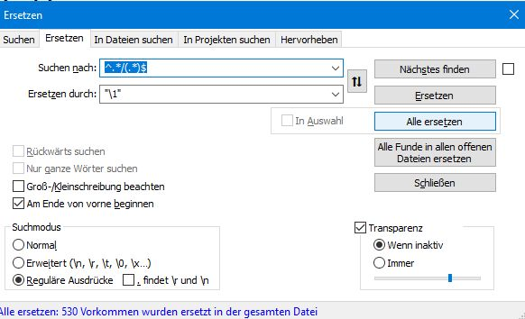


`^.*/(.*)$`
`"\1"`

---

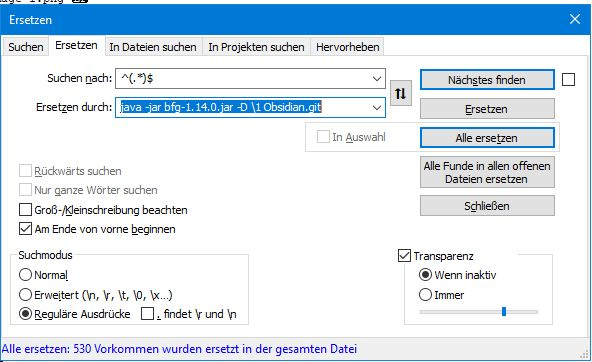


`^(.*)$`
`java -jar bfg-1.14.0.jar -D \1 Obsidian.git`

#### bfg remove history 
---
```
java -jar bfg-1.14.0.jar -D "2023-09-18 WordPressPlayground_image_1.png" Obsidian.git
java -jar bfg-1.14.0.jar -D "2023-09-18 WordPressPlayground_image_2.png" Obsidian.git
java -jar bfg-1.14.0.jar -D "2023-09-18 WordPressPlayground_image_3.png" Obsidian.git
java -jar bfg-1.14.0.jar -D "2023-09-18 WordPressPlayground_image_4.png" Obsidian.git
java -jar bfg-1.14.0.jar -D "2023-09-18-18-15-53_Chrome DevTools Protocol_image_1.png" Obsidian.git
java -jar bfg-1.14.0.jar -D "2023-09-18-18-16-32-PYOBD_image_1.png" Obsidian.git
java -jar bfg-1.14.0.jar -D "2023-09-18-18-17-08_illusion pages_image_1.png" Obsidian.git
java -jar bfg-1.14.0.jar -D "2023-09-18-18-31-45_Puckeditor_image_1.png" Obsidian.git
java -jar bfg-1.14.0.jar -D "2023-09-18-18-47-46_securityheaders_image_1.png" Obsidian.git
java -jar bfg-1.14.0.jar -D "2023-09-18-18-49-21_Random picker wheel_image_1.png" Obsidian.git
java -jar bfg-1.14.0.jar -D "2023-09-18-18-50-35_ARSnova_image_1.png" Obsidian.git
java -jar bfg-1.14.0.jar -D "2023-09-18-18-50-56-tweedback_image_1.png" Obsidian.git
java -jar bfg-1.14.0.jar -D "2023-09-18-18-50-56-tweedback_image_2.png" Obsidian.git
java -jar bfg-1.14.0.jar -D "2023-09-18-18-54-07_webvm_image_1.png" Obsidian.git
java -jar bfg-1.14.0.jar -D "2023-09-18-18-56-53_Devtoolstips_image_1.png" Obsidian.git
java -jar bfg-1.14.0.jar -D "2023-09-18-19-26-38_WtfPython_image_1.png" Obsidian.git
java -jar bfg-1.14.0.jar -D "2023-09-18-19-28-30-SweetHome3D_image_1.png" Obsidian.git
java -jar bfg-1.14.0.jar -D "2023-09-18-20-04-31_Radware Live Threat Map_image_1.png" Obsidian.git
java -jar bfg-1.14.0.jar -D "2023-09-18-20-30-54_webcam_image_1.png" Obsidian.git
java -jar bfg-1.14.0.jar -D "2023-09-18-20-34-18_revealjs_image_1.png" Obsidian.git
java -jar bfg-1.14.0.jar -D "2023-09-18-20-34-18_revealjs_image_2.png" Obsidian.git
java -jar bfg-1.14.0.jar -D "2023-09-18-CryptBoard_image_1.png" Obsidian.git
java -jar bfg-1.14.0.jar -D "2023-09-18-CryptBoard_image_2.png" Obsidian.git
java -jar bfg-1.14.0.jar -D "2023-09-18-Development-of-the-C-Language_image_1.png" Obsidian.git
java -jar bfg-1.14.0.jar -D "2023-09-18-Exploit Database_image_1.png" Obsidian.git
java -jar bfg-1.14.0.jar -D "2023-09-18-JSLinux_image_2.png" Obsidian.git
java -jar bfg-1.14.0.jar -D "2023-09-18-JSLinux_image_3.png" Obsidian.git
java -jar bfg-1.14.0.jar -D "2023-09-18-JSLinux_image_4.png" Obsidian.git
java -jar bfg-1.14.0.jar -D "2023-09-18-JSLinux_image_5.png" Obsidian.git
java -jar bfg-1.14.0.jar -D "2023-09-18-Knots_image_1.png" Obsidian.git
java -jar bfg-1.14.0.jar -D "2023-09-18-Pytudes_image_1.png" Obsidian.git
java -jar bfg-1.14.0.jar -D "2023-09-18-listEngineeringBlogs_image_1.png" Obsidian.git
java -jar bfg-1.14.0.jar -D "2023-09-18-listEngineeringBlogs_image_2.png" Obsidian.git
java -jar bfg-1.14.0.jar -D "2023-09-18-n8n_image_1.png" Obsidian.git
java -jar bfg-1.14.0.jar -D "2023-09-18-surfaceLinux_image_1.png" Obsidian.git
java -jar bfg-1.14.0.jar -D "2023-09-18-swisarmysknife_image_1.png" Obsidian.git
java -jar bfg-1.14.0.jar -D "2023-09-18-x86-wasm-recompile-browser_image_1.png" Obsidian.git
java -jar bfg-1.14.0.jar -D "2023-09-18-x86-wasm-recompile-browser_image_2.png" Obsidian.git
java -jar bfg-1.14.0.jar -D "2023-09-18_BLAZINGLYFASTHUGOCMSAPP_image_1.png" Obsidian.git
java -jar bfg-1.14.0.jar -D "2023-09-18_BLAZINGLYFASTHUGOCMSAPP_image_2.png" Obsidian.git
java -jar bfg-1.14.0.jar -D "2023-09-18_BiggestDataHacks_image_1.png" Obsidian.git
java -jar bfg-1.14.0.jar -D "2023-09-18_BriefcasePy_image_1.png" Obsidian.git
java -jar bfg-1.14.0.jar -D "2023-09-18_DiscoverOSSprojects_image_1.png" Obsidian.git
java -jar bfg-1.14.0.jar -D "2023-09-18_LiberaChat_image_1.png" Obsidian.git
java -jar bfg-1.14.0.jar -D "2023-09-18_LiberaChat_image_2.png" Obsidian.git
java -jar bfg-1.14.0.jar -D "2023-09-18_ModernJavaScriptTutorial_image_1.png" Obsidian.git
java -jar bfg-1.14.0.jar -D "2023-09-18_ModernJavaScriptTutorial_image_2.png" Obsidian.git
java -jar bfg-1.14.0.jar -D "2023-09-18_OpenMoji_image_1.png" Obsidian.git
java -jar bfg-1.14.0.jar -D "2023-09-18_ScienceTricksKids_image_1.png" Obsidian.git
java -jar bfg-1.14.0.jar -D "2023-09-18_ScienceTricksKids_image_2.png" Obsidian.git
java -jar bfg-1.14.0.jar -D "2023-09-18_TLauncher_image_1.png" Obsidian.git
java -jar bfg-1.14.0.jar -D "2023-09-18_WorkshopSpielefinden_image_1.png" Obsidian.git
java -jar bfg-1.14.0.jar -D "2023-09-18_YourAttentionWasStolen_image_1.png" Obsidian.git
java -jar bfg-1.14.0.jar -D "2023-09-18_YourAttentionWasStolen_image_2.png" Obsidian.git
java -jar bfg-1.14.0.jar -D "2023-09-18_Zeitreihenanalyse_image_1.png" Obsidian.git
java -jar bfg-1.14.0.jar -D "2023-09-18_digitalattackmap_image_1.png" Obsidian.git
java -jar bfg-1.14.0.jar -D "2023-09-18_internetABCLernmodule_image_1.png" Obsidian.git
java -jar bfg-1.14.0.jar -D "2023-09-18_mentimeter_image_1.png" Obsidian.git
java -jar bfg-1.14.0.jar -D "2023-09-19_ImprovingPrivacy_image_1.png" Obsidian.git
java -jar bfg-1.14.0.jar -D "2023-09-21-Counting Ghosts_image_1.png" Obsidian.git
java -jar bfg-1.14.0.jar -D "2023-09-21_WebTorrent_image_1.png" Obsidian.git
java -jar bfg-1.14.0.jar -D "2023-09-22_haskellWasm_image_1.png" Obsidian.git
java -jar bfg-1.14.0.jar -D "2023-09-23-09-51-09_geoTools_image_1.png" Obsidian.git
java -jar bfg-1.14.0.jar -D "2023-09-23-09-51-09_geoTools_image_2.png" Obsidian.git
java -jar bfg-1.14.0.jar -D "2023-09-23-09-51-09_geoTools_image_3.png" Obsidian.git
java -jar bfg-1.14.0.jar -D "2023-09-23-09-51-09_geoTools_image_4.png" Obsidian.git
java -jar bfg-1.14.0.jar -D "2023-09-23-09-51-09_geoTools_image_5.png" Obsidian.git
java -jar bfg-1.14.0.jar -D "2023-09-23-09-51-09_geoTools_image_6.png" Obsidian.git
java -jar bfg-1.14.0.jar -D "2023-09-23-09-51-09_geoTools_image_7.png" Obsidian.git
java -jar bfg-1.14.0.jar -D "2023-09-26-Prophet_image_1.png" Obsidian.git
java -jar bfg-1.14.0.jar -D "2023-09-26-Prophet_image_2.png" Obsidian.git
java -jar bfg-1.14.0.jar -D "2023-09-26-Prophet_image_3.png" Obsidian.git
java -jar bfg-1.14.0.jar -D "2023-09-28_modernWebApplicationDevelopmentJavaScript_image_1.png" Obsidian.git
java -jar bfg-1.14.0.jar -D "2023-09-29-xml cheatSheet-Py_image_1.png" Obsidian.git
java -jar bfg-1.14.0.jar -D "2023-09-29-xml cheatSheet-Py_image_2.png" Obsidian.git
java -jar bfg-1.14.0.jar -D "2023-09-29-xml cheatSheet-Py_image_3.png" Obsidian.git
java -jar bfg-1.14.0.jar -D "2023-09-29_DetectAI-generatedText_image_1.png" Obsidian.git
java -jar bfg-1.14.0.jar -D "2023-10-03- Local-first Software You own your data, in spite of the cloud_image_1.png" Obsidian.git
java -jar bfg-1.14.0.jar -D "2023-10-08_JavascriptWithoutBuild_image_1.png" Obsidian.git
java -jar bfg-1.14.0.jar -D "2023-10-09_ElasticTextSearchPostgres_image_1.png" Obsidian.git
java -jar bfg-1.14.0.jar -D "2023-10-11_Red Blob Games_1_image_1.png" Obsidian.git
java -jar bfg-1.14.0.jar -D "2023-10-11_SQLReservedWords_image_1.png" Obsidian.git
java -jar bfg-1.14.0.jar -D "2023-10-13_Clippings_image_1.png" Obsidian.git
java -jar bfg-1.14.0.jar -D "2023-10-14_Documenting Police Tech in Our Communitieswith Open Source Research_image_1.png" Obsidian.git
java -jar bfg-1.14.0.jar -D "2023-10-14_GraphQL for .NET_image_1.png" Obsidian.git
java -jar bfg-1.14.0.jar -D "2023-10-15- online version of ffmpeg built on ffmpeg.wasm_image_1.png" Obsidian.git
java -jar bfg-1.14.0.jar -D "2023-10-16-Navidrome_image_1.png" Obsidian.git
java -jar bfg-1.14.0.jar -D "2023-10-16-Navidrome_image_2.png" Obsidian.git
java -jar bfg-1.14.0.jar -D "2023-10-16-Navidrome_image_3.png" Obsidian.git
java -jar bfg-1.14.0.jar -D "2023-10-16-Navidrome_image_3.png" Obsidian.git
java -jar bfg-1.14.0.jar -D "2023-10-16-Navidrome_image_3.png" Obsidian.git
java -jar bfg-1.14.0.jar -D "2023-10-16-Navidrome_image_3.png" Obsidian.git
java -jar bfg-1.14.0.jar -D "2023-10-17_3D Environment_image_1.png" Obsidian.git
java -jar bfg-1.14.0.jar -D "2023-10-18_IshkursGuidetoElectronicMusic_image_1.png" Obsidian.git
java -jar bfg-1.14.0.jar -D "2023-10-18_IshkursGuidetoElectronicMusic_image_2.png" Obsidian.git
java -jar bfg-1.14.0.jar -D "2023-10-18_IshkursGuidetoElectronicMusic_image_3.png" Obsidian.git
java -jar bfg-1.14.0.jar -D "2023-10-20-sounddialuppictured_image_1.png" Obsidian.git
java -jar bfg-1.14.0.jar -D "2023-10-24_Invoice to Sheet_image_1.png" Obsidian.git
java -jar bfg-1.14.0.jar -D "2023-10-24_InvoiceNet_image_1.png" Obsidian.git
java -jar bfg-1.14.0.jar -D "2023-11-01-websitesforprogrammers_image_1.png" Obsidian.git
java -jar bfg-1.14.0.jar -D "2023-11-01_HackersGuidetoGit_image_1.png" Obsidian.git
java -jar bfg-1.14.0.jar -D "2023-11-01_websitesforprogrammers_image_1.png" Obsidian.git
java -jar bfg-1.14.0.jar -D "2023-11-01_websitesforprogrammers_image_1.png" Obsidian.git
java -jar bfg-1.14.0.jar -D "2023-11-01_websitesforprogrammers_image_1.png" Obsidian.git
java -jar bfg-1.14.0.jar -D "2023-11-01_websitesforprogrammers_image_1.png" Obsidian.git
java -jar bfg-1.14.0.jar -D "2023-11-11_Bitcoin in Python_image_1.png" Obsidian.git
java -jar bfg-1.14.0.jar -D "2023-11-11_Browser Debugging_image_1.png" Obsidian.git
java -jar bfg-1.14.0.jar -D "2023-11-11_prettymaps_image_1.png" Obsidian.git
java -jar bfg-1.14.0.jar -D "2023-11-13- Open rigorous and reproducible research_ A practitioners handbook_image_1.png" Obsidian.git
java -jar bfg-1.14.0.jar -D "2023-11-13_PostGISDay2023_image_1.png" Obsidian.git
java -jar bfg-1.14.0.jar -D "2023-11-13_PostGISDay2023_image_1.png" Obsidian.git
java -jar bfg-1.14.0.jar -D "2023-11-13_feditrends_image_1.png" Obsidian.git
java -jar bfg-1.14.0.jar -D "2023-11-14-A modest JavaScript framework for the HTML you already have_image_1.png" Obsidian.git
java -jar bfg-1.14.0.jar -D "2023-11-14-A modest JavaScript framework for the HTML you already have_image_2.png" Obsidian.git
java -jar bfg-1.14.0.jar -D "2023-11-14_ FlaskTutorial_image_1.png" Obsidian.git
java -jar bfg-1.14.0.jar -D "2023-11-14_ FlaskTutorial_image_1.png" Obsidian.git
java -jar bfg-1.14.0.jar -D "2023-11-14_projecteuler_image_1.png" Obsidian.git
java -jar bfg-1.14.0.jar -D "2023-11-15_WasmByExample_image_1.png" Obsidian.git
java -jar bfg-1.14.0.jar -D "2023-11-17_CleanAnyWebpage_image_1.png" Obsidian.git
java -jar bfg-1.14.0.jar -D "2023-11-17_tensorli_image_1.png" Obsidian.git
java -jar bfg-1.14.0.jar -D "2023-11-22_Discover91CoolGPTs_image_1.png" Obsidian.git
java -jar bfg-1.14.0.jar -D "2023-11-22_Wasmv86Systems_image_1.png" Obsidian.git
java -jar bfg-1.14.0.jar -D "2023-11-22_Wasmv86Systems_image_10.png" Obsidian.git
java -jar bfg-1.14.0.jar -D "2023-11-22_Wasmv86Systems_image_2.png" Obsidian.git
java -jar bfg-1.14.0.jar -D "2023-11-22_Wasmv86Systems_image_3.png" Obsidian.git
java -jar bfg-1.14.0.jar -D "2023-11-22_Wasmv86Systems_image_4.png" Obsidian.git
java -jar bfg-1.14.0.jar -D "2023-11-22_Wasmv86Systems_image_5.png" Obsidian.git
java -jar bfg-1.14.0.jar -D "2023-11-22_Wasmv86Systems_image_6.png" Obsidian.git
java -jar bfg-1.14.0.jar -D "2023-11-22_Wasmv86Systems_image_7.png" Obsidian.git
java -jar bfg-1.14.0.jar -D "2023-11-22_Wasmv86Systems_image_8.png" Obsidian.git
java -jar bfg-1.14.0.jar -D "2023-11-22_Wasmv86Systems_image_9.png" Obsidian.git
java -jar bfg-1.14.0.jar -D "2023-11-25_DesktopEnvironmentBrowser_image_1.png" Obsidian.git
java -jar bfg-1.14.0.jar -D "2023-11-25_MinecraftReimplementation_image_1.png" Obsidian.git
java -jar bfg-1.14.0.jar -D "2023-11-25_dosdeck_image_1.png" Obsidian.git
java -jar bfg-1.14.0.jar -D "2023-11-25_dosdeck_image_2.png" Obsidian.git
java -jar bfg-1.14.0.jar -D "2023-11-25_dosdeck_image_3.png" Obsidian.git
java -jar bfg-1.14.0.jar -D "2023-11-28_HallucinationsLeaderboard_image_1.png" Obsidian.git
java -jar bfg-1.14.0.jar -D "2023-11-28_Maptiler_image_1.png" Obsidian.git
java -jar bfg-1.14.0.jar -D "2023-11-29_LernVideos_image_1.png" Obsidian.git
java -jar bfg-1.14.0.jar -D "2023-11-30_BuildingREPLPython_image_1.png" Obsidian.git
java -jar bfg-1.14.0.jar -D "2023-12-03_Excalidraw_sketch2Code_image_1.png" Obsidian.git
java -jar bfg-1.14.0.jar -D "2023-12-03_Excalidraw_sketch2Code_image_3.png" Obsidian.git
java -jar bfg-1.14.0.jar -D "2023-12-03_Excalidraw_sketch2Code_image_4.png" Obsidian.git
java -jar bfg-1.14.0.jar -D "2023-12-04_LLM_Visualizations_image_1.png" Obsidian.git
java -jar bfg-1.14.0.jar -D "2023-12-05_Termshark_image_1.png" Obsidian.git
java -jar bfg-1.14.0.jar -D "2023-12-08_PrototypeFund_image_1.png" Obsidian.git
java -jar bfg-1.14.0.jar -D "2023-12-09-HallucinationsLeaderBoard_image_1.png" Obsidian.git
java -jar bfg-1.14.0.jar -D "2023-12-09-Magicoder.. Source Code Is All You Need_image_1.png" Obsidian.git
java -jar bfg-1.14.0.jar -D "2023-12-09_GoogleChat_image_1.png" Obsidian.git
java -jar bfg-1.14.0.jar -D "2023-12-10-Trippy_image_1.png" Obsidian.git
java -jar bfg-1.14.0.jar -D "2023-12-10-Trippy_image_2.png" Obsidian.git
java -jar bfg-1.14.0.jar -D "2023-12-10-Trippy_image_3.png" Obsidian.git
java -jar bfg-1.14.0.jar -D "2023-12-10-Trippy_image_4.png" Obsidian.git
java -jar bfg-1.14.0.jar -D "2023-12-10_WasmEdge_image_1.png" Obsidian.git
java -jar bfg-1.14.0.jar -D "2023-12-10_bard_image_1.png" Obsidian.git
java -jar bfg-1.14.0.jar -D "2023-12-13_Solo_image_1.png" Obsidian.git
java -jar bfg-1.14.0.jar -D "2023-12-13_Solo_image_2.png" Obsidian.git
java -jar bfg-1.14.0.jar -D "2023-12-13_Solo_image_3.png" Obsidian.git
java -jar bfg-1.14.0.jar -D "2023-12-13_Solo_image_4.png" Obsidian.git
java -jar bfg-1.14.0.jar -D "2023-12-13_Solo_image_5.png" Obsidian.git
java -jar bfg-1.14.0.jar -D "2023-12-13_leafmap_image_1.png" Obsidian.git
java -jar bfg-1.14.0.jar -D "2023-12-13_leafmap_image_2.png" Obsidian.git
java -jar bfg-1.14.0.jar -D "2023-12-13_leafmap_image_3.png" Obsidian.git
java -jar bfg-1.14.0.jar -D "2023-12-13_leafmap_image_4.png" Obsidian.git
java -jar bfg-1.14.0.jar -D "2023-12-13_leafmap_image_5.png" Obsidian.git
java -jar bfg-1.14.0.jar -D "2023-12-14_delphi-ai_image_2.png" Obsidian.git
java -jar bfg-1.14.0.jar -D "2023-12-20_VisualizingTransformerLanguageModels_image_3.png" Obsidian.git
java -jar bfg-1.14.0.jar -D "2023-12-21-wireflow_image_1.png" Obsidian.git
java -jar bfg-1.14.0.jar -D "2023-12-21-wireflow_image_2.png" Obsidian.git
java -jar bfg-1.14.0.jar -D "2023-12-21-wireflow_image_3.png" Obsidian.git
java -jar bfg-1.14.0.jar -D "2023-12-21-wireflow_image_4.png" Obsidian.git
java -jar bfg-1.14.0.jar -D "20231219172353_winampWeb.png" Obsidian.git
java -jar bfg-1.14.0.jar -D "20231219172518_internetArchiveWinamp.png" Obsidian.git
java -jar bfg-1.14.0.jar -D "2024-01-07_TeachableMachine_image_1.png" Obsidian.git
java -jar bfg-1.14.0.jar -D "2024-01-07_TeachableMachine_image_2.png" Obsidian.git
java -jar bfg-1.14.0.jar -D "2024-01-07_glitch_image_1.png" Obsidian.git
java -jar bfg-1.14.0.jar -D "2024-01-13_notes_image_1.png" Obsidian.git
java -jar bfg-1.14.0.jar -D "2024-01-13_notes_image_2.png" Obsidian.git
java -jar bfg-1.14.0.jar -D "2024-01-18-Artemis_image_1.png" Obsidian.git
java -jar bfg-1.14.0.jar -D "2024-01-18-p5.js_image_1.png" Obsidian.git
java -jar bfg-1.14.0.jar -D "2024-01-18_kanbanBoard_image_1.png" Obsidian.git
java -jar bfg-1.14.0.jar -D "2024-01-19_browserchat_image_1.png" Obsidian.git
java -jar bfg-1.14.0.jar -D "2024-01-24_Flutter_Flet_image_1.png" Obsidian.git
java -jar bfg-1.14.0.jar -D "2024-01-24_Flutter_Flet_image_2.png" Obsidian.git
java -jar bfg-1.14.0.jar -D "2024-01-25_JAVA_JDK_2024_image_1.png" Obsidian.git
java -jar bfg-1.14.0.jar -D "2024-01-25_PaperAirplaneDesigns_image_1.png" Obsidian.git
java -jar bfg-1.14.0.jar -D "2024-01-25_compilinglinuxKernel_image_1.png" Obsidian.git
java -jar bfg-1.14.0.jar -D "2024-01-25_llmsherpa_image_1.png" Obsidian.git
java -jar bfg-1.14.0.jar -D "2024-01-25_ml-lib_videos_image_1.png" Obsidian.git
java -jar bfg-1.14.0.jar -D "2024-01-25_skikit_lern_image_1.png" Obsidian.git
java -jar bfg-1.14.0.jar -D "2024-01-25_sqlitefiddlewasm_image_1.png" Obsidian.git
java -jar bfg-1.14.0.jar -D "2024-01-27_Google Research_GooglesLumiere_image_1.png" Obsidian.git
java -jar bfg-1.14.0.jar -D "2024-01-28_hiscalearchitecture_image_1.png" Obsidian.git
java -jar bfg-1.14.0.jar -D "2024-01-28_placemarkEditor_image_1.png" Obsidian.git
java -jar bfg-1.14.0.jar -D "2024-01-29_HowToSpeak_MIT_image_1.png" Obsidian.git
java -jar bfg-1.14.0.jar -D "2024-02-01_Pyodide_image_1.png" Obsidian.git
java -jar bfg-1.14.0.jar -D "2024-02-01_Pyodide_image_2.png" Obsidian.git
java -jar bfg-1.14.0.jar -D "2024-02-02_PageBuilders_WebFlow_image_1.png" Obsidian.git
java -jar bfg-1.14.0.jar -D "2024-02-02_PageBuilders_WebFlow_image_2.png" Obsidian.git
java -jar bfg-1.14.0.jar -D "2024-02-02_PageBuilders_WebFlow_image_3.png" Obsidian.git
java -jar bfg-1.14.0.jar -D "2024-02-04-ioPaint_image_2.png" Obsidian.git
java -jar bfg-1.14.0.jar -D "2024-02-04-ioPaint_image_3.png" Obsidian.git
java -jar bfg-1.14.0.jar -D "2024-02-04-ioPaint_image_4.png" Obsidian.git
java -jar bfg-1.14.0.jar -D "2024-02-04_Website_GithubActionTemplate_image_1.png" Obsidian.git
java -jar bfg-1.14.0.jar -D "2024-02-06-AdGuard_image_1.png" Obsidian.git
java -jar bfg-1.14.0.jar -D "2024-02-06-AdGuard_image_2.png" Obsidian.git
java -jar bfg-1.14.0.jar -D "2024-02-08_BrowsercraftCheerpJ_image_1.png" Obsidian.git
java -jar bfg-1.14.0.jar -D "2024-02-08_BrowsercraftCheerpJ_image_2.png" Obsidian.git
java -jar bfg-1.14.0.jar -D "2024-02-08_MermaidLive Editor_image_1.png" Obsidian.git
java -jar bfg-1.14.0.jar -D "2024-02-08_MermaidLive Editor_image_2.png" Obsidian.git
java -jar bfg-1.14.0.jar -D "2024-02-08_MermaidLive Editor_image_3.png" Obsidian.git
java -jar bfg-1.14.0.jar -D "2024-02-08_openai_logocreator_image_4.png" Obsidian.git
java -jar bfg-1.14.0.jar -D "2024-02-08_openai_logocreator_image_5.png" Obsidian.git
java -jar bfg-1.14.0.jar -D "2024-02-10_droneFylLearnung18s_image_1.png" Obsidian.git
java -jar bfg-1.14.0.jar -D "2024-02-13_Astro_image_1.png" Obsidian.git
java -jar bfg-1.14.0.jar -D "2024-02-13_python_search_80Lines_image_1.png" Obsidian.git
java -jar bfg-1.14.0.jar -D "2024-02-20-CryptPad_image_1.png" Obsidian.git
java -jar bfg-1.14.0.jar -D "2024-02-20-CryptPad_image_10.png" Obsidian.git
java -jar bfg-1.14.0.jar -D "2024-02-20-CryptPad_image_11.png" Obsidian.git
java -jar bfg-1.14.0.jar -D "2024-02-20-CryptPad_image_12.png" Obsidian.git
java -jar bfg-1.14.0.jar -D "2024-02-20-CryptPad_image_13.png" Obsidian.git
java -jar bfg-1.14.0.jar -D "2024-02-20-CryptPad_image_14.png" Obsidian.git
java -jar bfg-1.14.0.jar -D "2024-02-20-CryptPad_image_15.png" Obsidian.git
java -jar bfg-1.14.0.jar -D "2024-02-20-CryptPad_image_16.png" Obsidian.git
java -jar bfg-1.14.0.jar -D "2024-02-20-CryptPad_image_17.png" Obsidian.git
java -jar bfg-1.14.0.jar -D "2024-02-20-CryptPad_image_2.png" Obsidian.git
java -jar bfg-1.14.0.jar -D "2024-02-20-CryptPad_image_3.png" Obsidian.git
java -jar bfg-1.14.0.jar -D "2024-02-20-CryptPad_image_4.png" Obsidian.git
java -jar bfg-1.14.0.jar -D "2024-02-20-CryptPad_image_5.png" Obsidian.git
java -jar bfg-1.14.0.jar -D "2024-02-20-CryptPad_image_6.png" Obsidian.git
java -jar bfg-1.14.0.jar -D "2024-02-20-CryptPad_image_7.png" Obsidian.git
java -jar bfg-1.14.0.jar -D "2024-02-20-CryptPad_image_8.png" Obsidian.git
java -jar bfg-1.14.0.jar -D "2024-02-20-CryptPad_image_9.png" Obsidian.git
java -jar bfg-1.14.0.jar -D "2024-02-20_LM_Studio_image_1.png" Obsidian.git
java -jar bfg-1.14.0.jar -D "2024-02-20_LM_Studio_image_2.png" Obsidian.git
java -jar bfg-1.14.0.jar -D "2024-02-20_LM_Studio_image_3.png" Obsidian.git
java -jar bfg-1.14.0.jar -D "2024-02-20_LM_Studio_image_4.png" Obsidian.git
java -jar bfg-1.14.0.jar -D "2024-02-20_SVG_Loading_Spinners_image_2.png" Obsidian.git
java -jar bfg-1.14.0.jar -D "2024-02-20_TheNeuralNetworkZoo_image_2.png" Obsidian.git
java -jar bfg-1.14.0.jar -D "2024-02-20_gpt4all_image_1.png" Obsidian.git
java -jar bfg-1.14.0.jar -D "2024-02-20_gpt4all_image_2.png" Obsidian.git
java -jar bfg-1.14.0.jar -D "2024-02-20_visZoo_image_1.png" Obsidian.git
java -jar bfg-1.14.0.jar -D "2024-02-24-kiMusik_image_1.png" Obsidian.git
java -jar bfg-1.14.0.jar -D "2024-02-24-kiMusik_image_2.png" Obsidian.git
java -jar bfg-1.14.0.jar -D "2024-02-24-kiMusik_image_3.png" Obsidian.git
java -jar bfg-1.14.0.jar -D "2024-02-24-kiMusik_image_4.png" Obsidian.git
java -jar bfg-1.14.0.jar -D "2024-02-24_PGlitePostgresWASM_image_1.png" Obsidian.git
java -jar bfg-1.14.0.jar -D "2024-02-24_codemate_image_1.png" Obsidian.git
java -jar bfg-1.14.0.jar -D "2024-02-25_OpenSourceIntelligence_image_1.png" Obsidian.git
java -jar bfg-1.14.0.jar -D "2024-02-25_attantiontransformer_image_1.png" Obsidian.git
java -jar bfg-1.14.0.jar -D "2024-02-25_attantiontransformer_image_2.png" Obsidian.git
java -jar bfg-1.14.0.jar -D "2024-02-25_cartosvg_image_1.png" Obsidian.git
java -jar bfg-1.14.0.jar -D "2024-02-25_cartosvg_image_2.png" Obsidian.git
java -jar bfg-1.14.0.jar -D "2024-02-25_cartosvg_image_4.png" Obsidian.git
java -jar bfg-1.14.0.jar -D "2024-02-26-wasmdoom_image_1.png" Obsidian.git
java -jar bfg-1.14.0.jar -D "2024-02-26-wasmdoom_image_2.png" Obsidian.git
java -jar bfg-1.14.0.jar -D "2024-02-27-sandspiel_image_1.png" Obsidian.git
java -jar bfg-1.14.0.jar -D "2024-02-27_jupyterLite_image_1.png" Obsidian.git
java -jar bfg-1.14.0.jar -D "2024-03-01_Testcontainers_image_1.png" Obsidian.git
java -jar bfg-1.14.0.jar -D "2024-03-06_ebooks_image_1.png" Obsidian.git
java -jar bfg-1.14.0.jar -D "2024-03-06_online  Colab_image_1.png" Obsidian.git
java -jar bfg-1.14.0.jar -D "2024-03-06_online  Colab_image_2.png" Obsidian.git
java -jar bfg-1.14.0.jar -D "2024-03-06_rubics_image_1.png" Obsidian.git
java -jar bfg-1.14.0.jar -D "2024-03-07-eloquentjavascript_image_1.png" Obsidian.git
java -jar bfg-1.14.0.jar -D "2024-03-08-DaleCanegie_image_1.png" Obsidian.git
java -jar bfg-1.14.0.jar -D "2024-03-09-fingerprinting_image_1.png" Obsidian.git
java -jar bfg-1.14.0.jar -D "2024-03-09-fingerprinting_image_2.png" Obsidian.git
java -jar bfg-1.14.0.jar -D "2024-03-09_PianoPaper_image_2.png" Obsidian.git
java -jar bfg-1.14.0.jar -D "2024-03-22chronos-forecasting_image_1.png" Obsidian.git
java -jar bfg-1.14.0.jar -D "2024-03-28-scrapeOpenAi_image_1.png" Obsidian.git
java -jar bfg-1.14.0.jar -D "2024-04-01_py_image_1.png" Obsidian.git
java -jar bfg-1.14.0.jar -D "2024-04-04_obsidian Script_image_1.png" Obsidian.git
java -jar bfg-1.14.0.jar -D "2024-04-04_obsidian Script_image_2.png" Obsidian.git
java -jar bfg-1.14.0.jar -D "2024-04-07-database_image_1.png" Obsidian.git
java -jar bfg-1.14.0.jar -D "2024-04-07-database_image_2.png" Obsidian.git
java -jar bfg-1.14.0.jar -D "2024-04-07-database_image_3.png" Obsidian.git
java -jar bfg-1.14.0.jar -D "2024-04-07-database_image_4.png" Obsidian.git
java -jar bfg-1.14.0.jar -D "2024-04-07-database_image_5.png" Obsidian.git
java -jar bfg-1.14.0.jar -D "2024-04-07-database_image_6.png" Obsidian.git
java -jar bfg-1.14.0.jar -D "2024-04-07-database_image_7.png" Obsidian.git
java -jar bfg-1.14.0.jar -D "2024-04-09-The Concise TypeScript Book- A Concise Guide to Effective Development in TypeScript. Free and Open Source_image_1.png" Obsidian.git
java -jar bfg-1.14.0.jar -D "2024-04-09-py-Datascience_image_1.png" Obsidian.git
java -jar bfg-1.14.0.jar -D "2024-04-09-py-Datascience_image_2.png" Obsidian.git
java -jar bfg-1.14.0.jar -D "2024-04-09-py-Datascience_image_3.png" Obsidian.git
java -jar bfg-1.14.0.jar -D "2024-04-11-transformer.js_image_1.png" Obsidian.git
java -jar bfg-1.14.0.jar -D "2024-04-11-transformer.js_image_2.png" Obsidian.git
java -jar bfg-1.14.0.jar -D "2024-04-11-transformer.js_image_3.png" Obsidian.git
java -jar bfg-1.14.0.jar -D "2024-04-11-transformer.js_image_4.png" Obsidian.git
java -jar bfg-1.14.0.jar -D "2024-04-11-transformer.js_image_5.png" Obsidian.git
java -jar bfg-1.14.0.jar -D "2024-04-11-transformer.js_image_6.png" Obsidian.git
java -jar bfg-1.14.0.jar -D "2024-04-11-transformer.js_image_7.png" Obsidian.git
java -jar bfg-1.14.0.jar -D "2024-04-12_LearnDeepLearning_image_1.png" Obsidian.git
java -jar bfg-1.14.0.jar -D "2024-05-09-multimodalLLM_image_3.png" Obsidian.git
java -jar bfg-1.14.0.jar -D "2024-05-09-multimodalLLM_image_4.png" Obsidian.git
java -jar bfg-1.14.0.jar -D "2024-05-09-multimodalLLM_image_5.png" Obsidian.git
java -jar bfg-1.14.0.jar -D "2024-06-06-Create a landing page in seconds_image_1.png" Obsidian.git
java -jar bfg-1.14.0.jar -D "2024-06-06-Create a landing page in seconds_image_2.png" Obsidian.git
java -jar bfg-1.14.0.jar -D "2024-06-10-AIGenerators_image_1.png" Obsidian.git
java -jar bfg-1.14.0.jar -D "2024-06-10-AIGenerators_image_2.png" Obsidian.git
java -jar bfg-1.14.0.jar -D "2024-06-10-Data-Quality_image_1.png" Obsidian.git
java -jar bfg-1.14.0.jar -D "2024-06-10-Labor Market_image_1.png" Obsidian.git
java -jar bfg-1.14.0.jar -D "2024-06-10-Labor Market_image_2.png" Obsidian.git
java -jar bfg-1.14.0.jar -D "2024-06-10-PDF.ai_image_1.png" Obsidian.git
java -jar bfg-1.14.0.jar -D "2024-06-10-Research_image_1.png" Obsidian.git
java -jar bfg-1.14.0.jar -D "2024-06-10-Visualize Attention_image_1.png" Obsidian.git
java -jar bfg-1.14.0.jar -D "2024-06-10-Visualize Attention_image_4.png" Obsidian.git
java -jar bfg-1.14.0.jar -D "2024-06-10-atlas.nomic.ai_image_1.png" Obsidian.git
java -jar bfg-1.14.0.jar -D "2024-06-10-notbyai.fyi_image_1.png" Obsidian.git
java -jar bfg-1.14.0.jar -D "2024-06-10-undetectable.ai_image_1.png" Obsidian.git
java -jar bfg-1.14.0.jar -D "2024-06-10-undetectable.ai_image_2.png" Obsidian.git
java -jar bfg-1.14.0.jar -D "2024-06-12_image_1.png" Obsidian.git
java -jar bfg-1.14.0.jar -D "2024-06-12_image_2.png" Obsidian.git
java -jar bfg-1.14.0.jar -D "2024-06-12_image_3.png" Obsidian.git
java -jar bfg-1.14.0.jar -D "2024-06-12_image_4.png" Obsidian.git
java -jar bfg-1.14.0.jar -D "2024-06-12_image_5.png" Obsidian.git
java -jar bfg-1.14.0.jar -D "2024-06-18-website-generator_image_1.png" Obsidian.git
java -jar bfg-1.14.0.jar -D "2024-06-18-website-generator_image_2.png" Obsidian.git
java -jar bfg-1.14.0.jar -D "2024-06-18-website-generator_image_3.png" Obsidian.git
java -jar bfg-1.14.0.jar -D "2024-06-18-website-generator_image_4.png" Obsidian.git
java -jar bfg-1.14.0.jar -D "2024-06-18-website-generator_image_5.png" Obsidian.git
java -jar bfg-1.14.0.jar -D "2024-06-18-website-generator_image_6.png" Obsidian.git
java -jar bfg-1.14.0.jar -D "2024-06-18-website-generator_image_7.png" Obsidian.git
java -jar bfg-1.14.0.jar -D "2024-06-18-website-generator_image_8.png" Obsidian.git
java -jar bfg-1.14.0.jar -D "2024-06-18-website-generator_image_9.png" Obsidian.git
java -jar bfg-1.14.0.jar -D "2024-06-18_gartner_image_1.png" Obsidian.git
java -jar bfg-1.14.0.jar -D "2024-06-25-lemonsqueezy_image_1.png" Obsidian.git
java -jar bfg-1.14.0.jar -D "2024-06-25-lemonsqueezy_image_1.png" Obsidian.git
java -jar bfg-1.14.0.jar -D "2024-06-25-try-exalidraw_image_1.png" Obsidian.git
java -jar bfg-1.14.0.jar -D "2024-07-01-linux-backup_image_1.png" Obsidian.git
java -jar bfg-1.14.0.jar -D "2024-07-01-linux-backup_image_2.png" Obsidian.git
java -jar bfg-1.14.0.jar -D "2024-07-05-android-remote_image_1.png" Obsidian.git
java -jar bfg-1.14.0.jar -D "2024-07-05-android-remote_image_2.png" Obsidian.git
java -jar bfg-1.14.0.jar -D "2024-07-05-android-remote_image_3.png" Obsidian.git
java -jar bfg-1.14.0.jar -D "2024-07-05-android-remote_image_4.png" Obsidian.git
java -jar bfg-1.14.0.jar -D "2024-07-05-android-remote_image_5.png" Obsidian.git
java -jar bfg-1.14.0.jar -D "2024-07-07-nand2tetris_image_1.png" Obsidian.git
java -jar bfg-1.14.0.jar -D "2024-07-08-liveportrait_image_1.png" Obsidian.git
java -jar bfg-1.14.0.jar -D "2024-07-09TheDeadlockEmpire_image_1.png" Obsidian.git
java -jar bfg-1.14.0.jar -D "2024-07-12-consensus_image_1.png" Obsidian.git
java -jar bfg-1.14.0.jar -D "2024-07-12-consensus_image_2.png" Obsidian.git
java -jar bfg-1.14.0.jar -D "2024-07-12-suno_image_1.png" Obsidian.git
java -jar bfg-1.14.0.jar -D "2024-07-12-suno_image_2.png" Obsidian.git
java -jar bfg-1.14.0.jar -D "2024-07-12-suno_image_3.png" Obsidian.git
java -jar bfg-1.14.0.jar -D "2024-07-12-suno_image_4.png" Obsidian.git
java -jar bfg-1.14.0.jar -D "2024-07-12-suno_image_5.png" Obsidian.git
java -jar bfg-1.14.0.jar -D "2024-07-12-webvm_image_2.png" Obsidian.git
java -jar bfg-1.14.0.jar -D "2024-07-12-webvm_image_3.png" Obsidian.git
java -jar bfg-1.14.0.jar -D "2024-07-12_image_1.png" Obsidian.git
java -jar bfg-1.14.0.jar -D "2024-07-15-zapier_image_1.png" Obsidian.git
java -jar bfg-1.14.0.jar -D "2024-07-15-zapier_image_1.png" Obsidian.git
java -jar bfg-1.14.0.jar -D "2024-07-16-European_green_deal.pdf_image_1.png" Obsidian.git
java -jar bfg-1.14.0.jar -D "2024-07-16-Overleaf_image_1.png" Obsidian.git
java -jar bfg-1.14.0.jar -D "2024-07-16-Overleaf_image_2.png" Obsidian.git
java -jar bfg-1.14.0.jar -D "2024-07-16-Overleaf_image_3.png" Obsidian.git
java -jar bfg-1.14.0.jar -D "2024-07-16-Overleaf_image_4.png" Obsidian.git
java -jar bfg-1.14.0.jar -D "2024-07-16-blog-video_image_1.png" Obsidian.git
java -jar bfg-1.14.0.jar -D "2024-07-16-linkedin-proEngels_image_1.png" Obsidian.git
java -jar bfg-1.14.0.jar -D "2024-07-16-linkedin-proEngels_image_2.png" Obsidian.git
java -jar bfg-1.14.0.jar -D "2024-07-16-missuseAI_image_1.png" Obsidian.git
java -jar bfg-1.14.0.jar -D "2024-07-16-missuseAI_image_2.png" Obsidian.git
java -jar bfg-1.14.0.jar -D "2024-07-16_image_1.png" Obsidian.git
java -jar bfg-1.14.0.jar -D "2024-07-16_image_2.png" Obsidian.git
java -jar bfg-1.14.0.jar -D "2024-07-18-wargames_image_1.png" Obsidian.git
java -jar bfg-1.14.0.jar -D "2024-07-18-wargames_image_10.png" Obsidian.git
java -jar bfg-1.14.0.jar -D "2024-07-18-wargames_image_11.png" Obsidian.git
java -jar bfg-1.14.0.jar -D "2024-07-18-wargames_image_12.png" Obsidian.git
java -jar bfg-1.14.0.jar -D "2024-07-18-wargames_image_2.png" Obsidian.git
java -jar bfg-1.14.0.jar -D "2024-07-18-wargames_image_3.png" Obsidian.git
java -jar bfg-1.14.0.jar -D "2024-07-18-wargames_image_4.png" Obsidian.git
java -jar bfg-1.14.0.jar -D "2024-07-18-wargames_image_5.png" Obsidian.git
java -jar bfg-1.14.0.jar -D "2024-07-18-wargames_image_6.png" Obsidian.git
java -jar bfg-1.14.0.jar -D "2024-07-18-wargames_image_7.png" Obsidian.git
java -jar bfg-1.14.0.jar -D "2024-07-18-wargames_image_8.png" Obsidian.git
java -jar bfg-1.14.0.jar -D "2024-07-18-wargames_image_9.png" Obsidian.git
java -jar bfg-1.14.0.jar -D "2024-07-20-garage_image_1.png" Obsidian.git
java -jar bfg-1.14.0.jar -D "2024-08-08-aider_image_1.png" Obsidian.git
java -jar bfg-1.14.0.jar -D "2024-08-08-cursor_image_1.png" Obsidian.git
java -jar bfg-1.14.0.jar -D "2024-08-08-turing-post-twitter-lib_image_1.png" Obsidian.git
java -jar bfg-1.14.0.jar -D "2024-08-11-udio_image_1.png" Obsidian.git
java -jar bfg-1.14.0.jar -D "2024-08-12-pgwasm_image_1.png" Obsidian.git
java -jar bfg-1.14.0.jar -D "2024-08-18-pyscript_image_1.png" Obsidian.git
java -jar bfg-1.14.0.jar -D "2024-09-01-qrcode_image_1.png" Obsidian.git
java -jar bfg-1.14.0.jar -D "2024-09-01-qrcode_image_2.png" Obsidian.git
java -jar bfg-1.14.0.jar -D "2024-09-01-qrcode_image_3.png" Obsidian.git
java -jar bfg-1.14.0.jar -D "2024-09-04-fileDowloads-Pirate-block-list_image_1.png" Obsidian.git
java -jar bfg-1.14.0.jar -D "2024-09-04-fileDowloads-Pirate-block-list_image_2.png" Obsidian.git
java -jar bfg-1.14.0.jar -D "2024-09-04-fileDowloads-Pirate-block-list_image_3.png" Obsidian.git
java -jar bfg-1.14.0.jar -D "2024-09-04-fileDowloads-Pirate-block-list_image_4.png" Obsidian.git
java -jar bfg-1.14.0.jar -D "2024-09-04-fileDowloads-Pirate-block-list_image_5.png" Obsidian.git
java -jar bfg-1.14.0.jar -D "2024-09-04-fileDowloads-Pirate-block-list_image_6.png" Obsidian.git
java -jar bfg-1.14.0.jar -D "2024-09-04-fileDowloads-Pirate-block-list_image_7.png" Obsidian.git
java -jar bfg-1.14.0.jar -D "2024-09-05-AnythingLLM_image_1.png" Obsidian.git
java -jar bfg-1.14.0.jar -D "2024-09-05-Cyberchef_image_1.png" Obsidian.git
java -jar bfg-1.14.0.jar -D "2024-09-05-NSAToolSlides_image_1.png" Obsidian.git
java -jar bfg-1.14.0.jar -D "2024-09-10-learningProgramming_image_1.png" Obsidian.git
java -jar bfg-1.14.0.jar -D "2024-09-10-learningProgramming_image_2.png" Obsidian.git
java -jar bfg-1.14.0.jar -D "2024-09-10-learningProgramming_image_3.png" Obsidian.git
java -jar bfg-1.14.0.jar -D "2024-09-10-learningProgramming_image_4.png" Obsidian.git
java -jar bfg-1.14.0.jar -D "2024-09-10-learningProgramming_image_5.png" Obsidian.git
java -jar bfg-1.14.0.jar -D "2024-09-10-learningProgramming_image_6.png" Obsidian.git
java -jar bfg-1.14.0.jar -D "2024-09-10-learningProgramming_image_7.png" Obsidian.git
java -jar bfg-1.14.0.jar -D "2024-09-12svgedit_image_1.png" Obsidian.git
java -jar bfg-1.14.0.jar -D "2024-09-12svgedit_image_2.png" Obsidian.git
java -jar bfg-1.14.0.jar -D "2024-09-14-dnstool_image_1.png" Obsidian.git
java -jar bfg-1.14.0.jar -D "2024-09-14-iptvdramatv_image_1.png" Obsidian.git
java -jar bfg-1.14.0.jar -D "2024-09-15-scad_image_1.png" Obsidian.git
java -jar bfg-1.14.0.jar -D "2024-09-18-git-reduce-size_image_1.png" Obsidian.git
java -jar bfg-1.14.0.jar -D "2024-09-22-git-blog-repo-shrink_image_1.png" Obsidian.git
java -jar bfg-1.14.0.jar -D "2024-09-22-git-blog-repo-shrink_image_2.png" Obsidian.git
java -jar bfg-1.14.0.jar -D "2024-09-22-git-blog-repo-shrink_image_3.png" Obsidian.git
java -jar bfg-1.14.0.jar -D "2024-09-22-git-blog-repo-shrink_image_4.png" Obsidian.git
java -jar bfg-1.14.0.jar -D "2024-09-22-git-blog-repo-shrink_image_5.png" Obsidian.git
java -jar bfg-1.14.0.jar -D "2024-09-22-git-blog-repo-shrink_image_6.png" Obsidian.git
java -jar bfg-1.14.0.jar -D "2024-09-22-git-blog-repo-shrink_image_7.png" Obsidian.git
java -jar bfg-1.14.0.jar -D "2024-09-22-git-blog-repo-shrink_image_8.png" Obsidian.git
java -jar bfg-1.14.0.jar -D "20240123224120_llm_visualisation.png" Obsidian.git
java -jar bfg-1.14.0.jar -D "20240123224120_llm_visualisation.png" Obsidian.git
java -jar bfg-1.14.0.jar -D "20240124093601ghidraMario.png" Obsidian.git
java -jar bfg-1.14.0.jar -D "20240124093903wpplay.png" Obsidian.git
java -jar bfg-1.14.0.jar -D "20240204141508_ipgeo.png" Obsidian.git
java -jar bfg-1.14.0.jar -D "20240220162413_wa.png" Obsidian.git
java -jar bfg-1.14.0.jar -D "20240220162448wat.png" Obsidian.git
java -jar bfg-1.14.0.jar -D "A collection of videos to showcase the magic alchemy of computation_image_1.png" Obsidian.git
java -jar bfg-1.14.0.jar -D "Pasted Image 20240304145130_364.png" Obsidian.git
java -jar bfg-1.14.0.jar -D "Pasted Image 20240304145130_364.png" Obsidian.git
java -jar bfg-1.14.0.jar -D "Pasted Image 20240610203347_770.png" Obsidian.git
java -jar bfg-1.14.0.jar -D "Pasted Image 20240610203347_770.png" Obsidian.git
java -jar bfg-1.14.0.jar -D "Pasted image 20240118181701.png" Obsidian.git
java -jar bfg-1.14.0.jar -D "Pasted image 20240118182637.png" Obsidian.git
java -jar bfg-1.14.0.jar -D "Pasted image 20240129111217.png" Obsidian.git
java -jar bfg-1.14.0.jar -D "Pasted image 20240129111217.png" Obsidian.git
java -jar bfg-1.14.0.jar -D "Pasted image 20240129112300.png" Obsidian.git
java -jar bfg-1.14.0.jar -D "Pasted image 20240129112300.png" Obsidian.git
java -jar bfg-1.14.0.jar -D "Pasted image 20240129112300.png" Obsidian.git
java -jar bfg-1.14.0.jar -D "Pasted image 20240129112300.png" Obsidian.git
java -jar bfg-1.14.0.jar -D "Pasted image 20240131145924.png" Obsidian.git
java -jar bfg-1.14.0.jar -D "Pasted image 20240131145924.png" Obsidian.git
java -jar bfg-1.14.0.jar -D "Pasted image 20240131145924.png" Obsidian.git
java -jar bfg-1.14.0.jar -D "Pasted image 20240131145924.png" Obsidian.git
java -jar bfg-1.14.0.jar -D "Pasted image 20240131172844.png" Obsidian.git
java -jar bfg-1.14.0.jar -D "Pasted image 20240131172844.png" Obsidian.git
java -jar bfg-1.14.0.jar -D "Pasted image 20240202102904.png" Obsidian.git
java -jar bfg-1.14.0.jar -D "Pasted image 20240202102904.png" Obsidian.git
java -jar bfg-1.14.0.jar -D "Pasted image 20240202102929.png" Obsidian.git
java -jar bfg-1.14.0.jar -D "Pasted image 20240202102929.png" Obsidian.git
java -jar bfg-1.14.0.jar -D "Pasted image 20240204140859.png" Obsidian.git
java -jar bfg-1.14.0.jar -D "Pasted image 20240204140859.png" Obsidian.git
java -jar bfg-1.14.0.jar -D "Pasted image 20240204140925.png" Obsidian.git
java -jar bfg-1.14.0.jar -D "Pasted image 20240204140925.png" Obsidian.git
java -jar bfg-1.14.0.jar -D "Pasted image 20240204140947.png" Obsidian.git
java -jar bfg-1.14.0.jar -D "Pasted image 20240204140947.png" Obsidian.git
java -jar bfg-1.14.0.jar -D "Pasted image 20240204143316.png" Obsidian.git
java -jar bfg-1.14.0.jar -D "Pasted image 20240204143316.png" Obsidian.git
java -jar bfg-1.14.0.jar -D "Pasted image 20240210164808.png" Obsidian.git
java -jar bfg-1.14.0.jar -D "Pasted image 20240210164808.png" Obsidian.git
java -jar bfg-1.14.0.jar -D "Pasted image 20240220162845.png" Obsidian.git
java -jar bfg-1.14.0.jar -D "Pasted image 20240220162845.png" Obsidian.git
java -jar bfg-1.14.0.jar -D "Pasted image 20240220165425.png" Obsidian.git
java -jar bfg-1.14.0.jar -D "Pasted image 20240220165425.png" Obsidian.git
java -jar bfg-1.14.0.jar -D "Pasted image 20240220165458.png" Obsidian.git
java -jar bfg-1.14.0.jar -D "Pasted image 20240220165458.png" Obsidian.git
java -jar bfg-1.14.0.jar -D "Pasted image 20240220170241.png" Obsidian.git
java -jar bfg-1.14.0.jar -D "Pasted image 20240220170241.png" Obsidian.git
java -jar bfg-1.14.0.jar -D "Pasted image 20240220170249.png" Obsidian.git
java -jar bfg-1.14.0.jar -D "Pasted image 20240220170249.png" Obsidian.git
java -jar bfg-1.14.0.jar -D "Pasted image 20240221105510.png" Obsidian.git
java -jar bfg-1.14.0.jar -D "Pasted image 20240221105510.png" Obsidian.git
java -jar bfg-1.14.0.jar -D "Pasted image 20240221120448.png" Obsidian.git
java -jar bfg-1.14.0.jar -D "Pasted image 20240221120448.png" Obsidian.git
java -jar bfg-1.14.0.jar -D "Pasted image 20240222095404.png" Obsidian.git
java -jar bfg-1.14.0.jar -D "Pasted image 20240303142823.png" Obsidian.git
java -jar bfg-1.14.0.jar -D "Pasted image 20240303142823.png" Obsidian.git
java -jar bfg-1.14.0.jar -D "Pasted image 20240414135825.png" Obsidian.git
java -jar bfg-1.14.0.jar -D "Pasted image 20240606093854.png" Obsidian.git
java -jar bfg-1.14.0.jar -D "Pasted image 20240606093854.png" Obsidian.git
java -jar bfg-1.14.0.jar -D "Pasted image 20240606095120.png" Obsidian.git
java -jar bfg-1.14.0.jar -D "Pasted image 20240606095120.png" Obsidian.git
java -jar bfg-1.14.0.jar -D "Pasted image 20240606095120.png" Obsidian.git
java -jar bfg-1.14.0.jar -D "Pasted image 20240606095120.png" Obsidian.git
java -jar bfg-1.14.0.jar -D "Pasted image 20240610203227.png" Obsidian.git
java -jar bfg-1.14.0.jar -D "Pasted image 20240610203227.png" Obsidian.git
java -jar bfg-1.14.0.jar -D "Pasted image 20240625151258.png" Obsidian.git
java -jar bfg-1.14.0.jar -D "Pasted image 20240716085739.png" Obsidian.git
java -jar bfg-1.14.0.jar -D "Pasted image 20240716085739.png" Obsidian.git
java -jar bfg-1.14.0.jar -D "Pasted image 20240808143955.png" Obsidian.git
java -jar bfg-1.14.0.jar -D "Pasted image 20240918093728.png" Obsidian.git
java -jar bfg-1.14.0.jar -D "Pasted image 20240918093728.png" Obsidian.git
java -jar bfg-1.14.0.jar -D "PastedImage20240220162230.png" Obsidian.git
java -jar bfg-1.14.0.jar -D "PastedImage20240221110355.png" Obsidian.git
java -jar bfg-1.14.0.jar -D "Productive Thinking Model_image_1.png" Obsidian.git
java -jar bfg-1.14.0.jar -D "Productive Thinking Model_image_2.png" Obsidian.git
java -jar bfg-1.14.0.jar -D "grigora_image_1.png" Obsidian.git
java -jar bfg-1.14.0.jar -D "tmp1708529325164_2024-01-25_PaperAirplaneDesigns_image_1.png" Obsidian.git
java -jar bfg-1.14.0.jar -D "tmp1708529325164_2024-01-25_PaperAirplaneDesigns_image_1.png" Obsidian.git
java -jar bfg-1.14.0.jar -D "tmp1708530238928_2023-11-25_dosdeck_image_1.png" Obsidian.git
java -jar bfg-1.14.0.jar -D "tmp1708530238928_2023-11-25_dosdeck_image_1.png" Obsidian.git
java -jar bfg-1.14.0.jar -D "tmp1708530252734_2023-11-25_dosdeck_image_1.png" Obsidian.git
java -jar bfg-1.14.0.jar -D "tmp1708530252734_2023-11-25_dosdeck_image_1.png" Obsidian.git
java -jar bfg-1.14.0.jar -D "tmp1708540007028_2023-09-18_CryptBoard_image_1.png" Obsidian.git
java -jar bfg-1.14.0.jar -D "tmp1708540007028_2023-09-18_CryptBoard_image_1.png" Obsidian.git
java -jar bfg-1.14.0.jar -D "tmp1708592664044_Clippings_image_1.png" Obsidian.git
java -jar bfg-1.14.0.jar -D "tmp1708592664044_Clippings_image_1.png" Obsidian.git
java -jar bfg-1.14.0.jar -D "tmp1709628336625_2024-02-27_sandspiel_image_1.png" Obsidian.git
java -jar bfg-1.14.0.jar -D "tmp1709628336625_2024-02-27_sandspiel_image_1.png" Obsidian.git
java -jar bfg-1.14.0.jar -D "tmp1709633988685_2024-02-25_attantiontransformer_image_1.png" Obsidian.git
java -jar bfg-1.14.0.jar -D "tmp1709633988685_2024-02-25_attantiontransformer_image_1.png" Obsidian.git
java -jar bfg-1.14.0.jar -D "tmp1709822541728_2023-11-13_PostGISDay2023_image_1.png" Obsidian.git
java -jar bfg-1.14.0.jar -D "tmp1709822541728_2023-11-13_PostGISDay2023_image_1.png" Obsidian.git
java -jar bfg-1.14.0.jar -D "tmp1717661471469_2023-09-18-18-17-08_illusion pages_image_1.png" Obsidian.git
java -jar bfg-1.14.0.jar -D "tmp1717661471469_2023-09-18-18-17-08_illusion pages_image_1.png" Obsidian.git
java -jar bfg-1.14.0.jar -D "tmp1718019858405_2024-06-10_image_1.png" Obsidian.git
java -jar bfg-1.14.0.jar -D "tmp1718019858405_2024-06-10_image_1.png" Obsidian.git
java -jar bfg-1.14.0.jar -D "tmp1718022600145_2024-06-10_image_1.png" Obsidian.git
java -jar bfg-1.14.0.jar -D "tmp1718183804131_2024-06-12_image_1.png" Obsidian.git
java -jar bfg-1.14.0.jar -D "tmp1720788272266_2024-07-12_image_1.png" Obsidian.git
java -jar bfg-1.14.0.jar -D "tmp1720788272266_2024-07-12_image_1.png" Obsidian.git
java -jar bfg-1.14.0.jar -D "tmp1721121958391_2024-07-01- linux_image_2.png" Obsidian.git
java -jar bfg-1.14.0.jar -D "tmp1721121958391_2024-07-01- linux_image_2.png" Obsidian.git
java -jar bfg-1.14.0.jar -D "tmp1721146477880_2024-02-24-kiMusik_image_4.png" Obsidian.git
java -jar bfg-1.14.0.jar -D "tmp1721146477880_2024-02-24-kiMusik_image_4.png" Obsidian.git
java -jar bfg-1.14.0.jar -D "tmp1721150412754_2023-10-16-Navidrome_image_1.png" Obsidian.git
java -jar bfg-1.14.0.jar -D "tmp1721150412754_2023-10-16-Navidrome_image_1.png" Obsidian.git
java -jar bfg-1.14.0.jar -D "tmp1725970745056_2024-09-10-learningProgramming_image_2.png" Obsidian.git
java -jar bfg-1.14.0.jar -D "tmp1725970745056_2024-09-10-learningProgramming_image_2.png" Obsidian.git
java -jar bfg-1.14.0.jar -D "tmp1725970773383_2024-09-10-learningProgramming_image_1.png" Obsidian.git
java -jar bfg-1.14.0.jar -D "tmp1725970773383_2024-09-10-learningProgramming_image_1.png" Obsidian.git
java -jar bfg-1.14.0.jar -D "tmp1725970787815_2024-09-10-learningProgramming_image_1.png" Obsidian.git
java -jar bfg-1.14.0.jar -D "tmp1725970787815_2024-09-10-learningProgramming_image_1.png" Obsidian.git
java -jar bfg-1.14.0.jar -D "WhatsApp Bild 2024-06-25 um 14.06.49_54d6d7d1.png" Obsidian.git
java -jar bfg-1.14.0.jar -D "WhatsApp Bild 2024-06-25 um 14.06.49_54d6d7d1.png" Obsidian.git
java -jar bfg-1.14.0.jar -D  Obsidian.git
```


---
`java -jar bfg-1.14.0.jar -D 1f42694d77cdeeb96d14a8e15ee7ceec.jpg "Obsidian - Kopie"`

bfg read file - *not working*

`java -jar bfg.jar --delete-files files-to-delete.txt repository.git`

sub folder not possible 

`java -jar bfg.jar --delete-files Obsidian.git/allDeletedFilesPng.txt Obsidian.git`

### git push update to origin 

`git reflog expire --expire=now --all && git gc --prune=now --aggressive`


`git push origin --force --all`
`git push origin --force`


## PNG - Shirinking in JPG /  WEBP
TODO -> PNG -> JPG / Webp + rename all Links 


jpg irfanview default, 80% quality


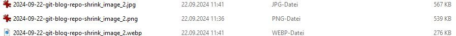

Beispiel 2

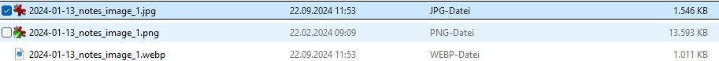


### Problem Webp 
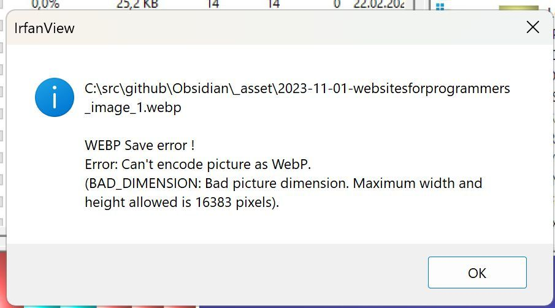

#### Find relevant files

## Python converter and renamer 

https://gist.github.com/juanbretti/7f3dfc98b39e3d4216c275232a56305c

#### conda venv 
https://uoa-eresearch.github.io/eresearch-cookbook/recipe/2014/11/20/conda/
```
(base) PS C:\src\py_hacks> conda -V
conda 24.1.0
(base) PS C:\src\py_hacks> conda create -n git-shrink python=3.12 
Retrieving notices: ...working... done
Channels:
 - defaults
Platform: win-64
Collecting package metadata (repodata.json): done
Solving environment: done

## Package Plan ##

  environment location: C:\Users\engels\.conda\envs\git-shrink

  added / updated specs:
    - python=3.12


The following packages will be downloaded:

    package                    |            build
    ---------------------------|-----------------
    setuptools-75.1.0          |  py312haa95532_0         2.2 MB
    ------------------------------------------------------------
                                           Total:         2.2 MB

The following NEW packages will be INSTALLED:

  bzip2              pkgs/main/win-64::bzip2-1.0.8-h2bbff1b_6
  ca-certificates    pkgs/main/win-64::ca-certificates-2024.7.2-haa95532_0
  expat              pkgs/main/win-64::expat-2.6.3-h5da7b33_0
  libffi             pkgs/main/win-64::libffi-3.4.4-hd77b12b_1
  openssl            pkgs/main/win-64::openssl-3.0.15-h827c3e9_0
  pip                pkgs/main/win-64::pip-24.2-py312haa95532_0
  python             pkgs/main/win-64::python-3.12.5-h14ffc60_1
  setuptools         pkgs/main/win-64::setuptools-75.1.0-py312haa95532_0
  sqlite             pkgs/main/win-64::sqlite-3.45.3-h2bbff1b_0
  tk                 pkgs/main/win-64::tk-8.6.14-h0416ee5_0
  tzdata             pkgs/main/noarch::tzdata-2024a-h04d1e81_0
  vc                 pkgs/main/win-64::vc-14.40-h2eaa2aa_1
  vs2015_runtime     pkgs/main/win-64::vs2015_runtime-14.40.33807-h98bb1dd_1
  wheel              pkgs/main/win-64::wheel-0.44.0-py312haa95532_0
  xz                 pkgs/main/win-64::xz-5.4.6-h8cc25b3_1
  zlib               pkgs/main/win-64::zlib-1.2.13-h8cc25b3_1


Proceed ([y]/n)? y


Downloading and Extracting Packages:

Preparing transaction: done
Verifying transaction: done
Executing transaction: done
#
# To activate this environment, use       
#
#     $ conda activate git-shrink
#
# To deactivate an active environment, use
#
#     $ conda deactivate

```

#### Pillow

```
conda install pillow
`pip install pillow`

[https://pypi.org/project/pillow/](https://pypi.org/project/pillow/)
```


### PY Result
```
(git-shrink) PS C:\src\py_hacks>  c:; cd 'c:\src\py_hacks'; & 'c:\Users\engels\.conda\envs\git-shrink\python.exe' 'c:\Users\engels\.vscode\extensions\ms-python.debugpy-2024.10.0-win32-x64\bundled\libs\debugpy\adapter/../..\debugpy\launcher' '53764' '--' 'c:\src\py_hacks\git-repo-shrink\testrun.py'
Directory exists
C:/src/github/Obsidian - Kopie/_asset\2023-09-18 WordPressPlayground_image_1.png
C:/src/github/Obsidian - Kopie/_asset\2023-09-18 WordPressPlayground_image_2.png
C:/src/github/Obsidian - Kopie/_asset\2023-09-18 WordPressPlayground_image_3.png
C:/src/github/Obsidian - Kopie/_asset\2023-09-18 WordPressPlayground_image_4.png
C:/src/github/Obsidian - Kopie/_asset\2023-09-18-18-15-53_Chrome DevTools Protocol_image_1.png
C:/src/github/Obsidian - Kopie/_asset\2023-09-18-18-16-32-PYOBD_image_1.png
C:/src/github/Obsidian - Kopie/_asset\2023-09-18-18-17-08_illusion pages_image_1.png
C:/src/github/Obsidian - Kopie/_asset\2023-09-18-18-31-45_Puckeditor_image_1.png
C:/src/github/Obsidian - Kopie/_asset\2023-09-18-18-47-46_securityheaders_image_1.png
C:/src/github/Obsidian - Kopie/_asset\2023-09-18-18-49-21_Random picker wheel_image_1.png
C:/src/github/Obsidian - Kopie/_asset\2023-09-18-18-50-35_ARSnova_image_1.png
C:/src/github/Obsidian - Kopie/_asset\2023-09-18-18-50-56-tweedback_image_1.png
C:/src/github/Obsidian - Kopie/_asset\2023-09-18-18-50-56-tweedback_image_2.png
C:/src/github/Obsidian - Kopie/_asset\2023-09-18-18-54-07_webvm_image_1.png
C:/src/github/Obsidian - Kopie/_asset\2023-09-18-18-56-53_Devtoolstips_image_1.png
C:/src/github/Obsidian - Kopie/_asset\2023-09-18-19-26-38_WtfPython_image_1.png
C:/src/github/Obsidian - Kopie/_asset\2023-09-18-19-28-30-SweetHome3D_image_1.png
C:/src/github/Obsidian - Kopie/_asset\2023-09-18-20-04-31_Radware Live Threat Map_image_1.png
C:/src/github/Obsidian - Kopie/_asset\2023-09-18-20-30-54_webcam_image_1.png
C:/src/github/Obsidian - Kopie/_asset\2023-09-18-20-34-18_revealjs_image_1.png
C:/src/github/Obsidian - Kopie/_asset\2023-09-18-20-34-18_revealjs_image_2.png
C:/src/github/Obsidian - Kopie/_asset\2023-09-18-CryptBoard_image_1.png
C:/src/github/Obsidian - Kopie/_asset\2023-09-18-CryptBoard_image_2.png
C:/src/github/Obsidian - Kopie/_asset\2023-09-18-Development-of-the-C-Language_image_1.png
C:/src/github/Obsidian - Kopie/_asset\2023-09-18-Exploit Database_image_1.png
C:/src/github/Obsidian - Kopie/_asset\2023-09-18-JSLinux_image_2.png
C:/src/github/Obsidian - Kopie/_asset\2023-09-18-JSLinux_image_3.png
C:/src/github/Obsidian - Kopie/_asset\2023-09-18-JSLinux_image_4.png
C:/src/github/Obsidian - Kopie/_asset\2023-09-18-JSLinux_image_5.png
C:/src/github/Obsidian - Kopie/_asset\2023-09-18-Knots_image_1.png
C:/src/github/Obsidian - Kopie/_asset\2023-09-18-listEngineeringBlogs_image_1.png
C:/src/github/Obsidian - Kopie/_asset\2023-09-18-listEngineeringBlogs_image_2.png
C:/src/github/Obsidian - Kopie/_asset\2023-09-18-n8n_image_1.png
C:/src/github/Obsidian - Kopie/_asset\2023-09-18-Pytudes_image_1.png
C:/src/github/Obsidian - Kopie/_asset\2023-09-18-surfaceLinux_image_1.png
C:/src/github/Obsidian - Kopie/_asset\2023-09-18-swisarmysknife_image_1.png
C:/src/github/Obsidian - Kopie/_asset\2023-09-18-x86-wasm-recompile-browser_image_1.png
C:/src/github/Obsidian - Kopie/_asset\2023-09-18-x86-wasm-recompile-browser_image_2.png
C:/src/github/Obsidian - Kopie/_asset\2023-09-18_BiggestDataHacks_image_1.png
C:/src/github/Obsidian - Kopie/_asset\2023-09-18_BLAZINGLYFASTHUGOCMSAPP_image_1.png
C:/src/github/Obsidian - Kopie/_asset\2023-09-18_BLAZINGLYFASTHUGOCMSAPP_image_2.png
C:/src/github/Obsidian - Kopie/_asset\2023-09-18_BriefcasePy_image_1.png
C:/src/github/Obsidian - Kopie/_asset\2023-09-18_digitalattackmap_image_1.png
C:/src/github/Obsidian - Kopie/_asset\2023-09-18_DiscoverOSSprojects_image_1.png
C:/src/github/Obsidian - Kopie/_asset\2023-09-18_internetABCLernmodule_image_1.png
C:/src/github/Obsidian - Kopie/_asset\2023-09-18_LiberaChat_image_1.png
C:/src/github/Obsidian - Kopie/_asset\2023-09-18_LiberaChat_image_2.png
C:/src/github/Obsidian - Kopie/_asset\2023-09-18_mentimeter_image_1.png
C:/src/github/Obsidian - Kopie/_asset\2023-09-18_ModernJavaScriptTutorial_image_1.png
C:/src/github/Obsidian - Kopie/_asset\2023-09-18_ModernJavaScriptTutorial_image_2.png
C:/src/github/Obsidian - Kopie/_asset\2023-09-18_OpenMoji_image_1.png
C:/src/github/Obsidian - Kopie/_asset\2023-09-18_ScienceTricksKids_image_1.png
C:/src/github/Obsidian - Kopie/_asset\2023-09-18_ScienceTricksKids_image_2.png
C:/src/github/Obsidian - Kopie/_asset\2023-09-18_TLauncher_image_1.png
C:/src/github/Obsidian - Kopie/_asset\2023-09-18_WorkshopSpielefinden_image_1.png
C:/src/github/Obsidian - Kopie/_asset\2023-09-18_YourAttentionWasStolen_image_1.png
C:/src/github/Obsidian - Kopie/_asset\2023-09-18_YourAttentionWasStolen_image_2.png
C:/src/github/Obsidian - Kopie/_asset\2023-09-18_Zeitreihenanalyse_image_1.png
C:/src/github/Obsidian - Kopie/_asset\2023-09-19_ImprovingPrivacy_image_1.png
C:/src/github/Obsidian - Kopie/_asset\2023-09-21-Counting Ghosts_image_1.png
C:/src/github/Obsidian - Kopie/_asset\2023-09-21_WebTorrent_image_1.png
C:/src/github/Obsidian - Kopie/_asset\2023-09-22_haskellWasm_image_1.png
C:/src/github/Obsidian - Kopie/_asset\2023-09-23-09-51-09_geoTools_image_1.png
C:/src/github/Obsidian - Kopie/_asset\2023-09-23-09-51-09_geoTools_image_2.png
C:/src/github/Obsidian - Kopie/_asset\2023-09-23-09-51-09_geoTools_image_3.png
C:/src/github/Obsidian - Kopie/_asset\2023-09-23-09-51-09_geoTools_image_4.png
C:/src/github/Obsidian - Kopie/_asset\2023-09-23-09-51-09_geoTools_image_5.png
C:/src/github/Obsidian - Kopie/_asset\2023-09-23-09-51-09_geoTools_image_6.png
C:/src/github/Obsidian - Kopie/_asset\2023-09-23-09-51-09_geoTools_image_7.png
C:/src/github/Obsidian - Kopie/_asset\2023-09-26-Prophet_image_1.png
C:/src/github/Obsidian - Kopie/_asset\2023-09-26-Prophet_image_2.png
C:/src/github/Obsidian - Kopie/_asset\2023-09-26-Prophet_image_3.png
C:/src/github/Obsidian - Kopie/_asset\2023-09-28_modernWebApplicationDevelopmentJavaScript_image_1.png
C:/src/github/Obsidian - Kopie/_asset\2023-09-29-xml cheatSheet-Py_image_1.png
C:/src/github/Obsidian - Kopie/_asset\2023-09-29-xml cheatSheet-Py_image_2.png
C:/src/github/Obsidian - Kopie/_asset\2023-09-29-xml cheatSheet-Py_image_3.png
C:/src/github/Obsidian - Kopie/_asset\2023-09-29_DetectAI-generatedText_image_1.png
C:/src/github/Obsidian - Kopie/_asset\2023-10-03- Local-first Software You own your data, in spite of the cloud_image_1.pngC:/src/github/Obsidian - Kopie/_asset\2023-10-08_JavascriptWithoutBuild_image_1.png
C:/src/github/Obsidian - Kopie/_asset\2023-10-09_ElasticTextSearchPostgres_image_1.png
C:/src/github/Obsidian - Kopie/_asset\2023-10-11_Red Blob Games_1_image_1.png
C:/src/github/Obsidian - Kopie/_asset\2023-10-11_SQLReservedWords_image_1.png
C:/src/github/Obsidian - Kopie/_asset\2023-10-13_Clippings_image_1.png
C:/src/github/Obsidian - Kopie/_asset\2023-10-14_Documenting Police Tech in Our Communitieswith Open Source Research_image_1.png
C:/src/github/Obsidian - Kopie/_asset\2023-10-14_GraphQL for .NET_image_1.png
C:/src/github/Obsidian - Kopie/_asset\2023-10-15- online version of ffmpeg built on ffmpeg.wasm_image_1.png
C:/src/github/Obsidian - Kopie/_asset\2023-10-16-Navidrome_image_1.png
C:/src/github/Obsidian - Kopie/_asset\2023-10-16-Navidrome_image_2.png
C:/src/github/Obsidian - Kopie/_asset\2023-10-17_3D Environment_image_1.png
C:/src/github/Obsidian - Kopie/_asset\2023-10-18_IshkursGuidetoElectronicMusic_image_1.png
C:/src/github/Obsidian - Kopie/_asset\2023-10-18_IshkursGuidetoElectronicMusic_image_2.png
C:/src/github/Obsidian - Kopie/_asset\2023-10-18_IshkursGuidetoElectronicMusic_image_3.png
C:/src/github/Obsidian - Kopie/_asset\2023-10-20-sounddialuppictured_image_1.png
C:/src/github/Obsidian - Kopie/_asset\2023-10-24_Invoice to Sheet_image_1.png
C:/src/github/Obsidian - Kopie/_asset\2023-10-24_InvoiceNet_image_1.png
C:/src/github/Obsidian - Kopie/_asset\2023-11-01-websitesforprogrammers_image_1.png
C:/src/github/Obsidian - Kopie/_asset\2023-11-01_HackersGuidetoGit_image_1.png
C:/src/github/Obsidian - Kopie/_asset\2023-11-11_Bitcoin in Python_image_1.png
C:/src/github/Obsidian - Kopie/_asset\2023-11-11_Browser Debugging_image_1.png
C:/src/github/Obsidian - Kopie/_asset\2023-11-11_prettymaps_image_1.png
C:/src/github/Obsidian - Kopie/_asset\2023-11-13- Open rigorous and reproducible research_ A practitioners handbook_image_1.png
C:/src/github/Obsidian - Kopie/_asset\2023-11-13_feditrends_image_1.png
C:/src/github/Obsidian - Kopie/_asset\2023-11-14-A modest JavaScript framework for the HTML you already have_image_1.png
C:/src/github/Obsidian - Kopie/_asset\2023-11-14-A modest JavaScript framework for the HTML you already have_image_2.png
C:/src/github/Obsidian - Kopie/_asset\2023-11-14_projecteuler_image_1.png
C:/src/github/Obsidian - Kopie/_asset\2023-11-15_WasmByExample_image_1.png
C:/src/github/Obsidian - Kopie/_asset\2023-11-17_CleanAnyWebpage_image_1.png
C:/src/github/Obsidian - Kopie/_asset\2023-11-17_tensorli_image_1.png
C:/src/github/Obsidian - Kopie/_asset\2023-11-22_Discover91CoolGPTs_image_1.png
C:/src/github/Obsidian - Kopie/_asset\2023-11-22_Wasmv86Systems_image_1.png
C:/src/github/Obsidian - Kopie/_asset\2023-11-22_Wasmv86Systems_image_10.png
C:/src/github/Obsidian - Kopie/_asset\2023-11-22_Wasmv86Systems_image_2.png
C:/src/github/Obsidian - Kopie/_asset\2023-11-22_Wasmv86Systems_image_3.png
C:/src/github/Obsidian - Kopie/_asset\2023-11-22_Wasmv86Systems_image_4.png
C:/src/github/Obsidian - Kopie/_asset\2023-11-22_Wasmv86Systems_image_5.png
C:/src/github/Obsidian - Kopie/_asset\2023-11-22_Wasmv86Systems_image_6.png
C:/src/github/Obsidian - Kopie/_asset\2023-11-22_Wasmv86Systems_image_7.png
C:/src/github/Obsidian - Kopie/_asset\2023-11-22_Wasmv86Systems_image_8.png
C:/src/github/Obsidian - Kopie/_asset\2023-11-22_Wasmv86Systems_image_9.png
C:/src/github/Obsidian - Kopie/_asset\2023-11-25_DesktopEnvironmentBrowser_image_1.png
C:/src/github/Obsidian - Kopie/_asset\2023-11-25_dosdeck_image_1.png
C:/src/github/Obsidian - Kopie/_asset\2023-11-25_dosdeck_image_2.png
C:/src/github/Obsidian - Kopie/_asset\2023-11-25_dosdeck_image_3.png
C:/src/github/Obsidian - Kopie/_asset\2023-11-25_MinecraftReimplementation_image_1.png
C:/src/github/Obsidian - Kopie/_asset\2023-11-28_HallucinationsLeaderboard_image_1.png
C:/src/github/Obsidian - Kopie/_asset\2023-11-28_Maptiler_image_1.png
C:/src/github/Obsidian - Kopie/_asset\2023-11-29_LernVideos_image_1.png
C:/src/github/Obsidian - Kopie/_asset\2023-11-30_BuildingREPLPython_image_1.png
C:/src/github/Obsidian - Kopie/_asset\2023-12-03_Excalidraw_sketch2Code_image_1.png
C:/src/github/Obsidian - Kopie/_asset\2023-12-03_Excalidraw_sketch2Code_image_3.png
C:/src/github/Obsidian - Kopie/_asset\2023-12-03_Excalidraw_sketch2Code_image_4.png
C:/src/github/Obsidian - Kopie/_asset\2023-12-04_LLM_Visualizations_image_1.png
C:/src/github/Obsidian - Kopie/_asset\2023-12-05_Termshark_image_1.png
C:/src/github/Obsidian - Kopie/_asset\2023-12-08_PrototypeFund_image_1.png
C:/src/github/Obsidian - Kopie/_asset\2023-12-09-HallucinationsLeaderBoard_image_1.png
C:/src/github/Obsidian - Kopie/_asset\2023-12-09-Magicoder.. Source Code Is All You Need_image_1.png
C:/src/github/Obsidian - Kopie/_asset\2023-12-09_GoogleChat_image_1.png
C:/src/github/Obsidian - Kopie/_asset\2023-12-10-Trippy_image_1.png
C:/src/github/Obsidian - Kopie/_asset\2023-12-10-Trippy_image_2.png
C:/src/github/Obsidian - Kopie/_asset\2023-12-10-Trippy_image_3.png
C:/src/github/Obsidian - Kopie/_asset\2023-12-10-Trippy_image_4.png
C:/src/github/Obsidian - Kopie/_asset\2023-12-10_bard_image_1.png
C:/src/github/Obsidian - Kopie/_asset\2023-12-10_WasmEdge_image_1.png
C:/src/github/Obsidian - Kopie/_asset\2023-12-13_leafmap_image_1.png
C:/src/github/Obsidian - Kopie/_asset\2023-12-13_leafmap_image_2.png
C:/src/github/Obsidian - Kopie/_asset\2023-12-13_leafmap_image_3.png
C:/src/github/Obsidian - Kopie/_asset\2023-12-13_leafmap_image_4.png
C:/src/github/Obsidian - Kopie/_asset\2023-12-13_leafmap_image_5.png
C:/src/github/Obsidian - Kopie/_asset\2023-12-13_Solo_image_1.png
C:/src/github/Obsidian - Kopie/_asset\2023-12-13_Solo_image_2.png
C:/src/github/Obsidian - Kopie/_asset\2023-12-13_Solo_image_3.png
C:/src/github/Obsidian - Kopie/_asset\2023-12-13_Solo_image_4.png
C:/src/github/Obsidian - Kopie/_asset\2023-12-13_Solo_image_5.png
C:/src/github/Obsidian - Kopie/_asset\2023-12-14_delphi-ai_image_2.png
C:/src/github/Obsidian - Kopie/_asset\2023-12-20_VisualizingTransformerLanguageModels_image_3.png
C:/src/github/Obsidian - Kopie/_asset\2023-12-21-wireflow_image_1.png
C:/src/github/Obsidian - Kopie/_asset\2023-12-21-wireflow_image_2.png
C:/src/github/Obsidian - Kopie/_asset\2023-12-21-wireflow_image_3.png
C:/src/github/Obsidian - Kopie/_asset\2023-12-21-wireflow_image_4.png
C:/src/github/Obsidian - Kopie/_asset\20231219172353_winampWeb.png
C:/src/github/Obsidian - Kopie/_asset\20231219172518_internetArchiveWinamp.png
C:/src/github/Obsidian - Kopie/_asset\2024-01-07_glitch_image_1.png
C:/src/github/Obsidian - Kopie/_asset\2024-01-07_TeachableMachine_image_1.png
C:/src/github/Obsidian - Kopie/_asset\2024-01-07_TeachableMachine_image_2.png
C:/src/github/Obsidian - Kopie/_asset\2024-01-13_notes_image_1.png
C:/src/github/Obsidian - Kopie/_asset\2024-01-13_notes_image_2.png
C:/src/github/Obsidian - Kopie/_asset\2024-01-18-Artemis_image_1.png
C:/src/github/Obsidian - Kopie/_asset\2024-01-18-p5.js_image_1.png
C:/src/github/Obsidian - Kopie/_asset\2024-01-18_kanbanBoard_image_1.png
C:/src/github/Obsidian - Kopie/_asset\2024-01-19_browserchat_image_1.png
C:/src/github/Obsidian - Kopie/_asset\2024-01-24_Flutter_Flet_image_1.png
C:/src/github/Obsidian - Kopie/_asset\2024-01-24_Flutter_Flet_image_2.png
C:/src/github/Obsidian - Kopie/_asset\2024-01-25_compilinglinuxKernel_image_1.png
C:/src/github/Obsidian - Kopie/_asset\2024-01-25_JAVA_JDK_2024_image_1.png
C:/src/github/Obsidian - Kopie/_asset\2024-01-25_llmsherpa_image_1.png
C:/src/github/Obsidian - Kopie/_asset\2024-01-25_ml-lib_videos_image_1.png
C:/src/github/Obsidian - Kopie/_asset\2024-01-25_PaperAirplaneDesigns_image_1.png
C:/src/github/Obsidian - Kopie/_asset\2024-01-25_skikit_lern_image_1.png
C:/src/github/Obsidian - Kopie/_asset\2024-01-25_sqlitefiddlewasm_image_1.png
C:/src/github/Obsidian - Kopie/_asset\2024-01-27_Google Research_GooglesLumiere_image_1.png
C:/src/github/Obsidian - Kopie/_asset\2024-01-28_hiscalearchitecture_image_1.png
C:/src/github/Obsidian - Kopie/_asset\2024-01-28_placemarkEditor_image_1.png
C:/src/github/Obsidian - Kopie/_asset\2024-01-29_HowToSpeak_MIT_image_1.png
C:/src/github/Obsidian - Kopie/_asset\2024-02-01_Pyodide_image_1.png
C:/src/github/Obsidian - Kopie/_asset\2024-02-01_Pyodide_image_2.png
C:/src/github/Obsidian - Kopie/_asset\2024-02-02_PageBuilders_WebFlow_image_1.png
C:/src/github/Obsidian - Kopie/_asset\2024-02-02_PageBuilders_WebFlow_image_2.png
C:/src/github/Obsidian - Kopie/_asset\2024-02-02_PageBuilders_WebFlow_image_3.png
C:/src/github/Obsidian - Kopie/_asset\2024-02-04-ioPaint_image_2.png
C:/src/github/Obsidian - Kopie/_asset\2024-02-04-ioPaint_image_3.png
C:/src/github/Obsidian - Kopie/_asset\2024-02-04-ioPaint_image_4.png
C:/src/github/Obsidian - Kopie/_asset\2024-02-04_Website_GithubActionTemplate_image_1.png
C:/src/github/Obsidian - Kopie/_asset\2024-02-06-AdGuard_image_1.png
C:/src/github/Obsidian - Kopie/_asset\2024-02-06-AdGuard_image_2.png
C:/src/github/Obsidian - Kopie/_asset\2024-02-08_BrowsercraftCheerpJ_image_1.png
C:/src/github/Obsidian - Kopie/_asset\2024-02-08_BrowsercraftCheerpJ_image_2.png
C:/src/github/Obsidian - Kopie/_asset\2024-02-08_MermaidLive Editor_image_1.png
C:/src/github/Obsidian - Kopie/_asset\2024-02-08_MermaidLive Editor_image_2.png
C:/src/github/Obsidian - Kopie/_asset\2024-02-08_MermaidLive Editor_image_3.png
C:/src/github/Obsidian - Kopie/_asset\2024-02-08_openai_logocreator_image_4.png
C:/src/github/Obsidian - Kopie/_asset\2024-02-08_openai_logocreator_image_5.png
C:/src/github/Obsidian - Kopie/_asset\2024-02-10_droneFylLearnung18s_image_1.png
C:/src/github/Obsidian - Kopie/_asset\2024-02-13_Astro_image_1.png
C:/src/github/Obsidian - Kopie/_asset\2024-02-13_python_search_80Lines_image_1.png
C:/src/github/Obsidian - Kopie/_asset\2024-02-20-CryptPad_image_1.png
C:/src/github/Obsidian - Kopie/_asset\2024-02-20-CryptPad_image_10.png
C:/src/github/Obsidian - Kopie/_asset\2024-02-20-CryptPad_image_11.png
C:/src/github/Obsidian - Kopie/_asset\2024-02-20-CryptPad_image_12.png
C:/src/github/Obsidian - Kopie/_asset\2024-02-20-CryptPad_image_13.png
C:/src/github/Obsidian - Kopie/_asset\2024-02-20-CryptPad_image_14.png
C:/src/github/Obsidian - Kopie/_asset\2024-02-20-CryptPad_image_15.png
C:/src/github/Obsidian - Kopie/_asset\2024-02-20-CryptPad_image_16.png
C:/src/github/Obsidian - Kopie/_asset\2024-02-20-CryptPad_image_17.png
C:/src/github/Obsidian - Kopie/_asset\2024-02-20-CryptPad_image_2.png
C:/src/github/Obsidian - Kopie/_asset\2024-02-20-CryptPad_image_3.png
C:/src/github/Obsidian - Kopie/_asset\2024-02-20-CryptPad_image_4.png
C:/src/github/Obsidian - Kopie/_asset\2024-02-20-CryptPad_image_5.png
C:/src/github/Obsidian - Kopie/_asset\2024-02-20-CryptPad_image_6.png
C:/src/github/Obsidian - Kopie/_asset\2024-02-20-CryptPad_image_7.png
C:/src/github/Obsidian - Kopie/_asset\2024-02-20-CryptPad_image_8.png
C:/src/github/Obsidian - Kopie/_asset\2024-02-20-CryptPad_image_9.png
C:/src/github/Obsidian - Kopie/_asset\2024-02-20_gpt4all_image_1.png
C:/src/github/Obsidian - Kopie/_asset\2024-02-20_gpt4all_image_2.png
C:/src/github/Obsidian - Kopie/_asset\2024-02-20_LM_Studio_image_1.png
C:/src/github/Obsidian - Kopie/_asset\2024-02-20_LM_Studio_image_2.png
C:/src/github/Obsidian - Kopie/_asset\2024-02-20_LM_Studio_image_3.png
C:/src/github/Obsidian - Kopie/_asset\2024-02-20_LM_Studio_image_4.png
C:/src/github/Obsidian - Kopie/_asset\2024-02-20_SVG_Loading_Spinners_image_2.png
C:/src/github/Obsidian - Kopie/_asset\2024-02-20_TheNeuralNetworkZoo_image_2.png
C:/src/github/Obsidian - Kopie/_asset\2024-02-20_visZoo_image_1.png
C:/src/github/Obsidian - Kopie/_asset\2024-02-24-kiMusik_image_1.png
C:/src/github/Obsidian - Kopie/_asset\2024-02-24-kiMusik_image_2.png
C:/src/github/Obsidian - Kopie/_asset\2024-02-24-kiMusik_image_3.png
C:/src/github/Obsidian - Kopie/_asset\2024-02-24-kiMusik_image_4.png
C:/src/github/Obsidian - Kopie/_asset\2024-02-24_codemate_image_1.png
C:/src/github/Obsidian - Kopie/_asset\2024-02-24_PGlitePostgresWASM_image_1.png
C:/src/github/Obsidian - Kopie/_asset\2024-02-25_attantiontransformer_image_1.png
C:/src/github/Obsidian - Kopie/_asset\2024-02-25_attantiontransformer_image_2.png
C:/src/github/Obsidian - Kopie/_asset\2024-02-25_cartosvg_image_1.png
C:/src/github/Obsidian - Kopie/_asset\2024-02-25_cartosvg_image_2.png
C:/src/github/Obsidian - Kopie/_asset\2024-02-25_cartosvg_image_4.png
C:/src/github/Obsidian - Kopie/_asset\2024-02-25_OpenSourceIntelligence_image_1.png
C:/src/github/Obsidian - Kopie/_asset\2024-02-26-wasmdoom_image_1.png
C:/src/github/Obsidian - Kopie/_asset\2024-02-26-wasmdoom_image_2.png
C:/src/github/Obsidian - Kopie/_asset\2024-02-27-sandspiel_image_1.png
C:/src/github/Obsidian - Kopie/_asset\2024-02-27_jupyterLite_image_1.png
C:/src/github/Obsidian - Kopie/_asset\2024-03-01_Testcontainers_image_1.png
C:/src/github/Obsidian - Kopie/_asset\2024-03-06_ebooks_image_1.png
C:/src/github/Obsidian - Kopie/_asset\2024-03-06_online  Colab_image_1.png
C:/src/github/Obsidian - Kopie/_asset\2024-03-06_online  Colab_image_2.png
C:/src/github/Obsidian - Kopie/_asset\2024-03-06_rubics_image_1.png
C:/src/github/Obsidian - Kopie/_asset\2024-03-07-eloquentjavascript_image_1.png
C:/src/github/Obsidian - Kopie/_asset\2024-03-08-DaleCanegie_image_1.png
C:/src/github/Obsidian - Kopie/_asset\2024-03-09-fingerprinting_image_1.png
C:/src/github/Obsidian - Kopie/_asset\2024-03-09-fingerprinting_image_2.png
C:/src/github/Obsidian - Kopie/_asset\2024-03-09_PianoPaper_image_2.png
C:/src/github/Obsidian - Kopie/_asset\2024-03-22chronos-forecasting_image_1.png
C:/src/github/Obsidian - Kopie/_asset\2024-03-28-scrapeOpenAi_image_1.png
C:/src/github/Obsidian - Kopie/_asset\2024-04-01_py_image_1.png
C:/src/github/Obsidian - Kopie/_asset\2024-04-04_obsidian Script_image_1.png
C:/src/github/Obsidian - Kopie/_asset\2024-04-04_obsidian Script_image_2.png
C:/src/github/Obsidian - Kopie/_asset\2024-04-07-database_image_1.png
C:/src/github/Obsidian - Kopie/_asset\2024-04-07-database_image_2.png
C:/src/github/Obsidian - Kopie/_asset\2024-04-07-database_image_3.png
C:/src/github/Obsidian - Kopie/_asset\2024-04-07-database_image_4.png
C:/src/github/Obsidian - Kopie/_asset\2024-04-07-database_image_5.png
C:/src/github/Obsidian - Kopie/_asset\2024-04-07-database_image_6.png
C:/src/github/Obsidian - Kopie/_asset\2024-04-07-database_image_7.png
C:/src/github/Obsidian - Kopie/_asset\2024-04-09-py-Datascience_image_1.png
C:/src/github/Obsidian - Kopie/_asset\2024-04-09-py-Datascience_image_2.png
C:/src/github/Obsidian - Kopie/_asset\2024-04-09-py-Datascience_image_3.png
C:/src/github/Obsidian - Kopie/_asset\2024-04-09-The Concise TypeScript Book- A Concise Guide to Effective Development in TypeScript. Free and Open Source_image_1.png
C:/src/github/Obsidian - Kopie/_asset\2024-04-11-transformer.js_image_1.png
C:/src/github/Obsidian - Kopie/_asset\2024-04-11-transformer.js_image_2.png
C:/src/github/Obsidian - Kopie/_asset\2024-04-11-transformer.js_image_3.png
C:/src/github/Obsidian - Kopie/_asset\2024-04-11-transformer.js_image_4.png
C:/src/github/Obsidian - Kopie/_asset\2024-04-11-transformer.js_image_5.png
C:/src/github/Obsidian - Kopie/_asset\2024-04-11-transformer.js_image_6.png
C:/src/github/Obsidian - Kopie/_asset\2024-04-11-transformer.js_image_7.png
C:/src/github/Obsidian - Kopie/_asset\2024-04-12_LearnDeepLearning_image_1.png
C:/src/github/Obsidian - Kopie/_asset\2024-05-09-multimodalLLM_image_3.png
C:/src/github/Obsidian - Kopie/_asset\2024-05-09-multimodalLLM_image_4.png
C:/src/github/Obsidian - Kopie/_asset\2024-05-09-multimodalLLM_image_5.png
C:/src/github/Obsidian - Kopie/_asset\2024-06-06-Create a landing page in seconds_image_1.png
C:/src/github/Obsidian - Kopie/_asset\2024-06-06-Create a landing page in seconds_image_2.png
C:/src/github/Obsidian - Kopie/_asset\2024-06-10-AIGenerators_image_1.png
C:/src/github/Obsidian - Kopie/_asset\2024-06-10-AIGenerators_image_2.png
C:/src/github/Obsidian - Kopie/_asset\2024-06-10-atlas.nomic.ai_image_1.png
C:/src/github/Obsidian - Kopie/_asset\2024-06-10-Data-Quality_image_1.png
C:/src/github/Obsidian - Kopie/_asset\2024-06-10-Labor Market_image_1.png
C:/src/github/Obsidian - Kopie/_asset\2024-06-10-Labor Market_image_2.png
C:/src/github/Obsidian - Kopie/_asset\2024-06-10-notbyai.fyi_image_1.png
C:/src/github/Obsidian - Kopie/_asset\2024-06-10-PDF.ai_image_1.png
C:/src/github/Obsidian - Kopie/_asset\2024-06-10-Research_image_1.png
C:/src/github/Obsidian - Kopie/_asset\2024-06-10-undetectable.ai_image_1.png
C:/src/github/Obsidian - Kopie/_asset\2024-06-10-undetectable.ai_image_2.png
C:/src/github/Obsidian - Kopie/_asset\2024-06-10-Visualize Attention_image_1.png
C:/src/github/Obsidian - Kopie/_asset\2024-06-10-Visualize Attention_image_2.gif
C:/src/github/Obsidian - Kopie/_asset\2024-06-10-Visualize Attention_image_3.gif
C:/src/github/Obsidian - Kopie/_asset\2024-06-10-Visualize Attention_image_4.png
C:/src/github/Obsidian - Kopie/_asset\2024-06-12_image_1.png
C:/src/github/Obsidian - Kopie/_asset\2024-06-12_image_2.png
C:/src/github/Obsidian - Kopie/_asset\2024-06-12_image_3.png
C:/src/github/Obsidian - Kopie/_asset\2024-06-12_image_4.png
C:/src/github/Obsidian - Kopie/_asset\2024-06-12_image_5.png
C:/src/github/Obsidian - Kopie/_asset\2024-06-18-website-generator_image_1.png
C:/src/github/Obsidian - Kopie/_asset\2024-06-18-website-generator_image_2.png
C:/src/github/Obsidian - Kopie/_asset\2024-06-18-website-generator_image_3.png
C:/src/github/Obsidian - Kopie/_asset\2024-06-18-website-generator_image_4.png
C:/src/github/Obsidian - Kopie/_asset\2024-06-18-website-generator_image_5.png
C:/src/github/Obsidian - Kopie/_asset\2024-06-18-website-generator_image_6.png
C:/src/github/Obsidian - Kopie/_asset\2024-06-18-website-generator_image_7.png
C:/src/github/Obsidian - Kopie/_asset\2024-06-18-website-generator_image_8.png
C:/src/github/Obsidian - Kopie/_asset\2024-06-18-website-generator_image_9.png
C:/src/github/Obsidian - Kopie/_asset\2024-06-18_gartner_image_1.png
C:/src/github/Obsidian - Kopie/_asset\2024-06-25-try-exalidraw_image_1.png
C:/src/github/Obsidian - Kopie/_asset\2024-07-01-linux-backup_image_1.png
C:/src/github/Obsidian - Kopie/_asset\2024-07-01-linux-backup_image_2.png
C:/src/github/Obsidian - Kopie/_asset\2024-07-05-android-remote_image_1.png
C:/src/github/Obsidian - Kopie/_asset\2024-07-05-android-remote_image_2.png
C:/src/github/Obsidian - Kopie/_asset\2024-07-05-android-remote_image_3.png
C:/src/github/Obsidian - Kopie/_asset\2024-07-05-android-remote_image_4.png
C:/src/github/Obsidian - Kopie/_asset\2024-07-05-android-remote_image_5.png
C:/src/github/Obsidian - Kopie/_asset\2024-07-07-nand2tetris_image_1.png
C:/src/github/Obsidian - Kopie/_asset\2024-07-08-liveportrait_image_1.png
C:/src/github/Obsidian - Kopie/_asset\2024-07-09TheDeadlockEmpire_image_1.png
C:/src/github/Obsidian - Kopie/_asset\2024-07-12-consensus_image_1.png
C:/src/github/Obsidian - Kopie/_asset\2024-07-12-consensus_image_2.png
C:/src/github/Obsidian - Kopie/_asset\2024-07-12-suno_image_1.png
C:/src/github/Obsidian - Kopie/_asset\2024-07-12-suno_image_2.png
C:/src/github/Obsidian - Kopie/_asset\2024-07-12-suno_image_3.png
C:/src/github/Obsidian - Kopie/_asset\2024-07-12-suno_image_4.png
C:/src/github/Obsidian - Kopie/_asset\2024-07-12-suno_image_5.png
C:/src/github/Obsidian - Kopie/_asset\2024-07-12-webvm_image_2.png
C:/src/github/Obsidian - Kopie/_asset\2024-07-12-webvm_image_3.png
C:/src/github/Obsidian - Kopie/_asset\2024-07-12_image_1.png
C:/src/github/Obsidian - Kopie/_asset\2024-07-16-blog-video_image_1.png
C:/src/github/Obsidian - Kopie/_asset\2024-07-16-European_green_deal.pdf_image_1.png
C:/src/github/Obsidian - Kopie/_asset\2024-07-16-linkedin-proEngels_image_1.png
C:/src/github/Obsidian - Kopie/_asset\2024-07-16-linkedin-proEngels_image_2.png
C:/src/github/Obsidian - Kopie/_asset\2024-07-16-missuseAI_image_1.png
C:/src/github/Obsidian - Kopie/_asset\2024-07-16-missuseAI_image_2.png
C:/src/github/Obsidian - Kopie/_asset\2024-07-16-Overleaf_image_1.png
C:/src/github/Obsidian - Kopie/_asset\2024-07-16-Overleaf_image_2.png
C:/src/github/Obsidian - Kopie/_asset\2024-07-16-Overleaf_image_3.png
C:/src/github/Obsidian - Kopie/_asset\2024-07-16-Overleaf_image_4.png
C:/src/github/Obsidian - Kopie/_asset\2024-07-16_image_1.png
C:/src/github/Obsidian - Kopie/_asset\2024-07-16_image_2.png
C:/src/github/Obsidian - Kopie/_asset\2024-07-18-wargames_image_1.png
C:/src/github/Obsidian - Kopie/_asset\2024-07-18-wargames_image_10.png
C:/src/github/Obsidian - Kopie/_asset\2024-07-18-wargames_image_11.png
C:/src/github/Obsidian - Kopie/_asset\2024-07-18-wargames_image_12.png
C:/src/github/Obsidian - Kopie/_asset\2024-07-18-wargames_image_2.png
C:/src/github/Obsidian - Kopie/_asset\2024-07-18-wargames_image_3.png
C:/src/github/Obsidian - Kopie/_asset\2024-07-18-wargames_image_4.png
C:/src/github/Obsidian - Kopie/_asset\2024-07-18-wargames_image_5.png
C:/src/github/Obsidian - Kopie/_asset\2024-07-18-wargames_image_6.png
C:/src/github/Obsidian - Kopie/_asset\2024-07-18-wargames_image_7.png
C:/src/github/Obsidian - Kopie/_asset\2024-07-18-wargames_image_8.png
C:/src/github/Obsidian - Kopie/_asset\2024-07-18-wargames_image_9.png
C:/src/github/Obsidian - Kopie/_asset\2024-07-20-garage_image_1.png
C:/src/github/Obsidian - Kopie/_asset\2024-08-08-aider_image_1.png
C:/src/github/Obsidian - Kopie/_asset\2024-08-08-cursor_image_1.png
C:/src/github/Obsidian - Kopie/_asset\2024-08-08-turing-post-twitter-lib_image_1.png
C:/src/github/Obsidian - Kopie/_asset\2024-08-11-udio_image_1.png
C:/src/github/Obsidian - Kopie/_asset\2024-08-12-pgwasm_image_1.png
C:/src/github/Obsidian - Kopie/_asset\2024-08-18-pyscript_image_1.png
C:/src/github/Obsidian - Kopie/_asset\2024-09-01-qrcode_image_1.png
C:/src/github/Obsidian - Kopie/_asset\2024-09-01-qrcode_image_2.png
C:/src/github/Obsidian - Kopie/_asset\2024-09-01-qrcode_image_3.png
C:/src/github/Obsidian - Kopie/_asset\2024-09-04-fileDowloads-Pirate-block-list_image_1.png
C:/src/github/Obsidian - Kopie/_asset\2024-09-04-fileDowloads-Pirate-block-list_image_2.png
C:/src/github/Obsidian - Kopie/_asset\2024-09-04-fileDowloads-Pirate-block-list_image_3.png
C:/src/github/Obsidian - Kopie/_asset\2024-09-04-fileDowloads-Pirate-block-list_image_4.png
C:/src/github/Obsidian - Kopie/_asset\2024-09-04-fileDowloads-Pirate-block-list_image_5.png
C:/src/github/Obsidian - Kopie/_asset\2024-09-04-fileDowloads-Pirate-block-list_image_6.png
C:/src/github/Obsidian - Kopie/_asset\2024-09-04-fileDowloads-Pirate-block-list_image_7.png
C:/src/github/Obsidian - Kopie/_asset\2024-09-05-AnythingLLM_image_1.png
C:/src/github/Obsidian - Kopie/_asset\2024-09-05-Cyberchef_image_1.png
C:/src/github/Obsidian - Kopie/_asset\2024-09-05-NSAToolSlides_image_1.png
C:/src/github/Obsidian - Kopie/_asset\2024-09-10-learningProgramming_image_1.png
C:/src/github/Obsidian - Kopie/_asset\2024-09-10-learningProgramming_image_2.png
C:/src/github/Obsidian - Kopie/_asset\2024-09-10-learningProgramming_image_3.png
C:/src/github/Obsidian - Kopie/_asset\2024-09-10-learningProgramming_image_4.png
C:/src/github/Obsidian - Kopie/_asset\2024-09-10-learningProgramming_image_5.png
C:/src/github/Obsidian - Kopie/_asset\2024-09-10-learningProgramming_image_6.png
C:/src/github/Obsidian - Kopie/_asset\2024-09-10-learningProgramming_image_7.png
C:/src/github/Obsidian - Kopie/_asset\2024-09-12svgedit_image_1.png
C:/src/github/Obsidian - Kopie/_asset\2024-09-12svgedit_image_2.png
C:/src/github/Obsidian - Kopie/_asset\2024-09-14-dnstool_image_1.png
C:/src/github/Obsidian - Kopie/_asset\2024-09-14-iptvdramatv_image_1.png
C:/src/github/Obsidian - Kopie/_asset\2024-09-15-scad_image_1.png
C:/src/github/Obsidian - Kopie/_asset\2024-09-18-git-reduce-size_image_1.png
C:/src/github/Obsidian - Kopie/_asset\2024-09-22-git-blog-repo-shrink_image_1.png
C:/src/github/Obsidian - Kopie/_asset\2024-09-22-git-blog-repo-shrink_image_2.png
C:/src/github/Obsidian - Kopie/_asset\2024-09-22-git-blog-repo-shrink_image_3.png
C:/src/github/Obsidian - Kopie/_asset\2024-09-22-git-blog-repo-shrink_image_4.png
C:/src/github/Obsidian - Kopie/_asset\2024-09-22-git-blog-repo-shrink_image_5.png
C:/src/github/Obsidian - Kopie/_asset\2024-09-22-git-blog-repo-shrink_image_6.png
C:/src/github/Obsidian - Kopie/_asset\2024-09-22-git-blog-repo-shrink_image_7.png
C:/src/github/Obsidian - Kopie/_asset\2024-09-22-git-blog-repo-shrink_image_8.png
C:/src/github/Obsidian - Kopie/_asset\20240124093601ghidraMario.png
C:/src/github/Obsidian - Kopie/_asset\20240124093903wpplay.png
C:/src/github/Obsidian - Kopie/_asset\20240204141508_ipgeo.png
C:/src/github/Obsidian - Kopie/_asset\20240220162413_wa.png
C:/src/github/Obsidian - Kopie/_asset\20240220162448wat.png
C:/src/github/Obsidian - Kopie/_asset\A collection of videos to showcase the magic alchemy of computation_image_1.png
C:/src/github/Obsidian - Kopie/_asset\grigora_image_1.png
C:/src/github/Obsidian - Kopie/_asset\Pasted image 20240118181701.png
C:/src/github/Obsidian - Kopie/_asset\Pasted image 20240118182637.png
C:/src/github/Obsidian - Kopie/_asset\Pasted image 20240222095404.png
C:/src/github/Obsidian - Kopie/_asset\Pasted image 20240414135825.png
C:/src/github/Obsidian - Kopie/_asset\Pasted image 20240625151258.png
C:/src/github/Obsidian - Kopie/_asset\Pasted image 20240808143955.png
C:/src/github/Obsidian - Kopie/_asset\PastedImage20240220162230.png
C:/src/github/Obsidian - Kopie/_asset\PastedImage20240221110355.png
C:/src/github/Obsidian - Kopie/_asset\Productive Thinking Model_image_1.png
C:/src/github/Obsidian - Kopie/_asset\Productive Thinking Model_image_2.png
C:/src/github/Obsidian - Kopie/_asset\README_image_1.png
C:/src/github/Obsidian - Kopie/_asset\tmp1718022600145_2024-06-10_image_1.png
C:/src/github/Obsidian - Kopie/_asset\tmp1718183804131_2024-06-12_image_1.png
```

## check Webp in Obsidian + git yekyll SSG Page - okay working 


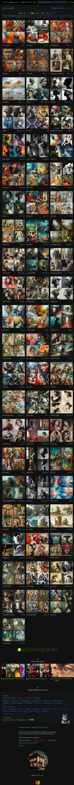


## Results

- keine Dateien > 16383 Pixel Dim X or Y  für webp
- size webp < jpg 
- import as jpg / auto update PNG  
	- https://github.com/musug/obsidian-paste-png-to-jpeg 
	- https://gist.github.com/juanbretti/7f3dfc98b39e3d4216c275232a56305c