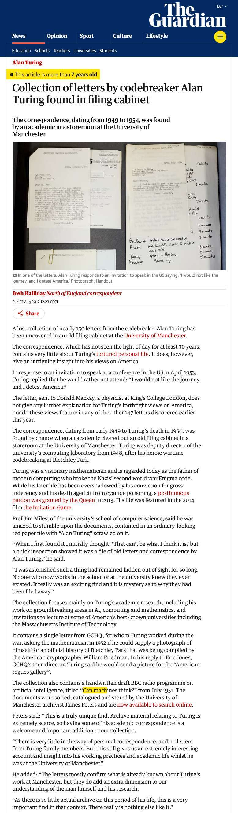
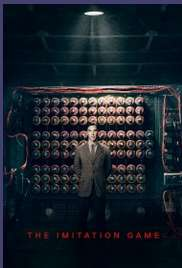

# Alan Turing Collection 

## Wikipedia 

<https://de.wikipedia.org/wiki/Alan_Turing>
## Mark I - Computer 

[2024-09-24-turing-Mark-I](2024-09-24-turing-Mark-I.md)
## Alan Turing: Inquest's suicide verdict 'not supportable'

<https://www.bbc.com/news/science-environment-18561092>
## Royal pardon for codebreaker Alan Turing

<https://www.bbc.com/news/technology-25495315>
## Collection of letters by codebreaker Alan Turing found in filing cabinet: "Can machines think?"

<https://archiveshub.jisc.ac.uk/search/archives/4f6c3f0c-9a70-33c5-bd03-df331fb06146?terms=%22BBC%22>

<https://www.theguardian.com/science/2017/aug/27/collection-letters-codebreaker-alan-turing-found-filing-cabinet>

#### Can Machines Think?

## New face of the Bank of England's £50 note is revealed as Alan Turing

https://www.bbc.com/news/business-48962557

## Video Imitation Game

## Links

<https://moviesjoy.is/movie/the-imitation-game-19720>
