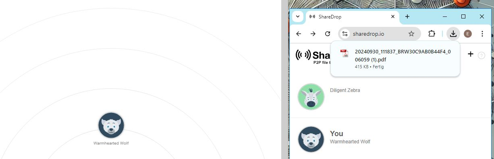

# P2P-Fileshare-Tools 

[PairDrop](https://pairdrop.net/)  [ShareDrop](https://sharedrop.io/)- [Toffeeshare](https://toffeeshare.com/)- [LocalSend](https://localsend.org/)- [LanDrop v2](https://landrop.app/)- [KDE Connect](https://kdeconnect.kde.org)

## Paidrop 

<https://github.com/schlagmichdoch/pairdrop>
<https://pairdrop.net/>

## Sharedrop

### Step 1

### Step 2

### Step 3

### Different Networks

<https://github.com/szimek/sharedrop>
## Localsend

https://github.com/localsend/localsend

## WebRTC

<https://www.freie-messenger.de/begriffe/webrtc/>
<https://www.baeldung.com/webrtc>

## softwarealternativen (nicht nur Fileshare)

<https://www.freie-messenger.de/software/>
## Links 

[WebRTC](https://webrtc.org/?hl=de)- [WebRTC in PairDrop](https://github.com/schlagmichdoch/PairDrop/blob/master/docs/technical-documentation.md)- [QuickShare für Android](https://www.android.com/intl/de_de/better-together/quick-share-app/)