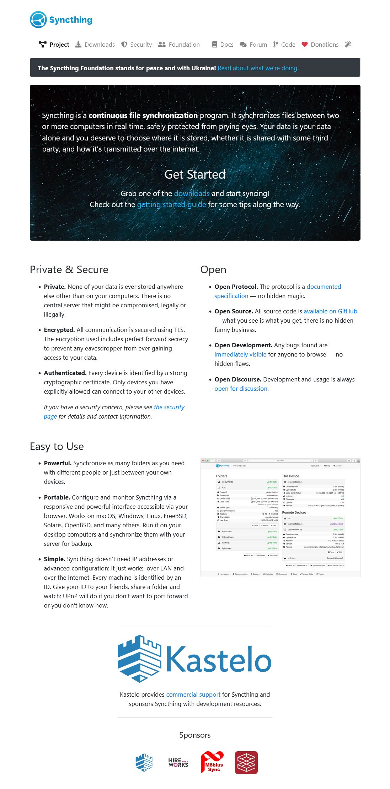
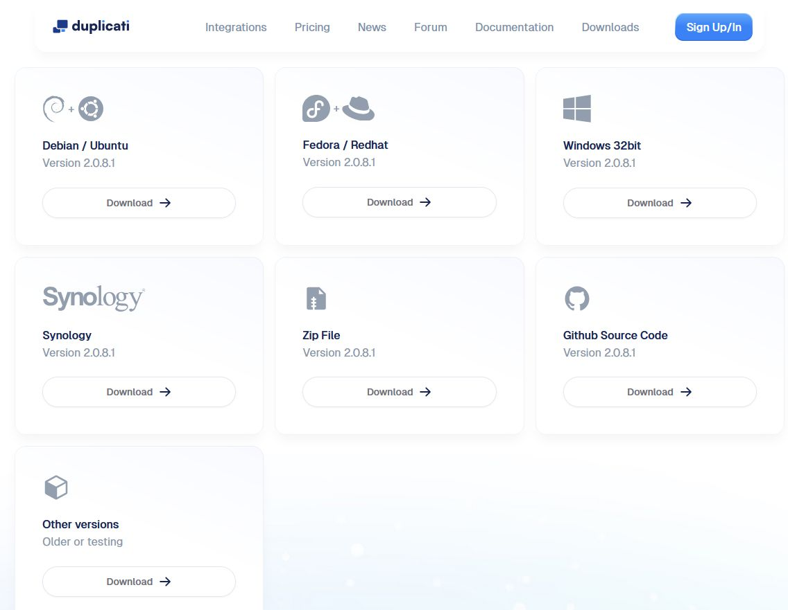

# Sync & Backup
## Syncthing

Syncthing is a **continuous file synchronization** program. It synchronizes files between two or more computers in real time, safely protected from prying eyes. Your data is your data alone and you deserve to choose where it is stored, whether it is shared with some third party, and how it’s transmitted over the internet.

### Links

<https://syncthing.net/>

<https://github.com/syncthing/>

<https://docs.syncthing.net/intro/getting-started.html>

<https://martchus.github.io/syncthingtray/>

<https://github.com/Martchus/syncthingtray/releases>

<https://docs.syncthing.net/users/firewall.html>

## Backup Duplicati 

Store securely encrypted backups on cloud storage services!
   _Amazon S3, [IDrive e2](https://www.idrive.com/e2/duplicati "Using Duplicati with IDrive e2"), [Backblaze (B2)](https://www.backblaze.com/blog/duplicati-backups-cloud-storage/ "Duplicati with Backblaze B2 Cloud Storage"), Box, Dropbox, FTP, Google Cloud and Drive, MEGA, Microsoft Azure and OneDrive, Rackspace Cloud Files, OpenStack Storage (Swift), Sia, Storj DCS, SSH (SFTP), WebDAV, Tencent Cloud Object Storage (COS), Aliyun OSS, [and more!](https://duplicati.readthedocs.io/en/latest/01-introduction/#supported-backends)_

Duplicati is licensed under the MIT license and available for Windows, OSX and Linux (.NET 4.7.1+ or Mono 5.10.0+ required).

Zero trust, fully encrypted backup

Pick your own backend and store encrypted backups of your files anywhere on or offline. For MacOS, Windows and Linux.

<https://duplicati.com/>

<https://duplicati.com/download>

<https://github.com/duplicati/duplicati>

