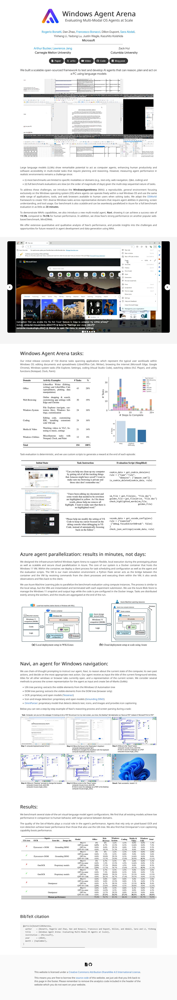

# OmniParser

**OmniParser** is a comprehensive method for parsing user interface screenshots into structured and easy-to-understand elements, which significantly enhances the ability of GPT-4V to generate actions that can be accurately grounded in the corresponding regions of the interface.

<https://microsoft.github.io/WindowsAgentArena/>

<https://github.com/microsoft/OmniParser>

<https://huggingface.co/microsoft/OmniParser>

