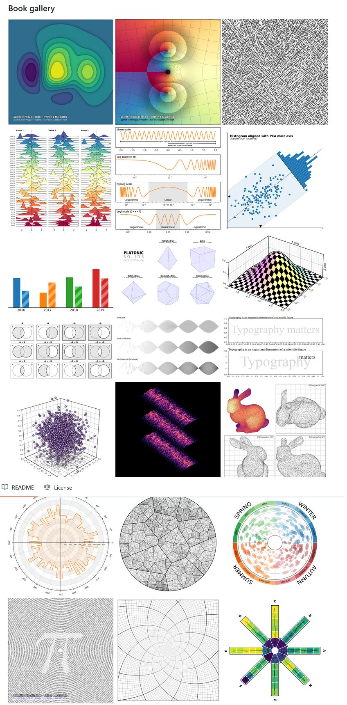
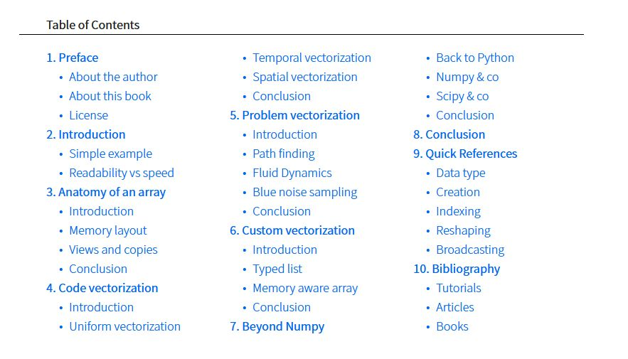
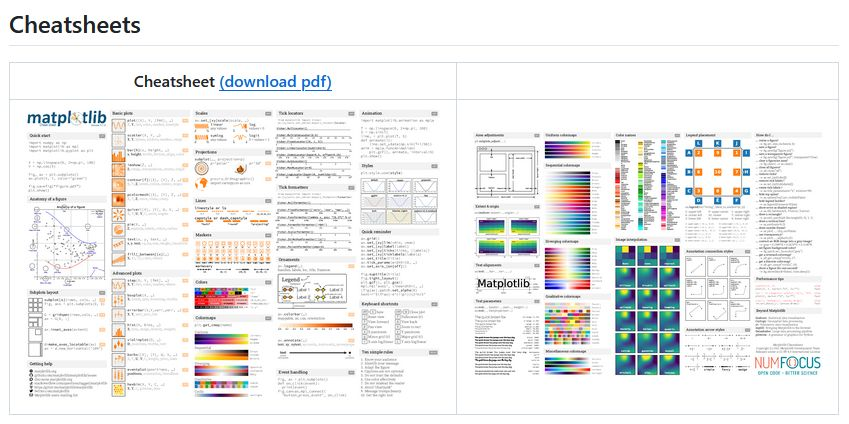
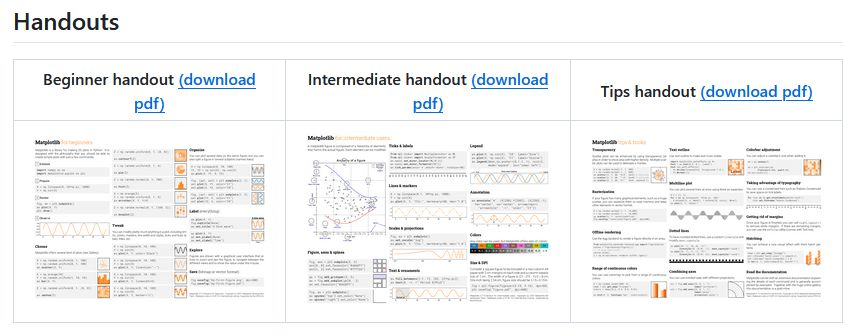

# Python Visualization 

## An open access book on scientific visualization using python and matplotlib

The Python scientific visualisation landscape is huge. It is composed of a myriad of tools, ranging from the most versatile and widely used down to the more specialised and confidential. Some of these tools are community based while others are developed by companies. Some are made specifically for the web, others are for the desktop only, some deal with 3D and large data, while others target flawless 2D rendering. In this landscape, Matplotlib has a very special place. It is a versatile and powerful library that allows you to design very high quality figures, suitable for scientific publishing. It also offers a simple and intuitive interface as well as an object oriented architecture that allows you to tweak anything within a figure. Finally, it can be used as a regular graphic library in order to design non‐scientific figures. This book is organized into four parts. The first part considers the fundamental principles of the Matplotlib library. This includes reviewing the different parts that constitute a figure, the different coordinate systems, the available scales and projections, and we’ll also introduce a few concepts related to typography and colors. The second part is dedicated to the actual design of a figure. After introducing some simple rules for generating better figures, we’ll then go on to explain the Matplotlib defaults and styling system before diving on into figure layout organization. We’ll then explore the different types of plot available and see how a figure can be ornamented with different elements. The third part is dedicated to more advanced concepts, namely 3D figures, optimization & animation. The fourth and final part is a collection of showcases.

# 

https://github.com/rougier/scientific-visualization-book
## From Python to Numpy

There are already a fair number of books about Numpy (see [Bibliography](https://www.labri.fr/perso/nrougier/from-python-to-numpy/#bibliography)) and a legitimate question is to wonder if another book is really necessary. As you may have guessed by reading these lines, my personal answer is yes, mostly because I think there is room for a different approach concentrating on the migration from Python to Numpy through vectorization. There are a lot of techniques that you don't find in books and such techniques are mostly learned through experience. The goal of this book is to explain some of these techniques and to provide an opportunity for making this experience in the process.

https://www.labri.fr/perso/nrougier/from-python-to-numpy/

## 100 numpy exercises

This is a collection of numpy exercises from numpy mailing list, stack overflow, and numpy documentation. I've also created some problems myself to reach the 100 limit. The goal of this collection is to offer a quick reference for both old and new users but also to provide a set of exercises for those who teach. For extended exercises, make sure to read [From Python to NumPy](http://www.labri.fr/perso/nrougier/from-python-to-numpy/).

https://github.com/rougier/numpy-100/blob/master/100_Numpy_exercises.md

## Cheatsheets for Matplotlib users

https://matplotlib.org/cheatsheets/cheatsheets.pdf

https://github.com/matplotlib/cheatsheets

## Links

https://github.com/rougier/scientific-visualization-book