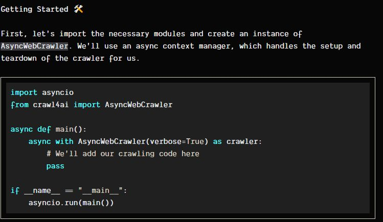
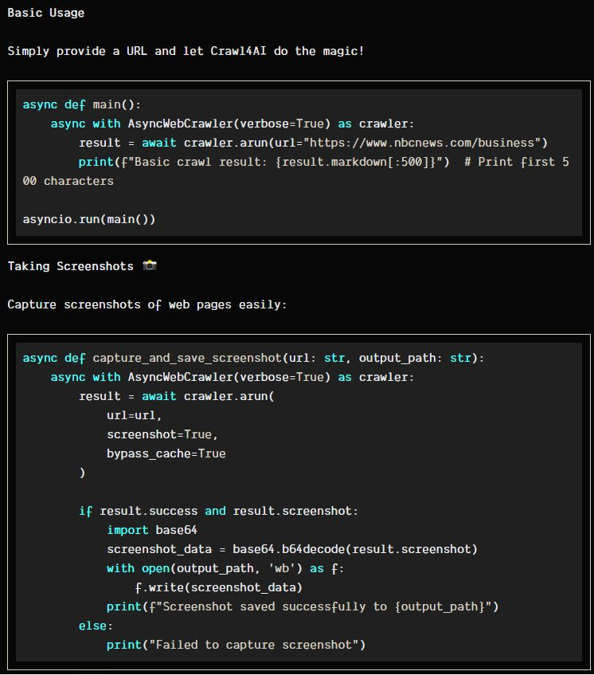
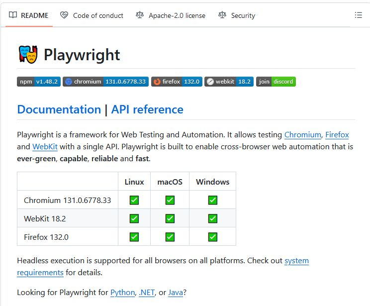
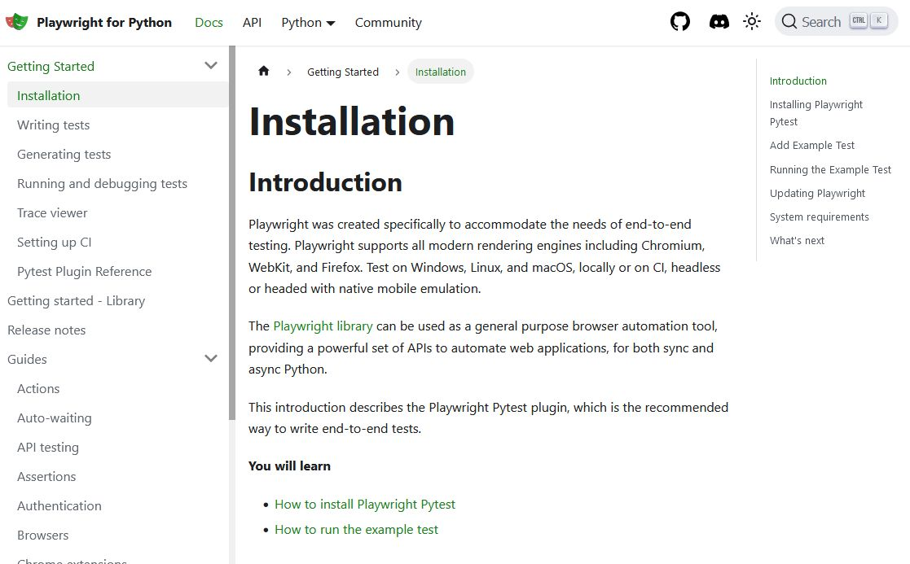
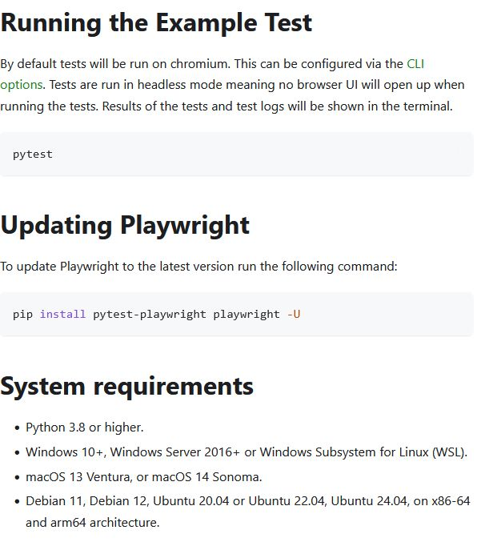
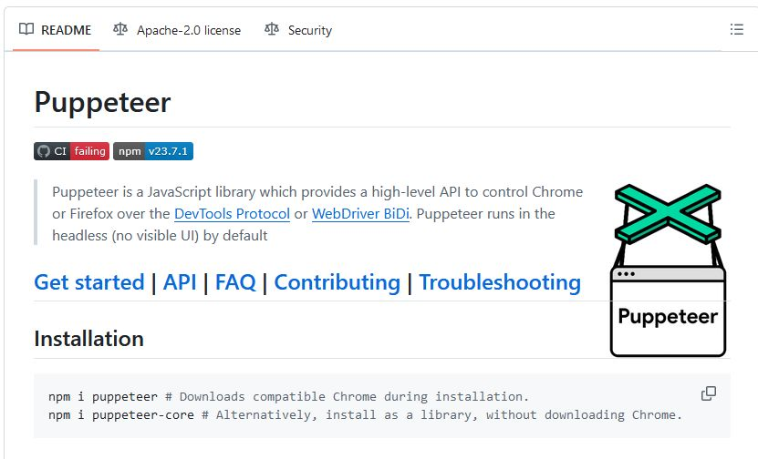
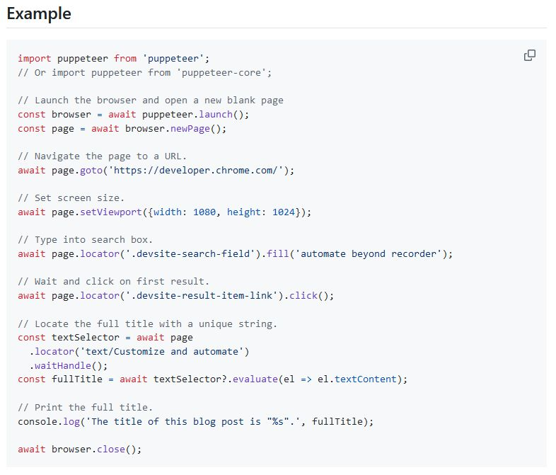
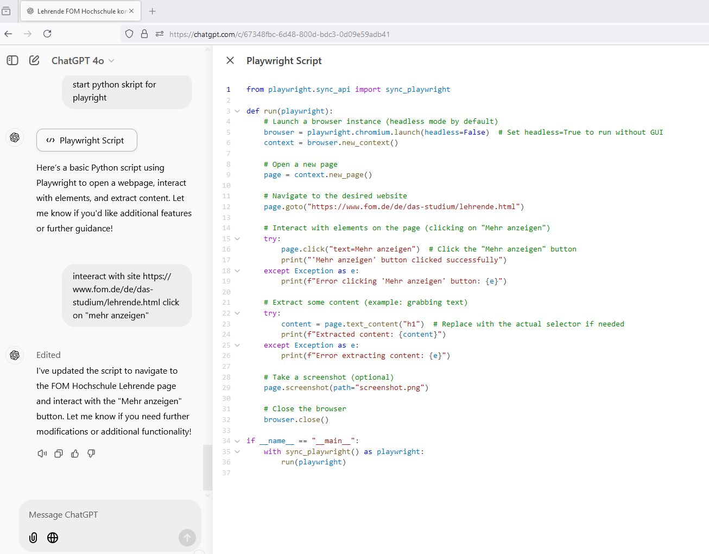
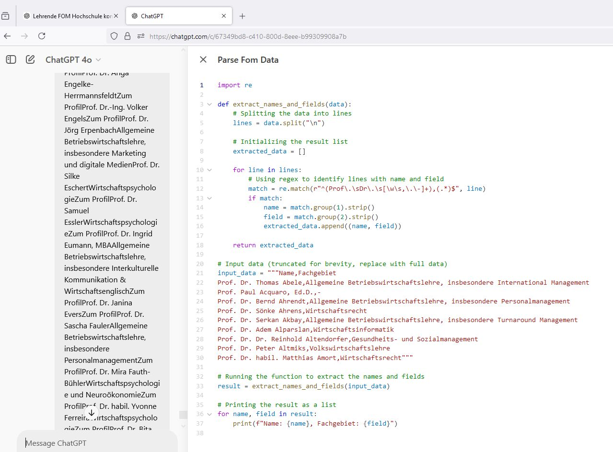

# Advanced Crawler 

## crawl4ai





<https://github.com/unclecode/crawl4ai>

## https://playwright.dev/docs/intro





## https://github.com/puppeteer/puppeteer






## code 


### Version 6B - working 

```
from playwright.sync_api import sync_playwright

import os

from datetime import datetime

  

def run(playwright):

    # Create data directory with timestamp

    timestamp = datetime.now().strftime("%Y-%m-%d_%H-%M-%S")

    data_dir = os.path.join("data", timestamp)

    os.makedirs(data_dir, exist_ok=True)

    # Launch a browser instance (headless mode by default)

    browser = playwright.chromium.launch(headless=False)  # Set headless=True to run without GUI

    context = browser.new_context()

  

    # Open a new page

    page = context.new_page()

  

    # Navigate to the desired website

    page.goto("https://www.fom.de/de/das-studium/lehrende.html")

  

    # Interact with elements on the page (clicking on "Mehr anzeigen" until it no longer appears)

    # or for testing 3 times

    anzTestScapes = 999

    try:

        click_count = 0

        while click_count < anzTestScapes:

            mehr_anzeigen_button = page.query_selector("text=Mehr anzeigen")

            if mehr_anzeigen_button:

                mehr_anzeigen_button.click()

                print(f"'Mehr anzeigen' button clicked successfully ({click_count + 1}/3)")

                page.wait_for_timeout(1000)  # Wait for content to load

                click_count += 1

            else:

                print("No more 'Mehr anzeigen' button visible")

                break

    except Exception as e:

        print(f"Error interacting with 'Mehr anzeigen' button: {e}")

  

    # Extract text from specific div and take a screenshot of it

    try:

        specific_div = page.query_selector("div[data-application='lecturers-overview']")

        if specific_div:

            specific_div_text = specific_div.text_content()

            print("Extracted text from specific div:")

            print(specific_div_text)

  

            # Save text content to a file

            with open(os.path.join(data_dir, "lecturers_overview.txt"), "w", encoding="utf-8") as file:

                file.write(specific_div_text)

            # Take a screenshot of the specific div

            specific_div.screenshot(path=os.path.join(data_dir, "lecturers_overview.png"))

            print("Screenshot of the specific div saved as 'lecturers_overview.png'")

        else:

            print("Specific div not found")

    except Exception as e:

        print(f"Error extracting text or taking screenshot of specific div: {e}")

  

    # Take a full-page screenshot (optional)

    page.screenshot(path="screenshot.png")

  

    # Close the browser

    browser.close()

  

if __name__ == "__main__":

    with sync_playwright() as playwright:

        run(playwright)

```

## Code Text Data Analytics 



## TODO

Here are some notable web crawlers that support interaction with dynamic web elements:

1. **Selenium**: An open-source tool that automates web browsers. Selenium can simulate user interactions like clicking, typing, and navigating through pages, making it suitable for testing web applications and scraping dynamic content.
    
2. **Puppeteer**: Developed by Google, Puppeteer is a Node.js library that provides a high-level API to control headless Chrome or Chromium browsers. It can perform actions such as clicking, form submission, and navigation, facilitating the extraction of content from websites that rely heavily on JavaScript.
    
3. **Scrapy with Splash**: Scrapy is a popular Python framework for web scraping. When combined with Splash, a headless browser designed for rendering JavaScript, Scrapy can handle pages that require interaction, such as clicking buttons to load additional content.
    
4. **Playwright**: A framework for Web Testing and Automation developed by Microsoft. Playwright enables reliable end-to-end testing for modern web apps and supports interactions like clicking, typing, and navigating across multiple pages.
    
5. **Crawl4AI**: An open-source web crawler and scraper designed to be friendly with Large Language Models (LLMs). Crawl4AI supports JavaScript execution and can handle dynamic content by performing actions such as scrolling, clicking, and form interactions


## Links 

<https://crawl4ai.com/mkdocs/basic/installation/>

https://playwright.dev/docs/intro