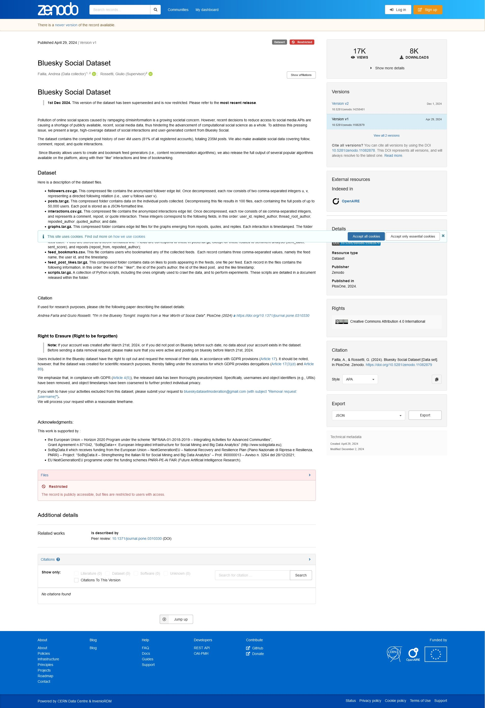

# Bluesky Social Dataset

Pollution of online social spaces caused by rampaging d/misinformation is a growing societal concern. However, recent decisions to reduce access to social media APIs are causing a shortage of publicly available, recent, social media data, thus hindering the advancement of computational social science as a whole. To address this pressing issue, we present a large, high-coverage dataset of social interactions and user-generated content from Bluesky Social.

The dataset contains the complete post history of over 4M users (81% of all registered accounts), totaling 235M posts. We also make available social data covering follow, comment, repost, and quote interactions.

https://zenodo.org/records/11082879