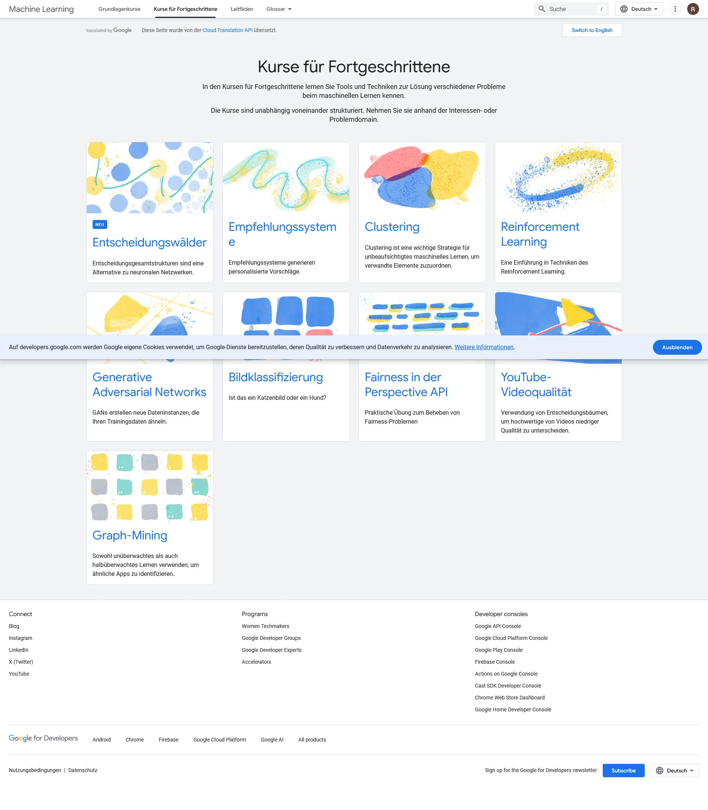
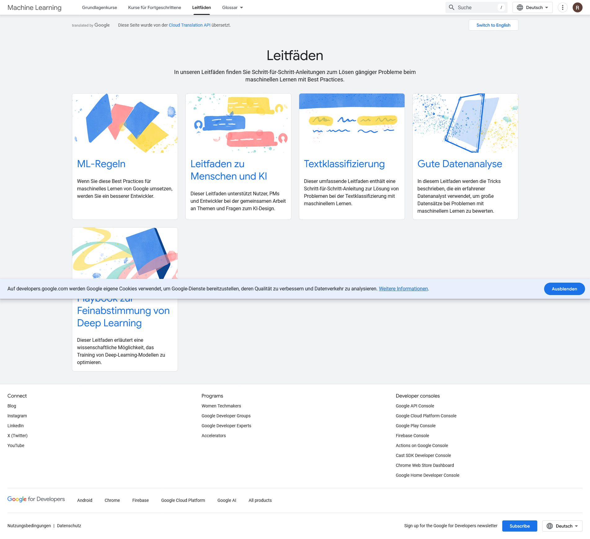

# Best Practices für ML-Entwicklung

Martin Zinkevich

Dieses Dokument richtet sich an Nutzer mit Grundkenntnissen in Maschinenbau. die Best Practices von Google für maschinelles Lernen zu nutzen. Es stellt einen Stil für maschinelles Lernen dar, ähnlich dem Google C++ Style Guide. und andere beliebte Leitfäden zur praktischen Programmierung.

<https://developers.google.com/machine-learning/guides/rules-of-ml?hl=de>