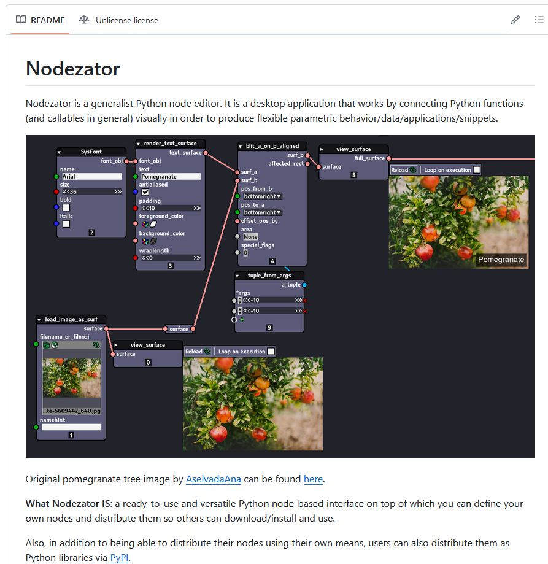
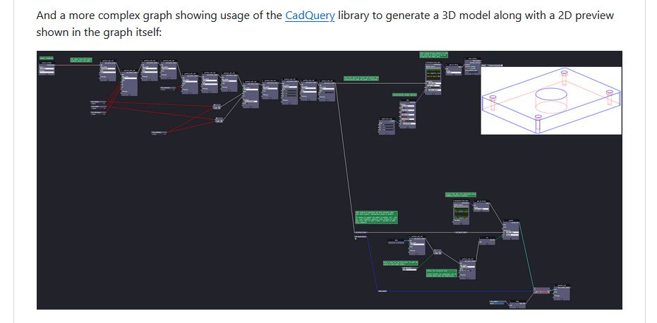

# Nodezator

Nodezator is a generalist Python node editor. It is a desktop application that works by connecting Python functions (and callables in general) visually in order to produce flexible parametric behavior/data/applications/snippets.

## Links

<https://github.com/IndiePython/nodezator>