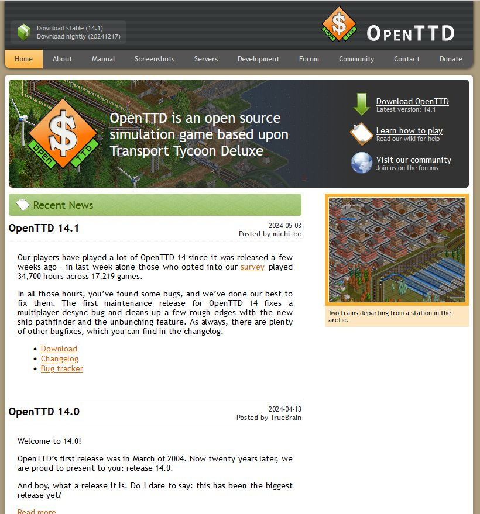

# OpenTTD is an open source simulation game based upon Transport Tycoon Deluxe 

OpenTTD is an open source simulation game based upon the popular Microprose game "Transport Tycoon Deluxe", written by Chris Sawyer. It attempts to mimic the original game as closely as possible while extending it with new features.

OpenTTD is licensed under the GNU General Public License version 2.0. For more information, see the file [COPYING.md](https://raw.githubusercontent.com/OpenTTD/OpenTTD/master/COPYING.md) included with every release and source download of the game.

<https://www.openttd.org/>

