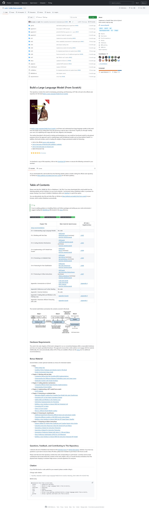

# dyi

https://github.com/codecrafters-io/build-your-own-x

https://github.com/practical-tutorials/project-based-learning#python

https://github.com/EbookFoundation/free-programming-books

https://github.com/microsoft/generative-ai-for-beginners

## apis

https://github.com/public-apis/public-apis
## learn

https://github.com/donnemartin/system-design-primer

https://github.com/Pythagora-io/gpt-pilot

https://github.com/langgenius/dify

https://github.com/cloudcommunity/Free-Certifications

https://github.com/ossu/computer-science

https://github.com/TheAlgorithms/Python

https://github.com/roboflow/supervision

https://github.com/Stirling-Tools/Stirling-PDF
### Build a Large Language Model (From Scratch)

https://github.com/rasbt/LLMs-from-scratch
