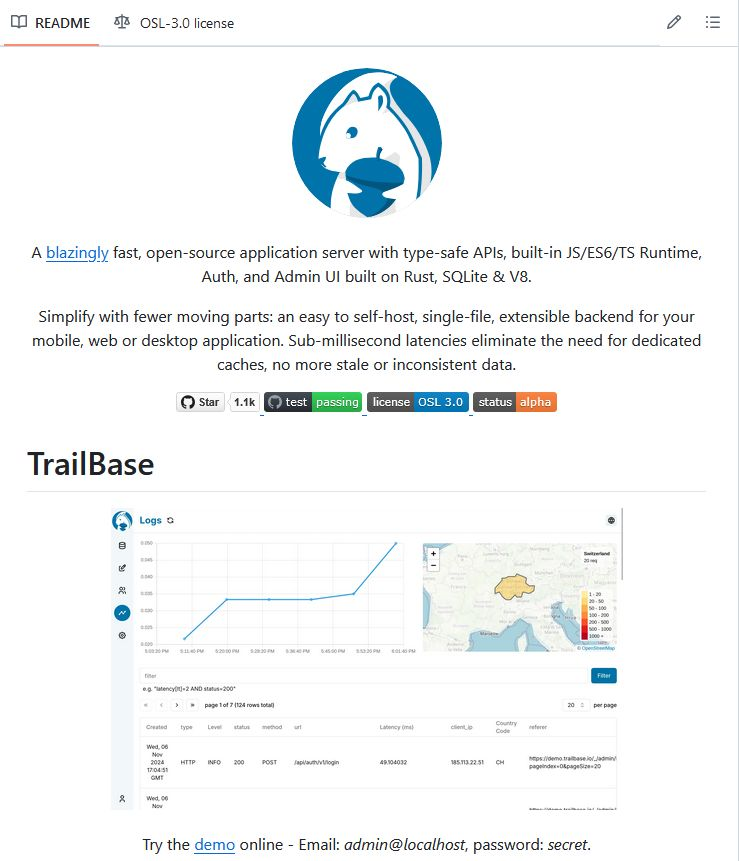

# Application server with type-safe APIs, Auth, and Admin UI built on

A [blazingly](https://trailbase.io/reference/benchmarks/) fast, open-source application server with type-safe APIs, built-in JS/ES6/TS Runtime, Auth, and Admin UI built on Rust, SQLite & V8.

Simplify with fewer moving parts: an easy to self-host, single-file, extensible backend for your mobile, web or desktop application. Sub-millisecond latencies eliminate the need for dedicated caches, no more stale or inconsistent data.

https://github.com/trailbaseio/trailbase