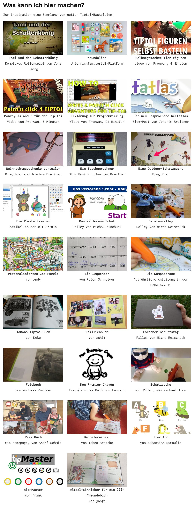

# TipToi pen reverse engineer
The goal of this project is to understand the file and paper format for the Ravensburger TipToi pen. The ultimate goal is that everyone can create their own books, with their own sounds.

# tttool

Das Schweizer Taschenmesser für den Tiptoi-Bastler

Diese Seite enthält Information zum `tttool`, einem Werkzeug zum Analysieren und Erstellen von GME-Dateien für den Tiptoi-Stift von Ravensburger. Damit kann man Tiptoi-Produkte umprogrammieren und eigene Produkte erstellen.

## Links 

<https://github.com/entropia/tip-toi-reveng>

<http://tttool.entropia.de/>

tiptoi hacking und “Systemanforderungen”
https://blogs.fsfe.org/guido/2014/05/tiptoi-hacking-und-systemanforderungen/