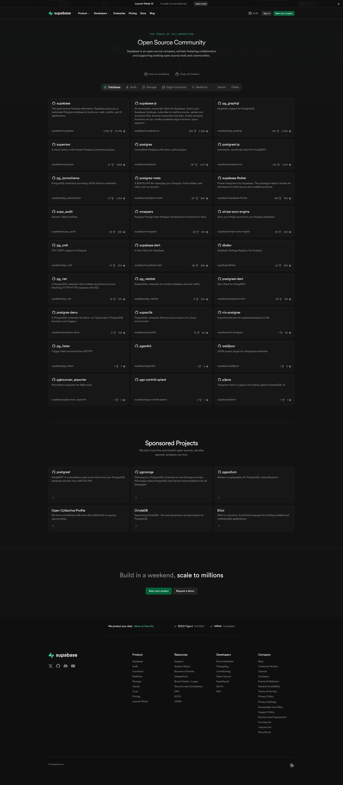

# Trailbase
A blazingly fast, single-file, open-source application server with type-safe APIs, Auth, and Admin UI built on

## PocketBase
[PocketBase](https://pocketbase.io) is an open source Go backend that includes:

- embedded database (_SQLite_) with **realtime subscriptions**
- built-in **files and users management**
- convenient **Admin dashboard UI**
- and simple **REST-ish API**

## Supabase

Supabase is an open source Firebase alternative.  
Start your project with a Postgres database, Authentication, instant APIs, Edge Functions, Realtime subscriptions, Storage, and Vector embeddings.

## Link

<https://github.com/trailbaseio/trailbase>

<https://github.com/pocketbase/pocketbase>

<https://supabase.com/>
