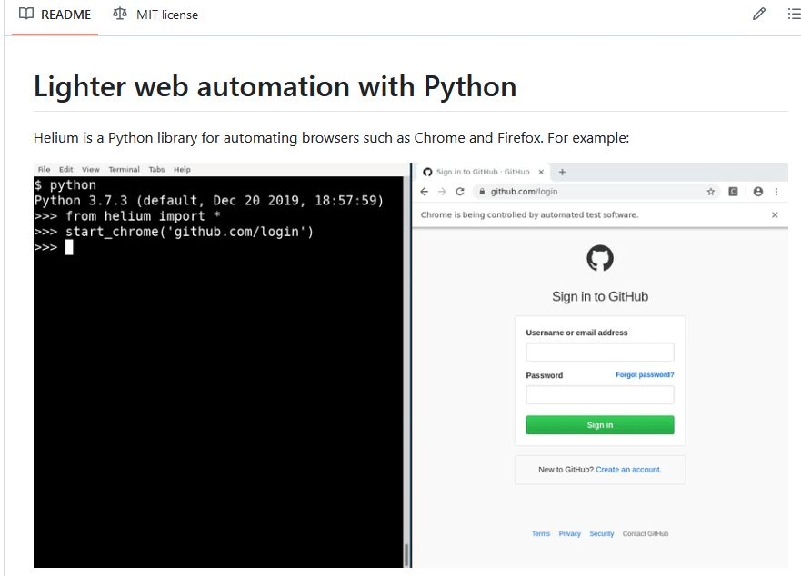
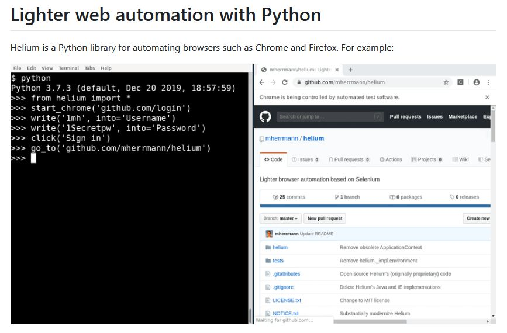
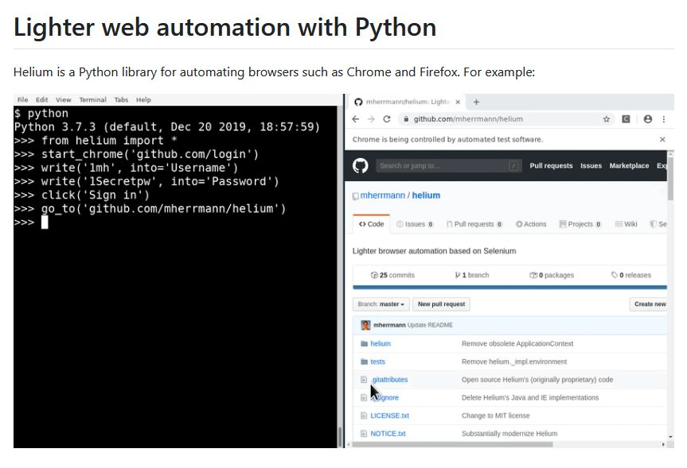

# Helium web automation with Python 

Lighter web automation with Python. Helium is a Python library for automating browsers such as Chrome and Firefox. To get started with Helium, you need Python 3 and Chrome or Firefox.

## Links
<https://github.com/mherrmann/helium>