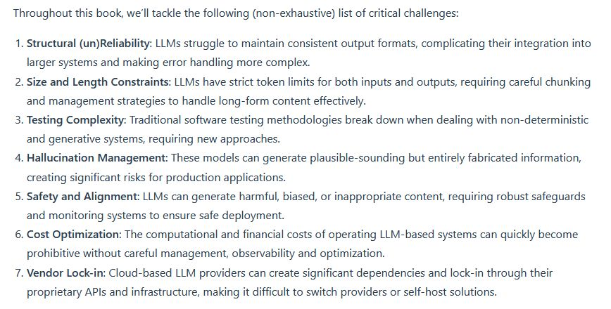
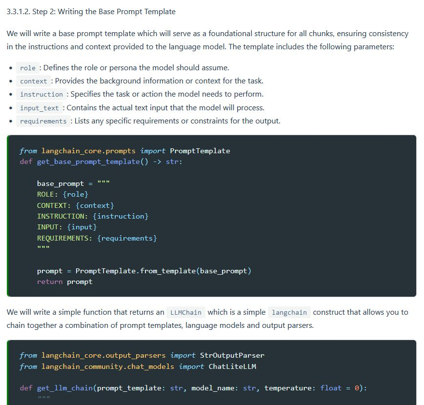

# Taming LLMs

A Practical Guide to LLM Pitfalls with Open Source Software
Abstract: The current discourse around Large Language Models (LLMs) tends to focus heavily on their capabilities while glossing over fundamental challenges. Conversely, this book takes a critical look at the key limitations and implementation pitfalls that engineers and technical product managers encounter when building LLM-powered applications. Through practical Python examples and proven open source solutions, it provides an introductory yet comprehensive guide for navigating these challenges. The focus is on concrete problems - from handling unstructured output to managing context windows - with reproducible code examples and battle-tested open source tools. By understanding these pitfalls upfront, readers will be better equipped to build products that harness the power of LLMs while sidestepping their inherent limitations.

<https://github.com/souzatharsis/tamingLLMs>

<https://www.souzatharsis.com/tamingLLMs/markdown/preface.html>