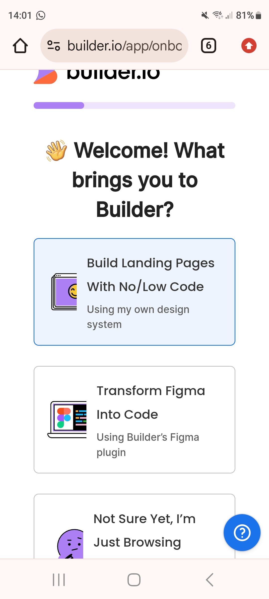

# Landingpages Generators Frameworks
## 1 Tailwind CSS templates 

Tailwind CSS templates for your next project
Landing pages, websites, and dashboards built on top of Tailwind CSS and fully coded in HTML, React, Next.js, and Vue. A great starting point for your next project, saving you weeks of development time.

https://cruip.com/

## 2 A landing page template.

https://github.com/adamlaz/temp-Ava

## 3 The Best Landing Page Design Inspiration, Learn Design And More

https://www.lapa.ninja/

## 4 The Most Entertaining Guide to Landing Page Optimization You'll Ever Read

https://moz.com/blog/most-entertaining-guide-to-landing-page-optimization
## 5 Choose from over 100 high-converting landing page, popup, and sticky bar templates

https://unbounce.com/landing-page-templates/

## 6 Free Drag-and-Drop Website Builder
https://www.hubspot.com/products/cms/drag-and-drop-website-builder
## 7   https://www.landingfolio.com/
## 8 Webflow

Your site should do more than look good
As the first-ever website experience platform, Webflow lets marketers, designers, and developers come together to build, manage, and optimize web experiences that get results.

##  FreeCodeCamp.com Responsive Web Design Certification Project - "Build A Product Landing Page"

https://webflow.com/
https://github.com/FreeCodeCamp-Solutions/Product-Landing-Page
## jimdo
Erstelle mühelos
eine ansprechende,
professionelle Website,
die beeindruckt.
https://landing.jimdo.com/professionelle-website-2
##  Die 14 besten Landing-Page-Builder im Überblick

https://blog.hubspot.de/website/landing-page-builder

HubSpot
Landingi
OptimizePress
GetResponse
Mailchimp
Brevo
Unbounce
Instapage
Squarespace
Leadpages
LanderLab
LaunchRock
ShortStack
PageFly
## wix 

https://de.wix.com/website/templates/html/one-page/landing-pages

https://de.wix.com/website/templates/html/one-page

https://de.wix.com/website/templates/html/one-page/2

BizBud
https://de.wix.com/website/templates/html/most-popular
## zoho 
Unlock success with our landing page builder
Say goodbye to design and development hassles, and embrace effortless drag-and-drop landing page building with our robust, no-code landing page builder.

https://www.zoho.com/landingpage/landing-page-builder.html
## The 7 best landing page builders in 2024
Choose the right landing page website for your business.

https://zapier.com/blog/best-landing-page-builders/
Carrd for making free landing pages

ConvertKit for driving email newsletter signups

Zapier Interfaces for automation

Instapage for businesses with a budget

Swipe Pages for mobile-first landing pages

Leadpages for selling products on a landing page

Landingi for small businesses without a budget

https://zapier.com/blog/best-landing-page-builders/

## soloist.ai 

