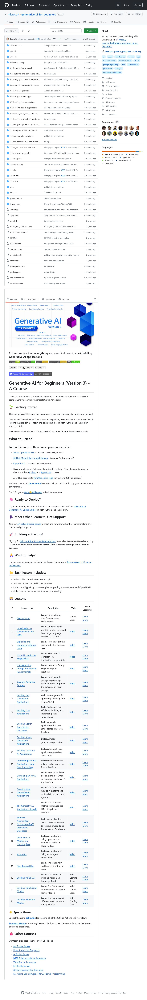
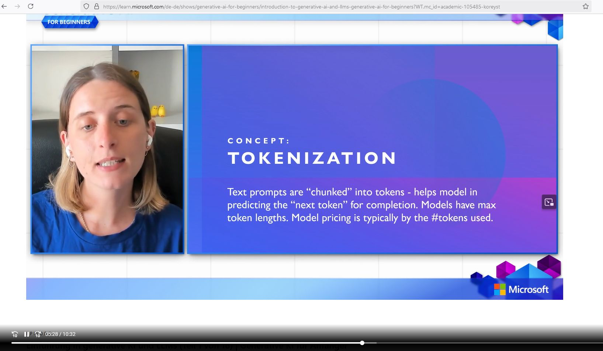
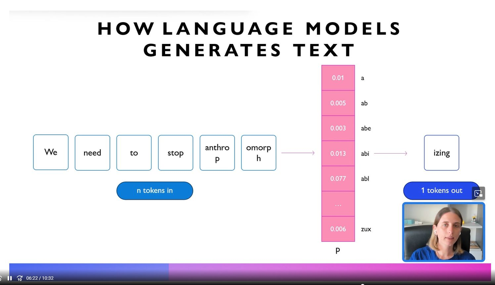

# # Generative AI for Beginners (Version 3) - A Course
### 21 Lessons teaching everything you need to know to start building Generative AI applications

## Video 

## Links 

https://github.com/microsoft/generative-ai-for-beginners
