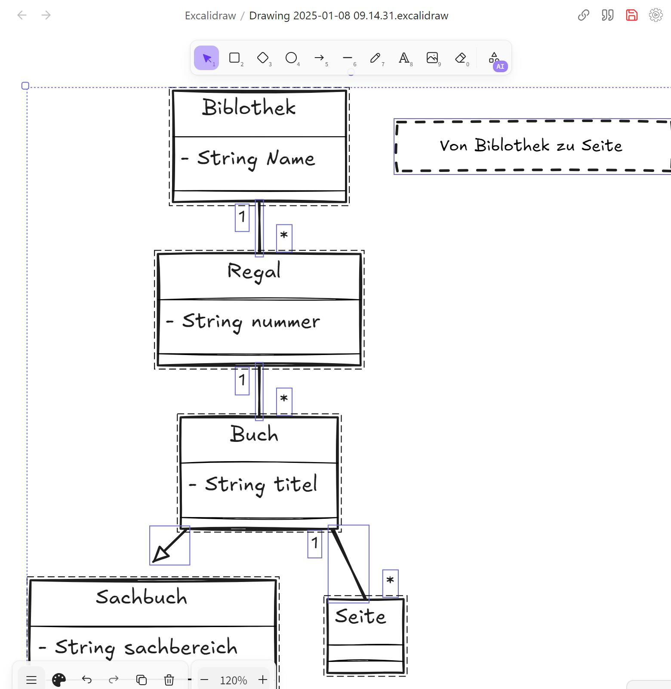

# 

``` Mermaid 
classDiagram
    note "Von Biblothek zu Seite "
Buch --|> Sachbuch 
Regal "1"--"*" Buch
Biblothek "1"--"*" Regal
Buch "1"-- "*" Seite 
class Buch {
- String titel 
}
class Regal{
- String nummer
}
class Biblothek {
- String Name
}
class Sachbuch {
- String sachbereich
}
class Seite
```





