# Email Spam

## Email 

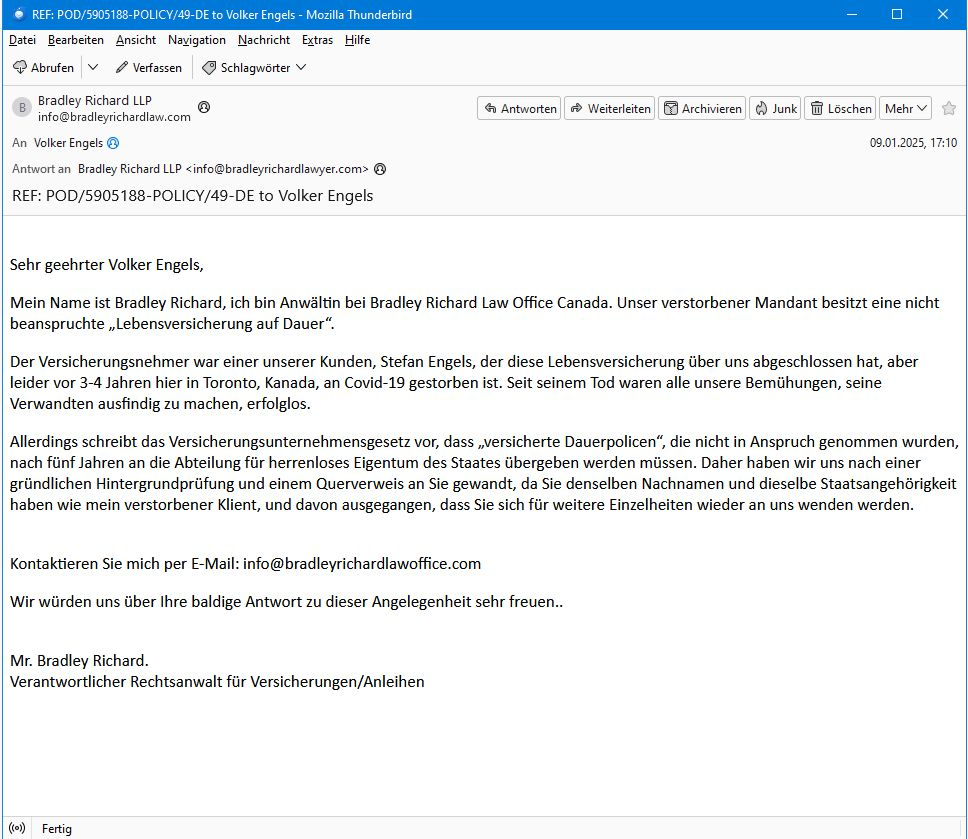

## Analyse Mail 3 Verschiedene Emails 

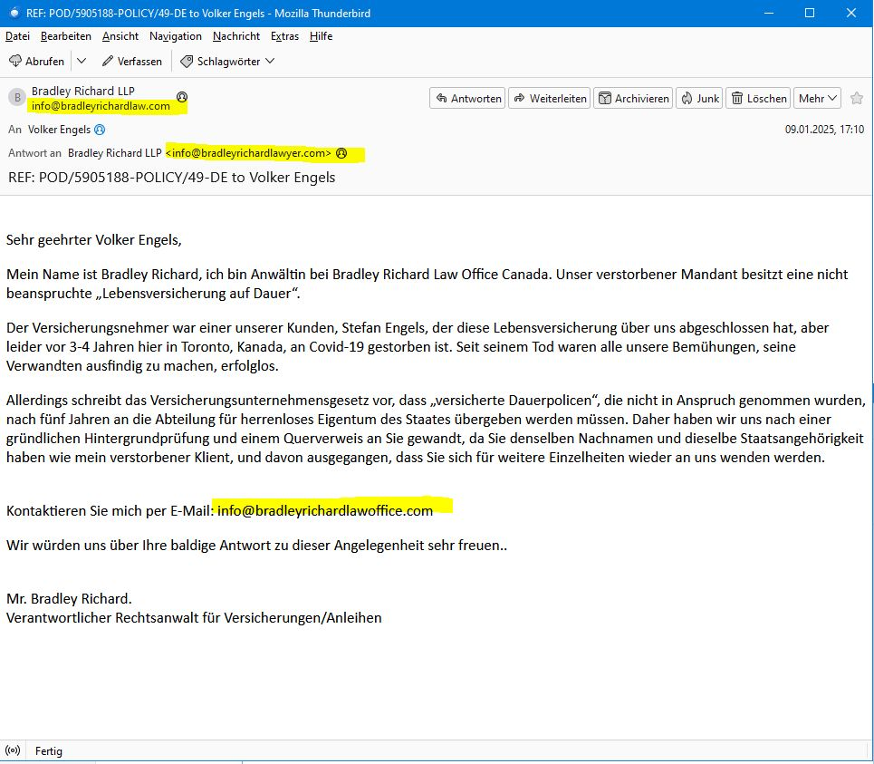

### Domain 1
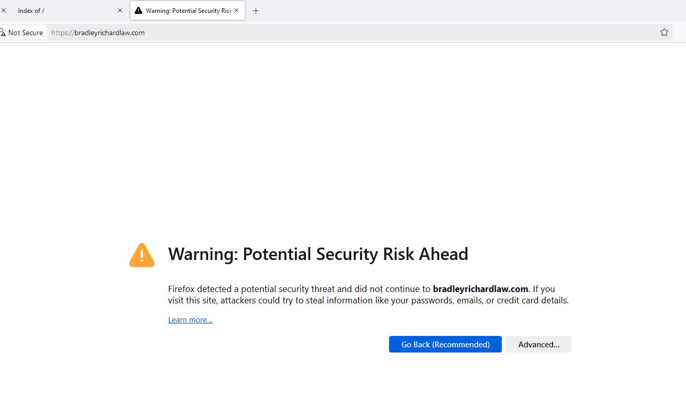

### Domain 2

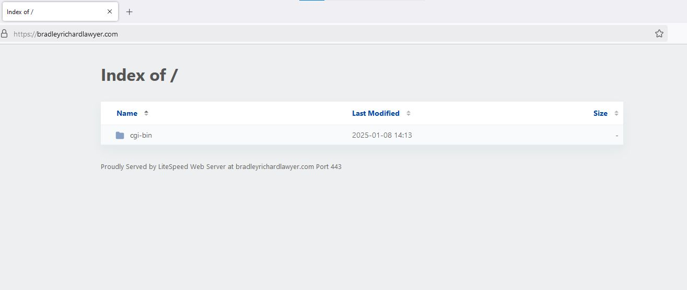

### Domain 3 

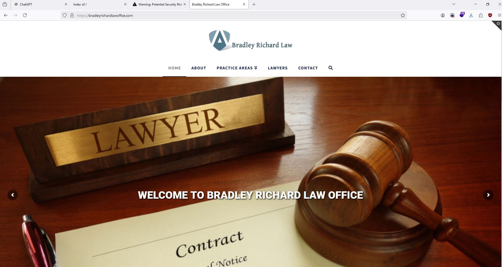

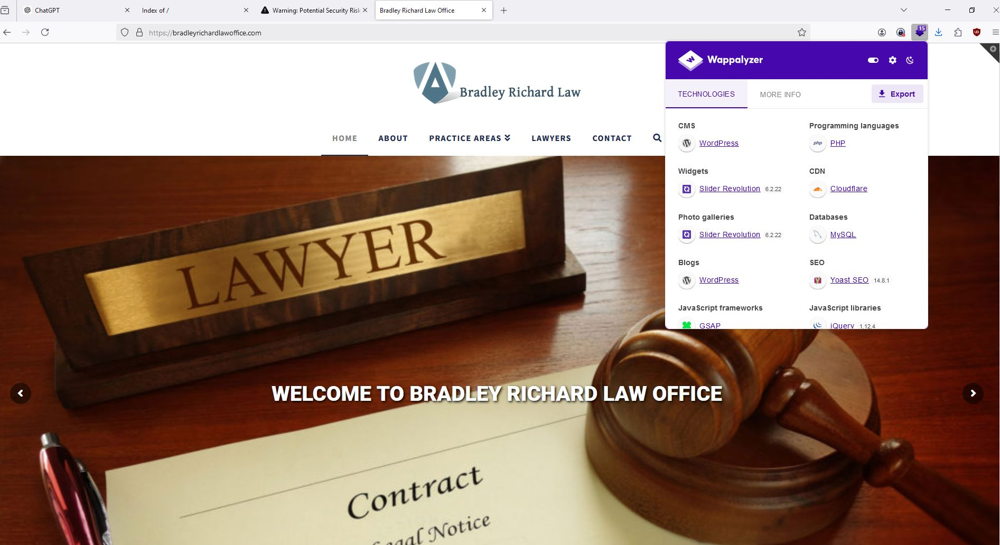

## chatgpt Analyse 
### Frage

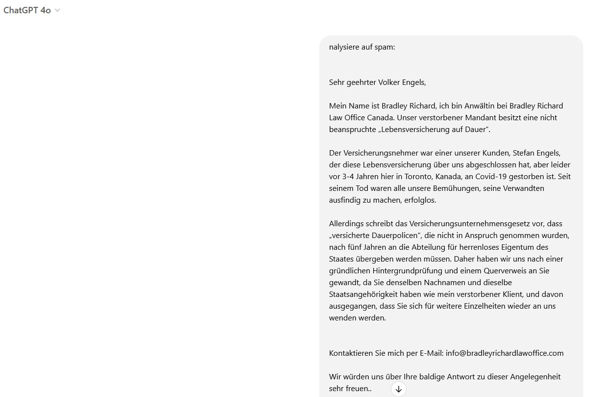

### Antwort 
Der Text ist ein typisches Beispiel für eine **Phishing-E-Mail** oder einen **Betrugsversuch**, der darauf abzielt, den Empfänger zu täuschen und sensible Informationen oder Geld zu erlangen. Im Folgenden eine Analyse der Merkmale, die auf einen Spam- oder Betrugsversuch hindeuten:

---

### **Merkmale und Analyse:**

1. **Unpersönliche Ansprache:**
    
    - Die E-Mail beginnt mit "Sehr geehrter Volker Engels", was korrekt personalisiert erscheint, jedoch ist dies häufig ein Trick, um Glaubwürdigkeit zu erzeugen.
    - Es wird suggeriert, dass eine Verbindung zum Verstorbenen besteht, weil der Empfänger denselben Nachnamen hat. Dies ist jedoch eine allgemeine Taktik, die beliebig angepasst werden kann.
2. **Unglaubwürdige Geschichte:**
    
    - Die Erzählung von einer "nicht beanspruchten Lebensversicherung" mit einem großen finanziellen Wert ist ein häufiger Aufhänger für Betrugsmails.
    - Die Behauptung, dass die Bemühungen, andere Verwandte zu kontaktieren, erfolglos waren, soll den Empfänger in Zugzwang bringen.
3. **Fehlende konkrete Informationen:**
    
    - Es fehlen überprüfbare Details, wie:
        - Der genaue Betrag der Lebensversicherung.
        - Die genaue Identität des Verstorbenen oder Dokumente, die die Verbindung belegen.
    - Dies soll den Empfänger dazu verleiten, Kontakt aufzunehmen, um mehr zu erfahren.
4. **Druck durch Zeitrahmen:**
    
    - Es wird erwähnt, dass das Vermögen bald an den Staat übertragen wird. Dies erzeugt künstlichen Druck, schnell zu handeln, ohne die Echtheit zu prüfen.
5. **Fragwürdige Absenderinformationen:**
    
    - Der Absendername "Bradley Richard" und die E-Mail-Adresse wirken zwar professionell, könnten jedoch leicht gefälscht sein.
    - Eine kurze Websuche nach der Kanzlei oder der angegebenen E-Mail-Adresse würde wahrscheinlich ergeben, dass sie nicht existieren oder Teil eines Betrugsnetzwerks ist.
6. **Grammatik- und Stilfehler:**
    
    - Obwohl die Nachricht auf den ersten Blick professionell klingt, gibt es grammatikalische Ungenauigkeiten, die auf eine automatische Übersetzung hinweisen könnten:
        - „An Covid-19 gestorben ist“ (ungeschickte Formulierung).
        - „Versicherte Dauerpolicen“ ist kein gebräuchlicher Begriff.
    - Professionelle Anwaltskanzleien würden solche Fehler vermeiden.
7. **Unübliche Kommunikationsweise:**
    
    - Seriöse Kanzleien würden nicht ohne vorherigen Kontakt oder Legitimation solche sensiblen Informationen per E-Mail verschicken.
    - In der Regel gibt es rechtliche Verfahren, die eingehalten werden müssen, bevor man Erben kontaktiert.
8. **Aufforderung zur Kontaktaufnahme:**
    
    - Die E-Mail drängt den Empfänger, sich unter der angegebenen Adresse zu melden. Dies dient dazu, weitere Informationen oder Geld zu erschleichen.

---

### **Risiken:**

- **Identitätsdiebstahl:** Bei einer Antwort könnten persönliche Daten abgefragt werden.
- **Finanzielle Verluste:** Es könnte eine Vorauszahlung für angebliche Gebühren oder Dokumente verlangt werden.
- **Malware:** Eine Antwort könnte zu weiteren Phishing-Versuchen oder Malware-Angriffen führen.

---

### **Empfohlene Maßnahmen:**

1. **Nicht antworten.**
2. **E-Mail-Adresse blockieren.**
3. **Als Spam markieren.**
4. **Websuche nach „Bradley Richard Law Office“ durchführen** – mit hoher Wahrscheinlichkeit handelt es sich um eine nicht existierende Kanzlei.
5. **Offizielle Behörden oder Rechtsberater kontaktieren**, falls Unsicherheiten bestehen.
6. **Warnung an andere weiterleiten**, um vor dieser Betrugstaktik zu schützen.

---

Dieser Spam-Text nutzt klassische psychologische Tricks, um den Empfänger zu manipulieren. Misstrauen ist hier die beste Reaktion.

## Perplexity 

### Antwort 
Diese Nachricht weist deutliche Anzeichen eines Betrugsversuchs auf:

1. Unaufgeforderte Kontaktaufnahme bezüglich einer angeblichen Erbschaft[1].
2. Behauptung einer Verwandtschaft basierend nur auf einem gemeinsamen Nachnamen[1].
3. Drängen auf schnelle Antwort und Kontaktaufnahme per E-Mail[1].
4. Vage Details zum angeblichen Verstorbenen und zur Versicherungspolice[1].
5. Verwendung von Druck und Zeitdruck ("nach fünf Jahren an die Abteilung für herrenloses Eigentum")[1].
6. Fehlerhafte oder ungewöhnliche Formulierungen (z.B. "Anwältin" vs. "Mr." Bradley Richard)[1].
7. Verwendung einer generischen E-Mail-Adresse statt einer offiziellen Kanzlei-Adresse[1].

Diese Merkmale sind typisch für sogenannte "Vorschussbetrug" oder "Erbschaftsbetrug" Schemata. Der Absender versucht wahrscheinlich, persönliche oder finanzielle Informationen zu erlangen oder Vorauszahlungen für nicht existierende Dienstleistungen zu erhalten. Es wird dringend empfohlen, nicht auf diese Nachricht zu reagieren und sie als Spam zu behandeln.

Citations:
[1] https://www.mawista.com/blog/reise-urlaub/auswandern-kanada/
[2] https://www.rippling.com/de-DE/blog/ip-ownership-in-canada
[3] https://huggingface.co/stefan-it/electra-base-gc4-64k-900000-cased-discriminator/resolve/main/vocab.txt?download=true
[4] https://www.deutsche-rentenversicherung.de/SharedDocs/Downloads/DE/Broschueren/international/weitere_abkommen/15_arbeiten_deutschland_kanada.pdf?__blob=publicationFile&v=1
[5] https://dserver.bundestag.de/btd/09/017/0901729.pdf
[6] https://huggingface.co/jhu-clsp/bibert-ende/raw/refs%2Fpr%2F1/vocab.txt
[7] https://www.stc-makler.de/blog/privat/vorsorge/uebertragung-altersvorsorge-kanada/
[8] https://biblioscout.net/book/chapter/10.33196/9783704672346/00054
[9] https://www.passportcard.de/laender/kanada/

## Claude 

### Q
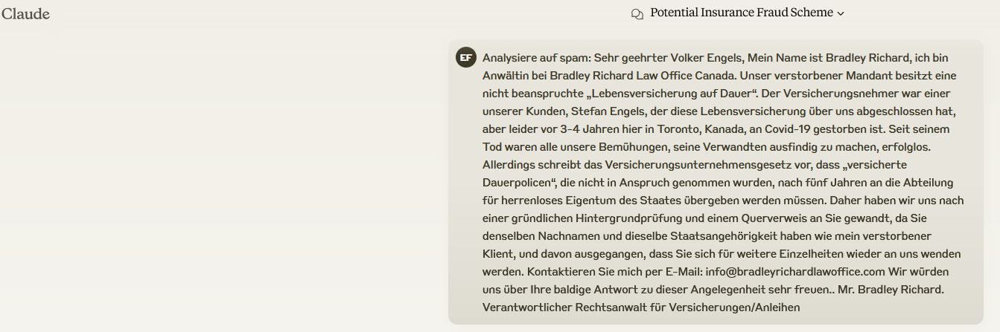

### A

Ich analysiere diese E-Mail auf typische Spam- und Betrugsmerkmale:

🚩 Eindeutige Betrugsmerkmale:

1. Erbschafts-/Versicherungsbetrug Schema: Der Absender behauptet, eine nicht beanspruchte Versicherungspolice eines angeblich verstorbenen Verwandten gefunden zu haben.

2. Dringende Zeitkomponente: Erwähnung einer 5-Jahres-Frist, um Handlungsdruck aufzubauen.

3. Sprachliche Unstimmigkeiten:
- Der Absender stellt sich als "Bradley Richard" vor und bezeichnet sich als "Anwältin" (falsches Geschlecht)
- Verwendung von deutschen Anführungszeichen gemischt mit englischen Begriffen
- Ungewöhnliche Formulierungen für einen professionellen Anwalt

4. Verdächtige Kontaktdetails:
- Generic E-Mail-Adresse, die nicht zu einer seriösen Anwaltskanzlei passt
- Keine vollständige Kanzleiadresse oder Telefonnummer angegeben

5. Vage Details:
- Ungenaues Todesdatum ("vor 3-4 Jahren")
- Keine spezifischen Details zur Versicherungspolice
- Oberflächliche "Verbindung" nur basierend auf gleichem Nachnamen

Fazit: Dies ist mit Sicherheit eine betrügerische E-Mail. Das Ziel ist vermutlich, den Empfänger zu kontaktieren und dann Vorauszahlungen für nicht existierende Versicherungsleistungen zu erschleichen. Solche E-Mails sollten ignoriert und als Spam markiert werden. Seriöse Anwaltskanzleien oder Versicherungen würden nie auf diese Weise potenzielle Erben kontaktieren.

Empfehlung: Diese E-Mail sofort löschen und keinesfalls auf sie antworten oder persönliche Daten preisgeben.

## Gemini

### W
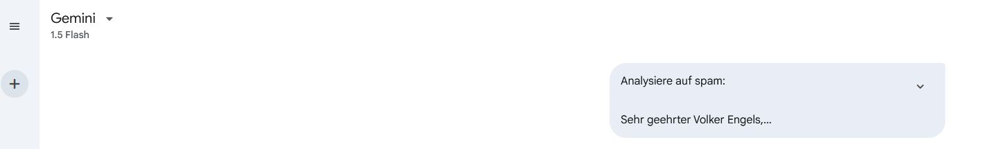

### A
## Analyse der E-Mail auf Spam-Merkmale

**Die E-Mail weist mehrere Merkmale auf, die auf einen möglichen Spam-Versuch hindeuten:**

- **Unpersönliche Anrede:** Die Anrede mit dem Nachnamen, aber ohne persönliche Ansprache, ist typisch für Massenmails.
- **Unerwartete Nachricht:** Die Nachricht über eine nicht beanspruchte Lebensversicherung eines vermeintlichen Verwandten kommt in der Regel unerwartet und ist nicht Teil einer bestehenden Beziehung.
- **Dringlichkeit:** Die Erwähnung der bevorstehenden Übergabe an die Abteilung für herrenloses Eigentum soll Druck erzeugen, schnell zu reagieren.
- **Unbekannte Absender:** Die Kanzlei und der Absender sind unbekannt und nicht leicht verifizierbar.
- **Auffällige Rechtschreibung und Grammatik:** Obwohl die E-Mail größtenteils korrekt geschrieben ist, können kleinere Ungenauigkeiten auf eine automatisierte Übersetzung oder eine schnelle Erstellung hindeuten.
- **Aufforderung zur Kontaktaufnahme über eine generische E-Mail-Adresse:** Eine persönliche E-Mail-Adresse wäre für eine individuelle Kontaktaufnahme üblicher.
- **Fehlen konkreter Details:** Es werden keine konkreten Angaben zur Versicherungssumme, zum Versicherungsanbieter oder zu den genauen Umständen des Todes gemacht.

**Mögliche Absichten des Absenders:**

- **Phishing:** Der Absender könnte versuchen, persönliche Daten wie Bankverbindungen oder Passwörter zu erlangen, um diese für betrügerische Zwecke zu missbrauchen.
- **Erpressung:** In seltenen Fällen kann es vorkommen, dass Betrüger versuchen, Geld für die Herausgabe eines vermeintlichen Erbes zu erpressen.

**Empfehlungen:**

- **Nicht antworten:** Antworten Sie in keinem Fall auf die E-Mail und klicken Sie auf keine darin enthaltenen Links.
- **E-Mail löschen:** Löschen Sie die E-Mail sofort und markieren Sie sie gegebenenfalls als Spam.
- **Selbstständig recherchieren:** Wenn Sie sich dennoch für die Angelegenheit interessieren, versuchen Sie, die Informationen selbstständig zu überprüfen. Kontaktieren Sie beispielsweise direkt die im Brief erwähnte Kanzlei über eine öffentlich zugängliche Telefonnummer oder suchen Sie nach Bewertungen im Internet.
- **Vorsicht bei unerwarteten Nachrichten:** Seien Sie generell vorsichtig bei unerwarteten Nachrichten, die finanzielle Vorteile versprechen oder dringende Handlungen erfordern.

**Fazit:**

Die vorliegende E-Mail weist zahlreiche Merkmale auf, die auf einen möglichen Betrugsversuch hindeuten. Es ist daher dringend davon abzuraten, auf diese Nachricht zu reagieren.

**Hinweis:** Diese Analyse dient lediglich der allgemeinen Information und ersetzt keine professionelle Rechtsberatung.

**Möchten Sie weitere Informationen zu diesem Thema oder zu ähnlichen Betrugsmaschen?**

## Llama 3 Instruct 

### Q
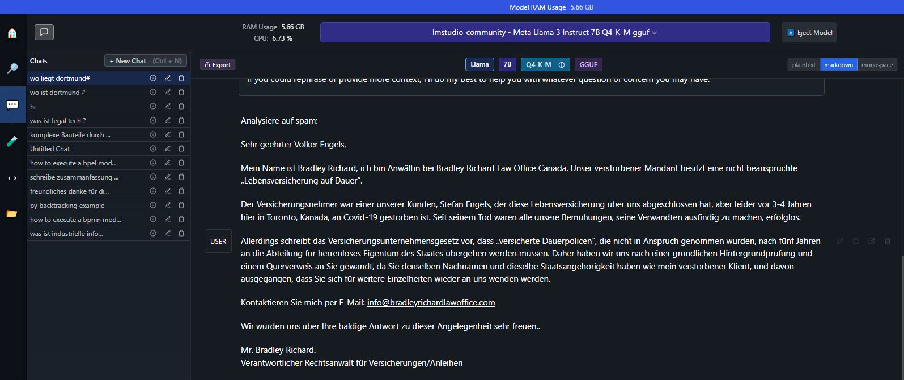

### A

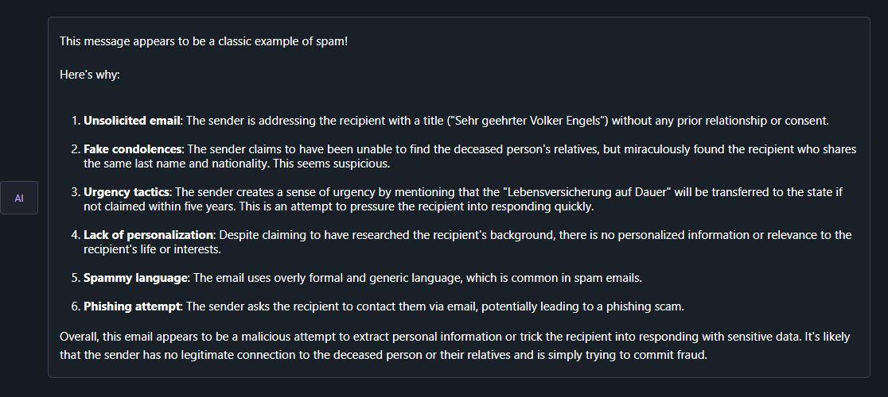

