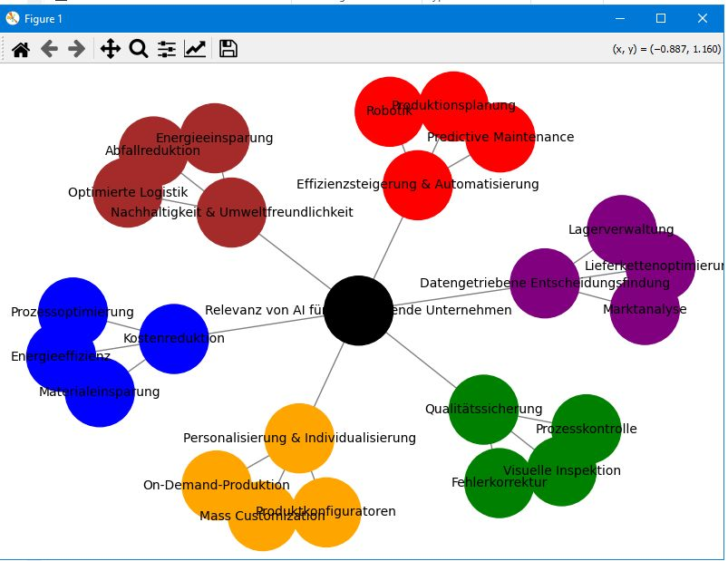
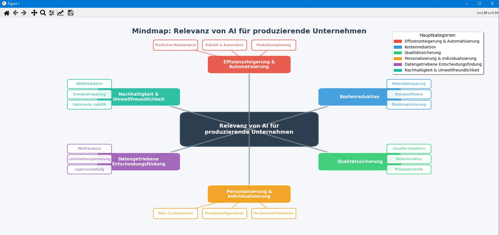

# mindmap-matplaotlib-diy


## Python code 

```python 
import matplotlib.pyplot as plt

import networkx as nx

  

# Erstellen des Graphen

G = nx.Graph()

  

# Zentrales Thema

central_node = "Relevanz von AI für produzierende Unternehmen"

G.add_node(central_node)

  

# Hauptkategorien

categories = {

    "Effizienzsteigerung & Automatisierung": ["Predictive Maintenance", "Robotik", "Produktionsplanung"],

    "Kostenreduktion": ["Materialeinsparung", "Energieeffizienz", "Prozessoptimierung"],

    "Qualitätssicherung": ["Visuelle Inspektion", "Fehlerkorrektur", "Prozesskontrolle"],

    "Personalisierung & Individualisierung": ["Mass Customization", "Produktkonfiguratoren", "On-Demand-Produktion"],

    "Datengetriebene Entscheidungsfindung": ["Marktanalyse", "Lieferkettenoptimierung", "Lagerverwaltung"],

    "Nachhaltigkeit & Umweltfreundlichkeit": ["Abfallreduktion", "Energieeinsparung", "Optimierte Logistik"]

}

  

# Farben für jeden Ast

colors = {

    "Effizienzsteigerung & Automatisierung": "red",

    "Kostenreduktion": "blue",

    "Qualitätssicherung": "green",

    "Personalisierung & Individualisierung": "orange",

    "Datengetriebene Entscheidungsfindung": "purple",

    "Nachhaltigkeit & Umweltfreundlichkeit": "brown"

}

  

# Knoten und Kanten hinzufügen

edges = []

node_colors = {}

node_colors[central_node] = "black"

  

for category, subnodes in categories.items():

    G.add_edge(central_node, category)

    node_colors[category] = colors[category]

    for subnode in subnodes:

        G.add_edge(category, subnode)

        node_colors[subnode] = colors[category]

  

# Layout für die Mindmap

plt.figure(figsize=(12, 8))

pos = nx.spring_layout(G, seed=42)

  

# Knotenfarben zuordnen

color_values = [node_colors[node] for node in G.nodes()]

  

# Zeichnen des Graphen

nx.draw(G, pos, with_labels=True, node_size=3000, node_color=color_values, font_size=10, edge_color="gray")

  

# Titel setzen

plt.title("Mindmap: Relevanz von AI für produzierende Unternehmen")

plt.show()
```

## Code Agent 

```
mache die anzeige der mindmap schöner , die texte sollen sich nicht überschneiden

```


## Ergebins



mm_verbessert.py

```python 
import matplotlib.pyplot as plt

import networkx as nx

import numpy as np

from matplotlib.patches import FancyBboxPatch

  

# Erstellen des Graphen

G = nx.Graph()

  

# Zentrales Thema

central_node = "Relevanz von AI für\nproduzierende\nUnternehmen"

G.add_node(central_node)

  

# Hauptkategorien mit kürzeren Namen für bessere Darstellung

categories = {

    "Effizienzsteigerung &\nAutomatisierung": ["Predictive\nMaintenance", "Robotik", "Produktions-\nplanung"],

    "Kosten-\nreduktion": ["Material-\neinsparung", "Energie-\neffizienz", "Prozess-\noptimierung"],

    "Qualitäts-\nsicherung": ["Visuelle\nInspektion", "Fehler-\nkorrektur", "Prozess-\nkontrolle"],

    "Personalisierung &\nIndividualisierung": ["Mass\nCustomization", "Produkt-\nkonfiguratoren", "On-Demand-\nProduktion"],

    "Datengetriebene\nEntscheidungsfindung": ["Markt-\nanalyse", "Lieferketten-\noptimierung", "Lager-\nverwaltung"],

    "Nachhaltigkeit &\nUmweltfreundlichkeit": ["Abfall-\nreduktion", "Energie-\neinsparung", "Optimierte\nLogistik"]

}

  

# Modernere Farbpalette mit besseren Kontrasten

colors = {

    "Effizienzsteigerung &\nAutomatisierung": "#FF6B6B",  # Warm Red

    "Kosten-\nreduktion": "#4ECDC4",  # Teal

    "Qualitäts-\nsicherung": "#45B7D1",  # Sky Blue

    "Personalisierung &\nIndividualisierung": "#FFA07A",  # Light Salmon

    "Datengetriebene\nEntscheidungsfindung": "#98D8C8",  # Mint

    "Nachhaltigkeit &\nUmweltfreundlichkeit": "#6C5CE7"  # Purple

}

  

# Knoten und Kanten hinzufügen

node_colors = {}

node_sizes = {}

node_colors[central_node] = "#2C3E50"  # Dark blue-gray für Zentrum

node_sizes[central_node] = 6000

  

for category, subnodes in categories.items():

    G.add_edge(central_node, category)

    node_colors[category] = colors[category]

    node_sizes[category] = 4000

    for subnode in subnodes:

        G.add_edge(category, subnode)

        node_colors[subnode] = colors[category]

        node_sizes[subnode] = 2500

  

# Erstelle ein hierarchisches Layout

plt.figure(figsize=(16, 12))

  

# Verwende ein angepasstes Spring-Layout mit mehr Platz

pos = nx.spring_layout(G, k=3, iterations=50, seed=42)

  

# Manuell anpassen der Positionen für bessere Verteilung

# Zentrum in der Mitte platzieren

pos[central_node] = (0, 0)

  

# Hauptkategorien in einem Kreis um das Zentrum platzieren

angle_step = 2 * np.pi / len(categories)

radius = 2.5

for i, category in enumerate(categories.keys()):

    angle = i * angle_step

    x = radius * np.cos(angle)

    y = radius * np.sin(angle)

    pos[category] = (x, y)

    # Subknoten um jede Kategorie platzieren

    subnodes = categories[category]

    sub_radius = 1.2

    sub_angle_step = np.pi / max(len(subnodes), 2)  # Maximal 180 Grad für Subknoten

    for j, subnode in enumerate(subnodes):

        # Subknoten in einem Bogen um die Kategorie platzieren

        sub_angle = angle + (j - len(subnodes)/2 + 0.5) * sub_angle_step * 0.8

        sub_x = x + sub_radius * np.cos(sub_angle)

        sub_y = y + sub_radius * np.sin(sub_angle)

        pos[subnode] = (sub_x, sub_y)

  

# Knotenfarben und -größen zuordnen

color_values = [node_colors[node] for node in G.nodes()]

size_values = [node_sizes[node] for node in G.nodes()]

  

# Hintergrund setzen

plt.gca().set_facecolor('#F8F9FA')

  

# Zeichnen der Kanten mit verschiedenen Stilen

# Kanten vom Zentrum zu Kategorien

center_edges = [(central_node, cat) for cat in categories.keys()]

other_edges = [edge for edge in G.edges() if edge not in center_edges and (edge[1], edge[0]) not in center_edges]

  

# Zentrale Kanten dicker zeichnen

nx.draw_networkx_edges(G, pos, edgelist=center_edges, edge_color='#34495E', width=3, alpha=0.8)

# Andere Kanten dünner zeichnen

nx.draw_networkx_edges(G, pos, edgelist=other_edges, edge_color='#7F8C8D', width=2, alpha=0.6)

  

# Knoten zeichnen mit unterschiedlichen Größen

nx.draw_networkx_nodes(G, pos, node_color=color_values, node_size=size_values, alpha=0.9, edgecolors='white', linewidths=2)

  

# Labels mit unterschiedlichen Schriftgrößen

font_sizes = {}

for node in G.nodes():

    if node == central_node:

        font_sizes[node] = 12

    elif node in categories.keys():

        font_sizes[node] = 10

    else:

        font_sizes[node] = 8

  

# Labels einzeln zeichnen für unterschiedliche Schriftgrößen

for node, (x, y) in pos.items():

    plt.text(x, y, node, fontsize=font_sizes[node], ha='center', va='center',

             weight='bold' if node == central_node else 'normal',

             color='white' if node == central_node else 'black',

             bbox=dict(boxstyle="round,pad=0.3", facecolor='white', alpha=0.8, edgecolor='none') if node != central_node else None)

  

# Titel und Layout

plt.title("Mindmap: Relevanz von AI für produzierende Unternehmen",

          fontsize=16, fontweight='bold', pad=20, color='#2C3E50')

  

# Achsen ausblenden

plt.axis('off')

  

# Layout anpassen

plt.tight_layout()

  

# Zeige eine Legende für die Kategorien

legend_elements = [plt.Line2D([0], [0], marker='o', color='w', markerfacecolor=color,

                             markersize=15, label=cat.replace('\n', ' '))

                  for cat, color in colors.items()]

  

plt.legend(handles=legend_elements, loc='upper left', bbox_to_anchor=(-0.1, 1),

          frameon=True, fancybox=True, shadow=True, fontsize=9)

  

plt.show()
```