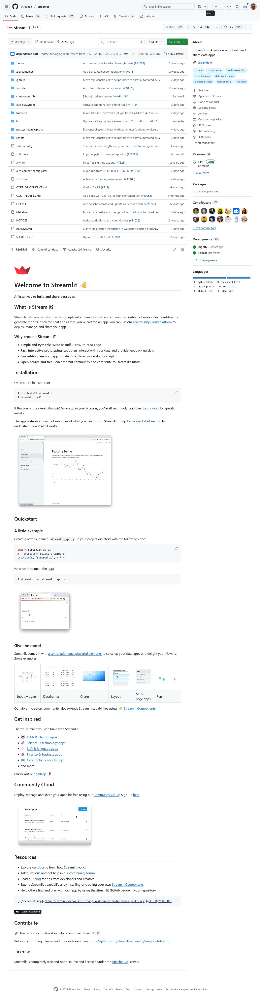

# streamlit
# Welcome to Streamlit 👋

**A faster way to build and share data apps.**

## What is Streamlit?

Streamlit lets you transform Python scripts into interactive web apps in minutes, instead of weeks. Build dashboards, generate reports, or create chat apps. Once you’ve created an app, you can use our [Community Cloud platform](https://streamlit.io/cloud) to deploy, manage, and share your app.

### Why choose Streamlit?

- **Simple and Pythonic:** Write beautiful, easy-to-read code.
- **Fast, interactive prototyping:** Let others interact with your data and provide feedback quickly.
- **Live editing:** See your app update instantly as you edit your script.
- **Open-source and free:** Join a vibrant community and contribute to Streamlit's future.

https://github.com/streamlit/streamlit

