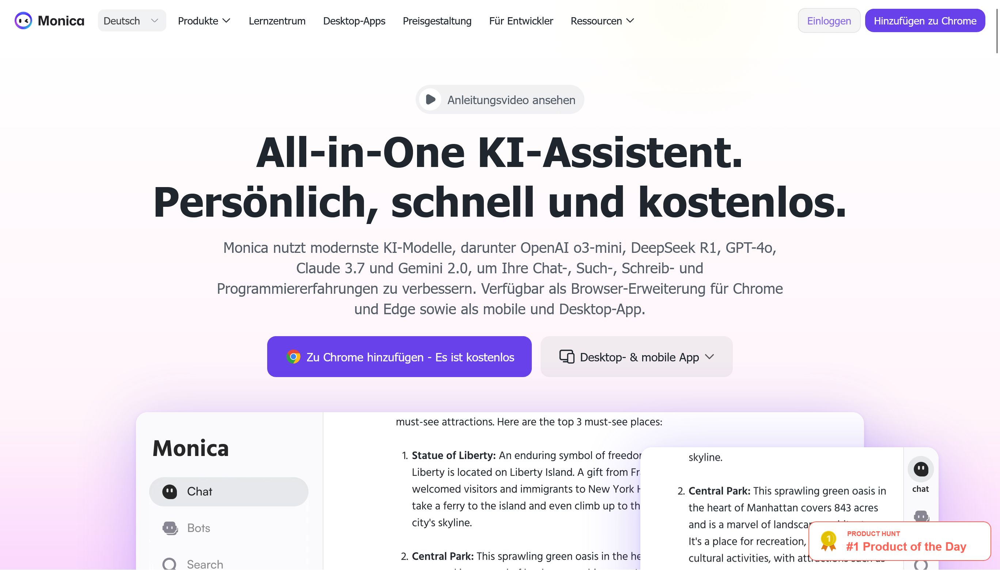

# All-in-One KI-Assistent.  
Persönlich, schnell und kostenlos.

Monica nutzt modernste KI-Modelle, darunter OpenAI o3-mini, DeepSeek R1, GPT-4o, Claude 3.7 und Gemini 2.0, um Ihre Chat-, Such-, Schreib- und Programmiererfahrungen zu verbessern. Verfügbar als Browser-Erweiterung für Chrome und Edge sowie als mobile und Desktop-App.

https://monica.im/
