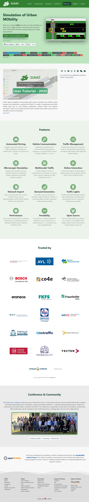

# Simulation of Urban MObility

Welcome to Eclipse SUMO (Simulation of Urban MObility), an open source, highly portable, microscopic and continuous multi-modal traffic simulation package designed to handle large networks.

https://eclipse.dev/sumo/

