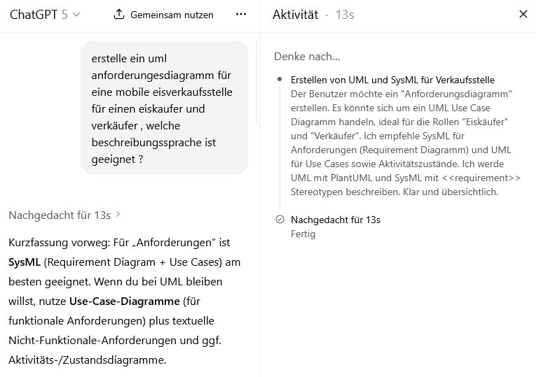
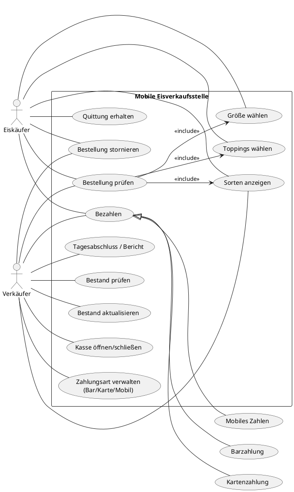
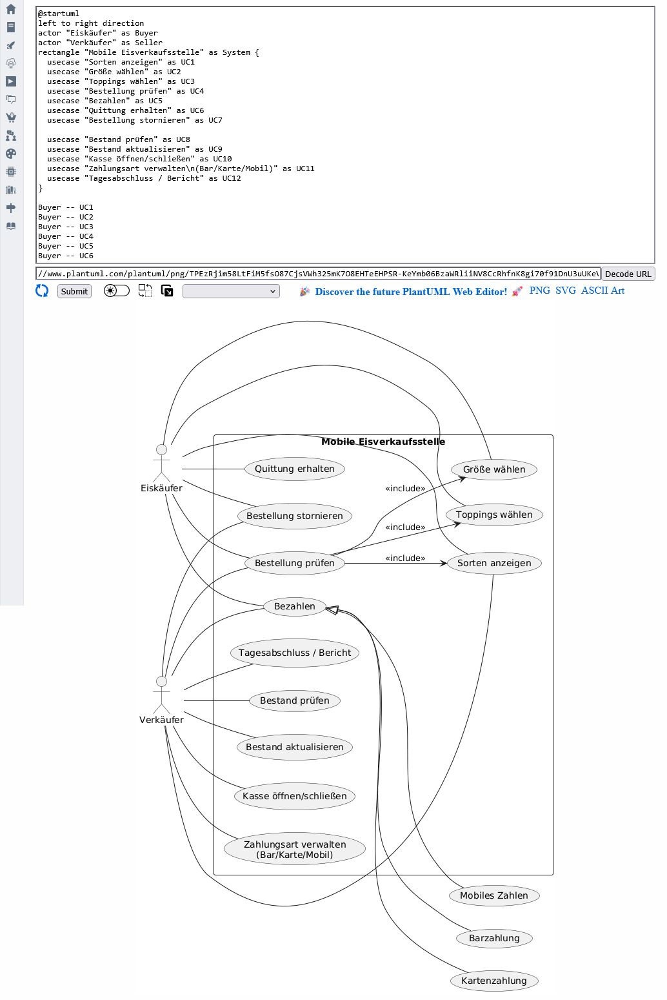
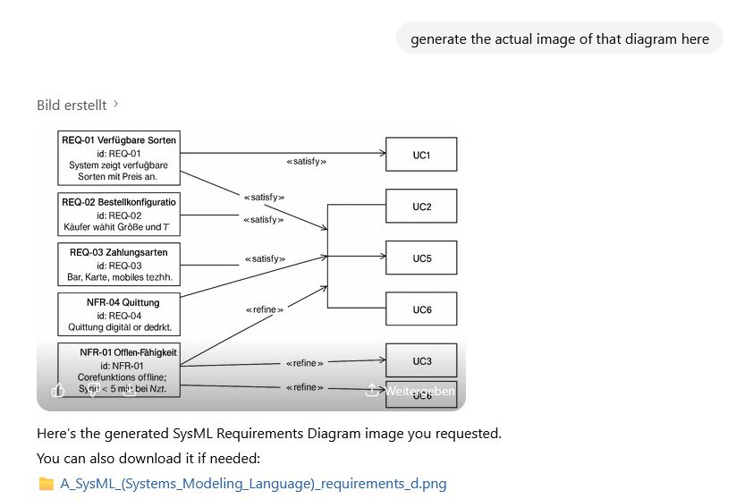

# UML UseCase Diag 



## A
Kurzfassung vorweg: Für „Anforderungen“ ist **SysML** (Requirement Diagram + Use Cases) am besten geeignet. Wenn du bei UML bleiben willst, nutze **Use-Case-Diagramme** (für funktionale Anforderungen) plus textuelle Nicht-Funktionale-Anforderungen und ggf. Aktivitäts-/Zustandsdiagramme.

---

# Geeignete Beschreibungssprache

- **SysML (Systems Modeling Language)**: Hat ein eigenes **Requirements Diagram**, Traceability (z. B. «satisfy», «verify»), ist dafür gemacht, Anforderungen formal zu führen.
    
- **UML**: Nutze **Use-Case-Diagramme** als „Anforderungsdiagramm“ (gängige Praxis), ergänzt durch Aktivitäts-/Sequenzdiagramme, und führe Nicht-Funktionales textuell.
    
- Ergänzend: **BPMN** für Prozesssicht (Bestell- und Bezahlfluss), wenn nötig.
    

---

# UML Use-Case-Diagramm (Eiskäufer & Verkäufer)



---

# (Optional) SysML-Requirements-Ausschnitt + Traceability

```plantuml
@startuml
' requirements (vereinfachte SysML-Notation in PlantUML)
class "REQ-01 Verfügbare Sorten" as R1 <<requirement>> {
  id = REQ-01
  text = "System zeigt verfügbare Sorten mit Preis an."
}
class "REQ-02 Bestellkonfiguration" as R2 <<requirement>> {
  id = REQ-02
  text = "Käufer wählt Größe und Toppings."
}
class "REQ-03 Zahlungsarten" as R3 <<requirement>> {
  id = REQ-03
  text = "Bar, Karte, mobiles Bezahlen werden unterstützt."
}
class "REQ-04 Quittung" as R4 <<requirement>> {
  id = REQ-04
  text = "Quittung digital oder gedruckt."
}
class "NFR-01 Offline-Fähigkeit" as N1 <<requirement>> {
  id = NFR-01
  text = "Kernfunktionen offline; Sync < 5 min bei Netz."
}
class "NFR-02 Leistung" as N2 <<requirement>> {
  id = NFR-02
  text = "Antwortzeit < 1s für UI; Zahlung < 5s."
}
class "NFR-03 Datenschutz" as N3 <<requirement>> {
  id = NFR-03
  text = "DSGVO-konforme Verarbeitung; keine Speicherung von Kartendaten."
}

' mapping zu Use Cases (vereinfacht mit «satisfy»)
class UC1 <<usecase>> 
class UC2 <<usecase>> 
class UC3 <<usecase>> 
class UC5 <<usecase>> 
class UC6 <<usecase>> 

UC1 -[<<satisfy>>]-> R1
UC2 -[<<satisfy>>]-> R2
UC3 -[<<satisfy>>]-> R2
UC5 -[<<satisfy>>]-> R3
UC6 -[<<satisfy>>]-> R4
UC1 -[<<refine>>]-> N2
UC5 -[<<refine>>]-> N1
UC5 -[<<refine>>]-> N3
@enduml
```

---

# Konsolidierte Anforderungen (Beispiel)

**Funktional**

1. System zeigt verfügbare Sorten/Preise.
    
2. Käufer wählt Größe und Toppings; System berechnet Preis dynamisch.
    
3. Bestellung prüfen/bestätigen; Storno vor Bezahlung möglich.
    
4. Bezahlen: bar, Karte, mobil; Quittung digital/gedruckt.
    
5. Verkäufer kann Bestand prüfen/aktualisieren, Kasse öffnen/schließen, Tagesabschluss erstellen.
    

**Nicht-Funktional**

- **Performance:** UI-Reaktionen < 1 s, Zahlvorgang < 5 s.
    
- **Offline:** Kernfunktionen offline; automatische Synchronisierung < 5 min.
    
- **Sicherheit/Datenschutz:** DSGVO-konform, keine Speicherung sensibler Kartendaten, Rollen („Verkäufer“ Admin-Funktionen).
    
- **Usability:** Einhändig bedienbar, große Buttons, klare Fehlertexte.
    
- **Zuverlässigkeit:** Transaktionen sind atomar; doppelte Abbuchung wird verhindert.
    

Wenn du magst, generiere ich dir die Diagramme als PNG/PDF oder ergänze Aktivitäts-/Sequenzdiagramme für den Bezahlfluss.
## PLantuml 

```
@startuml
left to right direction
actor "Eiskäufer" as Buyer
actor "Verkäufer" as Seller
rectangle "Mobile Eisverkaufsstelle" as System {
  usecase "Sorten anzeigen" as UC1
  usecase "Größe wählen" as UC2
  usecase "Toppings wählen" as UC3
  usecase "Bestellung prüfen" as UC4
  usecase "Bezahlen" as UC5
  usecase "Quittung erhalten" as UC6
  usecase "Bestellung stornieren" as UC7

  usecase "Bestand prüfen" as UC8
  usecase "Bestand aktualisieren" as UC9
  usecase "Kasse öffnen/schließen" as UC10
  usecase "Zahlungsart verwalten\n(Bar/Karte/Mobil)" as UC11
  usecase "Tagesabschluss / Bericht" as UC12
}

Buyer -- UC1
Buyer -- UC2
Buyer -- UC3
Buyer -- UC4
Buyer -- UC5
Buyer -- UC6
Buyer -- UC7

Seller -- UC1
Seller -- UC4
Seller -- UC5
Seller -- UC7
Seller -- UC8
Seller -- UC9
Seller -- UC10
Seller -- UC11
Seller -- UC12

UC5 <|-- (Barzahlung)
UC5 <|-- (Kartenzahlung)
UC5 <|-- (Mobiles Zahlen)
UC4 --> UC1 : <<include>>
UC4 --> UC2 : <<include>>
UC4 --> UC3 : <<include>>
@enduml

```


## sysml 

