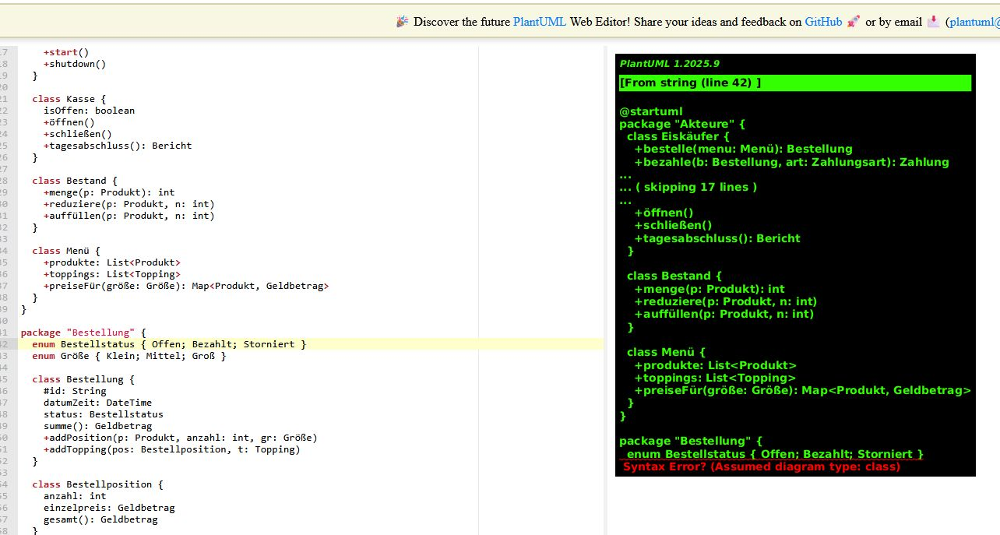
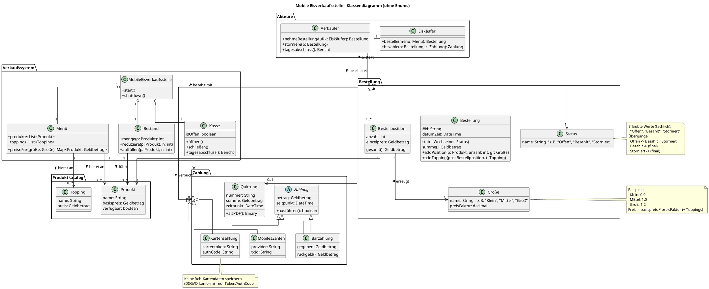
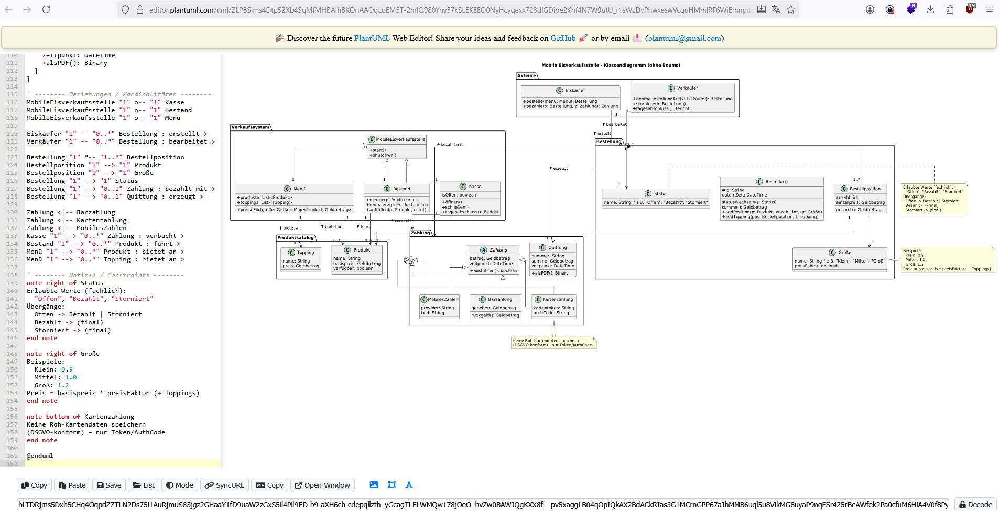

# UML Klassen-Diagramm 

## GPT5 Q
```
erstelle ein plantuml klassendiagramm für erstelle für eine mobile eisverkaufsstelle für einen eiskaufer und verkäufer
```
## A

Hier ist ein sauberes **PlantUML-Klassendiagramm** für eine **mobile Eisverkaufsstelle** mit den Rollen _Eiskäufer_ (Kunde) und _Verkäufer_. Du kannst den Code 1:1 in jeden PlantUML-Renderer einfügen.

```plantuml
@startuml
title Mobile Eisverkaufsstelle – Klassendiagramm

skinparam classAttributeIconSize 0
skinparam linetype ortho

package "Akteure" {
  class Eiskäufer {
    +bestelle(menu: Menü): Bestellung
    +bezahle(b: Bestellung, art: Zahlungsart): Zahlung
  }

  class Verkäufer {
    +nehmeBestellungAuf(k: Eiskäufer): Bestellung
    +storniere(b: Bestellung)
    +tagesabschluss(): Bericht
  }
}

package "Verkaufssystem" {
  class MobileEisverkaufsstelle {
    +start()
    +shutdown()
  }

  class Kasse {
    isOffen: boolean
    +öffnen()
    +schließen()
    +tagesabschluss(): Bericht
  }

  class Bestand {
    +menge(p: Produkt): int
    +reduziere(p: Produkt, n: int)
    +auffüllen(p: Produkt, n: int)
  }

  class Menü {
    +produkte: List<Produkt>
    +toppings: List<Topping>
    +preiseFür(größe: Größe): Map<Produkt, Geldbetrag>
  }
}

package "Bestellung" {
  enum Bestellstatus { Offen; Bezahlt; Storniert }
  enum Größe { Klein; Mittel; Groß }

  class Bestellung {
    #id: String
    datumZeit: DateTime
    status: Bestellstatus
    summe(): Geldbetrag
    +addPosition(p: Produkt, anzahl: int, gr: Größe)
    +addTopping(pos: Bestellposition, t: Topping)
  }

  class Bestellposition {
    anzahl: int
    einzelpreis: Geldbetrag
    gesamt(): Geldbetrag
  }
}

package "Produktkatalog" {
  class Produkt {
    name: String
    basispreis: Geldbetrag
    verfügbar: boolean
  }

  class Topping {
    name: String
    preis: Geldbetrag
  }
}

package "Zahlung" {
  enum Zahlungsart { Bar; Karte; Mobil }

  abstract class Zahlung {
    betrag: Geldbetrag
    zeitpunkt: DateTime
    +ausführen(): boolean
  }

  class Barzahlung extends Zahlung {
    gegeben: Geldbetrag
    rückgeld(): Geldbetrag
  }

  class Kartenzahlung extends Zahlung {
    kartentoken: String
    authCode: String
  }

  class MobilesZahlen extends Zahlung {
    provider: String
    txId: String
  }

  class Quittung {
    nummer: String
    summe: Geldbetrag
    art: Zahlungsart
    zeitpunkt: DateTime
    +alsPDF(): Binary
  }
}

' -------- Beziehungen / Kardinalitäten --------
MobileEisverkaufsstelle "1" o-- "1" Kasse
MobileEisverkaufsstelle "1" o-- "1" Bestand
MobileEisverkaufsstelle "1" o-- "1" Menü

Eiskäufer "1" -- "0..*" Bestellung : erstellt >
Verkäufer "1" -- "0..*" Bestellung : bearbeitet >

Bestellung "1" *-- "1..*" Bestellposition
Bestellposition "1" --> "1" Produkt
Bestellposition "0..*" --> "0..*" Topping : optional

Bestellung "1" --> "0..1" Zahlung : bezahlt mit >
Bestellung "1" --> "0..1" Quittung : erzeugt >
Zahlung <|-- Barzahlung
Zahlung <|-- Kartenzahlung
Zahlung <|-- MobilesZahlen

Kasse "1" --> "0..*" Zahlung : verbucht >
Bestand "1" --> "0..*" Produkt : führt >
Menü "1" --> "0..*" Produkt : bietet an >
Menü "1" --> "0..*" Topping : bietet an >

' -------- Notizen / Designentscheidungen --------
note right of Bestellung
Preisbildung:
  Summe = Σ(Positionspreis + Σ Toppings)
  nach Größe (Klein/Mittel/Groß)
  + evtl. Rundung
end note

note bottom of Kartenzahlung
Keine Kartendaten speichern
(DSGVO-konform) – nur Token/AuthCode
end note

@enduml
```

**Hinweise zur Nutzung**

- Rollen (_Eiskäufer_, _Verkäufer_) sind hier als Klassen/Actor-Klassen modelliert, damit Abläufe (Methoden) sichtbar werden.
    
- **Komposition** (`*--`) zwischen `Bestellung` und `Bestellposition` drückt aus, dass Positionen ohne Bestellung nicht existieren.
    
- **Aggregation** (`o--`) verbindet die Verkaufsstelle mit `Kasse`, `Bestand`, `Menü`.
    
- Du kannst das Diagramm bei Bedarf um Preisregeln, Rabatte oder Steuern erweitern (z. B. eine `Preisstrategie`-Schnittstelle mit konkreten Implementierungen).
## PLantuml 
## Problem Enum 


## Q : Fix - dont use enum 

## A
Alles klar — hier ist die **bereinigte PlantUML-Version ohne Enums**. Ich habe die bisherigen Enums durch Klassen/Assoziationen ersetzt:

- **Bestellstatus** → eigene Klasse `Status` (mit Allowed-Values-Hinweis).
    
- **Größe** → eigene Klasse `Größe` (mit `preisFaktor`).
    
- **Zahlungsart** → keine Enum; stattdessen die bereits vorhandene Vererbungshierarchie von `Zahlung` (Bar/Karte/Mobil). Methoden signieren jetzt mit `Zahlung` statt `Zahlungsart`.
    



Wenn du möchtest, kann ich die **Status-Übergänge** zusätzlich als **Zustandsdiagramm** liefern — ebenfalls ohne Enums.
## KD Diagram 



