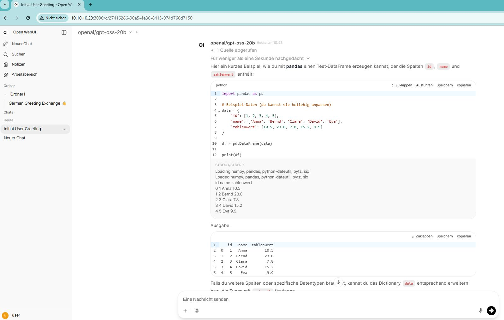
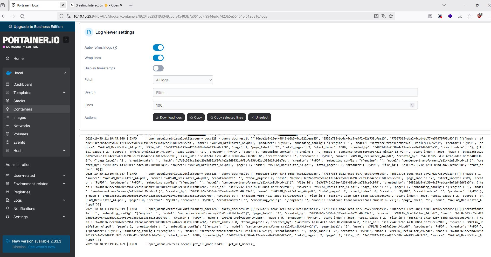

# open-webui on Raspi 


## DL Rapi OS, ssh, user 

https://downloads.raspberrypi.com/raspios_arm64/release_notes.txt
- add ssh :- on sd card add file ssh with 0 Bytes 
- add user pi with pwd raspi: add file userconf.txt on sd card with 
```
pi:$6$01d0LOa5n1bztez.$DmT0rH0abvOyiuDtHApYpxDWNAuVCgn9Y4jyNPh3wPgSDLrPpAZmYvIgBx6c1Jj2sPo5o2XaMuqznX83MFmNB/
```


see: [FOM_EDU/2023_IIT_Labor/files/userconf.txt at main · softwareengel/FOM_EDU](https://github.com/softwareengel/FOM_EDU/blob/main/2023_IIT_Labor/files/userconf.txt)

## install open-webui - log 

```bash 

uname -a

Linux raspberrypi 6.12.47+rpt-rpi-v8 #1 SMP PREEMPT Debian 1:6.12.47-1+rpt1 (2025-09-16) aarch64 GNU/Linux

sudo apt update
sudo apt upgrade
 

# Docker auf Raspberry Pi installieren
curl -fsSL https://get.docker.com -o get-docker.sh
sudo sh get-docker.sh
sudo usermod -aG docker pi
# Docker-Dienst starten und automatisch beim Boot aktivieren
sudo systemctl enable docker
sudo systemctl start docker
newgrp docker

# Portainer Volume erstellen

docker run -d -p 8000:8000 -p 9443:9443 --name portainer --restart=always -v /var/run/docker.sock:/var/run/docker.sock -v portainer_data:/data portainer/portainer-ce:latest


# Docker Open-webui 

docker run -d -p 3000:8080 --add-host=host.docker.internal:host-gateway -v open-webui:/app/backend/data --name open-webui --restart always --platform linux/arm64 ghcr.io/open-webui/open-webui:main


```

## Refs




