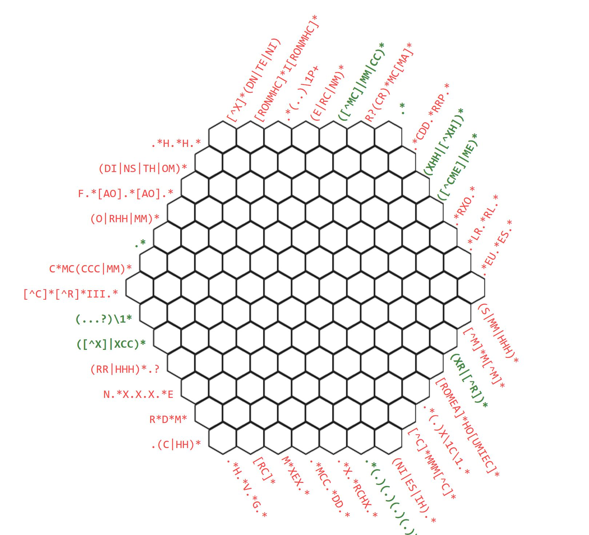

# regex crossword puzzle

It's a crossword puzzle where you need to fill in the hexes with character sequences, so that they match the regular expressions listed around the edges.
The individual clues will turn bold purple when satisfied, orange when not, and underlined when active.
Note that the regex must be a full match, and empty cells are treated as spaces.

https://jimbly.github.io/regex-crossword/

