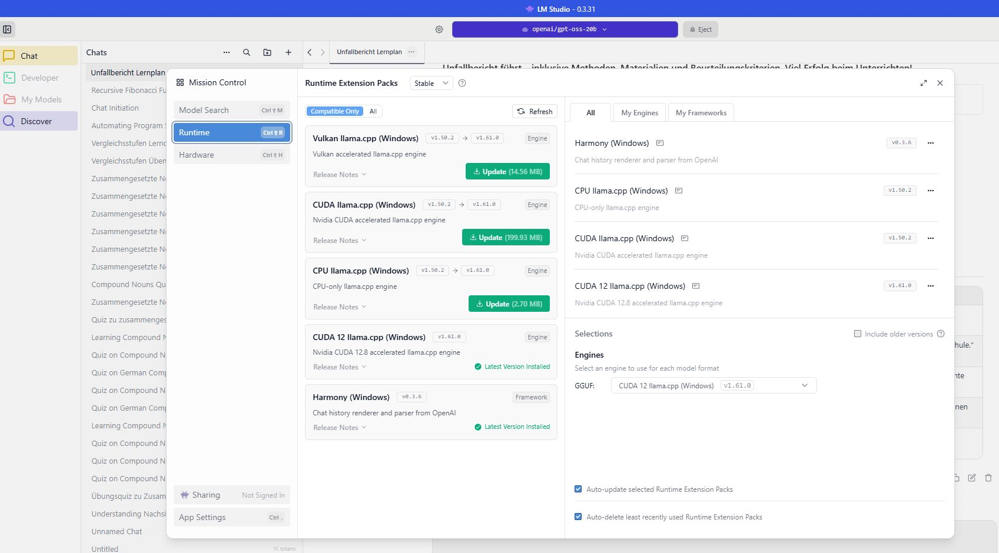
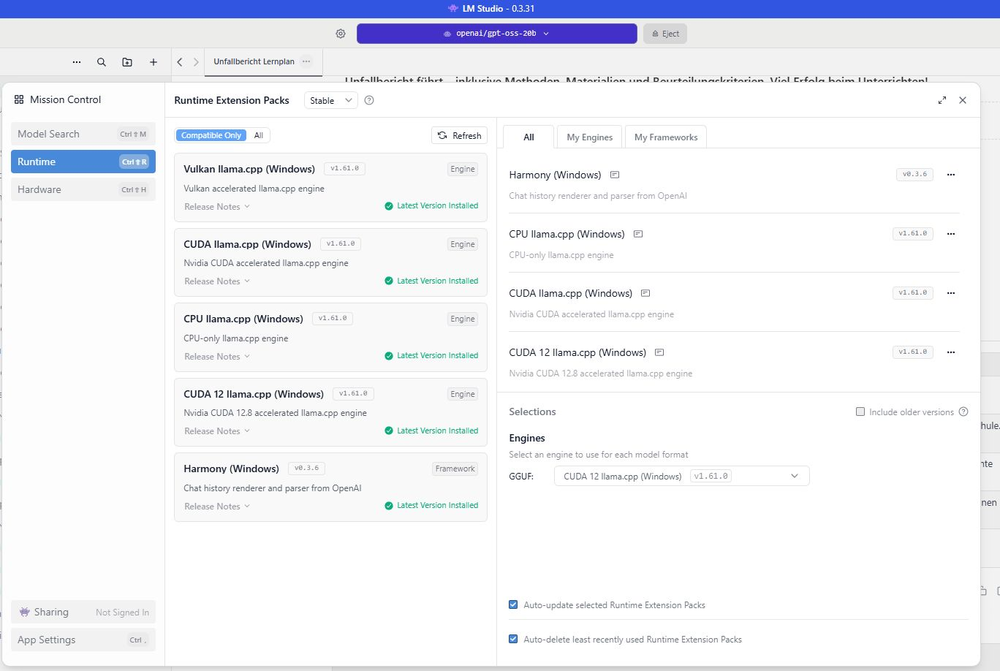
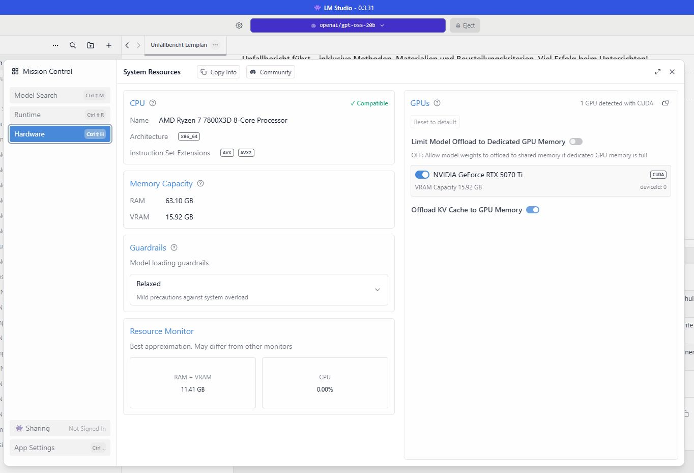

---
title:
tags:
date: 2025-12-22
toc: true
toc_sticky: true
---


# LLM-DIY-Perfomance

## Setup 
- gleiche Inferenz-Software 
- gleiche LLM Modelle 
	- MS/Phi4
	- OpenAI/OSS20B
	- 
- unterschiedliche Hardware 
	- sdf

Test Szenario
- gleiche Text Anfragen 
	- 
- gleiche Parameter 
- Anzahl Token / sec


___
# Test Cases

War heute bei KoSys  in Siegburg. Gespräch über neue Bürofenster. Budget ca. 50.000€. Angebot bis nächste Woche.


Tischlerei Sommer in Paderborn, KU 032 88. Termin mit Wolfgang Thiele, vorher in der Verwaltung  gewesen um eine Reklamationsscheibe abzuholen. Diese wurde allerdings nicht pünktlich geliefert. Frau Hillemeier kümmert sich darum, dass sie in KW 42 zum Kunden kommt. Anfrage Niggemeier durchgesprochen und im Nachgang in die Kalkulation geschickt. Angebot Martin wird kurzfristig beauftragt.


Besuch bei Tischlerei Baumann am 10. September. Herr Baumann zeigte sich sehr interessiert an unseren neuen Produktlinien. Besonders im Bereich der Nebeneingangstüren konnte ich ihm einige interessante Optionen aufzeigen. Wir haben über die derzeitige Marktsituation gesprochen. Insgesamt ist er zufrieden, bemängelt jedoch steigende Materialkosten. Er möchte demnächst eine Anfrage stellen, sobald ein Neubauprojekt freigegessen ist.


___
# Prompt
## P1
```

Du bist ein Experte für die Extraktion von Kundendaten aus CSV-Texten. Deine Aufgabe ist es, aus den gegebenen Textblöcken die folgenden Informationen zu extrahieren:
- ID (erste Spalte)
- Kundenname (meist in den Spalten name1, name2 oder name3)
- Ort (Spalte ort)
  

Gib das Ergebnis als JSON-Array zurück mit der Struktur:

[{"id": "ID", "kunde": "Kundenname", "ort": "Ort"}]

  

Wenn mehrere Kunden in einem Textblock sind, liste alle auf.

Wenn Informationen fehlen, verwende "N/A" als Wert."""

```

## P2
```
Analysiere die folgende Nachricht eines Außendienstmitarbeiters und klassifiziere sie.

  

Nachricht: "{message}"

  

Aufgaben:

1. Bestimme den Haupt-Intent:

   - "subject_search": Nutzer sucht nach einem Kunden/Interessenten

   - "visit_report": Nutzer berichtet über einen Besuch oder Termin

   - "mixed": Beides (Suche + Bericht)

   - "general_chat": Allgemeine Frage oder Smalltalk

  

2. Extrahiere falls vorhanden:

   - Subjekt-Name (Firmenname oder Person)

   - Subjekt-ID (Kann Kunde oder interessent sein,  Format: "in" + Ziffern, z.B. "in390192", oder "ku" + Ziffern)

   - Ort/Stadt

   - Suchbegriff (für Subjekt-Suche)

  

3. Prüfe ob ein Besuchsbericht enthalten ist (Indizien: "war bei", "besuch", "termin", "gespräch", "heute", "gestern", Datumsangaben)

  

Antworte NUR mit gültigem JSON (keine Markdown-Formatierung):

{{

  "intent": "subject_search|visit_report|mixed|general_chat",

  "subject_mentioned": true/false,

  "subject_name": "Name oder null",

  "subject_id": "ID oder null",

  "location": "Ort oder null",

  "search_query": "Suchbegriff oder null",

  "has_visit_report": true/false,

  "confidence": 0.0-1.0,

  "reasoning": "Kurze Begründung"

}}"""
```

## P3 
```
Analysiere diese Besuchsbericht-Nachricht eines Außendienstmitarbeiters und extrahiere alle relevanten Informationen.

  

Nachricht: "{message}"

  

Extrahiere folgende Informationen (falls vorhanden):

  

1. **Subjekt/Kunde:**

   - Firmenname oder Name

   - Subjekt-ID (Format: "in" + Ziffern, z.B. "in390192")

  

2. **Besuchsinformationen:**

   - Datum (Format: DD.MM.YYYY oder "heute", "gestern")

   - Uhrzeit (falls erwähnt)

   - Ort/Adresse des Besuchs

   - Teilnehmer (Namen)

  

3. **Gesprächsinhalte:**

   - Besprochene Themen (als Liste)

   - Notizen / Zusammenfassung

   - Getroffene Vereinbarungen

   - Nächste Schritte / Follow-up Aktionen

  

4. **Zusatzinformationen:**

   - Erwähntes Budget / Preise

   - Projektname

   - Ansprechpartner

  

Antworte NUR mit gültigem JSON (keine Markdown-Formatierung):

{{

  "subject_name": "Firmenname oder null",

  "subject_id": "ID oder null",

  "visit_date": "Datum oder null",

  "visit_time": "Uhrzeit oder null",

  "location": "Ort oder null",

  "participants": ["Name1", "Name2"] oder [],

  "topics": ["Thema1", "Thema2"] oder [],

  "notes": "Zusammenfassung oder null",

  "agreements": ["Vereinbarung1"] oder [],

  "next_steps": ["Aktion1", "Aktion2"] oder [],

  "budget": "Budget oder null",

  "project": "Projektname oder null",

  "contact_person": "Ansprechpartner oder null"

}}

  

Wichtig:

- Für Datumsangaben: Wenn "heute" → verwende heutiges Datum im Format DD.MM.YYYY

- Wenn "gestern" → gestrige Datum

- Extrahiere nur Informationen die wirklich in der Nachricht stehen

- Verwende null für nicht vorhandene Informationen

"""
```


## Hardware Rechenknecht 




### cuda 12 llama.cpp v 1.61.0
## Hardware

