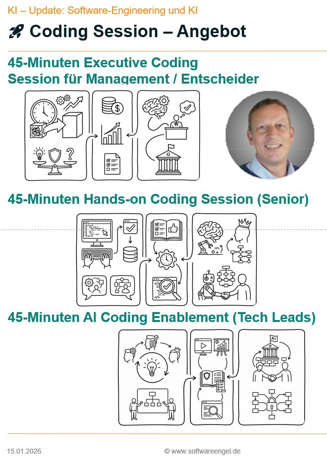
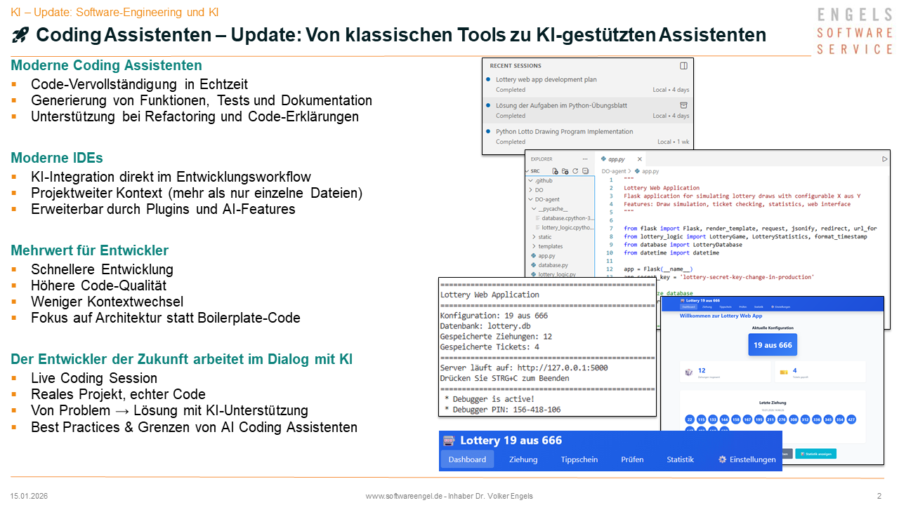
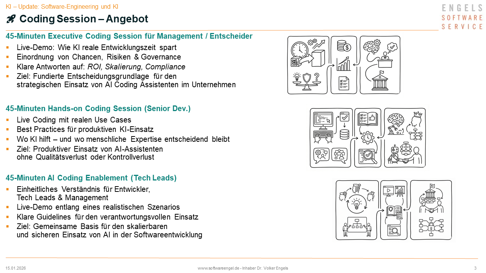
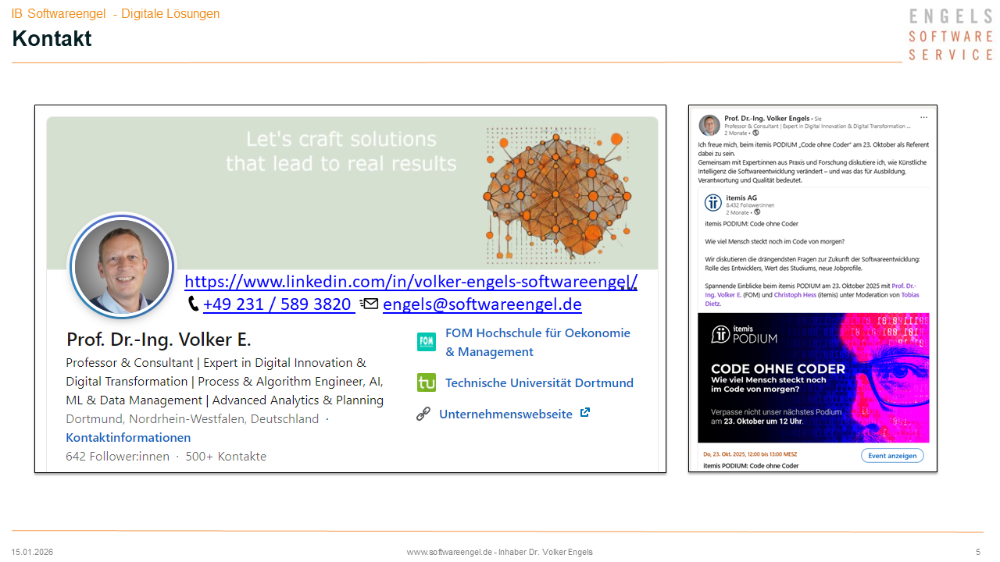

# KI schreibt heute Code – aber wie verändert sie wirklich die Arbeit von Entwickler-Teams und Entscheidern?

KI-gestützte Coding Assistenten sind längst mehr als Autocomplete.  
In modernen IDEs arbeiten Entwickler heute **im Dialog mit KI** – direkt im Projektkontext, nicht isoliert in einzelnen Dateien.

Was bedeutet das konkret?

🔹 **Schnellere Entwicklung**, ohne Qualität zu opfern  
🔹 **Bessere Code-Qualität** durch Refactoring- und Erklärungsfunktionen  
🔹 **Weniger Kontextwechsel** – mehr Fokus auf Architektur  
🔹 KI übernimmt Boilerplate, **Team behält die Verantwortung**

Der entscheidende Punkt:  
👉 KI ersetzt keine Entwickler -Teams – sie verändert ihre Rollen.

Der Entwickler der Zukunft:

- arbeitet live mit KI
    
- löst reale Probleme mit echtem Code
  
- kennt **Best Practices – und Grenzen** von AI Coding Assistenten
    

Für Entscheider stellen sich dabei ganz andere Fragen:

- Wie sieht der **ROI** wirklich aus?
    
- Wie skalierbar ist der Einsatz?
    
- Was bedeutet das für **Governance & Compliance**?
    

Genau deshalb setze ich auf **Live Coding Sessions statt Buzzwords**:

- Für Management & Entscheider
    
- Für Senior Developers
    
- Für Tech Leads, die Verantwortung tragen
    

👉 **KI im Software Engineering ist kein Tool-Thema – sondern ein Führungs- und Qualitäts-Thema.**

Wer sich fundiert damit auseinandersetzen will, braucht **echte Use Cases, klare Leitplanken und realistische Erwartungen**.

💬 Wie sind eure Erfahrungen mit KI im Entwicklungsalltag?

## Folien

## Notes

Kein Geheimnis - Der Problem -Solution - Fit kommt von mir, alles andere haben die Assistenten 
gemacht ;-) 

## Chatgpt 5.2 Q

plane einen LI artikel von diesen Folien
### A
## 🎯 Ziel des LinkedIn-Artikels

- Positionierung als **strategischer KI-Experte für Software Engineering**
    
- Brücke zwischen **Management, Tech Leads und Entwicklern**
    
- Einladung zum **Dialog / Coding Sessions-Angebot**
    

Zielgruppe:  
👉 Entscheider, CTOs, Tech Leads, Senior Developers

---

## 🧱 Empfohlene Artikel-Struktur (LinkedIn)

### 1. Starker Einstieg (Problem + Relevanz)

**Hook:**  
„KI schreibt heute Code – aber wie verändert sie wirklich die Arbeit von Entwicklern und Entscheidern?“

Ziel:

- Aufmerksamkeit
    
- Klare Einordnung: _Hype vs. Realität_
    

---

### 2. Einordnung: Von klassischen Tools zu KI-Assistenten

Inhalt aus Folie 2:

- Evolution der Coding Tools
    
- Was moderne Coding Assistenten heute wirklich können  
    (Realtime Completion, Tests, Refactoring, Erklärungen)
    
- Warum IDE-Integration entscheidend ist (Projektkontext!)
    

---

### 3. Der echte Mehrwert (kein Marketing)

Kernaussagen:

- Geschwindigkeit ≠ Qualität → **beides zusammen**
    
- Weniger Kontextwechsel
    
- Fokus auf Architektur & Design
    
- Entwickler arbeiten **im Dialog mit KI**, nicht „per Knopfdruck“
    

---

### 4. Der Entwickler der Zukunft

Aus den Folien:

- Live Coding statt Folien-KI
    
- Reale Projekte, echter Code
    
- KI als Sparringspartner
    
- Menschliche Expertise bleibt entscheidend
    

---

### 5. Management-Perspektive: Chancen & Risiken

Aufgreifen aus Coding Session Angebot:

- ROI realistisch bewerten
    
- Governance & Compliance
    
- Skalierbarkeit
    
- Warum „einfach mal ChatGPT erlauben“ zu kurz greift
    

---

### 6. Praxisangebot (Call to Action)

Kurz & klar:

- Executive Coding Session
    
- Hands-on Session für Senior Devs
    
- AI Coding Enablement für Tech Leads
    

---

## ✍️ Beispiel-Entwurf für den LinkedIn-Artikel

Du kannst diesen Text **direkt posten oder leicht anpassen**:

---

### 🚀 KI schreibt Code – aber verändert sie wirklich Software Engineering?

KI-gestützte Coding Assistenten sind längst mehr als Autocomplete.  
In modernen IDEs arbeiten Entwickler heute **im Dialog mit KI** – direkt im Projektkontext, nicht isoliert in einzelnen Dateien.

Was bedeutet das konkret?

🔹 **Schnellere Entwicklung**, ohne Qualität zu opfern  
🔹 **Bessere Code-Qualität** durch Refactoring- und Erklärungsfunktionen  
🔹 **Weniger Kontextwechsel** – mehr Fokus auf Architektur  
🔹 KI übernimmt Boilerplate, **Menschen behalten die Verantwortung**

Der entscheidende Punkt:  
👉 KI ersetzt keine Entwickler – sie verändert ihre Rolle.

Der Entwickler der Zukunft:

- arbeitet live mit KI
    
- löst reale Probleme mit echtem Code
    
- kennt **Best Practices – und Grenzen** von AI Coding Assistenten
    

Für Entscheider stellen sich dabei ganz andere Fragen:

- Wie sieht der **ROI** wirklich aus?
    
- Wie skalierbar ist der Einsatz?
    
- Was bedeutet das für **Governance & Compliance**?
    

Genau deshalb setze ich auf **Live Coding Sessions statt Buzzwords**:

- Für Management & Entscheider
    
- Für Senior Developers
    
- Für Tech Leads, die Verantwortung tragen
    

👉 **KI im Software Engineering ist kein Tool-Thema – sondern ein Führungs- und Qualitäts-Thema.**

Wer sich fundiert damit auseinandersetzen will, braucht **echte Use Cases, klare Leitplanken und realistische Erwartungen**.

💬 Wie sind eure Erfahrungen mit KI im Entwicklungsalltag?

---

## 📌 Quelle / Basis

Der Artikel basiert auf den Inhalten der Präsentation _„KI-Update: Software-Engineering und KI – Coding Assistenten“_ von IB Softwareengel (15.01.2026)

2026-01-15-Softwareengel-KI-Upd…

---

Wenn du willst, kann ich:

- den Artikel **kürzen für einen normalen LI-Post**
    
- ihn **stärker auf Management oder Entwickler zuschneiden**
    
- oder eine **Artikelserie (3–4 Posts)** daraus machen

„KI schreibt heute Code – aber wie verändert sie wirklich die Arbeit von Entwicklern und Entscheidern?“