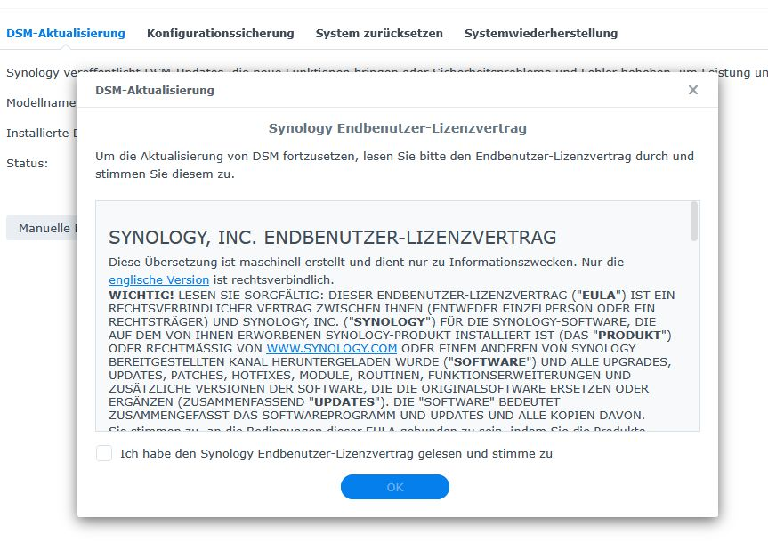

# SYNOLOGY, INC. ENDBENUTZER-LIZENZVERTRAG

<h1>SYNOLOGY, INC. ENDBENUTZER-LIZENZVERTRAG</h1>
<em>Diese Übersetzung ist maschinell erstellt und dient nur zu Informationszwecken. Nur die <a target="_blank" href="https://www.synology.com/en-global/company/legal/terms_EULA">englische Version</a> ist rechtsverbindlich.</em>
<strong>WICHTIG!</strong> LESEN SIE SORGFÄLTIG: DIESER ENDBENUTZER-LIZENZVERTRAG ("<strong>EULA</strong>") IST EIN RECHTSVERBINDLICHER VERTRAG ZWISCHEN IHNEN (ENTWEDER EINZELPERSON ODER EIN RECHTSTRÄGER) UND SYNOLOGY, INC. ("<strong>SYNOLOGY</strong>") FÜR DIE SYNOLOGY-SOFTWARE, DIE AUF DEM VON IHNEN ERWORBENEN SYNOLOGY-PRODUKT INSTALLIERT IST (DAS "<strong>PRODUKT</strong>") ODER RECHTMÄSSIG VON <a href="https://www.synology.com" target="_blank">WWW.SYNOLOGY.COM</a> ODER EINEM ANDEREN VON SYNOLOGY BEREITGESTELLTEN KANAL HERUNTERGELADEN WURDE ("<strong>SOFTWARE</strong>") UND ALLE UPGRADES, UPDATES, PATCHES, HOTFIXES, MODULE, ROUTINEN, FUNKTIONSERWEITERUNGEN UND ZUSÄTZLICHE VERSIONEN DER SOFTWARE, DIE DIE ORIGINALSOFTWARE ERSETZEN ODER ERGÄNZEN (ZUSAMMENFASSEND "<strong>UPDATES</strong>"). DIE "SOFTWARE" BEDEUTET ZUSAMMENGEFASST DAS SOFTWAREPROGRAMM UND UPDATES UND ALLE KOPIEN DAVON.
Sie stimmen zu, an die Bedingungen dieser EULA gebunden zu sein, indem Sie die Produkte verwenden, die die Software enthalten, und indem Sie die Software auf die Produkte oder mit den Produkten verbundene Geräte installieren. Wenn Sie den Bedingungen dieser EULA nicht zustimmen, verwenden Sie die Produkte, die die Software enthalten, nicht und laden Sie die Software nicht von <a href="https://www.synology.com" target="_blank">WWW.SYNOLOGY.COM</a> oder einem anderen von Synology bereitgestellten Kanal herunter. Stattdessen können Sie das Produkt an den Händler zurückgeben, bei dem Sie es gekauft haben, um eine Rückerstattung gemäß der geltenden Rückgaberichtlinie des Händlers zu erhalten.

<strong>Abschnitt 1. Eingeschränkte Software-Lizenz.</strong> Die Software wird Ihnen lizenziert, nicht verkauft. Vorbehaltlich und unter der Bedingung Ihrer Einhaltung aller in dieser EULA festgelegten Bedingungen, einschließlich gegebenenfalls der Zahlung von Lizenzgebühren, gewährt Ihnen Synology hiermit eine eingeschränkte, nicht-exklusive, persönliche Lizenz, um: (a) eine Kopie der Software auf einem einzelnen Produkt oder auf Ihrem mit dem Produkt verbundenen Gerät zu installieren, auszuführen und zu nutzen, ausschließlich in Bezug auf Ihre autorisierte Nutzung des Produkts, und für den in einer befristeten Lizenz angegebenen Zeitraum oder unbefristet, wenn kein Zeitraum angegeben ist; oder (b) die Software auf zusätzlichen Produkten über einen bestimmten Schwellenwert hinaus zu installieren, auszuführen und zu nutzen, vorbehaltlich der Zahlung der anwendbaren Lizenzgebühren gemäß der von Synology festgelegten Preisstruktur. Die hierin gewährten Rechte beschränken sich auf die geistigen Eigentumsrechte von Synology an der Software und schließen keine anderen geistigen Eigentumsrechte Dritter ein. Wenn Sie ein individueller Verbraucher sind, erlaubt Ihnen diese Lizenz, die Software in Verbindung mit Ihrer eigenen privaten Nutzung zu verwenden. Wenn Sie eine Geschäftseinheit sind, erlaubt Ihnen diese Lizenz, die Software in Verbindung mit den internen Geschäftsvorgängen Ihrer Einheit zu verwenden.

<strong>Abschnitt 2. Dokumentation.</strong> Sie dürfen eine angemessene Anzahl von Kopien der mit der Software bereitgestellten Dokumentation anfertigen und verwenden, vorausgesetzt, dass solche Kopien nur für interne Geschäftszwecke verwendet werden und nicht an Dritte weiterveröffentlicht oder weiterverteilt werden (weder in Papierform noch in elektronischer Form).

<strong>Abschnitt 3. Sicherung.</strong> Sie dürfen eine angemessene Anzahl von Kopien der Software nur zu Sicherungs- und Archivierungszwecken anfertigen.

<strong>Abschnitt 4. Aktualisierungen.</strong> Jegliche Software, die Ihnen von Synology bereitgestellt oder auf der Synology-Website unter <a href="https://www.synology.com" target="_blank">www.synology.com</a> ("<strong>Website</strong>") verfügbar gemacht wird, oder jegliche von Synology bereitgestellten Aktualisierungen unterliegen dieser EULA, es sei denn, es werden separate Lizenzbedingungen mit solcher Software oder Aktualisierungen bereitgestellt, in diesem Fall gelten diese separaten Bedingungen. Synology kann nach eigenem Ermessen die Software ändern, bestimmte Teile oder Komponenten der Software entfernen oder deaktivieren (jeweils eine "<strong>Änderung</strong>") von Zeit zu Zeit, was unter anderem Sicherheitsverbesserungen, Fehlerbehebungen, Leistungsverbesserungen oder funktionale Modifikationen umfassen kann. Sie erkennen an und stimmen zu, dass diese Änderungen zur Änderung oder Entfernung bestimmter Funktionen führen können, einschließlich derer, auf die Sie sich möglicherweise verlassen. Synology kann auch die Installation oder Annahme solcher Änderungen als Bedingung für die fortgesetzte Nutzung der Software verlangen. Alle Änderungen gelten als integrale Bestandteile der Software unter dieser EULA. Durch die Zustimmung zu dieser EULA stimmen Sie der Implementierung solcher Änderungen zu, wie von Synology bestimmt. Diese EULA berechtigt Sie nicht von sich aus zu zukünftigen Aktualisierungen der Software.

<strong>Abschnitt 5. Lizenzbeschränkungen.</strong> Die in den Abschnitten 1, 2 und 3 festgelegte Lizenz gilt nur insoweit, als Sie das Produkt bestellt und bezahlt haben, und legt die Gesamtheit Ihrer Rechte in Bezug auf die Software fest. Mit Ausnahme der in diesem EULA ausdrücklich gewährten Lizenz behält sich Synology alle Rechte, Titel und Interessen an und in Bezug auf die Software sowie an allen zugehörigen Inhalten, Materialien, Urheberrechten, Geschäftsgeheimnissen, Patenten, Marken, abgeleiteten Werken und sonstigen geistigen Eigentums- und Eigentumsrechten vor. Ohne das Vorstehende einzuschränken, dürfen Sie nicht und dürfen keinem Dritten gestatten: (a) die Software für andere Zwecke als in Verbindung mit dem Produkt zu verwenden; (b) die Software zu lizenzieren, zu vertreiben, zu verleasen, zu vermieten, zu verleihen, abzutreten oder anderweitig zu veräußern; (c) die Software zurückzuentwickeln, zu dekompilieren, zu disassemblieren oder zu versuchen, den Quellcode oder Geschäftsgeheimnisse der Software zu entdecken, außer und nur insoweit, als ein solches Verhalten durch geltendes Recht ungeachtet dieser Einschränkung ausdrücklich gestattet ist; (d) die Software anzupassen, zu modifizieren, zu verändern, zu übersetzen oder abgeleitete Werke der Software zu erstellen; (e) Urheberrechtshinweise oder andere Eigentumshinweise auf der Software oder dem Produkt zu entfernen, zu verändern oder zu verdecken; oder (f) Methoden zu umgehen oder zu versuchen, Methoden zu umgehen, die von Synology zur Kontrolle des Zugriffs auf die Komponenten, Funktionen oder Merkmale des Produkts oder der Software eingesetzt werden; (g) die Software oder Dokumentation in Verletzung von Gesetzen, Vorschriften oder Regeln zu verwenden; oder (h) die Software oder Dokumentation für Zwecke der Wettbewerbsanalyse der Software, der Entwicklung eines konkurrierenden Softwareprodukts oder -dienstes oder für andere Zwecke zu verwenden, die dem kommerziellen Nachteil des Lizenzgebers dienen. Vorbehaltlich der in diesem EULA festgelegten Einschränkungen sind Sie nicht daran gehindert, Dritten für kommerzielle Zwecke Dienste anzubieten, die von einem Synology NAS-Server gehostet werden.

<strong>Abschnitt 6. Open Source.</strong> Die Software kann Komponenten enthalten, die an Synology unter der GNU General Public License ("<strong>GPL-Komponenten</strong>") lizenziert sind, derzeit verfügbar unter <a href="https://www.gnu.org/licenses/gpl.html" target="_blank">www.gnu.org/licenses/gpl.html</a>. Die Bedingungen der GPL gelten ausschließlich in Bezug auf die GPL-Komponenten, soweit diese EULA mit den Anforderungen der GPL in Bezug auf Ihre Nutzung der GPL-Komponenten in Konflikt steht, und in einem solchen Fall stimmen Sie zu, an die GPL in Bezug auf Ihre Nutzung solcher Komponenten gebunden zu sein. DIE GPL-KOMPONENTEN WERDEN VON SYNOLOGY AUF EINER "AS IS"-BASIS BEREITGESTELLT, OHNE JEGLICHE GEWÄHRLEISTUNG JEGLICHER ART, OB AUSDRÜCKLICH, STILLSCHWEIGEND ODER GESETZLICH, EINSCHLIESSLICH, ABER NICHT BESCHRÄNKT AUF DIE STILLSCHWEIGENDE GEWÄHRLEISTUNG DER MARKTGÄNGIGKEIT, EIGNUNG FÜR EINEN BESTIMMTEN ZWECK UND NICHTVERLETZUNG. UNGEACHTET ANDERSLAUTENDER BESTIMMUNGEN IN DIESER EULA HAT SYNOLOGY KEINE HAFTUNG FÜR DIREKTE, INDIREKTE, ZUFÄLLIGE, STRAFENDE, BESONDERE ODER FOLGESCHÄDEN, WIE AUCH IMMER VERURSACHT UND AUF JEGLICHER HAFTUNGSTHEORIE, OB VERTRAG, STRIKTE HAFTUNG ODER UNERLAUBTE HANDLUNG (EINSCHLIESSLICH FAHRLÄSSIGKEIT ODER ANDERWEITIG), DIE IN IRGENDEINER WEISE AUS DER NUTZUNG DER GPL-KOMPONENTEN ENTSTEHEN, SELBST WENN AUF DIE MÖGLICHKEIT SOLCHER SCHÄDEN HINGEWIESEN WURDE.

<strong>Abschnitt 7. Eigentum.</strong> Die Software ist ein wertvolles Eigentum von Synology und seinen Lizenzgebern, geschützt durch Urheberrechte und andere Gesetze und Verträge zum geistigen Eigentum. Synology oder seine Lizenzgeber besitzen alle Rechte, Titel und Interessen an und in der Software, einschließlich, aber nicht beschränkt auf Urheberrechte und andere geistige Eigentumsrechte. Ihr Besitz, Zugriff und Nutzung der Software, Updates und des Produkts übertragen Ihnen keine Rechte, Titel oder Interessen an solchen Urheberrechten und geistigen Eigentumsrechten.

<strong>Abschnitt 8. Support.</strong> Diese EULA berechtigt Sie zu den Support-Diensten über die Synology-Website für ein Jahr ab dem Datum, an dem Sie das Synology-Produkt kaufen. Solche Support-Dienste werden zu den in den <a href="https://www.synology.com/company/legal/terms_conditions_account" target="_blank">Nutzungsbedingungen des Synology-Kontos</a> festgelegten Bedingungen bereitgestellt. Support-Dienste können Updates umfassen. Synology kann Updates nach eigenem Ermessen entwickeln und bereitstellen, und Sie stimmen zu, dass Synology keine Verpflichtung hat, Updates überhaupt oder für bestimmte Probleme zu entwickeln. Synology behält sich das Recht vor, die Bereitstellung von Support-Diensten zu konditionieren. Synology ist nicht verpflichtet, Support-Dienste bereitzustellen: (1) für jede Kopie der Software, für die nicht alle zuvor veröffentlichten Updates installiert wurden; (2) wenn Sie gegen diese EULA verstoßen; (3) wenn die Software von jemand anderem als Synology oder ohne die Genehmigung von Synology modifiziert wurde.

<strong>Abschnitt 9. Maßnahmen zur Einhaltung.</strong> Die Software kann technologische Kopierschutzmaßnahmen oder andere Sicherheitsfunktionen enthalten, die dazu bestimmt sind, die unbefugte Nutzung der Software zu verhindern, einschließlich Funktionen zum Schutz vor jeglicher Nutzung der Software, die gemäß Abschnitt 5 verboten ist. Sie dürfen nicht, und dürfen nicht versuchen, solche Kopierschutz- oder Sicherheitsfunktionen zu entfernen, zu deaktivieren, zu umgehen oder anderweitig eine Umgehung zu schaffen oder zu implementieren. Wenn Sie ein Unternehmen sind, kann Synology nach eigenem Ermessen alle Informationen anfordern, die erforderlich sind, um Ihre Einhaltung dieser EULA zu überprüfen, wie z.B. Seriennummern oder andere relevante Daten im Zusammenhang mit Ihrer Nutzung der Software. Das Versäumnis, die angeforderten Informationen innerhalb des von Synology festgelegten Zeitrahmens bereitzustellen, gilt als wesentlicher Verstoß gegen diese EULA. Falls Synology unter Abschnitt 9 eine Nichteinhaltung feststellt, müssen Sie Synology die rückwirkenden Gebühren für eine solche übermäßige Nutzung zahlen, eine gültige Lizenz erwerben und bezahlen, um Ihre Nutzung in Übereinstimmung mit dieser EULA zu bringen, und Synology für alle Schäden, Verluste oder Kosten entschädigen, die durch eine solche Nichteinhaltung entstehen. Synology behält sich das Recht vor, nach eigenem Ermessen Ihren Zugang zur Software ohne vorherige Ankündigung auszusetzen oder zu beenden, wenn eine solche Nichteinhaltung nicht vollständig innerhalb des von Synology festgelegten Zeitrahmens behoben wird. Die in Abschnitt 9 festgelegten Rechtsmittel von Synology sind kumulativ und zusätzlich zu, und nicht anstelle von, allen anderen Rechtsmitteln, die Synology gesetzlich oder im Eigenkapital, sei es unter dieser EULA oder anderweitig, zur Verfügung stehen.

<strong>Abschnitt 10. Fußzeile der Garantien.</strong> DIE SOFTWARE UND DOKUMENTATION WERDEN „WIE BESEHEN“ UND MIT ALLEN FEHLERN UND MÄNGELN OHNE JEGLICHE GARANTIE BEREITGESTELLT. IM MAXIMAL ZULÄSSIGEN UMFANG NACH GELTENDEM RECHT LEHNEN SYNOLOGY UND SEINE LIEFERANTEN HIERMIT ALLE ANDEREN GEWÄHRLEISTUNGEN, AUSDRÜCKLICH, IMPLIZIT ODER GESETZLICH, AB, DIE GESETZLICH ODER ANDERWEITIG ENTSTEHEN, EINSCHLIESSLICH, ABER NICHT BESCHRÄNKT AUF JEGLICHE IMPLIZITEN GEWÄHRLEISTUNGEN DER MARKTGÄNGIGKEIT, EIGNUNG FÜR EINEN BESTIMMTEN ZWECK ODER GEBRAUCH, TITEL UND NICHTVERLETZUNG, UND LEHNEN GEWÄHRLEISTUNGEN AB, DIE AUS DEM GESCHÄFTSVERLAUF, DER LEISTUNGSERBRINGUNG, DEM GEBRAUCH ODER DER HANDELSPRAXIS ENTSTEHEN KÖNNTEN, IN BEZUG AUF DIE SOFTWARE. OHNE EINSCHRÄNKUNG DES VORSTEHENDEN GEWÄHRLEISTET SYNOLOGY NICHT, DASS DIE SOFTWARE FEHLERFREI, VIRUSFREI ODER ANDERE MÄNGELFREI IST. SYNOLOGY GEWÄHRLEISTET NICHT, DASS DIE FUNKTIONEN DER SOFTWARE IHREN ANFORDERUNGEN ENTSPRECHEN ODER DASS DER BETRIEB DER SOFTWARE UNUNTERBROCHEN ODER FEHLERFREI IST ODER DASS FEHLER ODER MÄNGEL BEHOBEN WERDEN KÖNNEN ODER WERDEN.

<strong>Abschnitt 11. Haftungsausschluss für bestimmte Schäden.</strong> Sie sind dafür verantwortlich, eigene Maßnahmen zu ergreifen, um eine angemessene Datensicherheit, Datenwiederherstellung, Datensicherung und einen Notfallwiederherstellungsplan zu gewährleisten. IN KEINEM FALL HAFTEN SYNOLOGY ODER SEINE LIZENZGEBER FÜR IRGENDWELCHE ZUFÄLLIGEN, INDIREKTEN, SPEZIELLEN, STRAFENDEN, FOLGE- ODER ÄHNLICHEN SCHÄDEN ODER HAFTUNGEN (EINSCHLIESSLICH, ABER NICHT BESCHRÄNKT AUF DATEN-, INFORMATIONS-, EINNAHMEN-, GEWINN- ODER GESCHÄFTSVERLUSTE), DIE AUS DER NUTZUNG ODER UNFÄHIGKEIT ZUR NUTZUNG DER SOFTWARE ODER ANDERWEITIG IM RAHMEN ODER IM ZUSAMMENHANG MIT DIESER EULA ODER DER SOFTWARE ENTSTEHEN, UNABHÄNGIG DAVON, OB DIE HAFTUNG AUS VERTRAG, UNERLAUBTER HANDLUNG (EINSCHLIESSLICH FAHRLÄSSIGKEIT), VERSCHULDENSUNABHÄNGIGER HAFTUNG ODER EINER ANDEREN THEORIE BERUHT, SELBST WENN SYNOLOGY ÜBER DIE MÖGLICHKEIT SOLCHER SCHÄDEN INFORMIERT WURDE.

<strong>Abschnitt 12. Haftungsbeschränkung.</strong> DIE HAFTUNG VON SYNOLOGY UND SEINEN LIEFERANTEN, DIE SICH AUS DER VERWENDUNG ODER DER UNFÄHIGKEIT ZUR VERWENDUNG DER SOFTWARE ODER ANDERWEITIG IM RAHMEN ODER IM ZUSAMMENHANG MIT DIESER EULA ODER DER SOFTWARE ERGIBT, IST AUF DEN BETRAG BESCHRÄNKT, DEN SIE TATSÄCHLICH FÜR DAS PRODUKT BEZAHLT HABEN, UNABHÄNGIG VON DER HÖHE DER SCHÄDEN, DIE SIE ERLEIDEN KÖNNEN, UND OB DIESE AUF VERTRAG, UNERLAUBTE HANDLUNG (EINSCHLIESSLICH FAHRLÄSSIGKEIT), VERSCHULDENSUNABHÄNGIGE HAFTUNG ODER ANDERE THEORIEN GESTÜTZT SIND. Der vorstehende Haftungsausschluss, der Ausschluss bestimmter Schäden und die Haftungsbeschränkung gelten im größtmöglichen Umfang, der nach geltendem Recht zulässig ist. Die Gesetze einiger Staaten/Rechtsordnungen erlauben nicht den Ausschluss stillschweigender Garantien oder den Ausschluss oder die Beschränkung bestimmter Schäden. Soweit diese Gesetze auf diese EULA anwendbar sind, gelten die oben genannten Ausschlüsse und Beschränkungen möglicherweise nicht für Sie.

<strong>Abschnitt 13. Entschädigung.</strong> Sie sind auf eigene Kosten verpflichtet, Synology gegen jegliche Ansprüche, Klagen oder Verfahren zu verteidigen und schadlos zu halten, die gegen Synology erhoben werden und die sich aus Ihrer unbefugten Nutzung der Software ergeben oder in irgendeiner Weise damit verbunden sind oder die sich aus Ihrem Verstoß gegen eine Bestimmung dieser EULA ergeben.

<strong>Abschnitt 14. Exportbeschränkungen.</strong> Sie erkennen an, dass die Software und das Produkt den US-Exportbeschränkungen sowie den Gesetzen des Landes, in dem sie geliefert oder verwendet werden, unterliegen. Sie stimmen zu, alle anwendbaren Gesetze und Vorschriften einzuhalten, die für die Software und das Produkt gelten, einschließlich, aber nicht beschränkt auf die US-Exportverwaltungsvorschriften. Nach diesen Gesetzen dürfen die Software und das Produkt nicht an Embargoländer, andere eingeschränkte Länder, eingeschränkte Endbenutzer oder für eingeschränkte Endverwendungen verkauft, vermietet oder übertragen werden. Sie stimmen zu, dass die Software und das Produkt nicht für Aktivitäten im Zusammenhang mit Massenvernichtungswaffen verwendet werden, einschließlich, aber nicht beschränkt auf Aktivitäten im Zusammenhang mit dem Entwurf, der Entwicklung, der Produktion oder der Verwendung von nuklearen Materialien, nuklearen Anlagen oder Atomwaffen, Raketen oder der Unterstützung von Raketenprojekten oder chemischen oder biologischen Waffen. Sie verstehen, dass bestimmte Funktionen der Software und des Produkts, wie Verschlüsselung oder Authentifizierung, Import- oder Exportbeschränkungen unterliegen können, falls Sie die Software und das Produkt aus dem Lieferland transferieren, und Sie sind dafür verantwortlich, die geltenden Beschränkungen einzuhalten.

<strong>Abschnitt 15. Rechte der US-Regierung.</strong> Sowohl die Dokumentation als auch die Software sind "kommerzielles Produkt", wie dieser Begriff in 48 C.F.R. § 2.101 definiert ist, bestehend aus "kommerzieller Computersoftware" und "kommerzieller Computersoftware-Dokumentation", wie diese Begriffe in 48 C.F.R. § 12.212 verwendet werden. Dementsprechend, wenn der Lizenznehmer eine Behörde der US-Regierung oder ein Auftragnehmer dafür ist, erhält der Lizenznehmer nur die Rechte in Bezug auf die Software und Dokumentation, die allen anderen Endbenutzern unter Lizenz gewährt werden, in Übereinstimmung mit (a) 48 C.F.R. § 227.7201 bis 48 C.F.R. § 227.7204, in Bezug auf das Verteidigungsministerium und deren Auftragnehmer, oder (b) 48 C.F.R. § 12.212, in Bezug auf alle anderen Lizenznehmer der US-Regierung und deren Auftragnehmer.

<strong>Abschnitt 16. Nutzung von Informationen.</strong> Sie erkennen an und stimmen zu, dass Synology Informationen über die Nutzung der Software und über die Geräte, auf denen die Software installiert ist und über die auf die Software zugegriffen und sie genutzt wird, sammeln, verwenden und verarbeiten darf. Diese Informationen können gesammelt werden durch: (a) Informationen, die Sie Synology bereitstellen; (b) Informationen, die Synology automatisch aufgrund von Serviceanforderungen sammelt; (c) Informationen, die Synology automatisch zur Überprüfung der Einhaltung sammelt, wie in <a href="#section-9">Abschnitt 9</a> beschrieben; und (d) Informationen, die Synology aus anderen Quellen während Ihrer Nutzung der Software erhält. Sie stimmen zu, dass Synology solche Informationen zu folgenden Zwecken verwenden darf: (1) Verbesserung der Leistung der Software oder Entwicklung von Updates; und Überprüfung Ihrer Einhaltung der Bedingungen dieser EULA. Bitte beachten Sie Synologys <a href="https://www.synology.com/company/legal/privacy" target="_blank">Datenschutzerklärung</a>, die unter <a href="https://www.synology.com/company/legal/privacy" target="_blank">www.synology.com/company/legal/privacy</a> zu finden ist, um Informationen darüber zu erhalten, wie Synology Informationen von Ihnen sammelt, verwendet und offenlegt.

<strong>Abschnitt 17. Beendigung.</strong> Unbeschadet anderer Rechte und ohne vorherige Ankündigung kann Synology diese EULA kündigen, wenn Sie die hierin enthaltenen Bedingungen nicht einhalten oder Synology Ihre Zahlung von Gebühren, die für die Software oder für ein Gerät, auf dem die Software geladen werden kann, anfallen, nicht erhält. Darüber hinaus kann Synology nach eigenem Ermessen jederzeit eine Lizenz für die Software kündigen, wenn sie kostenlos verteilt wird. In einem solchen Fall enden alle hierunter gewährten Lizenzen automatisch und Sie müssen die Nutzung der Software einstellen und alle Kopien der Software und ihrer Komponenten zerstören.

<strong>Abschnitt 18. Abtretung.</strong> Sie dürfen Ihre Rechte aus dieser EULA nicht an Dritte übertragen oder abtreten. Jede solche Übertragung oder Abtretung, die gegen die vorgenannte Einschränkung verstößt, ist nichtig.

<strong>Abschnitt 19. Anwendbares Recht.</strong> Sofern nicht ausdrücklich durch lokales Recht verboten, unterliegt diese EULA den Gesetzen des Landes, in dem Synology Inc. gegründet wurde, und wird in Übereinstimmung mit diesen ausgelegt, ohne Rücksicht auf entgegenstehende kollisionsrechtliche Grundsätze.

<strong>Abschnitt 20. Streitbeilegung.</strong> Alle Streitigkeiten, Kontroversen oder Ansprüche, die sich aus oder im Zusammenhang mit diesem Endbenutzer-Lizenzvertrag (EULA) ergeben, werden ausschließlich und endgültig durch ein Schiedsverfahren gelöst, das von drei neutralen Schiedsrichtern gemäß den Verfahren des Schiedsgesetzes und den damit verbundenen Durchsetzungsregeln des Landes, in dem Synology Inc. gegründet wurde, durchgeführt wird. In solchen Fällen beschränkt sich das Schiedsverfahren ausschließlich auf den Streit zwischen Ihnen und Synology. Das Schiedsverfahren oder ein Teil davon wird nicht mit einem anderen Schiedsverfahren zusammengelegt und nicht auf einer klassenweiten oder Sammelklagebasis durchgeführt. Das Schiedsverfahren findet in Taipeh statt und die Schiedsverfahren werden in englischer Sprache oder, wenn beide Parteien zustimmen, in Mandarin-Chinesisch durchgeführt. Der Schiedsspruch ist endgültig und bindend für die Parteien und kann in jedem zuständigen Gericht durchgesetzt werden. Sie verstehen, dass Sie in Abwesenheit dieser Bestimmung das Recht gehabt hätten, einen solchen Streit, eine Kontroverse oder einen Anspruch vor Gericht zu verhandeln, einschließlich des Rechts, Ansprüche auf klassenweiter oder Sammelklagebasis zu verhandeln, und Sie verzichten ausdrücklich und wissentlich auf diese Rechte und stimmen zu, alle Streitigkeiten durch bindende Schiedsverfahren gemäß den Bestimmungen dieses Abschnitts 20 zu lösen. Nichts in diesem Abschnitt soll Synology daran hindern oder einschränken, Unterlassungsansprüche zu suchen oder andere Rechte und Rechtsmittel geltend zu machen, die es nach Gesetz oder Billigkeit für einen tatsächlichen oder drohenden Verstoß gegen eine Bestimmung dieses EULA in Bezug auf die geistigen Eigentumsrechte von Synology hat.

<strong>Abschnitt 21. Anwaltsgebühren.</strong> In jedem Schiedsverfahren, jeder Mediation oder anderen rechtlichen Aktion oder Verfahren zur Durchsetzung von Rechten oder Rechtsmitteln gemäß diesem Endbenutzer-Lizenzvertrag (EULA) hat die obsiegende Partei Anspruch auf Erstattung der Kosten und angemessenen Anwaltsgebühren zusätzlich zu jedem anderen ihr zustehenden Recht.

<strong>Abschnitt 22. Salvatorische Klausel.</strong> Sollte eine Bestimmung dieser EULA von einem zuständigen Gericht für ungültig, rechtswidrig oder nicht durchsetzbar erklärt werden, bleibt der Rest dieser EULA in vollem Umfang in Kraft.

<strong>Abschnitt 23. Gesamte Vereinbarung und Änderungen.</strong> Dieses EULA stellt die gesamte Vereinbarung zwischen Synology und Ihnen in Bezug auf die Software und den hierin behandelten Gegenstand dar und ersetzt alle vorherigen und gleichzeitigen Absprachen und Vereinbarungen, ob schriftlich oder mündlich. Synology behält sich das Recht vor, Bestimmungen dieses EULA nach eigenem Ermessen zu ändern und wird angemessene Mitteilung über solche Änderungen geben. Jegliche Änderungen gelten nur ab dem Datum, an dem Synology die überarbeiteten Bedingungen veröffentlicht, oder ab dem in den überarbeiteten Bedingungen angegebenen Wirksamkeitsdatum. Ihre fortgesetzte Nutzung der Software nach einer Änderung dieses EULA stellt Ihre vollständige und unwiderrufliche Annahme aller solcher Änderungen dar.

