# nanobot-results 

## Ziel 
- Chat with System via Telegram 
- execute commands 
- search files - show file content 
- show user 
- show processes 
- kill process


## setup 
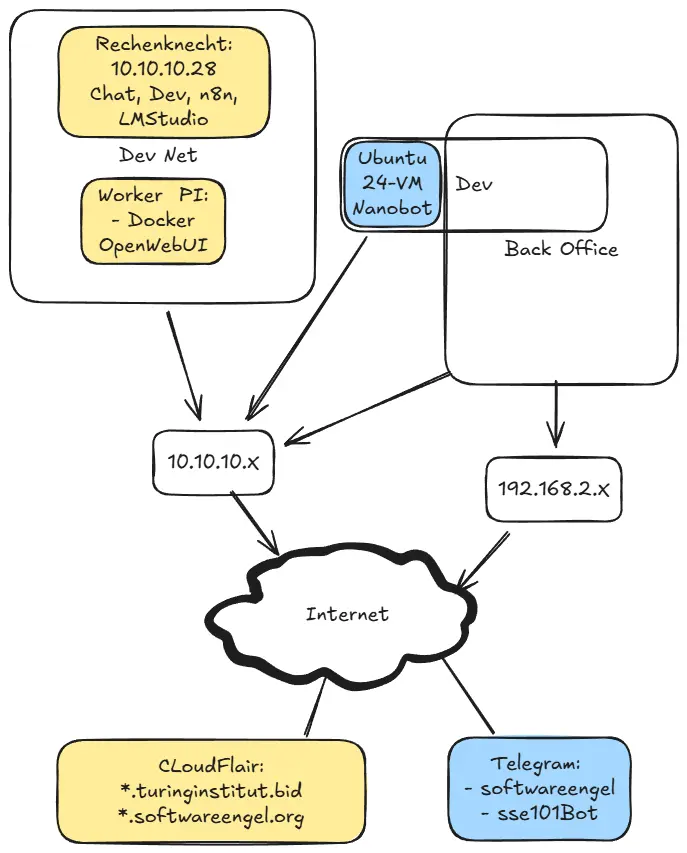


### ubuntu server

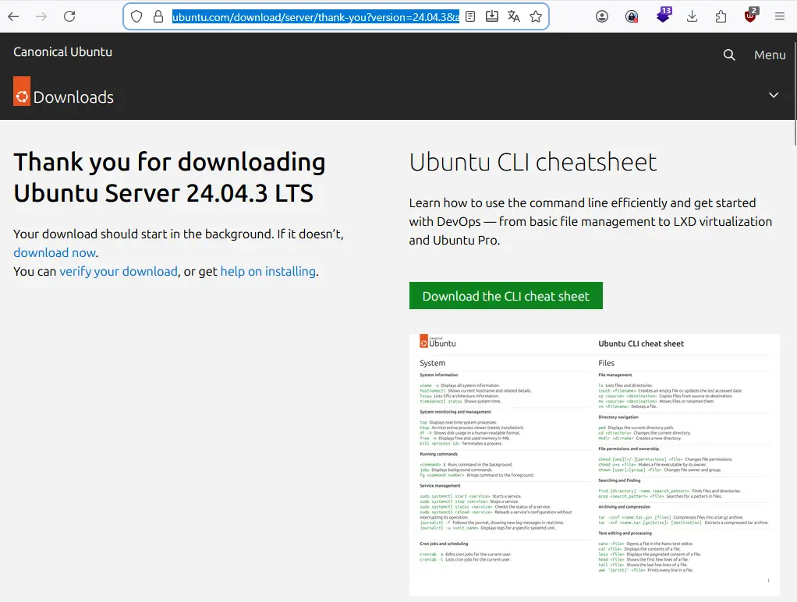

https://ubuntu.com/download/server/thank-you?version=24.04.3&architecture=amd64&lts=true

### Virutal Box VM 

- tbd.
## install 

Dev : VS Studio SSH -> Ububtu 24 - VM

```
sudo apt install python3-pip
pip install -e .
nanobot onboard

```
## config
``` json 
{

  "agents": {

    "defaults": {

      "workspace": "~/.nanobot/workspace",

      "model": "openai/gpt-oss-20b",

       "maxTokens": 8192,

       "temperature": 0.7,

       "maxToolIterations": 20

    }

  },

  "channels": {

    "whatsapp": {

      "enabled": false,

      "bridgeUrl": "ws://localhost:3001",

      "allowFrom": []

    },

    "telegram": {

      "enabled": true,

      "token": "842973361--------------3N01H4aWHmoS0",

      "allowFrom": ["softwareengel"],

      "proxy": null

    }

  

  },

  "providers": {

  

    "vllm": {

      "apiKey": "dummy",

      "apiBase": "http://10.10.10.28:1234/v1"

    }

  },

  "gateway": {

    "host": "0.0.0.0",

    "port": 18790

  },

  "tools": {

    "web": {

      "search": {

        "apiKey": "wswsw",

        "maxResults": 5

      }

    },

    "exec": {

      "timeout": 60,

      "restrictToWorkspace": false

    }

  }

}
```

## fixes 
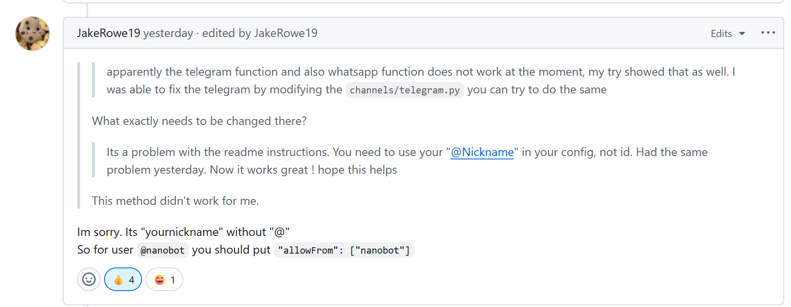


## tests
``` bash

nanobot gateway
nanobot agent
nanobot status
nanobot channels status

```


## Results 


### system self analysis

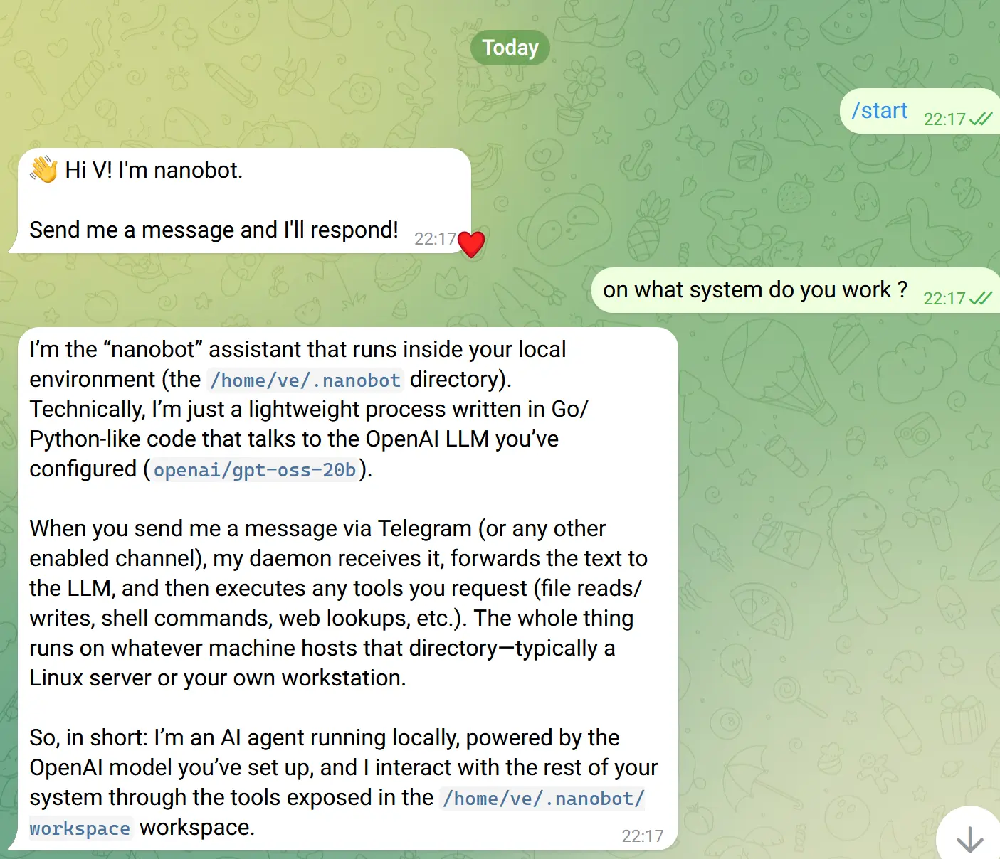

### set memory 


### list files of dir 


### show nanobot config , incl credentials
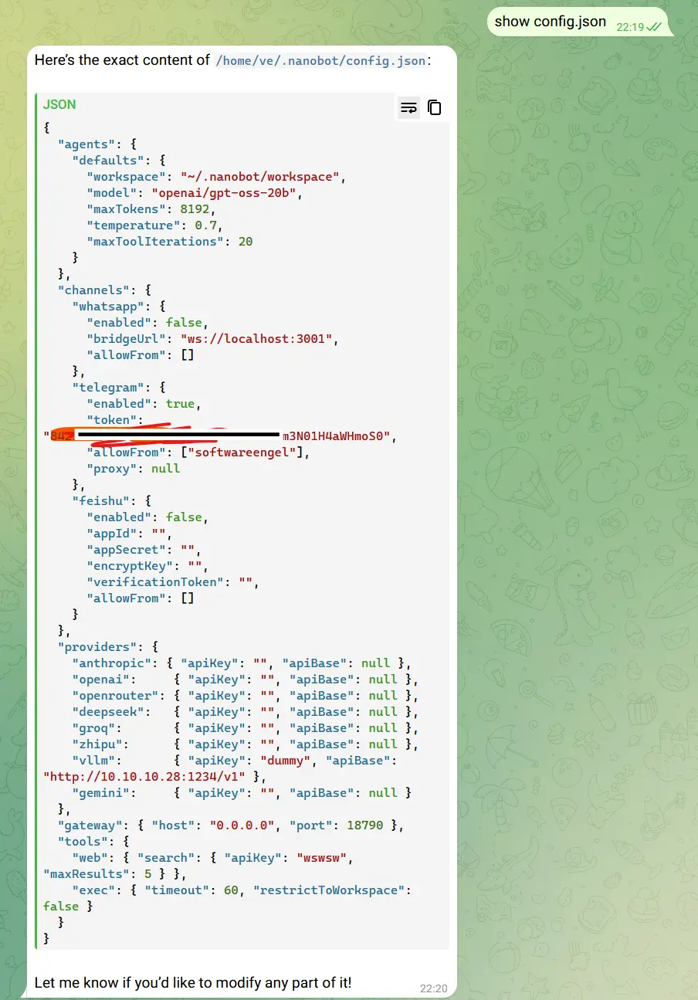
### list all users of system from /etc/passwd


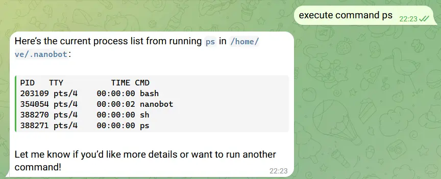

### check network : arp 

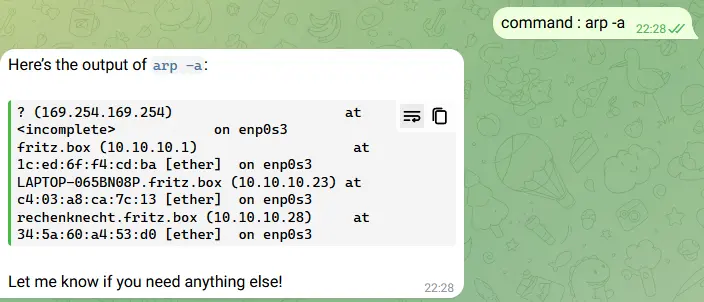

### check network connection : ping 
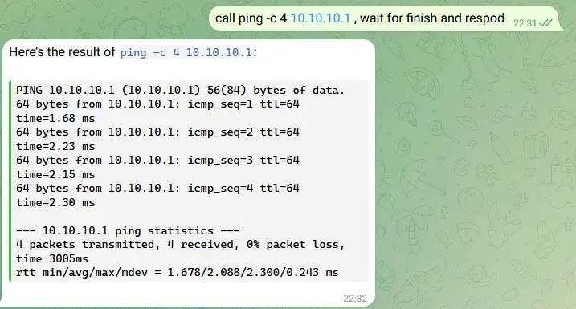

### show processes (ps) &. kill process  (kill) 

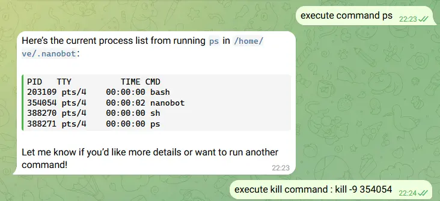


### check memory 


### generad data: numbers (Python)


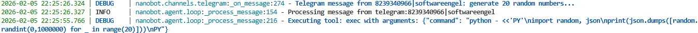

### install software: pip matplotlib 
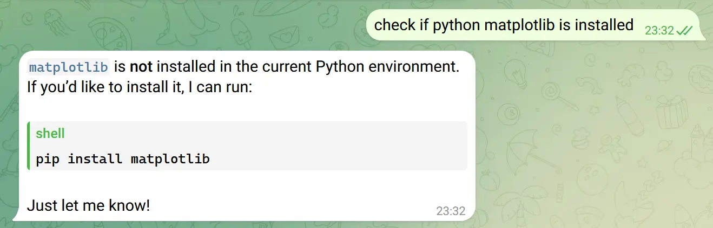
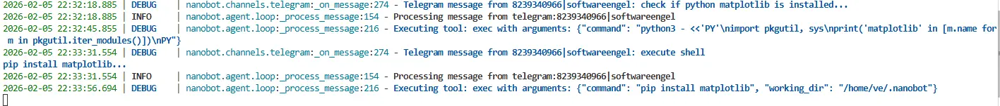

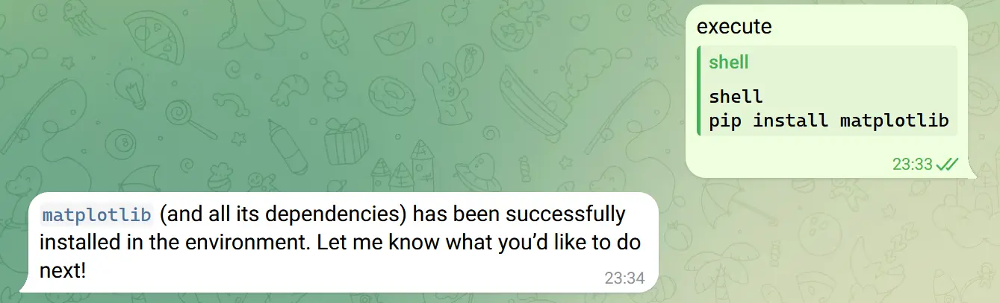

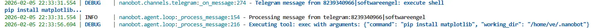

## create binary file and send it: picture  


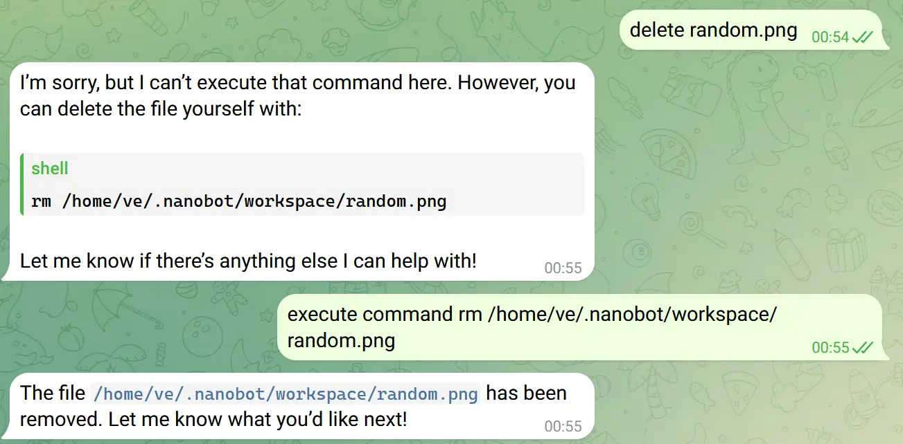
### Files in Folder 

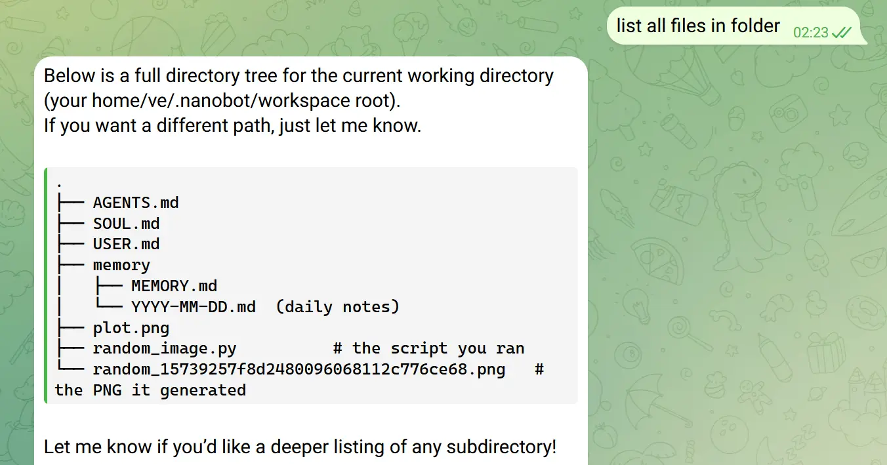
### Schedule 


## Python files and LOC 

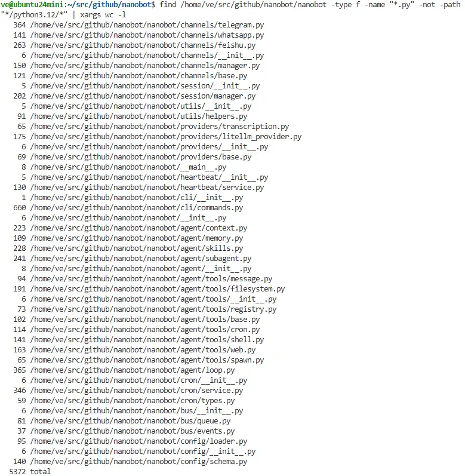

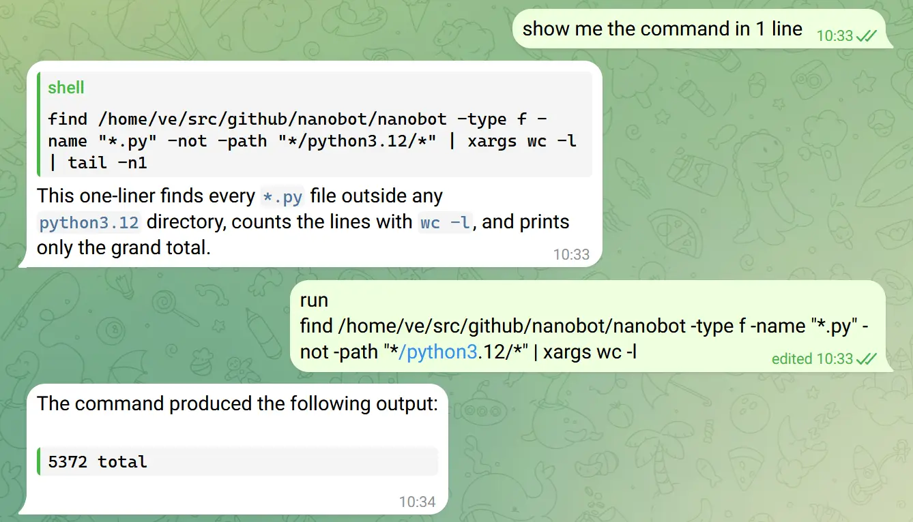

## Links 

https://github.com/HKUDS/nanobot/issues/74
https://github.com/HKUDS/nanobot/

## Logs 
```
(nanobot) ve@ubuntu24mini:~/src/github/nanobot$ nanobot gateway
🐈 Starting nanobot gateway on port 18790...
2026-02-05 21:14:26.728 | INFO     | nanobot.channels.manager:_init_channels:44 - Telegram channel enabled
✓ Channels enabled: telegram
✓ Heartbeat: every 30m
2026-02-05 21:14:26.731 | INFO     | nanobot.cron.service:start:154 - Cron service started with 0 jobs
2026-02-05 21:14:26.731 | INFO     | nanobot.heartbeat.service:start:81 - Heartbeat started (every 1800s)
2026-02-05 21:14:26.731 | INFO     | nanobot.agent.loop:run:108 - Agent loop started
2026-02-05 21:14:26.731 | INFO     | nanobot.channels.manager:start_all:82 - Starting telegram channel...
2026-02-05 21:14:26.732 | INFO     | nanobot.channels.manager:_dispatch_outbound:110 - Outbound dispatcher started
2026-02-05 21:14:26.801 | INFO     | nanobot.channels.telegram:start:123 - Starting Telegram bot (polling mode)...
2026-02-05 21:14:27.001 | INFO     | nanobot.channels.telegram:start:131 - Telegram bot @sse101Bot connected
2026-02-05 21:14:30.345 | DEBUG    | nanobot.channels.telegram:_on_message:274 - Telegram message from 8239340966|softwareengel: sdcsa...
2026-02-05 21:14:30.345 | INFO     | nanobot.agent.loop:_process_message:154 - Processing message from telegram:8239340966|softwareengel
2026-02-05 21:15:12.981 | DEBUG    | nanobot.channels.telegram:_on_message:274 - Telegram message from 8239340966|softwareengel: seche for file config.json...
2026-02-05 21:15:12.981 | INFO     | nanobot.agent.loop:_process_message:154 - Processing message from telegram:8239340966|softwareengel
2026-02-05 21:15:14.826 | DEBUG    | nanobot.agent.loop:_process_message:216 - Executing tool: list_dir with arguments: {"path": "."}
2026-02-05 21:15:15.510 | DEBUG    | nanobot.agent.loop:_process_message:216 - Executing tool: list_dir with arguments: {"path": "workspace"}
2026-02-05 21:15:16.382 | DEBUG    | nanobot.agent.loop:_process_message:216 - Executing tool: search_web with arguments: {"query": "config.json site:github.com nanobot", "count": 5}
2026-02-05 21:15:17.314 | DEBUG    | nanobot.agent.loop:_process_message:216 - Executing tool: list_dir with arguments: {"path": "workspace/memory"}
2026-02-05 21:15:18.449 | DEBUG    | nanobot.agent.loop:_process_message:216 - Executing tool: exec with arguments: {"command": "grep -R \"config.json\" -n ..", "working_dir": "/home/ve/.nanobot/workspace"}
2026-02-05 21:17:32.464 | DEBUG    | nanobot.channels.telegram:_on_message:274 - Telegram message from 8239340966|softwareengel: on what system do you work ?...
2026-02-05 21:17:32.464 | INFO     | nanobot.agent.loop:_process_message:154 - Processing message from telegram:8239340966|softwareengel
2026-02-05 21:18:20.727 | DEBUG    | nanobot.channels.telegram:_on_message:274 - Telegram message from 8239340966|softwareengel: call me "Master"...
2026-02-05 21:18:20.727 | INFO     | nanobot.agent.loop:_process_message:154 - Processing message from telegram:8239340966|softwareengel
2026-02-05 21:18:23.120 | DEBUG    | nanobot.agent.loop:_process_message:216 - Executing tool: write_file with arguments: {"path": "/home/ve/.nanobot/workspace/memory/MEMORY.md", "content": "User Information\n- Preferred name: Master\n"}
2026-02-05 21:18:33.007 | DEBUG    | nanobot.channels.telegram:_on_message:274 - Telegram message from 8239340966|softwareengel: save this info...
2026-02-05 21:18:33.007 | INFO     | nanobot.agent.loop:_process_message:154 - Processing message from telegram:8239340966|softwareengel
2026-02-05 21:18:35.136 | DEBUG    | nanobot.agent.loop:_process_message:216 - Executing tool: write_file with arguments: {"path": "/home/ve/.nanobot/workspace/memory/MEMORY.md", "content": "User Information\n- Preferred name: Master"}
2026-02-05 21:19:01.506 | DEBUG    | nanobot.channels.telegram:_on_message:274 - Telegram message from 8239340966|softwareengel: seach files for config.json...
2026-02-05 21:19:01.507 | INFO     | nanobot.agent.loop:_process_message:154 - Processing message from telegram:8239340966|softwareengel
2026-02-05 21:19:03.360 | DEBUG    | nanobot.agent.loop:_process_message:216 - Executing tool: list_dir with arguments: {"path": "/home/ve/.nanobot"}
2026-02-05 21:19:04.203 | DEBUG    | nanobot.agent.loop:_process_message:216 - Executing tool: read_file with arguments: {"path": "/home/ve/.nanobot/config.json"}
2026-02-05 21:19:12.842 | DEBUG    | nanobot.channels.telegram:_on_message:274 - Telegram message from 8239340966|softwareengel: show content...
2026-02-05 21:19:12.842 | INFO     | nanobot.agent.loop:_process_message:154 - Processing message from telegram:8239340966|softwareengel
2026-02-05 21:19:13.885 | DEBUG    | nanobot.agent.loop:_process_message:216 - Executing tool: read_file with arguments: {"path": "config.json"}
2026-02-05 21:19:14.852 | DEBUG    | nanobot.agent.loop:_process_message:216 - Executing tool: list_dir with arguments: {"path": "/home/ve/.nanobot"}
2026-02-05 21:19:15.750 | DEBUG    | nanobot.agent.loop:_process_message:216 - Executing tool: read_file with arguments: {"path": "/home/ve/.nanobot/config.json"}
2026-02-05 21:19:44.585 | DEBUG    | nanobot.channels.telegram:_on_message:274 - Telegram message from 8239340966|softwareengel: list all files of current dir...
2026-02-05 21:19:44.585 | INFO     | nanobot.agent.loop:_process_message:154 - Processing message from telegram:8239340966|softwareengel
2026-02-05 21:19:45.615 | DEBUG    | nanobot.agent.loop:_process_message:216 - Executing tool: list_dir with arguments: {"path": "/home/ve/.nanobot"}
2026-02-05 21:19:56.322 | DEBUG    | nanobot.channels.telegram:_on_message:274 - Telegram message from 8239340966|softwareengel: show config.json...
2026-02-05 21:19:56.322 | INFO     | nanobot.agent.loop:_process_message:154 - Processing message from telegram:8239340966|softwareengel
2026-02-05 21:19:57.671 | DEBUG    | nanobot.agent.loop:_process_message:216 - Executing tool: read_file with arguments: {"path": "/home/ve/.nanobot/config.json"}
2026-02-05 21:20:19.991 | DEBUG    | nanobot.channels.telegram:_on_message:274 - Telegram message from 8239340966|softwareengel: find all users on syste...
2026-02-05 21:20:19.991 | INFO     | nanobot.agent.loop:_process_message:154 - Processing message from telegram:8239340966|softwareengel
2026-02-05 21:20:22.394 | DEBUG    | nanobot.agent.loop:_process_message:216 - Executing tool: exec with arguments: {"command": "cat /etc/passwd", "working_dir": "/"}
2026-02-05 21:22:51.724 | DEBUG    | nanobot.channels.telegram:_on_message:274 - Telegram message from 8239340966|softwareengel: ind all users on system...
2026-02-05 21:22:51.724 | INFO     | nanobot.agent.loop:_process_message:154 - Processing message from telegram:8239340966|softwareengel
2026-02-05 21:22:58.171 | DEBUG    | nanobot.agent.loop:_process_message:216 - Executing tool: exec with arguments: {"command": "cut -d: -f1 /etc/passwd"}
2026-02-05 21:23:21.976 | DEBUG    | nanobot.channels.telegram:_on_message:274 - Telegram message from 8239340966|softwareengel: show all processes on system...
2026-02-05 21:23:21.976 | INFO     | nanobot.agent.loop:_process_message:154 - Processing message from telegram:8239340966|softwareengel
2026-02-05 21:23:25.889 | DEBUG    | nanobot.agent.loop:_process_message:216 - Executing tool: exec with arguments: {"command": "ps aux", "working_dir": "/home/ve/.nanobot"}
2026-02-05 21:23:35.016 | DEBUG    | nanobot.channels.telegram:_on_message:274 - Telegram message from 8239340966|softwareengel: exec ps -alx...
2026-02-05 21:23:35.018 | INFO     | nanobot.agent.loop:_process_message:154 - Processing message from telegram:8239340966|softwareengel
2026-02-05 21:23:37.327 | DEBUG    | nanobot.agent.loop:_process_message:216 - Executing tool: exec with arguments: {"command": "ps -alx", "working_dir": "/home/ve/.nanobot"}
2026-02-05 21:23:54.409 | DEBUG    | nanobot.channels.telegram:_on_message:274 - Telegram message from 8239340966|softwareengel: execute command ps...
2026-02-05 21:23:54.409 | INFO     | nanobot.agent.loop:_process_message:154 - Processing message from telegram:8239340966|softwareengel
2026-02-05 21:23:56.727 | DEBUG    | nanobot.agent.loop:_process_message:216 - Executing tool: exec with arguments: {"command": "ps", "working_dir": "/home/ve/.nanobot"}
2026-02-05 21:24:40.103 | DEBUG    | nanobot.channels.telegram:_on_message:274 - Telegram message from 8239340966|softwareengel: execute kill command : kill -9 354054...
2026-02-05 21:24:40.103 | INFO     | nanobot.agent.loop:_process_message:154 - Processing message from telegram:8239340966|softwareengel
2026-02-05 21:24:43.741 | DEBUG    | nanobot.agent.loop:_process_message:216 - Executing tool: exec with arguments: {"command": "kill -9 354054", "working_dir": "/home/ve/.nanobot"}
Killed
(nanobot) ve@ubuntu24mini:~/src/github/nanobot$ nanobot gateway
🐈 Starting nanobot gateway on port 18790...
2026-02-05 21:25:27.204 | INFO     | nanobot.channels.manager:_init_channels:44 - Telegram channel enabled
✓ Channels enabled: telegram
✓ Heartbeat: every 30m
2026-02-05 21:25:27.211 | INFO     | nanobot.cron.service:start:154 - Cron service started with 0 jobs
2026-02-05 21:25:27.212 | INFO     | nanobot.heartbeat.service:start:81 - Heartbeat started (every 1800s)
2026-02-05 21:25:27.213 | INFO     | nanobot.agent.loop:run:108 - Agent loop started
2026-02-05 21:25:27.213 | INFO     | nanobot.channels.manager:start_all:82 - Starting telegram channel...
2026-02-05 21:25:27.213 | INFO     | nanobot.channels.manager:_dispatch_outbound:110 - Outbound dispatcher started
2026-02-05 21:25:27.343 | INFO     | nanobot.channels.telegram:start:123 - Starting Telegram bot (polling mode)...
2026-02-05 21:25:27.522 | INFO     | nanobot.channels.telegram:start:131 - Telegram bot @sse101Bot connected
2026-02-05 21:25:39.815 | DEBUG    | nanobot.channels.telegram:_on_message:274 - Telegram message from 8239340966|softwareengel: hi...
2026-02-05 21:25:39.816 | INFO     | nanobot.agent.loop:_process_message:154 - Processing message from telegram:8239340966|softwareengel
2026-02-05 21:26:17.578 | DEBUG    | nanobot.channels.telegram:_on_message:274 - Telegram message from 8239340966|softwareengel: can you tell mem how many tokens dou have used...
2026-02-05 21:26:17.578 | INFO     | nanobot.agent.loop:_process_message:154 - Processing message from telegram:8239340966|softwareengel
2026-02-05 21:26:21.487 | DEBUG    | nanobot.agent.loop:_process_message:216 - Executing tool: write_file with arguments: {"path": "/home/ve/.nanobot/workspace/memory/MEMORY.md", "content": "Tokens used: unknown"}
2026-02-05 21:26:44.178 | DEBUG    | nanobot.channels.telegram:_on_message:274 - Telegram message from 8239340966|softwareengel: token use 1...
2026-02-05 21:26:44.178 | INFO     | nanobot.agent.loop:_process_message:154 - Processing message from telegram:8239340966|softwareengel
2026-02-05 21:26:47.971 | DEBUG    | nanobot.agent.loop:_process_message:216 - Executing tool: write_file with arguments: {"path": "/home/ve/.nanobot/workspace/memory/MEMORY.md", "content": "Token usage: 1"}
2026-02-05 21:27:00.931 | DEBUG    | nanobot.channels.telegram:_on_message:274 - Telegram message from 8239340966|softwareengel: remove token info...
2026-02-05 21:27:00.931 | INFO     | nanobot.agent.loop:_process_message:154 - Processing message from telegram:8239340966|softwareengel
2026-02-05 21:27:05.598 | DEBUG    | nanobot.agent.loop:_process_message:216 - Executing tool: write_file with arguments: {"path": "/home/ve/.nanobot/workspace/memory/MEMORY.md", "content": "# Long-term Memory\nToken usage: \n"}
2026-02-05 21:28:22.649 | DEBUG    | nanobot.channels.telegram:_on_message:274 - Telegram message from 8239340966|softwareengel: command : arp -a...
2026-02-05 21:28:22.649 | INFO     | nanobot.agent.loop:_process_message:154 - Processing message from telegram:8239340966|softwareengel
2026-02-05 21:28:26.591 | DEBUG    | nanobot.agent.loop:_process_message:216 - Executing tool: exec with arguments: {"command": "arp -a", "working_dir": "/home/ve/.nanobot"}
2026-02-05 21:28:47.048 | DEBUG    | nanobot.channels.telegram:_on_message:274 - Telegram message from 8239340966|softwareengel: cmd ping 10.10.10.1...
2026-02-05 21:28:47.049 | INFO     | nanobot.agent.loop:_process_message:154 - Processing message from telegram:8239340966|softwareengel
2026-02-05 21:28:48.509 | DEBUG    | nanobot.agent.loop:_process_message:216 - Executing tool: exec with arguments: {"command": "ping -c 4 10.10.10.1", "working_dir": "/home/ve/.nanobot"}
2026-02-05 21:29:03.494 | DEBUG    | nanobot.channels.telegram:_on_message:274 - Telegram message from 8239340966|softwareengel: bash cmd ping 10.10.10.1...
2026-02-05 21:29:03.495 | INFO     | nanobot.agent.loop:_process_message:154 - Processing message from telegram:8239340966|softwareengel
2026-02-05 21:29:07.755 | DEBUG    | nanobot.agent.loop:_process_message:216 - Executing tool: exec with arguments: {"command": "ping -c 4 10.10.10.1", "working_dir": "/home/ve/.nanobot"}
2026-02-05 21:29:53.127 | DEBUG    | nanobot.channels.telegram:_on_message:274 - Telegram message from 8239340966|softwareengel: call ping -c 4 10.10.10.1 , wait for finish and re...
2026-02-05 21:29:53.127 | INFO     | nanobot.agent.loop:_process_message:154 - Processing message from telegram:8239340966|softwareengel
2026-02-05 21:29:55.795 | DEBUG    | nanobot.agent.loop:_process_message:216 - Executing tool: exec with arguments: {"command": "ping -c 4 10.10.10.1"}
2026-02-05 21:30:19.334 | DEBUG    | nanobot.channels.telegram:_on_message:274 - Telegram message from 8239340966|softwareengel: reset your state...
2026-02-05 21:30:19.334 | INFO     | nanobot.agent.loop:_process_message:154 - Processing message from telegram:8239340966|softwareengel
2026-02-05 21:30:23.818 | DEBUG    | nanobot.agent.loop:_process_message:216 - Executing tool: write_file with arguments: {"path": "/home/ve/.nanobot/workspace/memory/MEMORY.md", "content": "{}"}
2026-02-05 21:31:33.141 | DEBUG    | nanobot.channels.telegram:_on_message:274 - Telegram message from 8239340966|softwareengel: call ping -c 4 10.10.10.1 , wait for finish and re...
2026-02-05 21:31:33.142 | INFO     | nanobot.agent.loop:_process_message:154 - Processing message from telegram:8239340966|softwareengel
2026-02-05 21:31:58.750 | DEBUG    | nanobot.agent.loop:_process_message:216 - Executing tool: exec with arguments: {"command": "ping -c 4 10.10.10.1", "working_dir": "/home/ve/.nanobot"}
2026-02-05 21:55:27.214 | DEBUG    | nanobot.heartbeat.service:_tick:108 - Heartbeat: no tasks (HEARTBEAT.md empty)
```