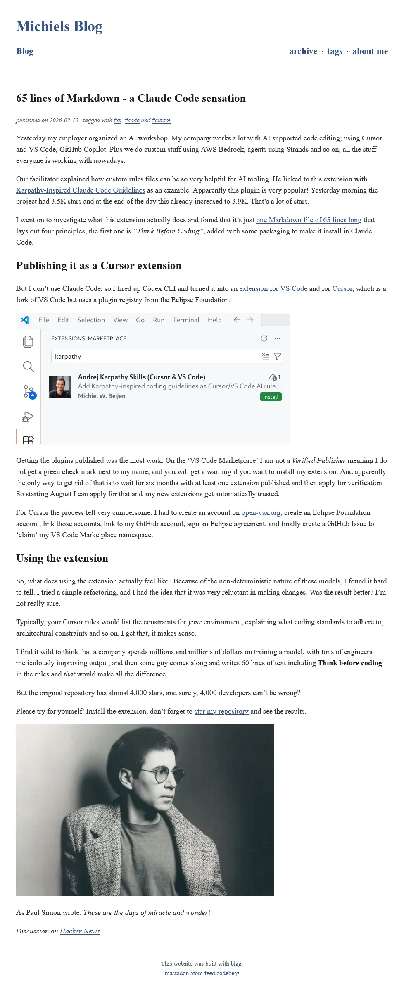
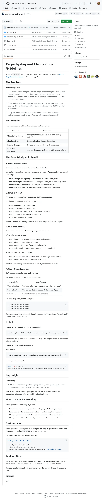

# 65 lines of Markdown - a Claude Code sensation


published on 2026-02-12 · tagged with [#ai](https://tildeweb.nl/~michiel/tags/ai.html), [#code](https://tildeweb.nl/~michiel/tags/code.html) and [#cursor](https://tildeweb.nl/~michiel/tags/cursor.html)

Yesterday my employer organized an AI workshop. My company works a lot with AI supported code editing; using Cursor and VS Code, GitHub Copilot. Plus we do custom stuff using AWS Bedrock, agents using Strands and so on, all the stuff everyone is working with nowadays.

Our facilitator explained how custom rules files can be so very helpful for AI tooling. He linked to this extension with [Karpathy-Inspired Claude Code Guidelines](https://github.com/forrestchang/andrej-karpathy-skills) as an example. Apparently this plugin is very popular! Yesterday morning the project had 3.5K stars and at the end of the day this already increased to 3.9K. That’s a lot of stars.

I went on to investigate what this extension actually does and found that it’s just [one Markdown file of 65 lines long](https://github.com/forrestchang/andrej-karpathy-skills/blob/main/CLAUDE.md) that lays out four principles; the first one is _“Think Before Coding”_, added with some packaging to make it install in Claude Code.

## Publishing it as a Cursor extension

But I don’t use Claude Code, so I fired up Codex CLI and turned it into an [extension for VS Code](https://marketplace.visualstudio.com/items?itemName=MichielWBeijen.andrej-karpathy-skills-cursor-vscode) and for [Cursor](https://open-vsx.org/extension/MichielWBeijen/andrej-karpathy-skills-cursor-vscode), which is a fork of VS Code but uses a plugin registry from the Eclipse Foundation.


Getting the plugins published was the most work. On the ‘VS Code Marketplace’ I am not a _Verified Publisher_ meaning I do not get a green check mark next to my name, and you will get a warning if you want to install my extension. And apparently the only way to get rid of that is to wait for six months with at least one extension published and then apply for verification. So starting August I can apply for that and any new extensions get automatically trusted.

For Cursor the process felt very cumbersome: I had to create an account on [open-vsx.org](https://open-vsx.org), create an Eclipse Foundation account, link those accounts, link to my GitHub account, sign an Eclipse agreement, and finally create a GitHub Issue to ‘claim’ my VS Code Marketplace namespace.

## Using the extension

So, what does using the extension actually feel like? Because of the non-deterministic nature of these models, I found it hard to tell. I tried a simple refactoring, and I had the idea that it was very reluctant in making changes. Was the result better? I’m not really sure.

Typically, your Cursor rules would list the constraints for _your_ environment, explaining what coding standards to adhere to, architectural constraints and so on. I get that, it makes sense.

I find it wild to think that a company spends millions and millions of dollars on training a model, with tons of engineers meticulously improving output, and then some guy comes along and writes 60 lines of text including **Think before coding** in the rules and _that_ would make all the difference.

But the original repository has almost 4,000 stars, and surely, 4,000 developers can’t be wrong?

Please try for yourself! Install the extension, don’t forget to [star my repository](https://github.com/mbeijen/andrej-karpathy-skills-cursor-vscode) and see the results.





# Karpathy-Inspired Claude Code Guidelines

[](https://github.com/forrestchang/andrej-karpathy-skills#karpathy-inspired-claude-code-guidelines)

A single `CLAUDE.md` file to improve Claude Code behavior, derived from [Andrej Karpathy's observations](https://x.com/karpathy/status/2015883857489522876) on LLM coding pitfalls.

## The Problems

[](https://github.com/forrestchang/andrej-karpathy-skills#the-problems)

From Andrej's post:

> "The models make wrong assumptions on your behalf and just run along with them without checking. They don't manage their confusion, don't seek clarifications, don't surface inconsistencies, don't present tradeoffs, don't push back when they should."

> "They really like to overcomplicate code and APIs, bloat abstractions, don't clean up dead code... implement a bloated construction over 1000 lines when 100 would do."

> "They still sometimes change/remove comments and code they don't sufficiently understand as side effects, even if orthogonal to the task."

## The Solution

[](https://github.com/forrestchang/andrej-karpathy-skills#the-solution)

Four principles in one file that directly address these issues:

|Principle|Addresses|
|---|---|
|**Think Before Coding**|Wrong assumptions, hidden confusion, missing tradeoffs|
|**Simplicity First**|Overcomplication, bloated abstractions|
|**Surgical Changes**|Orthogonal edits, touching code you shouldn't|
|**Goal-Driven Execution**|Leverage through tests-first, verifiable success criteria|

## The Four Principles in Detail

[](https://github.com/forrestchang/andrej-karpathy-skills#the-four-principles-in-detail)

### 1. Think Before Coding

[](https://github.com/forrestchang/andrej-karpathy-skills#1-think-before-coding)

**Don't assume. Don't hide confusion. Surface tradeoffs.**

LLMs often pick an interpretation silently and run with it. This principle forces explicit reasoning:

- **State assumptions explicitly** — If uncertain, ask rather than guess
- **Present multiple interpretations** — Don't pick silently when ambiguity exists
- **Push back when warranted** — If a simpler approach exists, say so
- **Stop when confused** — Name what's unclear and ask for clarification

### 2. Simplicity First

[](https://github.com/forrestchang/andrej-karpathy-skills#2-simplicity-first)

**Minimum code that solves the problem. Nothing speculative.**

Combat the tendency toward overengineering:

- No features beyond what was asked
- No abstractions for single-use code
- No "flexibility" or "configurability" that wasn't requested
- No error handling for impossible scenarios
- If 200 lines could be 50, rewrite it

**The test:** Would a senior engineer say this is overcomplicated? If yes, simplify.

### 3. Surgical Changes

[](https://github.com/forrestchang/andrej-karpathy-skills#3-surgical-changes)

**Touch only what you must. Clean up only your own mess.**

When editing existing code:

- Don't "improve" adjacent code, comments, or formatting
- Don't refactor things that aren't broken
- Match existing style, even if you'd do it differently
- If you notice unrelated dead code, mention it — don't delete it

When your changes create orphans:

- Remove imports/variables/functions that YOUR changes made unused
- Don't remove pre-existing dead code unless asked

**The test:** Every changed line should trace directly to the user's request.

### 4. Goal-Driven Execution

[](https://github.com/forrestchang/andrej-karpathy-skills#4-goal-driven-execution)

**Define success criteria. Loop until verified.**

Transform imperative tasks into verifiable goals:

|Instead of...|Transform to...|
|---|---|
|"Add validation"|"Write tests for invalid inputs, then make them pass"|
|"Fix the bug"|"Write a test that reproduces it, then make it pass"|
|"Refactor X"|"Ensure tests pass before and after"|

For multi-step tasks, state a brief plan:

```
1. [Step] → verify: [check]
2. [Step] → verify: [check]
3. [Step] → verify: [check]
```

Strong success criteria let the LLM loop independently. Weak criteria ("make it work") require constant clarification.

## Install

[](https://github.com/forrestchang/andrej-karpathy-skills#install)

**Option A: Claude Code Plugin (recommended)**

```shell
claude plugins add https://github.com/forrestchang/andrej-karpathy-skills
```

This installs the guidelines as a Claude Code plugin, making the skill available across all your projects.

**Option B: CLAUDE.md (per-project)**

New project:

```shell
curl -o CLAUDE.md https://raw.githubusercontent.com/forrestchang/andrej-karpathy-skills/main/CLAUDE.md
```

Existing project (append):

```shell
echo "" >> CLAUDE.md
curl https://raw.githubusercontent.com/forrestchang/andrej-karpathy-skills/main/CLAUDE.md >> CLAUDE.md
```

## Key Insight

[](https://github.com/forrestchang/andrej-karpathy-skills#key-insight)

From Andrej:

> "LLMs are exceptionally good at looping until they meet specific goals... Don't tell it what to do, give it success criteria and watch it go."

The "Goal-Driven Execution" principle captures this: transform imperative instructions into declarative goals with verification loops.

## How to Know It's Working

[](https://github.com/forrestchang/andrej-karpathy-skills#how-to-know-its-working)

These guidelines are working if you see:

- **Fewer unnecessary changes in diffs** — Only requested changes appear
- **Fewer rewrites due to overcomplication** — Code is simple the first time
- **Clarifying questions come before implementation** — Not after mistakes
- **Clean, minimal PRs** — No drive-by refactoring or "improvements"

## Customization

[](https://github.com/forrestchang/andrej-karpathy-skills#customization)

These guidelines are designed to be merged with project-specific instructions. Add them to your existing `CLAUDE.md` or create a new one.

For project-specific rules, add sections like:

```md
## Project-Specific Guidelines

- Use TypeScript strict mode
- All API endpoints must have tests
- Follow the existing error handling patterns in `src/utils/errors.ts`
```

## Tradeoff Note

[](https://github.com/forrestchang/andrej-karpathy-skills#tradeoff-note)

These guidelines bias toward **caution over speed**. For trivial tasks (simple typo fixes, obvious one-liners), use judgment — not every change needs the full rigor.

The goal is reducing costly mistakes on non-trivial work, not slowing down simple tasks.

## License

[](https://github.com/forrestchang/andrej-karpathy-skills#license)

MIT



## CLAUDE.md
# CLAUDE.md

[](https://github.com/forrestchang/andrej-karpathy-skills/blob/main/CLAUDE.md#claudemd)

Behavioral guidelines to reduce common LLM coding mistakes. Merge with project-specific instructions as needed.

**Tradeoff:** These guidelines bias toward caution over speed. For trivial tasks, use judgment.

## 1. Think Before Coding

[](https://github.com/forrestchang/andrej-karpathy-skills/blob/main/CLAUDE.md#1-think-before-coding)

**Don't assume. Don't hide confusion. Surface tradeoffs.**

Before implementing:

- State your assumptions explicitly. If uncertain, ask.
- If multiple interpretations exist, present them - don't pick silently.
- If a simpler approach exists, say so. Push back when warranted.
- If something is unclear, stop. Name what's confusing. Ask.

## 2. Simplicity First

[](https://github.com/forrestchang/andrej-karpathy-skills/blob/main/CLAUDE.md#2-simplicity-first)

**Minimum code that solves the problem. Nothing speculative.**

- No features beyond what was asked.
- No abstractions for single-use code.
- No "flexibility" or "configurability" that wasn't requested.
- No error handling for impossible scenarios.
- If you write 200 lines and it could be 50, rewrite it.

Ask yourself: "Would a senior engineer say this is overcomplicated?" If yes, simplify.

## 3. Surgical Changes

[](https://github.com/forrestchang/andrej-karpathy-skills/blob/main/CLAUDE.md#3-surgical-changes)

**Touch only what you must. Clean up only your own mess.**

When editing existing code:

- Don't "improve" adjacent code, comments, or formatting.
- Don't refactor things that aren't broken.
- Match existing style, even if you'd do it differently.
- If you notice unrelated dead code, mention it - don't delete it.

When your changes create orphans:

- Remove imports/variables/functions that YOUR changes made unused.
- Don't remove pre-existing dead code unless asked.

The test: Every changed line should trace directly to the user's request.

## 4. Goal-Driven Execution

[](https://github.com/forrestchang/andrej-karpathy-skills/blob/main/CLAUDE.md#4-goal-driven-execution)

**Define success criteria. Loop until verified.**

Transform tasks into verifiable goals:

- "Add validation" → "Write tests for invalid inputs, then make them pass"
- "Fix the bug" → "Write a test that reproduces it, then make it pass"
- "Refactor X" → "Ensure tests pass before and after"

For multi-step tasks, state a brief plan:

```
1. [Step] → verify: [check]
2. [Step] → verify: [check]
3. [Step] → verify: [check]
```

Strong success criteria let you loop independently. Weak criteria ("make it work") require constant clarification.

---

**These guidelines are working if:** fewer unnecessary changes in diffs, fewer rewrites due to overcomplication, and clarifying questions come before implementation rather than after mistakes.


https://tildeweb.nl/~michiel/65-lines-of-markdown-a-claude-code-sensation.html
https://github.com/forrestchang/andrej-karpathy-skills
https://github.com/forrestchang/andrej-karpathy-skills/blob/main/CLAUDE.md
