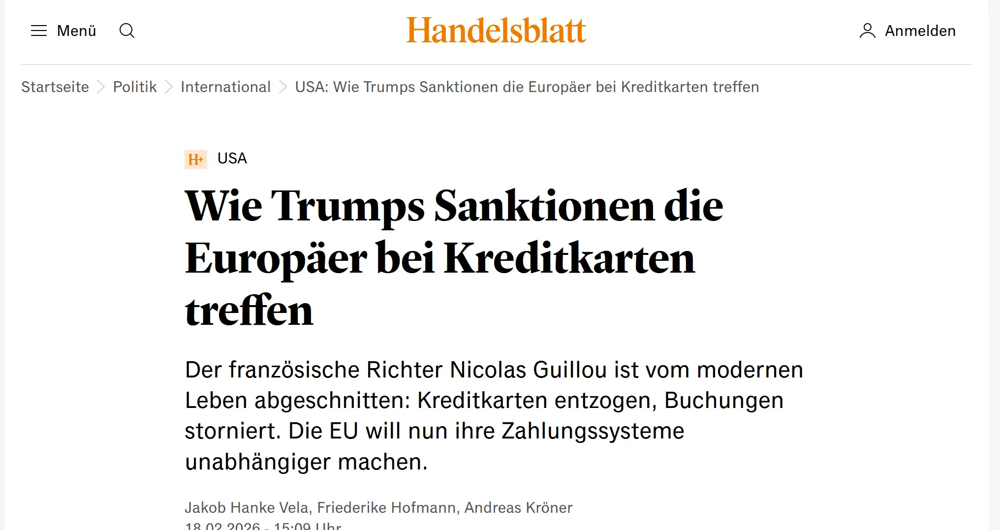

# # Sanktionen und Souveränität

Brüssel, Paris. Nicolas Guillou ist seit zwanzig Jahren französischer Richter. Im vergangenen Sommer setzte US-Präsident [Donald Trump](https://www.handelsblatt.com/themen/donald-trump) ihn gemeinsam mit zehn anderen Mitarbeitern des Internationalen Strafgerichtshofs und mit der italienischen Juristin Francesca Albanese auf eine Sanktionsliste, die ursprünglich für Terroristen und Menschenrechtsverbrecher gedacht war.

Die US-Sanktionen haben Guillous Leben in [Europa](https://www.handelsblatt.com/themen/europa) aus den Fugen gebracht, erzählt er bei einem Pressegespräch in Brüssel. Weil die [EU](https://www.handelsblatt.com/themen/europaeische-union) kein eigenes digitales Zahlungsmittel hat, sind Europäer auf US-amerikanische Unternehmen wie [Visa](https://www.handelsblatt.com/boerse/isin/S11235) , [Mastercard](https://www.handelsblatt.com/boerse/isin/S11905) und [Paypal](https://www.handelsblatt.com/boerse/isin/S47298) angewiesen. Diese dürfen Guillou wegen Trumps Sanktionen aber keine Dienste mehr anbieten.

„Wenn man unter Sanktionen steht, verliert man seine gewohnten Zahlungsmittel“, sagt Guillou. „Meine Visa-Karte wurde mir von meiner Bank in Frankreich weggenommen. Sie existiert nicht mehr.“ Ähnlich bei allen digitalen Diensten: „Über Nacht werden einem die Benutzerkonten geschlossen, bei [Amazon](https://www.handelsblatt.com/boerse/isin/S43922) , bei [Paypal](https://www.handelsblatt.com/themen/paypal), [Netflix](https://www.handelsblatt.com/boerse/isin/S46718) und Airbnb.“
## Links

https://www.handelsblatt.com/politik/international/usa-wie-trumps-sanktionen-die-europaeer-bei-kreditkarten-treffen/100199524.html
