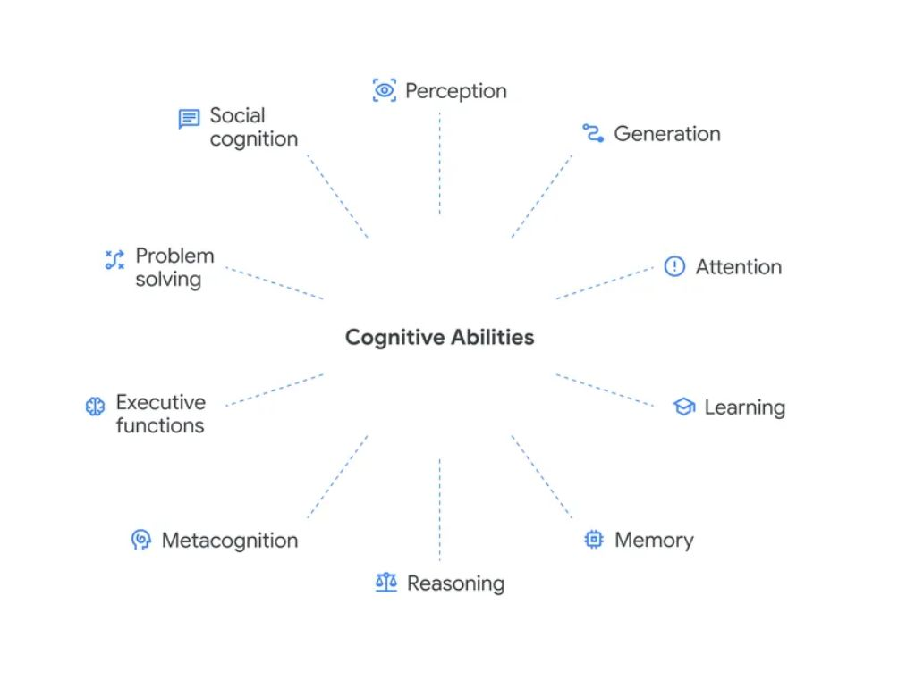

# # Measuring progress toward AGI: A cognitive framework

## Deconstructing general intelligence

Our framework draws on decades of research from psychology, neuroscience and cognitive science to develop a cognitive taxonomy. It identifies 10 key cognitive abilities that we hypothesize will be important for general intelligence in AI systems:

1. **Perception**: extracting and processing sensory information from the environment
2. **Generation**: producing outputs such as text, speech and actions
3. **Attention**: focusing cognitive resources on what matters
4. **Learning**: acquiring new knowledge through experience and instruction
5. **Memory**: storing and retrieving information over time
6. **Reasoning**: drawing valid conclusions through logical inference
7. **Metacognition**: knowledge and monitoring of one's own cognitive processes
8. **Executive functions**: planning, inhibition and cognitive flexibility
9. **Problem solving**: finding effective solutions to domain-specific problems
10. **Social cognition**: processing and interpreting social information and responding appropriately in social situations

https://blog.google/innovation-and-ai/models-and-research/google-deepmind/measuring-agi-cognitive-framework/