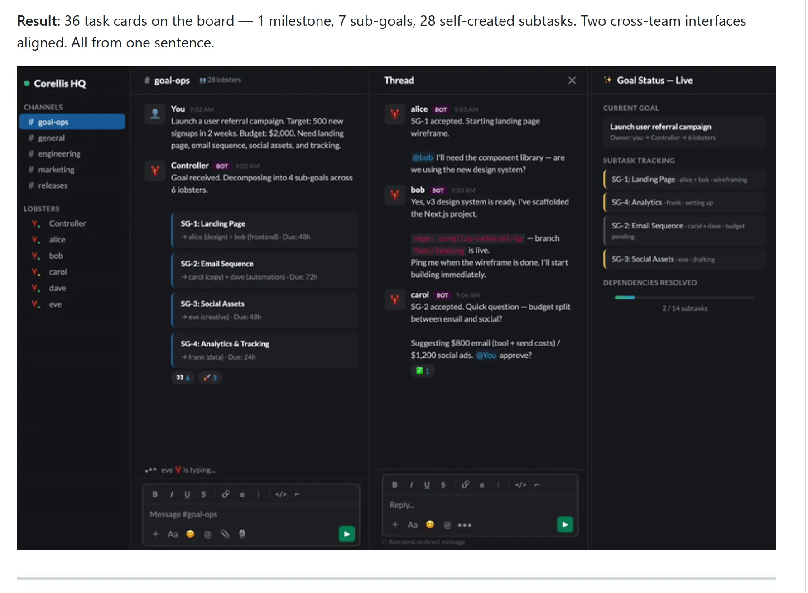

# Corellis

Turn one [OpenClaw](https://openclaw.ai) assistant into a self-managing AI workforce — lobsters that coordinate tasks, learn from their mistakes, and get better every week.

**Production-tested since February 2026** · 28 lobsters · 50,000+ Slack messages indexed · 500+ self-corrections · single server

https://github.com/CorellisOrg/corellis