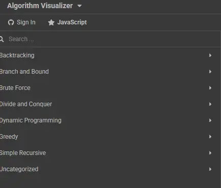
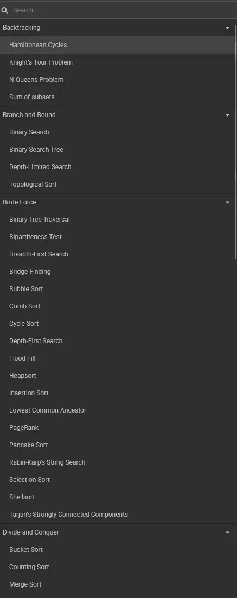
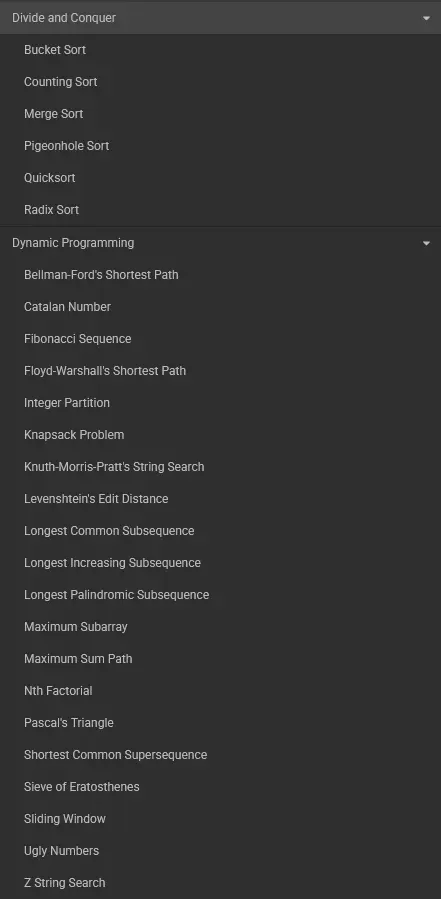
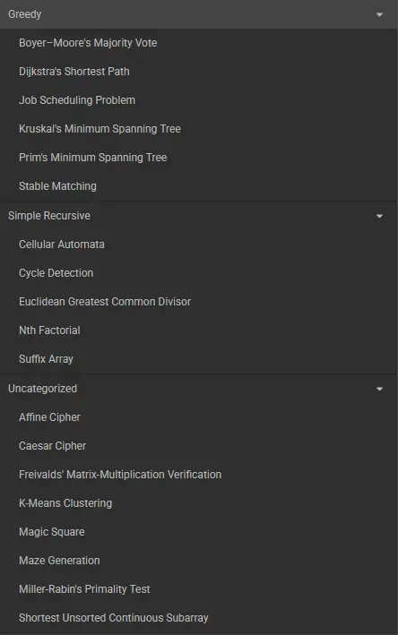
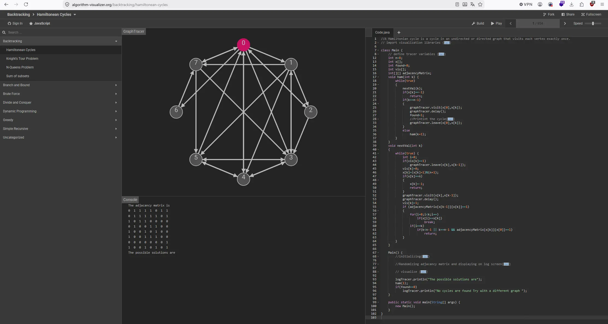
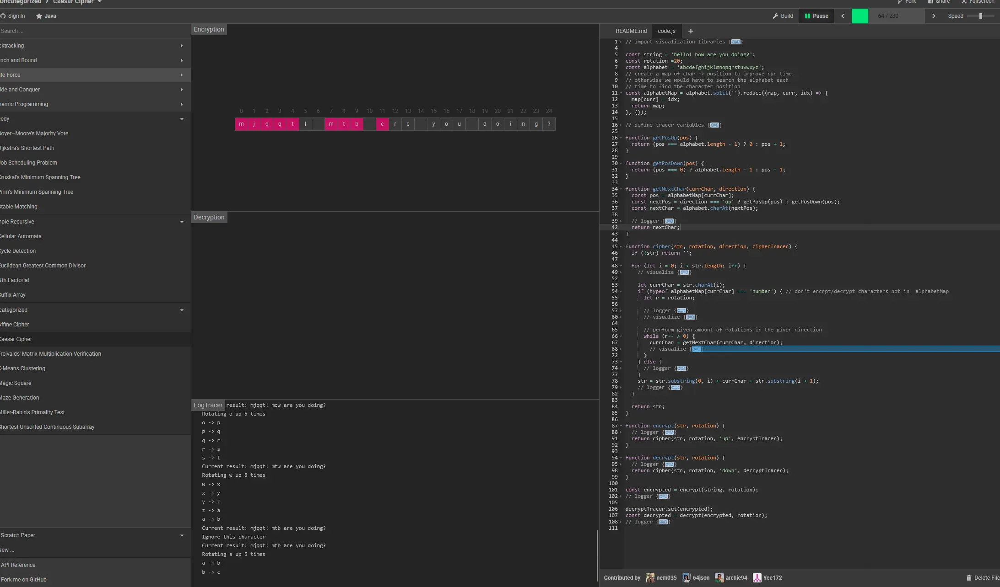
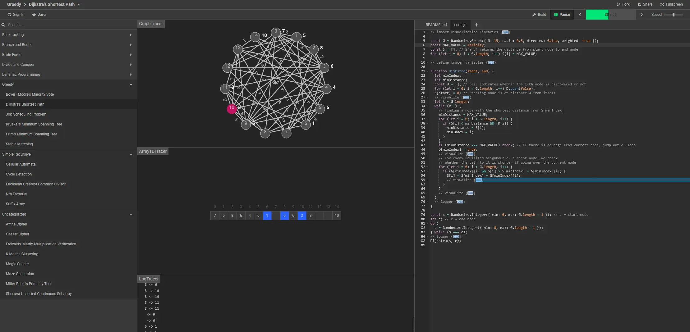
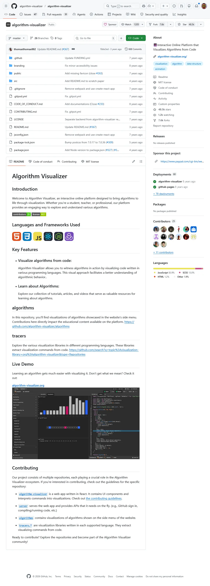

# Algorithm Visualizer

Welcome to Algorithm Visualizer, an interactive online platform designed to bring algorithms to life through visualization. Whether you're a student, teacher, or professional, our platform provides an engaging way to explore and understand various algorithms.

https://algorithm-visualizer.org/

https://github.com/algorithm-visualizer/algorithm-visualizer

