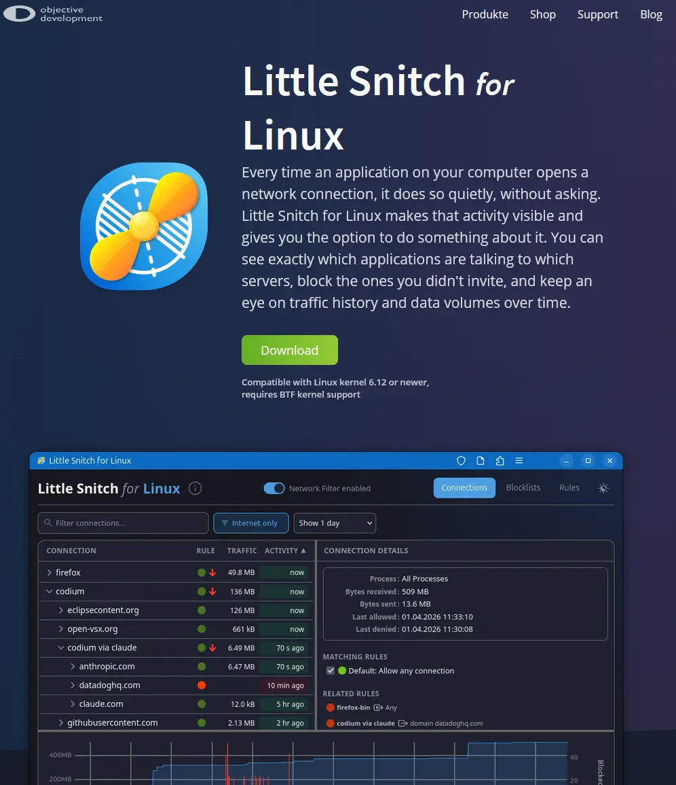

# Little Snitch for Linux

Every time an application on your computer opens a network connection, it does so quietly, without asking. Little Snitch for Linux makes that activity visible and gives you the option to do something about it. You can see exactly which applications are talking to which servers, block the ones you didn't invite, and keep an eye on traffic history and data volumes over time.

https://obdev.at/products/littlesnitch-linux/index.html