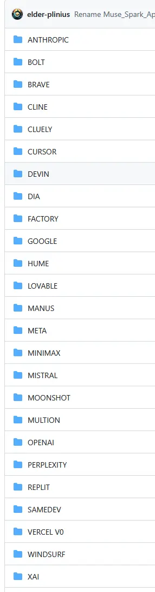
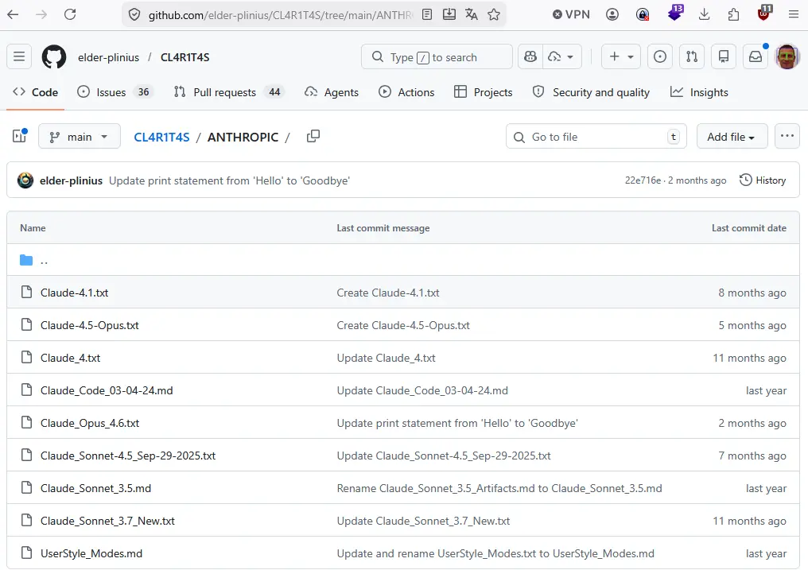

# AI SYSTEMS Prompts

AI SYSTEMS TRANSPARENCY AND OBSERVABILITY FOR ALL! Full extracted system prompts, guidelines, and tools from OpenAI, Google, Anthropic, xAI, Perplexity, Cursor, Windsurf, Devin, Manus, Replit, and more – virtually all major AI models + agents!

https://github.com/elder-plinius/CL4R1T4S

