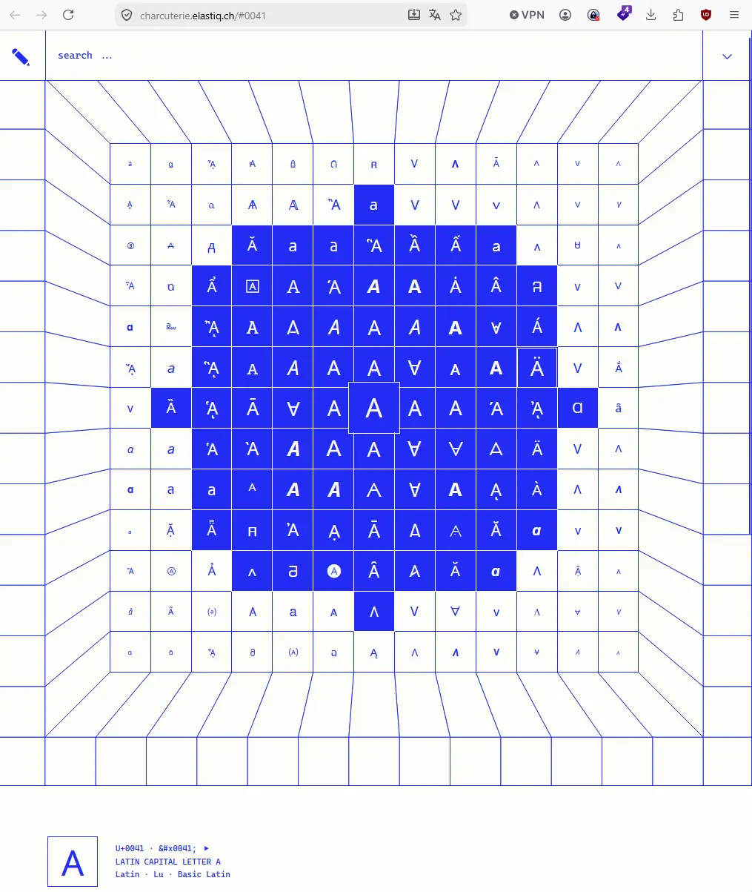

# Charcuterie

A visual explorer for Unicode. Browse the character set, discover related glyphs, and learn more about the scripts, symbols, and shapes that make up the standard.

https://charcuterie.elastiq.ch/#0041