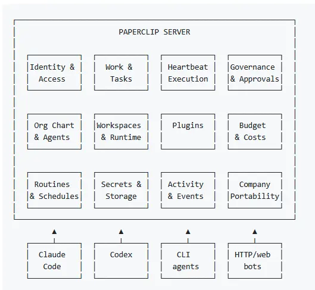

# Open-source orchestration for zero-human companies

**If OpenClaw is an _employee_, Paperclip is the _company_**

Paperclip is a Node.js server and React UI that orchestrates a team of AI agents to run a business. Bring your own agents, assign goals, and track your agents' work and costs from one dashboard.

It looks like a task manager — but under the hood it has org charts, budgets, governance, goal alignment, and agent coordination.
## Links

https://github.com/paperclipai/paperclip
https://github.com/gsxdsm/awesome-paperclip

## Shot
