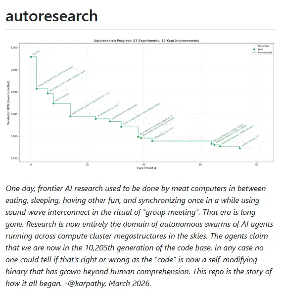
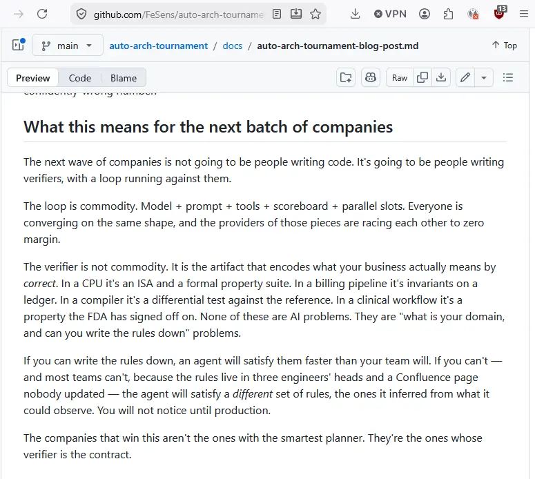

# Autoresearch 

## What this means for the next batch of companies

The next wave of companies is not going to be people writing code. It's going to be people writing verifiers, with a loop running against them.

==The loop is commodity.== Model + prompt + tools + scoreboard + parallel slots. Everyone is converging on the same shape, and the providers of those pieces are racing each other to zero margin.

==The verifier is not commodity==. It is the artifact that encodes what your business actually means by _correct_. In a CPU it's an ISA and a formal property suite. In a billing pipeline it's invariants on a ledger. In a compiler it's a differential test against the reference. In a clinical workflow it's a property the FDA has signed off on. None of these are AI problems. They are "what is your domain, and can you write the rules down" problems.

If you can write the rules down, an agent will satisfy them faster than your team will. If you can't — and most teams can't, because the rules live in three engineers' heads and a Confluence page nobody updated — the agent will satisfy a _different_ set of rules, the ones it inferred from what it could observe. You will not notice until production.

The companies that win this aren't the ones with the smartest planner. They're the ones whose verifier is the contract.

## Links

https://github.com/karpathy/nanochat

https://github.com/FeSens/auto-arch-tournament/blob/main/docs/auto-arch-tournament-blog-post.md

https://github.com/karpathy/autoresearch