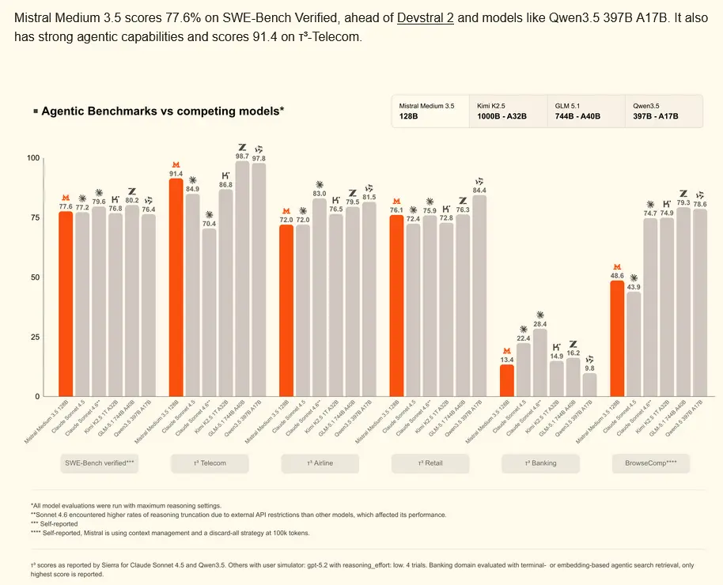

# # Mistral AI: Neues Sprachmodell Medium 3.5 und Cloud-Coding-Agenten

## Highlights.

1. Mistral Medium 3.5, a new flagship model that merges instruction-following, reasoning, and coding into a single 128B dense model. Released as open weights, under a modified MIT license.
2. Strong real-world performance at a size that runs self-hosted on as few as four GPUs.
3. Mistral Vibe remote agents for async coding: sessions run in the cloud, can be spawned from the CLI or Le Chat, and a local CLI session can be teleported up to the cloud.
4. Start Mistral Vibe coding tasks in Le Chat. Sessions run on the same remote runtime and keep going while you step away.
5. Work mode in Le Chat runs on a new agent, powered by Mistral Medium 3.5, that works through multi-step tasks, calling tools in parallel until the job is done.

https://www.heise.de/news/Mistral-AI-Neues-Sprachmodell-Medium-3-5-und-Cloud-Coding-Agenten-11277993.html

https://mistral.ai/news/vibe-remote-agents-mistral-medium-3-5
